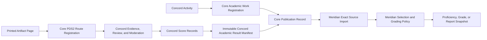

# pds-concord Conceptual Design

**Status:** Draft for foundation review  
**Project:** Paper Data Suite  
**Module:** `pds-concord`  
**Date:** July 29, 2026  
**Revision:** 4 — aligned with PDS2, ADRs 0014–0015, Core academic publication architecture, and Meridian

## 1. Purpose

`pds-concord` is a Paper Data Suite module for creating, organizing, printing, scanning, filing, reviewing, moderating, scoring, and publishing structured evidence from collaborative classroom activities.

The module exists because collaborative learning produces evidence that is difficult to preserve consistently. A teacher cannot observe every Group continuously, and important evidence may be distributed across discussion notes, shared organizers, peer observations, contribution records, teacher trackers, attached project work, scoring forms, and related records owned by other modules.

Concord provides a paper-first workflow for turning those temporary classroom records into:

- organized, reviewable evidence;
- explicit Review and Moderation decisions;
- criterion-level teacher-approved judgments;
- and versioned, immutable academic-result publications suitable for authorized downstream use.

Paper Data Suite is predominantly standards-based. Concord therefore uses standards-based scoring as its primary academic scoring model while retaining legitimate local Criteria for collaborative procedures, roles, responsibilities, and Activity-specific expectations.

Concord is not a lesson-planning system. It begins after the teacher has already decided what Activity students will complete, what evidence would be useful, and—when the Activity is intended to produce academic judgments—which standards the Activity will evaluate.

Concord is also not the grading or reporting authority. `pds-meridian` applies explicit, versioned policy to determine whether and how authorized producer results contribute to standards proficiency, Grade items, Academic Period calculations, cumulative Grades, and formal reports.

This document defines Concord’s conceptual scope and architecture. More detailed requirements are governed by:

- `docs/design/cross-case-requirements.md`;
- `docs/design/initial-concord-domain-model.md`;
- `docs/design/conceptual-data-contracts.md`;
- `docs/design/pds-core-integration-requirements.md`;
- the accepted Concord ADRs, including ADR 0014 and ADR 0015;
- the released `pds-core` 0.5/PDS2 contracts;
- the accepted Core Academic Period and publication-registry architecture present in Core mainline development;
- and the accepted Meridian grading and reporting ADRs.

The released Core package remains the runtime compatibility baseline until the newer registry APIs are released or explicitly stabilized. The newer accepted Core architecture nevertheless governs conceptual planning for Academic Work Registration, Publication Records, publication supersession and withdrawal, the derived publication catalog, and Academic Period identity.

When this document conflicts with an accepted ADR or a later finalized conceptual contract, the accepted ADR or later contract governs.

## 2. Core Definition

> Concord is a paper-based collaborative-evidence, criterion-scoring, and academic-result publication system.

It helps teachers create and manage scannable paper templates that document what happened during discussions, seminars, laboratories, projects, design activities, and other collaborative work.

The retained source scan remains the canonical evidence record. Concord may attach metadata, Review decisions, Moderation decisions, evidence links, and teacher-approved Scores to that source, but it does not attempt to interpret handwriting, transcribe discussion, infer student behavior, or assign Scores automatically.

For native academic scoring, Concord normally organizes judgment through:

```text
collaborative evidence
    -> standard-backed Criterion
    -> teacher-approved Concord Score
```

Concord also supports local Criteria when an Activity needs to record or score an expectation that is not a direct standards judgment.

For cross-module use, the conceptual publication path is:

```text
Concord Activity
    -> optional Core Academic Work Registration
    -> Concord canonical records
    -> immutable Concord Academic Result Manifest revision
    -> immutable Core Publication Record
    -> Core publication discovery
    -> Meridian import and source snapshot
    -> Meridian grading, proficiency, Academic Period, and reporting policy
```

The central ownership rule is:

> Concord creates contextual teacher judgments. Core registers exact producer publications. Meridian applies grading and reporting policy.

Routing, academic registration, publication, grading, and reporting are separate domains. A route does not create a publication. A publication does not create a Grade item. A Grade or report does not rewrite the Concord source records from which it was derived.

## 3. Scope

Concord is responsible for:

- configuring an already-planned collaborative Activity;
- declaring whether the Activity is evidence-only, standards-based, mixed, or local-criteria-only;
- selecting a Core-owned standards profile and ordered Focus Standards when standards-based scoring is used;
- generating printable collaborative-learning templates;
- combining related templates into versioned Activity packets;
- assigning generated Artifact Instances to Activities, Sessions, Groups, participants, or other supported contexts;
- creating an Artifact Page identity before printing each returnable page;
- registering page-level PDS2 routes and adding QR codes and human-readable fallback identifiers;
- receiving scanned pages or PDFs through Core’s source-retention and dispatch infrastructure;
- resolving routed pages to existing Artifact Page records;
- preserving the original scan as the source record;
- supporting teacher Review of scanned evidence;
- supporting Moderation when evidence requires a reliability, fairness, or permitted-use judgment;
- defining standard-backed and local Criteria;
- recording criterion-level teacher-approved Scores;
- distinguishing individual, Group, Artifact, Session, Activity, and component targets;
- recording who completed, observed, reviewed, moderated, corrected, generated, or scored a record;
- linking Concord evidence to related Paper Data Suite records;
- preserving standards identity, exact scale identity, evidence provenance, and native supersession history;
- explicitly registering selected Activities as academic work through Core when cross-module academic use is intended;
- generating immutable, revision-addressable Concord Academic Result Manifests;
- publishing those manifests through Core as `academic_result_set` publications;
- projecting both standard-backed and local Scores while preserving their distinct semantics;
- preserving explicit non-score dispositions without converting them to zero;
- exposing cross-producer evidence lineage when ScoreForm, Quillan, or another source contributes to a Concord judgment;
- preserving applicable Moderation state and permitted-use restrictions in the publication projection;
- creating new manifest revisions when the published projection changes materially;
- supporting Core publication supersession and withdrawal without mutating published bytes;
- and supporting paper-first, local-first, and offline classroom workflows.

Concord’s scope ends before Meridian performs:

- source eligibility and selection;
- cross-publication overlap handling;
- standards-proficiency calculation;
- Grade-item membership;
- Academic Period membership;
- conventional or hybrid Grade calculation;
- teacher overrides of Meridian-derived results;
- report snapshot creation;
- or formal report composition and delivery.

## 4. Non-Goals

Concord does not:

- perform optical mark recognition;
- replace `pds-scoreform`;
- recognize or interpret handwriting;
- evaluate extended written responses;
- replace `pds-quillan`;
- reimplement PDS Core workspace, roster, identifier, PDS2, route-registration, source-retention, dispatch, standards, Academic Period, registration, or publication-registry infrastructure;
- create a competing standards library or standards-profile system;
- transcribe audio or video;
- create automated or AI-generated records of classroom discussion;
- perform automated scoring of collaborative behavior;
- infer a standards Score from the presence of evidence or standards metadata;
- infer mastery, proficiency, growth, or a course Grade from one Concord Score;
- convert ScoreForm or Quillan results into Concord Scores automatically;
- require every Activity to select standards or produce Scores;
- force every useful collaborative Criterion to be a standard;
- register every Activity as academic work automatically;
- publish every saved Score automatically as an architectural requirement;
- treat a route registration or successful scan as a result publication;
- treat publication as automatic Grade-item or standards-evidence inclusion;
- treat a Core Publication Record as a copy of the Concord result set;
- mutate an immutable published manifest;
- reuse one manifest revision for different bytes;
- calculate manifest current state from filenames or modification times;
- assign authoritative Academic Period membership from Activity, Session, evidence, or Score dates;
- plan lessons or design units;
- calculate marking-period or course Grades;
- aggregate results across Activities, modules, courses, terms, or years;
- normalize or convert Scoring Scales automatically;
- create Meridian evidence-selection, weighting, reassessment, conversion, or override policy;
- generate report cards, parent reports, or longitudinal standards reports;
- manage formal safety, disciplinary, medical, disability, or counseling records;
- infer engagement, leadership, collaboration, or understanding from behavior alone;
- require audio, video, cloud services, or continuous connectivity;
- or function as a public participation leaderboard.

## 5. Relationship to Other Paper Data Suite Modules

### 5.1 `pds-core`

PDS Core owns shared infrastructure used across Paper Data Suite modules. Concord consumes that infrastructure rather than creating parallel workspace, identity, routing, source-retention, standards, Academic Period, registration, or publication systems.

The dependency direction is:

```text
pds-concord -> pds-core
```

Concord does not depend directly on ScoreForm, Quillan, or Meridian merely to access shared behavior. Cross-module relationships use public module-qualified identifiers, Core registry records, documented producer contracts, and optional adapters.

PDS Core responsibilities relevant to Concord include:

- resolving and validating the Paper Data Suite workspace root;
- owning canonical class, roster, and student identity conventions;
- validating durable identifiers and constructing safe module-qualified paths;
- defining the PDS2 locator grammar;
- parsing and serializing PDS2 locators;
- owning Route Registration records;
- resolving a route to a module-owned record reference;
- retaining active source scans before module-specific processing;
- preserving provenance from routed derivatives to retained source scans and source pages;
- defining generic routing-failure and resolution metadata;
- dispatching a successful route to the registered module profile;
- owning the shared standards library;
- owning standards profiles and durable `standard_id` and `profile_id` references;
- validating standards and profile membership at workflow boundaries;
- owning shared Academic Period calendars and durable `school_year + period_id` references;
- owning Academic Work Registration identity and revision;
- owning Publication Record identity and schema versioning;
- controlling shared publication-kind and capability vocabularies;
- validating manifest paths and SHA-256 digests;
- enforcing publication idempotency, supersession, and withdrawal rules;
- maintaining canonical registry records;
- maintaining a rebuildable, nonauthoritative publication catalog;
- and exposing shared contract-version information.

Concord owns:

- Concord Activities and Sessions;
- Activity-specific Groups, Memberships, Roles, and Responsibilities;
- Activity scoring orientation;
- selection of Core standards profiles and Focus Standards for Concord Activities;
- Template Definitions and immutable Template Versions;
- Packet Definitions, immutable Packet Versions, and Packet Components;
- generated Packet, Artifact, and Artifact Page records;
- Artifact Authors and Artifact Subjects;
- Concord-specific Scan References;
- Review, Moderation, correction, and native supersession behavior;
- standard-backed and local Criteria;
- Concord Scoring Scales and Score Records;
- Score Evidence Links;
- the public Concord Academic Result Manifest contract;
- manifest generation and native validation;
- stable producer-owned `record_set_id` assignment;
- manifest record-set revision assignment;
- deciding when a new manifest revision is required;
- and Concord’s teacher-facing workflow and interface.

#### PDS2 work identity

For Core routing and workspace identity:

```text
module_id = concord
class_id  = <Core class identifier>
work_id   = <Concord activity_id>
```

For Concord:

```text
work_id = activity_id
```

The effective module work identity is:

```text
module_id + class_id + work_id
```

Concord does not need a second Core-versus-Concord assignment identity for PDS2 routing.

The canonical Concord work root is conceptually:

```text
classes/<class_id>/modules/concord/work/<activity_id>/
```

Concord must use Core helpers rather than construct this path from unvalidated strings.

#### PDS2 route target

A normal Concord Route Registration targets an existing Artifact Page:

```text
module_id: concord
record_kind: artifact_page
record_id: <artifact_page_id>
```

The Artifact Page must exist before its Route Registration and QR code are generated.

The normal resolution chain is:

```text
PDS2 locator
    -> Core Route Registration
    -> Concord Artifact Page
    -> Concord Artifact Instance
    -> optional Packet Instance
    -> Activity
    -> optional Session and Group context
    -> Artifact Authors
    -> Artifact Subjects
```

The QR code identifies the expected physical route. It does not encode the complete semantic graph.

#### Academic Work Registration

A Concord Activity is not automatically registered as academic work.

When the teacher deliberately registers an Activity, Core records a revisioned relationship equivalent to:

```text
ModuleWorkRef
    module_id: concord
    class_id: <Activity class_id>
    work_id: <activity_id>

source record
    module_id: concord
    record_kind: activity
    record_id: <activity_id>
```

Core’s registration `academic_intent` is distinct from Concord’s scoring orientation and Meridian’s Grade-item membership decision.

#### Publication Record

Concord stores immutable manifest revisions beneath the exact Activity work root. Core exclusively creates the Publication Record that binds:

- the producing `ModuleWorkRef`;
- the Concord Activity source reference;
- `publication_kind: academic_result_set`;
- truthful shared capabilities;
- producer `record_set_id` and `record_set_revision`;
- manifest contract version;
- safe workspace-relative path;
- SHA-256 digest;
- publication time;
- applicable Academic Work Registration revision;
- and optional predecessor Publication Record.

Core does not copy Score arrays into its registry and does not interpret them as Grades.

### 5.2 `pds-scoreform`

ScoreForm owns machine-readable selected-response and OMR workflows.

Examples include:

- multiple-choice assessments;
- bubble-based ratings;
- structured response grids;
- machine-readable accountability checks;
- and OMR-based checklists.

ScoreForm may attach durable standards metadata to individual questions while preserving answer-key-based scoring.

Concord may reference a ScoreForm assignment or result as:

- an individual accountability check;
- a pre- or post-Activity content check;
- supporting evidence for a standard-backed Concord Score;
- contextual evidence;
- or a packet instruction.

Concord must not:

- implement a competing OMR system;
- copy ScoreForm answer keys or result ownership;
- treat question-level alignment as a Concord Score;
- convert percentage correct automatically into a Concord Scoring Scale value;
- or infer a standards judgment without explicit teacher approval.

When a ScoreForm result supports a Concord Score, the conceptual relationship is:

```text
ScoreForm result
    -> Concord External Reference
    -> Concord Evidence Reference
    -> Concord Score Evidence Link
    -> explicit Concord Score Record
    -> Concord manifest lineage projection
```

The lineage projection is necessary because Meridian may also import the originating ScoreForm publication directly. Meridian must be able to identify the relationship and apply an explicit overlap policy rather than assume that the two results are independent.

### 5.3 `pds-quillan`

Quillan owns focused and extended written-response workflows.

Examples include:

- individual reflections;
- extended peer feedback;
- written defenses of Group decisions;
- analytical exit responses;
- explanations of learning;
- and substantial written self-assessment.

Quillan makes Focus Standards the organizing unit for its teacher review and standards-based result records.

Concord may reference a Quillan assignment, response, or standards result as:

- an individual reflection;
- supporting evidence;
- complementary written evidence;
- a follow-up explanation;
- or contextual evidence for a Concord judgment.

Concord must not:

- recreate Quillan’s review-unit workflow;
- copy Quillan-owned result records;
- assume a Quillan rating determines a Concord Score;
- or convert a Quillan result without an explicit Concord teacher judgment.

When a Quillan record supports a Concord Score, the conceptual relationship is:

```text
Quillan record
    -> Concord External Reference
    -> Concord Evidence Reference
    -> Concord Score Evidence Link
    -> explicit Concord Score Record
    -> Concord manifest lineage projection
```

The external record remains Quillan-owned. Meridian may use the lineage to avoid undocumented double-counting when it also imports Quillan directly.

### 5.4 Future lesson-planning module

A future Paper Data Suite planning module may manage:

- objectives;
- instructional sequencing;
- standards alignment;
- materials;
- timing;
- differentiation;
- lesson plans;
- and unit plans.

Concord begins after the teacher has already planned the collaborative Activity.

A planning module may later propose:

- Activity title;
- class;
- Sessions;
- Groups;
- scoring orientation;
- standards profile;
- ordered Focus Standards;
- packet recommendation;
- Criteria;
- or linked ScoreForm and Quillan work.

Concord remains capable of operating independently.

### 5.5 `pds-meridian`

Meridian is Paper Data Suite’s policy-driven grading and reporting module.

The dependency direction is:

```text
pds-meridian -> pds-core
```

Meridian does not need a private runtime dependency on Concord to discover a Concord publication. It consumes:

- Core Academic Work Registrations;
- Core Publication Records;
- exact immutable producer manifest revisions;
- public producer manifest contracts;
- and optional compatibility adapters.

Meridian owns:

- source subscriptions and publication selection;
- exact imported-source revision tracking;
- Grade-item membership;
- standards-evidence eligibility;
- evidence and attempt selection;
- reassessment policy;
- cross-producer overlap handling;
- standards-proficiency calculation;
- conventional, standards-based, and hybrid grading policies;
- weighting, categories, minimum-evidence rules, and rounding;
- Academic Period membership;
- assignment, period, and cumulative Grades;
- teacher overrides of Meridian-derived results;
- reproducible calculation and report snapshots;
- audience-specific reports;
- and formal reporting provenance.

Meridian must preserve producer-native meaning. It must not:

- mutate Concord records or manifest bytes;
- reinterpret a local Score as a direct standards rating;
- infer individual Scores from Group Scores;
- convert a non-score disposition to zero without explicit policy;
- assume the highest or newest Score always governs;
- silently replace one imported publication revision with another;
- or treat publication as automatic Grade inclusion.

The governing path is:

```text
Concord immutable manifest revision
    -> Core Publication Record
    -> Meridian exact source import
    -> explicit Meridian selection and calculation policy
    -> Meridian-derived proficiency, Grade, or report
```

A later Concord publication does not rewrite an earlier Meridian calculation or report snapshot that cited the prior Publication Record and digest.

## 6. Design Principles

### 6.1 Paper-first

Printed Artifacts are central, not fallback exports from a digital system.

The workflow should remain useful when students have no devices and when the teacher chooses to conduct the Activity entirely on paper.

### 6.2 Human-reviewed and teacher-approved

Concord files and presents evidence for human interpretation.

The system does not decide:

- what handwriting means;
- whether a contribution was valuable;
- whether a peer judgment was fair;
- whether evidence proves a standard;
- or which Score value should be assigned.

A consequential Score is created only through an authorized teacher or scorer judgment.

### 6.3 Preserve the source Artifact

The Core-retained source scan is canonical evidence.

Metadata, notes, derived images, Reviews, Moderation Records, evidence links, and Scores are linked records. They do not replace or silently alter the retained source.

### 6.4 Clear module boundaries

Concord must not duplicate OMR, written-response evaluation, lesson planning, grading, reporting, identity, standards-library, Academic Period, registration, publication-registry, or PDS2 infrastructure owned elsewhere.

### 6.5 Predominantly standards-based, not standards-exclusive

Standards-based scoring is Concord’s primary academic scoring model.

Activities intended to produce academic performance judgments should normally select:

- one Core standards profile;
- one or more ordered Focus Standards;
- standard-backed Criteria;
- and exact Scoring Scale revisions.

Concord also preserves local Criteria for legitimate Activity-specific, procedural, organizational, or collaborative expectations.

A local Criterion may be useful and scoreable without becoming a direct standards judgment.

### 6.6 Standards selection is not standards performance

Selecting a profile or Focus Standard establishes intended Activity scope.

It does not prove that the standard was:

- taught;
- practiced;
- assessed;
- demonstrated;
- mastered;
- or included in a final Grade.

A direct Concord standards result exists only through an explicit standard-backed Score Record.

### 6.7 One governing standard per direct standards judgment

A standard-backed Criterion has exactly one governing `standard_id`.

Therefore:

```text
one standard-backed Score
    -> one immutable Criterion
    -> one governing standard_id
```

When evidence is relevant to two standards, Concord should ordinarily use two Criteria and two Score Records.

A holistic multi-standard Criterion may exist as a local Criterion with non-governing alignment metadata, but one holistic Score must not be duplicated across several standards automatically.

### 6.8 Activity-specific evidence and Criteria

A Socratic seminar, laboratory Group, design challenge, debate, and programming team should not be forced into one universal rubric.

Teachers should be able to select or adapt:

- templates appropriate to the Activity;
- standard-backed Criteria that describe the Focus Standard in that context;
- local Criteria that capture legitimate non-standard expectations;
- and Scoring Scales appropriate to the judgment.

### 6.9 Separate routing, registration, publication, grading, and reporting

These domains answer different questions:

| Domain | Primary question |
| --- | --- |
| PDS2 routing | Which expected physical page record does this locator identify? |
| Academic Work Registration | Which module work unit is deliberately registered for an academic purpose? |
| Result publication | Which exact immutable producer manifest revision is available for compatible use? |
| Meridian grading | Which eligible source results participate in which calculation under which policy? |
| Meridian reporting | Which source and derived results are communicated to which audience in which snapshot? |

A route may exist without registration or publication.

An Activity may be registered without any publication.

A publication may exist for work that generated no paper pages.

A publication does not imply Grade-item membership.

### 6.10 Separate evidence, Review, Moderation, Score, Grade, and report

These are distinct concepts:

- **Evidence:** a completed Artifact, teacher record, external result, Event, Attachment, or rationale that may support a judgment;
- **Review:** a human determination of filing, readability, attribution, relevance, completeness, privacy, and readiness;
- **Moderation:** a human determination of whether and how evidence may be used consequentially;
- **Score:** one teacher-approved judgment about one Criterion for one target;
- **Grade:** a Meridian-owned academic result created under explicit policy;
- **Report:** a Meridian-owned presentation or communication of selected source and derived results.

Concord handles evidence, Review, Moderation, and Scoring. Meridian handles grading and formal reporting.

### 6.11 Publish immutable producer projections

A published Concord result set is an immutable, revision-addressable projection of Concord-owned records.

The canonical Core Publication Record must bind exact bytes through a safe path and SHA-256 digest.

A mutable convenience file such as `latest.json` may exist, but it must not be the sole canonical publication target.

### 6.12 Publication is not Grade inclusion

A Concord publication may contain:

- formative results;
- diagnostic results;
- practice results;
- feedback-only results;
- reporting-only results;
- summative results;
- standard-backed Scores;
- local Scores;
- and explicit non-score dispositions.

Meridian determines eligibility and use. Concord must not encode an assumed Grade outcome in the publication merely because the result is numeric or standards-backed.

### 6.13 Preserve producer meaning and cross-producer lineage

The Concord manifest must preserve:

- standard-backed versus local classification;
- exact target kind;
- exact Criterion and scale revision;
- non-score dispositions;
- native Score supersession;
- evidence lineage;
- and required Moderation state.

When a Concord Score uses ScoreForm or Quillan evidence, the source relationship must remain visible so Meridian can apply an explicit overlap policy.

### 6.14 Separate revision and override histories

The following histories remain distinct:

```text
Concord Score supersession
Concord manifest record-set revision
Core Publication Record supersession or withdrawal
Meridian imported-source revision
Meridian calculation or report snapshot revision
Meridian override history
```

One history must not be inferred from another.

### 6.15 Academic Period membership belongs to Meridian

Core owns the Academic Period calendar and durable period identity.

Concord preserves Activity, Session, evidence, Review, Moderation, and Score dates. Those dates do not universally determine period membership.

Meridian applies explicit policy to associate eligible results or Grade items with Core-owned Academic Periods.

### 6.16 Provenance

Every Artifact, Score, manifest, and publication relationship should preserve enough context to answer:

- who completed or represented it;
- whom or what it concerns;
- which Activity and Session produced it;
- which Group or component supplied context;
- which Template and Packet revisions were used;
- which standard and Criterion governed a direct standards Score;
- which Scoring Scale revision governed the value;
- who reviewed, moderated, corrected, generated, or scored it;
- which evidence was deliberately used;
- which immutable manifest revision projected it;
- which Core Publication Record bound that manifest;
- and when those actions occurred.

### 6.17 Historical preservation

Printed, distributed, scanned, reviewed, moderated, scored, exported, published, imported, calculated, or reported records must not be silently rewritten in ways that change their historical meaning.

Corrections and replacements preserve the earlier record and identify the superseding record.

### 6.18 Minimal classroom burden

Evidence collection should not interfere with the collaboration being documented.

Forms should be as short and focused as the Activity permits. A standards-based architecture does not require printing full standard text on every page or asking students to complete administrative metadata that Concord can resolve from linked records.

### 6.19 Privacy by default

Peer observations, contribution disputes, Moderation rationales, teacher judgments, and academic-result manifests may be sensitive.

Concord should avoid public rankings and should support record-specific restricted visibility and privacy-minimized publication projections.

### 6.20 Local-first

Concord should work within the Paper Data Suite local workspace model and should not require third-party cloud processing.

## 7. Core Domain Concepts

This section defines conceptual terms. It does not prescribe final Python classes, JSON schemas, filesystem records, or database tables.

### 7.1 Activity

An **Activity** is one already-planned collaborative classroom undertaking and Concord’s top-level module-owned work unit.

Examples include:

- Socratic seminar;
- science laboratory;
- collaborative coding task;
- literature circle;
- group research project;
- debate;
- engineering challenge;
- and peer-review workshop.

For PDS2 routing:

```text
work_id = activity_id
```

An Activity occurs in one or more Sessions.

An Activity declares one scoring orientation:

- `evidence_only`;
- `standards_based`;
- `mixed`;
- or `local_criteria_only`.

A standards-based or mixed Activity selects one Core standards profile and one or more ordered Focus Standards.

### 7.2 Scoring orientation

**Scoring orientation** states what kind of judgments an Activity is configured to produce.

#### `evidence_only`

The Activity collects, organizes, Reviews, or moderates evidence without creating Concord Score Records.

#### `standards_based`

The Activity’s scored judgments are direct judgments against selected Focus Standards through standard-backed Criteria.

#### `mixed`

The Activity uses both direct standard-backed Criteria and local Criteria.

#### `local_criteria_only`

The Activity produces local Score Records but no direct standards judgments.

Scoring orientation prevents later consumers from guessing whether generic Criteria represent standards performance.

### 7.3 Focus Standard

A **Focus Standard** is a durable Core-owned `standard_id` deliberately selected for a standards-based or mixed Activity.

An Activity’s ordered `focus_standard_ids`:

- define intended standards-scoring scope;
- belong to the selected Core standards profile;
- are ordered for teacher-facing scoring, publication, and downstream interpretation;
- and do not by themselves create standards evidence or Scores.

### 7.4 Session

A **Session** is one occurrence or work period within an Activity.

A multi-day project may have several Sessions, each with different Groups, Memberships, Roles, Responsibilities, Artifacts, or evidence.

Even a single-period Activity has one explicit Session.

### 7.5 Group

A **Group** is an Activity-specific collaborative unit.

Groups are Concord-owned and are not added to the Core roster.

A Group may have a parent Group when a bounded subteam identity is needed.

### 7.6 Group Membership

A **Group Membership** associates one participant with one Group for a defined Activity context.

Membership is contextual and historical. A participant may belong to different Groups in different Sessions without rewriting earlier Membership records.

Membership does not establish:

- Artifact authorship;
- contribution;
- Role fulfillment;
- or a Score.

### 7.7 Role Assignment

A **Role Assignment** records a contextual function held by a participant.

Examples include:

- peer observer;
- discussion mapper;
- facilitator;
- recorder;
- materials manager;
- tester;
- debugger;
- or integration coordinator.

Roles are contextual functions, not personality labels or permanent classifications.

### 7.8 Responsibility Assignment

A **Responsibility Assignment** records a specific obligation assigned to a participant, Group, or child Group.

It records what was assigned. It does not prove completion, quality, contribution, or Role fulfillment.

### 7.9 Template Definition

A **Template Definition** is the stable lineage of one reusable printable design.

Examples include:

- discussion map;
- peer observation form;
- group process rubric;
- contribution record;
- teacher observation tracker;
- standards-scoring rubric;
- or Artifact cover sheet.

A Template Definition is not assigned to a specific class, Group, participant, or Activity.

### 7.10 Template Version

A **Template Version** is one immutable revision of a Template Definition.

Versioning is required because layout, prompts, page structure, QR placement, authorship expectations, subject expectations, supported Criteria, or return behavior may change.

A generated Artifact remains linked to the exact Template Version that produced it.

### 7.11 Packet Definition

A **Packet Definition** is the stable lineage of a reusable packet design.

It identifies the packet’s name, purpose, and revision family. Ordered composition belongs to Packet Version.

### 7.12 Packet Version

A **Packet Version** is one immutable ordered composition of Template Versions and optional external components.

Example:

```text
Socratic Seminar Packet — Version 3
├── Discussion map — Template Version 2
├── Peer observer sheet — Template Version 4
├── Teacher observation tracker — Template Version 3
├── Focus Standards scoring rubric — Template Version 1
└── Optional Quillan reflection reference
```

A Packet Version becomes immutable after it generates a Packet Instance.

### 7.13 Packet Component

A **Packet Component** is one ordered element of a Packet Version.

It may identify:

- an exact Concord Template Version;
- or an external component owned by another module or system.

Physical packet assembly does not transfer record ownership.

### 7.14 Packet Instance

A **Packet Instance** is one generated packet tied to a specific Activity context.

It may be associated with:

- Activity;
- Session;
- Group;
- participant;
- series or checkpoint;
- generator;
- and generation date.

### 7.15 Artifact Instance

An **Artifact Instance** is one generated copy of one Template Version.

Examples include:

- the discussion map generated for Group 3;
- one peer observation sheet assigned to a student observer;
- the teacher observation page for Period 2;
- or one project retrospective generated for a milestone.

Each Artifact Instance has stable identity and one or more Artifact Pages.

### 7.16 Artifact Page

An **Artifact Page** is one expected physical page within an Artifact Instance.

Every returned scannable page has stable identity before rendering.

When routing is required, the Artifact Page receives one immutable `route_id`, and Core stores a Route Registration targeting that Artifact Page.

### 7.17 Artifact Author

An **Artifact Author** is a durable association between an Artifact Instance and the person or collective that completed, produced, recorded, or formally represented it.

Examples include:

- individual student;
- co-authors;
- peer observer;
- Group recorder;
- collective Group;
- teacher;
- or another authorized adult.

The Author is not necessarily the Subject or Score target.

### 7.18 Artifact Subject

An **Artifact Subject** is a durable association between an Artifact Instance and the person, Group, Session, Activity, Event, component, or object that the Artifact concerns.

One Artifact may have several Subjects.

Subject does not establish authorship and does not automatically create a Score.

### 7.19 Scan Reference

A **Scan Reference** is Concord’s durable association between one Artifact Page and one page or region of a Core-retained source scan.

A Scan Reference preserves routing, readability, filing, Review, duplicate, rescan, conflict, and supersession semantics without replacing the retained source.

### 7.20 Review

A **Review** is a human examination of an Artifact Instance and its available routed evidence.

A Review may:

- confirm readability and completeness;
- confirm or correct filing;
- confirm or correct Authors and Subjects;
- confirm privacy;
- determine relevance;
- identify whether Moderation is required;
- and determine readiness for possible scoring.

Review does not determine performance and does not create a Score.

### 7.21 Moderation

A **Moderation Record** documents an authorized judgment about whether and how evidence may be used consequentially.

Moderation is especially important for:

- peer observations;
- disputed contribution claims;
- conflicting Group accounts;
- student-generated claims about other students;
- and incomplete or questionable evidence.

Moderation does not select the Criterion, Score target, standard, or Score value.

### 7.22 Criterion Set

A **Criterion Set** is one immutable revision of an ordered collection of related Criteria.

A Criterion Set is classified as:

- `standard_backed`;
- `local`;
- or `mixed`.

A standard-backed Set contains only standard-backed Criteria. A local Set contains only local Criteria. A mixed Set contains both.

### 7.23 Standard-backed Criterion

A **standard-backed Criterion** defines how one selected Focus Standard will be judged in the Concord Activity context.

It has exactly one governing `standard_id`.

Example:

```text
Focus Standard:
njsls-ela:SL.PE.9-10.1

Activity-specific Criterion:
Builds on peers’ ideas and responds substantively during collaborative discussion
```

The Criterion contextualizes the standard. It does not redefine the Core-owned standard.

### 7.24 Local Criterion

A **local Criterion** evaluates an Activity-specific, procedural, organizational, product, or collaborative expectation that is not a direct standards rating.

Examples include:

- performs the assigned observer rotation;
- returns shared materials to the agreed location;
- records a component handoff;
- maintains the Group version log;
- or follows a locally defined procedure.

A local Criterion may carry optional non-governing standards-alignment metadata.

A Score against a local Criterion is not a direct standards result.

### 7.25 Scoring Scale

A **Scoring Scale** is one immutable revision of the values permitted for Score Records.

A scale may be:

- ordinal;
- categorical;
- numeric;
- binary;
- rubric-based;
- or teacher-defined.

Concord does not assume that similarly numbered scales are semantically equivalent.

### 7.26 Score Record

A **Score Record** is one teacher-approved judgment about one Criterion for one target in one Activity context using one exact Scoring Scale revision.

A Score Record is classified as:

- `standard_backed` when its immutable Criterion has one governing standard;
- or `local` when its Criterion is local.

A standard-backed Score preserves or exposes one unambiguous governing `standard_id`.

A Score is not a course Grade, final mastery determination, or longitudinal proficiency claim.

### 7.27 Score Evidence Link

A **Score Evidence Link** records the deliberate use of one evidence source in one Score judgment.

One Score may use several evidence sources. One evidence source may support several Scores.

Evidence reuse does not make the resulting Scores equivalent.

### 7.28 Concord Academic Result Manifest

A **Concord Academic Result Manifest** is one immutable, revision-addressable, Concord-owned publication projection for one registered Activity work context.

It is scoped to exactly one:

```text
ModuleWorkRef
    module_id: concord
    class_id: <Core class_id>
    work_id: <activity_id>
```

The manifest may expose:

- Activity context;
- Criterion projections;
- exact Scoring Scale projections;
- standard-backed Score projections;
- local Score projections;
- non-score dispositions;
- native Score supersession state;
- Score Evidence Link and evidence-lineage projections;
- Moderation state;
- and publication-generation provenance.

The manifest does not replace Concord’s canonical records. It is the authoritative published projection for the exact record-set revision and bytes identified by the associated Core Publication Record.

### 7.29 Activity Result Projection

An **Activity Result Projection** supplies the minimum Activity context needed to interpret one published result set without copying the complete Activity record.

It preserves:

- `activity_id`;
- Core class identity;
- title snapshot;
- scoring orientation;
- standards profile when applicable;
- and ordered Focus Standard IDs when applicable.

The title is a display snapshot, not identity.

### 7.30 Criterion Projection

A **Criterion Projection** makes the exact immutable Criterion meaning required by an included Score available to an authorized consumer.

It preserves:

- `criterion_id`;
- Criterion Set revision where applicable;
- Criterion kind;
- definition or public definition reference;
- supported target kinds;
- exactly one governing `standard_id` when standard-backed;
- and optional non-governing alignment references when local.

A local Criterion remains local in every projection.

### 7.31 Scoring Scale Projection

A **Scoring Scale Projection** exposes the exact immutable scale revision required to interpret an included Score.

It preserves, as applicable:

- `scoring_scale_id`;
- lineage ID;
- revision;
- scale type;
- ordered levels;
- machine values;
- display labels;
- descriptions or meanings;
- and lifecycle state.

A bare scale ID is insufficient when Meridian cannot otherwise resolve the public scale contract independently.

### 7.32 Score Projection

A **Score Projection** exposes one native Concord Score Record without converting it into a Grade or proficiency result.

It preserves:

- Score identity;
- Activity and optional Session context;
- typed target;
- Criterion identity;
- standard-backed or local classification;
- governing standard when applicable;
- exact scale revision;
- disposition;
- value only when scored;
- basis;
- scorer provenance;
- scoring time;
- required Moderation state;
- current or superseded state;
- and native predecessor where applicable.

Standard-backed and local Score projections may coexist in one manifest.

### 7.33 Evidence Lineage Projection

An **Evidence Lineage Projection** makes the deliberate source relationships behind a published Score visible without copying the complete evidence.

It may preserve:

- Score Evidence Link identity;
- source owner and public record reference;
- source evidence kind;
- optional locator;
- optional Subject context;
- relevance description;
- significance;
- applicable Moderation Record;
- and optional Core source Publication Record identity when known.

This projection allows Meridian to identify when a Concord Score incorporates evidence from a ScoreForm or Quillan result that Meridian may also import directly.

### 7.34 Moderation Projection

A **Moderation Projection** exposes the minimum structured state needed to determine whether evidence requiring Moderation was permitted for the Score’s use.

It may preserve:

- Moderation Record identity;
- outcome;
- permitted use;
- qualification when materially necessary;
- and whether the requirement is complete.

It does not ordinarily copy unrestricted sensitive rationale.

### 7.35 Standards Result Projection

A **Standards Result Projection** is the standards-specific subset of the broader Concord Academic Result Manifest.

It includes only standard-backed Scores and preserves:

- governing standard;
- target;
- Criterion;
- exact scale;
- disposition;
- value when scored;
- evidence lineage;
- Moderation state;
- and native supersession state.

It does not include local Scores as direct standards results and does not calculate proficiency, mastery, Grades, averages, growth, or cross-scale normalization.

### 7.36 Core Academic Work Registration Relationship

A **Core Academic Work Registration Relationship** records that one Concord Activity has been explicitly registered through Core for an academic purpose.

It is distinct from:

- Activity scoring orientation;
- existence of Score Records;
- publication;
- and Meridian Grade-item membership.

The relationship preserves the exact `ModuleWorkRef`, source Activity reference, Core-controlled academic intent, registration revision, producer contract version, lifecycle, and provenance.

### 7.37 Core Publication Record Relationship

A **Core Publication Record Relationship** identifies the immutable Core registry record that binds one exact Concord manifest revision.

The Core record preserves:

- publication ID;
- producing work reference;
- source Activity reference;
- publication kind;
- shared capabilities;
- record-set identity and revision;
- manifest contract version;
- safe manifest path;
- SHA-256 digest;
- publication time;
- registration revision;
- and optional predecessor Publication Record.

Core does not copy the Score projections into the Publication Record.

### 7.38 Publication Withdrawal

A **Publication Withdrawal** is a Core-owned immutable lifecycle event indicating that consumers should not newly rely on a Publication Record as current usable data.

Withdrawal does not delete:

- the Publication Record;
- the manifest;
- Concord-native records;
- prior Meridian imports;
- or historical reports.

Corrected usable data requires a new manifest revision and new Publication Record.

### 7.39 Meridian Source Import

A **Meridian Source Import** is a Meridian-owned record or snapshot that preserves the exact Core Publication Record and manifest digest consumed for one grading or reporting context.

It is not owned by Concord and is not a Concord source-of-truth record.

Meridian may later refresh to a superseding publication deliberately. It must preserve earlier source imports used by historical calculations or reports.

### 7.40 External Reference

An **External Reference** is a Concord-owned relationship to a record owned by another module or external system.

Examples include:

- ScoreForm result;
- Quillan response or standards result;
- external project Artifact;
- source-control record;
- cloud document;
- Core Academic Work Registration;
- Core Publication Record;
- or Meridian source, Grade-item, calculation, or report record.

The external owner remains authoritative.

## 8. Artifact Model

Concord Artifacts fall into three conceptual classes.

### 8.1 Structured Concord Artifacts

These are generated by Concord and contain stable page layouts, PDS2 QR codes, prompts, tables, rubrics, trackers, or graphic organizers.

Examples include:

- teacher observation sheet;
- peer observation form;
- standards-based scoring rubric;
- local process checklist;
- contribution log;
- decision map;
- concept map;
- project retrospective;
- and Artifact cover sheet.

Concord identifies and files these Artifacts but does not interpret handwritten content automatically.

### 8.2 Attached collaborative work

These are irregular or externally created Artifacts associated with a Concord Activity.

Examples include:

- poster;
- handwritten design sketch;
- annotated text;
- Group notes;
- chart paper;
- laboratory diagram;
- storyboard;
- printed source code;
- and collaborative digital document export.

They may be associated through:

- an Artifact cover sheet;
- QR label;
- Attachment record;
- External Reference;
- or companion identification page.

### 8.3 Instructional scaffolds

These are printable materials that support the Activity but may not need to return.

Examples include:

- Role cards;
- discussion stems;
- collaboration norms;
- protocol instructions;
- Group procedure cards;
- and peer-feedback guidance.

A Template Version declares whether each page is expected to return and whether it requires a PDS2 route.

## 9. Artifact Taxonomy

The initial taxonomy should support different subject areas without becoming a universal rubric or fixed curricular ontology.

### 9.1 `discussion_tracker`

Documents how ideas move through a discussion.

Examples:

- discussion web;
- question-response map;
- evidence-use tracker;
- idea-connection chart;
- and seminar observation map.

### 9.2 `teacher_observation`

Provides a paper interface for teacher observation.

Examples:

- roster grid;
- Group rotation sheet;
- anecdotal note form;
- Focus Standard tracker;
- targeted Criterion tracker;
- and conference record.

### 9.3 `peer_observation`

Allows a student to record evidence about another student or Group.

Examples:

- seminar observer sheet;
- teamwork observation form;
- Criterion-specific peer record;
- and peer conference notes.

Peer evidence may require Moderation before consequential use.

### 9.4 `group_process_rubric`

Supports evaluation of how the Group worked.

A Group-process rubric may contain:

- standard-backed Criteria when a selected Focus Standard governs the judgment;
- local Criteria for Activity-specific procedures;
- or both in a mixed Activity.

Examples:

- collaboration rubric;
- Group functioning rubric;
- project-team process rubric;
- and laboratory teamwork rubric.

### 9.5 `contribution_record`

Documents responsibilities, tasks, decisions, or contributions.

Examples:

- contribution chart;
- responsibility record;
- task-completion record;
- Artifact authorship sheet;
- and Role-fulfillment record.

A contribution record is evidence, not automatically a Score.

### 9.6 `group_graphic_organizer`

Structures shared thinking or problem solving.

Examples:

- K-W-L chart;
- concept map;
- cause-and-effect diagram;
- claim-evidence-reasoning chart;
- compare-and-contrast matrix;
- decision matrix;
- problem-solution organizer;
- and sequence chart.

### 9.7 `collaborative_work_log`

Provides a lightweight chronological record.

Examples:

- Session log;
- decision log;
- troubleshooting record;
- design-iteration log;
- milestone record;
- project checkpoint sheet;
- and component-handoff log.

### 9.8 `group_retrospective`

Helps the Group examine its process after or during the Activity.

Examples:

- plus/delta;
- start/stop/continue;
- team retrospective;
- process reflection grid;
- and next-Session improvement plan.

This category remains concise and structured. Extended individual writing belongs to Quillan.

### 9.9 `artifact_cover_sheet`

Associates irregular or externally created work with Concord metadata.

Examples:

- poster cover sheet;
- attached-work routing page;
- project Artifact identification page;
- and multi-page submission cover.

### 9.10 `moderation_record`

Documents teacher review of evidence use.

Examples:

- peer-evidence review form;
- conflicting-evidence resolution;
- attribution correction;
- accepted-with-qualification decision;
- and rejected-evidence record.

### 9.11 `scoring_rubric`

Supports criterion-level teacher scoring.

Examples:

- Focus Standards seminar rubric;
- standards-based laboratory-practice rubric;
- engineering-design Criterion rubric;
- mixed standards-and-local project rubric;
- local procedural checklist;
- and Group outcome rubric.

A rubric must make standard-backed and local Criteria distinguishable.

### 9.12 `correction_or_exception`

Handles unusual, damaged, corrected, or unresolved records.

Examples:

- missing-page form;
- incorrect Group assignment;
- absence note;
- disputed attribution;
- rescan request;
- unmatched Scan Reference;
- and Score revision record.

## 10. Packet Model

Concord treats packets as composable collections of versioned components rather than as lessons.

A packet may contain:

- student-facing Artifacts;
- Group-facing Artifacts;
- peer-observer Artifacts;
- teacher-facing Artifacts;
- standards-based scoring Artifacts;
- local process Artifacts;
- cover sheets;
- instructional scaffolds;
- and optional links to ScoreForm or Quillan work.

### 10.1 Example: Socratic seminar packet

```text
Socratic Seminar Packet
├── Group discussion map
├── Peer observation sheet
├── Teacher Focus Standards observation tracker
├── Standards-based seminar scoring rubric
├── Optional local observer-rotation checklist
└── Optional Quillan reflection reference
```

Possible direct standards judgments might include:

- builds on peers’ ideas;
- uses relevant textual evidence;
- and integrates information from the discussion.

The observer-rotation checklist may remain a local Criterion if it is not a direct standards judgment.

### 10.2 Example: Science laboratory packet

```text
Science Laboratory Packet
├── Shared prediction organizer
├── Group procedure organizer
├── Contribution record
├── Decision and troubleshooting log
├── Teacher standards observation sheet
├── Mixed standards-and-local rubric
└── Optional ScoreForm accountability check reference
```

The mixed rubric might include:

- a standard-backed Criterion for evaluating evidence or engineering constraints;
- and a local Criterion for completing a required equipment check.

### 10.3 Example: Programming or engineering project packet

```text
Collaborative Project Packet
├── Task and responsibility record
├── Design decision matrix
├── Work-Session log
├── Contribution record
├── Group retrospective
├── Focus Standards scoring rubric
├── Optional local handoff-protocol checklist
└── Artifact cover sheet
```

Source code, CAD files, and repository history remain externally owned evidence.

## 11. Artifact, Scoring, and Publication Lifecycle

The conceptual lifecycle is:

```text
Select Packet Version or Template Versions
        ↓
Configure Activity and scoring orientation
        ↓
Select standards profile and Focus Standards when required
        ↓
Select standard-backed and/or local Criteria
        ↓
Generate Packet and Artifact Instances
        ↓
Create Artifact Pages and PDS2 Route Registrations
        ↓
Print and distribute
        ↓
Complete Artifacts on paper
        ↓
Collect and scan
        ↓
Core retains source scans
        ↓
Resolve and file Artifact Pages
        ↓
Review scans and metadata
        ↓
Moderate evidence where required
        ↓
Record teacher-approved Scores when configured
        ↓
Optionally register Activity as Core academic work
        ↓
Generate immutable Concord Academic Result Manifest revision
        ↓
Core validates and creates immutable Publication Record
        ↓
Meridian deliberately imports and selects eligible results
        ↓
Meridian calculates proficiency, Grades, or reports under policy
        ↓
Retain, supersede, withdraw, or archive according to the applicable record lifecycle
```

Not every Activity or Artifact passes through every step.

Examples:

- an evidence-only Activity may stop before scoring and may never register or publish;
- a non-returned scaffold stops after distribution;
- a missing Artifact never reaches Scan Review;
- a peer observation may require Moderation;
- a teacher tracker may move directly from Review to scoring use;
- a local-criteria-only Activity may publish local Scores without creating direct standards results;
- a registered Activity may have no publication yet;
- and a published Activity may still contribute to no Meridian Grade calculation.

### 11.1 Select

The teacher chooses one immutable Packet Version or one or more Template Versions.

### 11.2 Configure

The teacher supplies only the context necessary to generate and interpret Artifacts, such as:

- class;
- Activity;
- Sessions;
- Groups;
- participants;
- scoring orientation;
- standards profile and ordered Focus Standards when required;
- Criterion Sets;
- Scoring Scales;
- privacy policy;
- and linked ScoreForm or Quillan work.

This is Activity configuration, not lesson planning.

### 11.3 Generate

Concord creates:

- Packet Instance records;
- Artifact Instance records;
- Artifact Page records;
- printable PDFs;
- PDS2 Route Registrations for route-required pages;
- page-level QR codes;
- human-readable fallback identifiers;
- packet manifests;
- and page numbering.

### 11.4 Complete

Students and teachers write, draw, annotate, or mark the printed Artifacts.

### 11.5 Scan

Completed pages are scanned individually or in batches.

Core retains the selected source before Concord-specific filing.

### 11.6 Resolve and file

Core resolves the PDS2 locator to an Artifact Page registration and dispatches the route to Concord.

Concord creates a Scan Reference linking the routed source page to that Artifact Page.

This stage identifies the page. It does not interpret handwritten content and does not publish results.

### 11.7 Review

The teacher confirms or records:

- correct filing;
- scan quality;
- page completeness;
- Author and Subject attribution;
- relevance;
- privacy classification;
- Moderation requirement;
- and readiness for possible scoring.

### 11.8 Moderate

The teacher determines whether and how evidence may be used when reliability, fairness, attribution, or consequential use requires a separate judgment.

### 11.9 Score

The authorized scorer records one criterion-level judgment for one target using one exact Scoring Scale revision.

For a standard-backed Score, the governing standard is unambiguous through the immutable standard-backed Criterion and the Score contract.

For a local Score, the record remains explicitly local and is not a direct standards result.

### 11.10 Register academic work

When downstream academic use is intended, an authorized workflow may create or revise a Core Academic Work Registration for the Activity.

Registration is explicit. Saving a Score, selecting Focus Standards, completing an Activity, or publishing a manifest must not silently fabricate registration.

The registration identifies broad academic intent. It does not determine Meridian Grade-item membership.

### 11.11 Generate the manifest

Concord selects the exact publishable native state and writes a new immutable, revision-addressed Concord Academic Result Manifest beneath the Activity work root.

The manifest must validate under the public Concord manifest contract before publication is requested.

### 11.12 Publish through Core

Core validates:

- the Academic Work Registration relationship;
- the shared publication envelope;
- safe work-scoped manifest path;
- manifest existence;
- exact SHA-256 digest;
- record-set identity and revision;
- predecessor relationship;
- and publication idempotency.

Core then exclusively creates the immutable Publication Record and updates or later repairs its derived catalog.

The presence of an unregistered manifest file does not mean publication succeeded.

### 11.13 Import into Meridian

Meridian discovers compatible publications through Core and deliberately imports one exact Publication Record and manifest revision.

Meridian preserves the publication ID, digest, manifest contract version, record-set revision, registration revision, and import provenance.

### 11.14 Apply Meridian policy

Meridian determines:

- publication eligibility;
- Score eligibility;
- standards-evidence eligibility;
- overlap handling;
- reassessment and repeated-observation selection;
- Grade-item membership;
- Academic Period membership;
- scale mapping;
- proficiency or Grade calculation;
- and report inclusion.

These decisions do not mutate the Concord Score or publication.

### 11.15 Revise or withdraw

A material change to the published Concord projection requires:

```text
new Concord manifest revision
    -> new Core Publication Record
    -> explicit publication supersession where applicable
```

A publication that should not be newly relied upon may be withdrawn through Core.

A Concord Score revision, manifest revision, Publication Record supersession, Meridian source refresh, and Meridian override remain separate actions.

## 12. PDS2 QR and Identification Design

Every returnable scannable page should normally contain its own PDS2 QR code.

Packet-level identification alone is insufficient because pages may be:

- separated;
- reordered;
- rescanned;
- submitted independently;
- attached to other work;
- or mixed with pages from other Groups.

### 12.1 PDS2 locator grammar

The PDS2 grammar is:

```text
PDS2|m=<module_id>|c=<class_id>|w=<work_id>|r=<route_id>
```

A Concord page uses:

```text
PDS2|m=concord|c=<class_id>|w=<activity_id>|r=<route_id>
```

### 12.2 QR purpose

The QR code identifies one expected physical page route.

It does not encode:

- student responses;
- Artifact Authors;
- Artifact Subjects;
- Group Membership;
- Score target;
- Criterion;
- standard;
- Scoring Scale;
- Score value;
- privacy graph;
- or the complete semantic context of the page.

Those meanings resolve through the registered Artifact Page and linked Concord records.

### 12.3 Route Registration

A route-required Artifact Page has one immutable `route_id`.

Core stores a Route Registration targeting:

```text
module_id: concord
record_kind: artifact_page
record_id: <artifact_page_id>
```

The Artifact Page must exist before registration and rendering.

### 12.4 Human-readable fallback

Each route-required page should contain a visible fallback label for manual resolution when:

- the QR code is damaged;
- the scan is incomplete;
- the code cannot be read;
- or the page must be handled without automated routing.

The fallback identifier must not expose unnecessary PII.

### 12.5 Page design

Templates should reserve stable areas for:

- QR code;
- fallback identifier;
- title;
- human-readable Activity or Session context where useful;
- student or Group display labels where pedagogically necessary;
- page number;
- and Template Version.

Printed display labels are not durable identities.

## 13. Scan and Filing Model

PDS Core owns shared source-scan retention, source-page provenance, route resolution, failure metadata, and generic dispatch.

Concord’s scan responsibility is the module-specific association between a routed source page and an expected Artifact Page.

### 13.1 Canonical source

The Core-retained source scan is canonical.

Concord-created derivatives may support Review, but they never replace the retained source.

### 13.2 Scan Reference

After successful dispatch, Concord creates a Scan Reference that may record:

- Artifact Page identity;
- Core source-scan identity;
- source-page position;
- optional routed derivative;
- routing status;
- readability status;
- filing status;
- Review status;
- preferred-for-use state;
- provenance;
- and supersession.

### 13.3 Independent states

Concord should not collapse all scan facts into one status.

A Scan Reference may separately represent:

- routing state;
- readability;
- filing correctness;
- Review state;
- preferred-for-use state;
- duplicate state;
- and supersession state.

### 13.4 Rescans and duplicates

A rescan creates a new retained source and a new Scan Reference.

A duplicate is preserved and may later be reclassified.

Neither silently erases an earlier source or association.

## 14. Review and Moderation Model

### 14.1 Review is not transcription

A teacher may enter a note or select a Review judgment, but Concord should not require the teacher to recreate all handwritten content digitally.

### 14.2 Review is not scoring

A Review may establish that evidence is readable, correctly filed, relevant, and ready for possible use.

It does not determine performance and does not create a Score.

### 14.3 Moderation status

Student-generated evidence may be moderated as:

- accepted;
- accepted with qualification;
- insufficient;
- disputed;
- rejected;
- or not used for scoring.

An accepted Moderation decision means that evidence may be used under the recorded conditions. It is not a high Score.

A rejected decision is not negative evidence against the Subject.

### 14.4 Missing and exceptional evidence

The system must distinguish:

- not observed;
- not applicable;
- absent;
- excused;
- deferred;
- incomplete Artifact;
- unreadable Artifact;
- misrouted evidence;
- unavailable external evidence;
- and insufficient evidence.

These conditions must not be converted automatically into zero, the lowest Scoring Scale value, or a mastery failure.

## 15. Scoring Model

### 15.1 Primary model

Concord’s primary academic scoring model is standards-based.

The normal academic relationship is:

```text
reviewed and permitted evidence
    -> standard-backed Criterion
    -> teacher-approved standard-backed Score
```

Concord remains standards-aware without being standards-exclusive.

Some Activities are evidence-only. Some use local Criteria only. Mixed Activities use both standard-backed and local Criteria.

### 15.2 Activity scoring orientations

Each Activity declares one scoring orientation.

#### `evidence_only`

The Activity produces no Concord Score Records.

It may still produce reviewed, moderated, and exportable evidence.

#### `standards_based`

The Activity produces direct standards judgments through standard-backed Criteria.

It requires:

- one valid `standards_profile_id`;
- one or more ordered `focus_standard_ids`;
- standard-backed Criteria;
- and exact Scoring Scale revisions.

#### `mixed`

The Activity produces both:

- direct standard-backed Scores;
- and local Criterion Scores.

It also requires one standards profile and one or more ordered Focus Standards.

#### `local_criteria_only`

The Activity produces local Scores but no direct standards judgments.

Local Scores may later affect a Grade only through an explicit downstream policy.

### 15.3 Focus Standards

Focus Standards define the Activity’s intended standards-scoring scope.

Rules include:

- standards identity remains Core-owned;
- `standards_profile_id` is one durable Core profile reference;
- `focus_standard_ids` is ordered and nonempty for standards-based and mixed Activities;
- duplicate Focus Standards are invalid;
- each Focus Standard should belong to the selected profile;
- and selection alone does not create a Score or mastery claim.

### 15.4 Criterion kinds

Every scored Criterion is classified as standard-backed or local.

#### Standard-backed Criterion

A standard-backed Criterion:

- has exactly one governing `standard_id`;
- uses a standard selected as an Activity Focus Standard;
- defines what that standard looks like in the Activity context;
- and may support one or more valid target kinds.

Example:

```text
Standard:
njsls-ela:SL.PE.9-10.1

Criterion:
Builds on peers’ ideas and responds substantively during collaborative discussion
```

#### Local Criterion

A local Criterion:

- has no governing `standard_id`;
- evaluates an Activity-specific or procedural expectation;
- may carry optional non-governing alignment metadata;
- and does not produce a direct standards result.

Example:

```text
Local Criterion:
Completes the assigned observer rotation and submits the observation form
```

#### Multi-standard holistic Criteria

One Score against a holistic Criterion must not be treated as several direct standards ratings.

When a behavior provides direct evidence for two standards, Concord should ordinarily use two standard-backed Criteria and two Score Records.

A holistic multi-standard Criterion may remain local with alignment metadata, or a later explicit composite contract may define another interpretation.

### 15.5 Score ownership and meaning

A Score is recorded by an authorized scorer, normally the teacher.

Student-generated peer ratings may be stored as evidence, but they do not become final Concord Scores without teacher approval.

One Score Record evaluates:

- exactly one Criterion;
- for exactly one target;
- in one Activity context;
- using one exact Scoring Scale revision.

A standard-backed Score is one contextual judgment about one governing standard.

A local Score is one contextual judgment about one local Criterion.

### 15.6 Score dispositions

A Score Record distinguishes:

- `scored`;
- `insufficient_evidence`;
- `absent`;
- `excused`;
- `not_observed`;
- `not_applicable`;
- and `deferred`.

When the disposition is `scored`, a valid value from the selected Scoring Scale is required.

When the disposition is not `scored`, a value is absent. Zero or the lowest level must not be inferred.

### 15.7 Score targets

A Score target may be:

- one Core student;
- one Concord Group;
- one Session;
- one Activity;
- one Artifact Instance;
- one Work Item;
- or another approved Activity component.

A target must be valid for the Criterion.

A Group Score does not become an individual Score for each member.

### 15.8 Evidence and Scores

One Score may use:

- several Concord Artifacts;
- one teacher tracker;
- peer evidence permitted through Moderation;
- an Attachment;
- an Activity Event;
- a Contribution Claim;
- a ScoreForm result;
- a Quillan response or result;
- another external record;
- professional judgment with rationale;
- or a mixed basis.

One evidence source may support several Scores through separate Score Evidence Links.

Group or multi-subject evidence may support an individual Score only when:

- the evidence is relevant to the individual target;
- required Moderation permits that use;
- the teacher makes an explicit individual judgment;
- and the evidence link or rationale explains the relevance.

Group evidence must never generate individual Scores automatically.

### 15.9 Scoring Scales

Concord does not impose one universal Scoring Scale.

Possible scales include:

- Developing / Approaching / Meeting / Exceeding;
- Beginning / Progressing / Proficient / Advanced;
- numeric ordinal levels;
- binary demonstrated/not-demonstrated where appropriate;
- categorical judgments;
- and teacher-defined labels.

A Scoring Scale revision preserves:

- permitted machine values;
- display labels;
- descriptions;
- ordering where applicable;
- semantic meaning;
- and historical revision identity.

Concord does not assume that one scale’s `3` means the same as another scale’s `3`.

### 15.10 Examples

#### Standards-based seminar

```text
Focus Standard: SL.PE.9-10.1
Criterion: Builds on peers’ ideas during discussion
Score: Meeting
Target: Student
Evidence: Teacher tracker + moderated peer observation
```

```text
Focus Standard: RL.CR.9-10.1
Criterion: Uses relevant textual evidence to support claims
Score: Approaching
Target: Student
Evidence: Discussion map + teacher observation
```

These are direct standards-based Concord judgments.

#### Mixed laboratory Activity

```text
Focus Standard: HS-ETS1-3
Standard-backed Criterion: Evaluates proposed solutions against constraints
Score: Proficient
Target: Group
```

```text
Local Criterion: Completes required equipment check
Score: Complete
Target: Group
```

The first Score is a direct standards result. The second is a local procedural judgment.

#### Local-only Activity

```text
Local Criterion: Maintains the Group handoff log
Score: Complete
Target: Group
```

This is a valid Concord Score but not a direct standards rating.

### 15.11 Concord Academic Result Manifest

The Concord Academic Result Manifest is the public producer contract through which selected Concord Scores become available for compatible cross-module use.

One manifest is scoped to one registered Activity work context and one producer-owned record-set revision.

It may include:

- standard-backed Scores;
- local Scores;
- explicit non-score dispositions;
- exact Criteria;
- exact Scoring Scale revisions;
- evidence lineage;
- Moderation state;
- native Score supersession;
- and Activity context.

The manifest is not a Grade ledger and is not limited to results that Meridian will ultimately select.

### 15.12 Standards result subset

A standards-specific view of the manifest exposes only standard-backed Scores as direct standards results.

It preserves:

```text
module_id
class_id
activity_id
optional session_id
score_record_id
target reference
standard_id
criterion_id
scoring_scale_id
score disposition
score value when applicable
scorer
scored_at
evidence lineage
moderation state
native supersession state
```

This subset does not calculate proficiency, mastery, Grades, weights, averages, growth, or cross-scale normalization.

### 15.13 Local Score publication

Local Scores may be included in the broader manifest.

They remain:

```text
score_kind: local
standard_id: absent
```

Optional standards alignment on the local Criterion remains non-governing.

Meridian may consider a local Score only under an explicit conventional or hybrid policy. It must not present the Score as direct standards evidence.

### 15.14 Publication capabilities

A Core Publication Record for a Concord academic-result manifest may truthfully advertise shared capabilities such as:

```text
criterion_scores
standards_ratings
moderated_scores
```

Capability declaration aids discovery. It does not guarantee that every target has every type of result, authorize access, or establish Grade eligibility.

`standards_ratings` must not be declared solely because the Activity selected Focus Standards or local alignment metadata.

### 15.15 Cross-producer lineage and overlap

When a published Concord Score uses a ScoreForm or Quillan record as evidence, the manifest preserves the source-module relationship.

Meridian may also import the originating publication directly. It must therefore apply an explicit policy to determine whether the records are:

- both used;
- treated as related observations;
- one used as corroboration;
- one excluded;
- or otherwise handled.

Different producing modules do not prove independent evidence.

### 15.16 Score is not Grade, mastery, or period membership

A standard-backed Concord Score is one contextual teacher judgment.

It does not automatically establish:

- final mastery;
- permanent proficiency;
- marking-period performance;
- course-level attainment;
- growth;
- Grade-item membership;
- Academic Period membership;
- or a Grade.

Meridian defines how authorized contextual judgments are selected, compared, weighted, combined, normalized, superseded for calculation, summarized, or reported.

### 15.17 Native revision and Meridian override

When the underlying teacher-approved Criterion judgment changes, Concord creates a new Score Record that supersedes the earlier Score. A material publication change then requires a new manifest revision and Publication Record.

When the Concord Score remains valid but a derived proficiency or Grade requires an authorized exception, Meridian records an override under its own contract.

A Meridian override must not rewrite the Concord Score, manifest, or Core Publication Record.

## 16. Privacy and Access

### 16.1 Sensitive record types

The following may require restricted visibility:

- peer observations;
- contribution disputes;
- teacher Review notes;
- Moderation rationales;
- individual Score Records;
- evidence links;
- correction records;
- exception records;
- Concord Academic Result Manifests;
- and publication-related diagnostics.

### 16.2 Record-specific privacy

Privacy is record-specific.

A Score may be less restrictive than some supporting evidence when that difference is deliberate.

For example:

- a teacher-restricted peer observation may support a student-visible standards Score;
- the student may receive the Score without receiving the observer’s identity;
- a Group Artifact may remain Group-and-teacher visible while individual Scores remain teacher-and-subject visible;
- and a Moderation rationale may remain more restricted than the resulting Score.

Access to a Score does not imply access to every supporting source.

### 16.3 Default visibility

Peer- and teacher-generated evidence should be private by default unless the teacher deliberately chooses another policy.

### 16.4 Public repository data

All examples, fixtures, screenshots, tests, manifests, registry records, and sample packets in the public repository must use synthetic students, classes, Activities, standards selections, Scores, registrations, and publications.

### 16.5 Data minimization

QR payloads, Core registry records, and Concord manifests should contain only the identifiers and context required by their contracts.

Sensitive medical, disability, disciplinary, counseling, family, or unrelated intervention details must not be copied into Concord merely to explain a restriction or disposition.

### 16.6 Registry discoverability is not authorization

A Core Publication Record establishes that one exact producer manifest revision exists and can be discovered by compatible consumers.

It does not authorize every installed module, user, report, or audience to inspect the manifest contents.

### 16.7 Manifest minimization

A Concord Academic Result Manifest should ordinarily avoid embedding:

- source scans;
- complete student writing;
- complete peer comments;
- unrestricted teacher notes;
- full Artifact contents;
- detailed Moderation narratives;
- student names;
- or unrelated Activity records.

It should expose durable references and the minimum structured state required for result interpretation, lineage, Moderation, and downstream policy.

### 16.8 Report privacy remains Meridian-owned

Meridian determines audience-specific report selection, redaction, explanation, and snapshot policy.

Concord’s publication privacy and source restrictions remain applicable. Meridian report access does not transfer ownership or broaden access to restricted Concord evidence automatically.

## 17. Integration Model

Concord depends on PDS Core for suite-level infrastructure and references sibling-module records through public identifiers rather than private package dependencies.

```text
pds-scoreform -> pds-core
pds-quillan   -> pds-core
pds-concord   -> pds-core
pds-meridian  -> pds-core

pds-concord -/-> pds-scoreform
pds-concord -/-> pds-quillan
pds-concord -/-> pds-meridian
pds-meridian -/-> pds-concord private implementation
```

The complete integration model contains four independent paths.



The diagram does not imply that every routed page produces a Score, every Activity is registered, every Score is published, or every publication enters a Grade.

### 17.1 Physical-page routing

```text
PDS2 QR
    -> Core Route Registration
    -> Concord Artifact Page
    -> Concord Scan Reference
    -> Review, Moderation, and optional Scoring
```

Routing identifies a physical page. It does not register academic work or publish results.

### 17.2 Academic Work Registration

```text
Concord Activity
    -> explicit Core Academic Work Registration revision
```

Registration identifies the work and broad academic intent. It does not create Scores, publications, Grade items, or Academic Period membership.

### 17.3 Academic-result publication

```text
Concord canonical records
    -> immutable Concord Academic Result Manifest revision
    -> Core Publication Record
    -> Core publication catalog
```

The manifest remains Concord-owned. The Publication Record remains Core-owned. The catalog is derived and nonauthoritative.

### 17.4 Meridian consumption

```text
Core Publication Record
    -> Meridian exact source import
    -> Meridian source eligibility and selection
    -> Meridian proficiency or Grade calculation
    -> Meridian report snapshot
```

Meridian preserves the exact publication identity and digest used by every reproducible calculation or report.

### 17.5 Shared Core concepts

Shared PDS Core concepts include:

- class identity;
- student identity;
- roster;
- identifier validation;
- module-qualified work identity;
- workspace paths;
- PDS2 locator;
- Route Registration;
- source-scan identity and provenance;
- generic route-resolution and failure metadata;
- standards library;
- standards profile;
- durable standard identity;
- Academic Period calendar and references;
- Academic Work Registration;
- Publication Record;
- publication kind and capability vocabulary;
- publication supersession and withdrawal;
- derived publication catalog;
- and shared contract versions.

### 17.6 ScoreForm integration

Concord may reference a ScoreForm assignment or result as:

- an individual accountability check;
- a pre- or post-Activity content check;
- supporting evidence for one or several explicitly judged Concord Scores;
- or another OMR component.

The actual form generation, scanning, OMR extraction, correctness determination, and ScoreForm result remain ScoreForm responsibilities.

A Concord manifest preserves source lineage when a ScoreForm record supports a published Concord Score.

### 17.7 Quillan integration

Concord may reference a Quillan assignment, response, or standards result as:

- an individual reflection;
- written explanation;
- extended peer feedback;
- defense of a Group decision;
- analytical follow-up;
- or supporting evidence for an explicit Concord judgment.

The written-response workflow and Quillan result remain Quillan responsibilities.

A Concord manifest preserves source lineage when a Quillan record supports a published Concord Score.

### 17.8 Future planning integration

A future planning module may supply Activity configuration recommendations, including standards and packet selections.

Concord remains authoritative for the Concord Activity record and should still function independently.

### 17.9 Meridian integration

Meridian may consume:

- standard-backed Concord Score projections;
- local Concord Scores under an explicit policy;
- ScoreForm and Quillan publications;
- Activity metadata;
- Group and individual distinctions;
- exact scale semantics;
- evidence lineage;
- Moderation state;
- non-score dispositions;
- and native supersession state.

Meridian must not treat standards selection, local alignment, evidence presence, a capability declaration, or publication itself as a direct standards Score or automatic Grade input.

### 17.10 Academic Period integration

Core owns canonical Academic Period definitions and calendar revisions.

Concord preserves native dates but does not assign authoritative period membership.

Meridian associates eligible evidence or Grade items with Academic Periods under explicit, versioned policy.

### 17.11 Compatibility

Routing compatibility and publication compatibility are separate.

A Concord installation may support PDS2 routing while not yet supporting the newer Core publication APIs.

Runtime publication implementation must declare supported:

- Core package versions;
- Academic Work Registration schema versions;
- Publication Record schema versions;
- Concord manifest contract versions;
- and shared publication capabilities.

Conceptual adoption of ADR 0015 does not justify claiming runtime compatibility with unreleased Core APIs.

## 18. Representative Use Cases

### 18.1 Standards-based Socratic seminar

The teacher configures a `standards_based` seminar Activity.

The Activity selects:

- one Core ELA standards profile;
- ordered Focus Standards for collaborative discussion and textual evidence;
- standard-backed Criteria for those Focus Standards;
- and one teacher-approved Scoring Scale revision.

Students complete a discussion map and peer observation forms. The teacher completes a roaming Focus Standards observation tracker and standards-based scoring rubric.

The pages are scanned, retained by Core, resolved through PDS2, and filed by Artifact Page.

The teacher Reviews the Artifacts, moderates peer evidence, and creates separate standard-backed Scores for each directly evaluated Focus Standard.

An optional Quillan reflection may support one or more Scores through explicit evidence links, but it does not determine them automatically.

When downstream academic use is intended:

1. the Activity receives an explicit Core Academic Work Registration;
2. Concord generates an immutable manifest revision containing the standard-backed Scores, exact Criteria and scales, non-score dispositions, evidence lineage, and Moderation state;
3. Core creates an `academic_result_set` Publication Record;
4. Meridian imports the exact publication;
5. and Meridian selects eligible observations under policy without treating publication as automatic proficiency or Grade inclusion.

### 18.2 Mixed science laboratory

The teacher configures a `mixed` laboratory Activity.

The packet contains:

- prediction organizer;
- procedure organizer;
- decision and troubleshooting log;
- contribution record;
- teacher observation sheet;
- and mixed scoring rubric.

The Activity selects a science or engineering Focus Standard and defines a standard-backed Criterion for evaluating evidence or constraints. It also defines a local equipment-check Criterion.

The teacher may create:

- a Group standard-backed Score for the selected practice standard;
- and a local Group Score for the equipment check.

An individual ScoreForm concept check may be linked as supporting evidence, but Concord does not convert it automatically into the Group or individual Concord Score.

The published manifest may include both Scores. The standard-backed Score enters the standards-result subset. The local Score remains available only as a local Criterion judgment. Meridian decides whether the local Score participates in any conventional or hybrid Grade policy.

### 18.3 Standards-based collaborative programming task

The teacher configures a `standards_based` or `mixed` project Activity.

The teacher generates:

- responsibility record;
- design decision matrix;
- debugging log;
- contribution record;
- Group retrospective;
- Focus Standards scoring rubric;
- and Artifact cover sheet.

Source code and repository history remain external evidence.

A standard-backed Criterion may evaluate documentation, testing, iterative improvement, or collaborative program development under one governing standard. A local Criterion may evaluate a school-specific handoff protocol.

The teacher may use Group evidence to support an individual Score only through an explicit individual judgment and relevance explanation.

The manifest preserves the external source references, Concord evidence links, target identity, exact Criteria and scales, and any required Moderation state. Meridian can identify related producer evidence rather than assume that every module result is independent.

### 18.4 Evidence-only peer-review workshop

The teacher configures an `evidence_only` Activity.

Concord generates peer-feedback forms and a teacher Review tracker.

The completed forms are scanned, filed, and available as evidence for a later Quillan revision workflow.

Concord creates no Scores for the Activity.

The Activity is not automatically registered or published merely because evidence exists. A later evidence-reporting contract would require a separate architectural decision.

### 18.5 Attached poster or chart paper

A Group creates work on a large sheet that is not a normal Concord Template.

A Concord Artifact cover sheet is generated and routed through PDS2. The poster is represented through an Attachment or External Reference.

The teacher may use the attached work as evidence for several separate standard-backed Scores and one local process Score.

The shared source does not force those Scores to have the same target, standard, Criterion, or value.

A manifest publishes references and lineage rather than copying the full poster image unnecessarily.

### 18.6 Revised Score and publication history

A teacher later determines that one published Score targeted the wrong student.

The correction path is:

```text
original Concord Score remains preserved
    -> corrected Concord Score supersedes it
    -> new Concord manifest revision projects the corrected state
    -> new Core Publication Record supersedes the earlier publication
    -> Meridian may deliberately refresh to the new publication
```

An earlier Meridian report snapshot remains reproducible against the original Publication Record and digest.

### 18.7 Meridian override without Concord revision

A Concord Score remains educationally correct, but a teacher grants a Meridian Grade exception under an authorized policy.

Meridian records the override, rationale, actor, time, scope, calculated value, and replacement value.

The Concord Score, manifest, and Core Publication Record remain unchanged.

## 19. Initial Product Decisions

The following decisions are accepted for the conceptual design phase:

1. Concord is a paper-based collaborative-evidence, criterion-scoring, and academic-result publication system.
2. Concord begins after Activity planning.
3. Concord generates Templates and Packets, not lesson plans.
4. Concord depends on PDS Core for shared workspace, identity, identifier, PDS2, route-registration, source-retention, dispatch, standards, Academic Period, registration, publication, and contract infrastructure.
5. Concord must not create a separate QR grammar or duplicate PDS Core contracts.
6. The effective PDS2 work identity is `module_id + class_id + activity_id`.
7. For Concord, `work_id = activity_id`.
8. A normal PDS2 Route Registration targets an existing Concord Artifact Page.
9. PDS2 identifies a physical route, not complete Artifact semantics.
10. Routing, academic registration, result publication, grading, and reporting are separate domains.
11. Activity-specific Groups, Sessions, Memberships, Roles, Responsibilities, Artifacts, Criteria, Reviews, Moderation Records, Scores, and manifests remain Concord-owned.
12. Core owns standards libraries, profiles, and durable standards identity.
13. Core owns Academic Period calendars and durable period references.
14. Core owns Academic Work Registration and Publication Record identity and lifecycle.
15. Concord’s primary academic scoring model is standards-based.
16. Concord is not standards-exclusive.
17. Every Activity declares one scoring orientation.
18. Standards-based and mixed Activities select one standards profile and ordered Focus Standards.
19. Standards selection or alignment does not create a standards Score.
20. A standard-backed Criterion has exactly one governing standard.
21. A local Criterion has no governing standard and may carry only non-governing alignment metadata.
22. One direct standards Score evaluates one standard-backed Criterion for one target.
23. A holistic multi-standard Score must not be duplicated across several standards automatically.
24. Local Scores remain distinguishable from direct standards results.
25. Group evidence may support an individual Score only through explicit teacher judgment.
26. A Group Score does not create individual Scores for Group members.
27. Missing or exceptional evidence states do not become zero or the lowest scale value automatically.
28. Concord records contextual Scores but does not determine Grades, mastery, growth, longitudinal proficiency, or Academic Period membership.
29. A Concord Activity is not automatically registered as academic work.
30. Activity scoring orientation, Core academic intent, and Meridian Grade-item membership are distinct decisions.
31. Concord publishes selected results through immutable, revision-addressable Concord Academic Result Manifests.
32. The initial publication scope is one work-scoped academic-result record-set series per registered Activity.
33. A manifest may include both standard-backed and local Scores while preserving their different meanings.
34. The Standards Result Projection is a subset of the broader manifest, not the complete publication contract.
35. A published manifest preserves exact Criterion and Scoring Scale meaning needed for independent interpretation.
36. A published manifest preserves explicit non-score dispositions without converting them to zero.
37. A published manifest preserves evidence lineage and applicable Moderation state.
38. Cross-producer ScoreForm and Quillan lineage remains visible when their records support a Concord Score.
39. Core publishes Concord manifests as `academic_result_set` publications.
40. Core Publication Records bind exact immutable manifest bytes through safe path and SHA-256 digest.
41. Core Publication Records do not contain complete Score arrays or become a duplicate result database.
42. Publication capabilities aid discovery but do not authorize access or establish Grade eligibility.
43. Publication is deliberate and is not created automatically by a route, scan, Review, Score save, or Activity completion.
44. Published manifest bytes are immutable.
45. Changed published content requires a new record-set revision and Publication Record.
46. Concord Score supersession and Core publication supersession are separate histories.
47. Core publication withdrawal does not delete the manifest or Concord-native records.
48. Meridian is Paper Data Suite’s grading and reporting module.
49. Meridian consumes Core-governed registrations and publications without mutating producer records.
50. Meridian owns source eligibility, evidence selection, reassessment, overlap policy, Grade-item membership, proficiency, Grades, Academic Period membership, overrides, and reports.
51. Publication does not imply Meridian Grade inclusion.
52. A local Score may contribute to a conventional or hybrid Grade only through explicit Meridian policy.
53. A standard-backed Score is one contextual observation, not automatic mastery.
54. Meridian must preserve the exact Publication Record and digest used by a calculation or report snapshot.
55. Meridian may deliberately refresh to a superseding publication but must not silently replace the earlier imported revision.
56. A Meridian override is distinct from a Concord Score revision.
57. Template Definitions and immutable Template Versions are separate.
58. Packet Definitions and immutable Packet Versions are separate.
59. Artifact Authors and Artifact Subjects are separate association records.
60. Concord does not perform handwriting recognition, audio transcription, or automated behavior inference.
61. ScoreForm owns OMR workflows and Quillan owns focused written-response workflows.
62. External results may support Concord Scores but do not determine them automatically.
63. Concord preserves Core-retained scans as canonical evidence.
64. Review, Moderation, Scoring, Grading, and Reporting remain separate.
65. Student-generated evidence requires provenance and may require teacher Moderation.
66. Peer evidence is private by default.
67. Public repository examples use synthetic data.
68. Concord integrates through public references and contracts rather than duplicating sibling-module capabilities.
69. The minimum viable workflow remains useful without cloud services or student devices.
70. Corrections, rescans, revised attributions, Moderation decisions, Scores, manifests, publications, imports, calculations, and reports preserve their respective histories.

## 20. Open Questions for Contract and Implementation Design

The foundational semantics are substantially settled. The following questions remain for implementation contracts, Core release coordination, Meridian producer integration, or later product work:

1. What exact serialized schema and contract-version identifier will implement the first Concord Academic Result Manifest?
2. Which immutable Criterion and Scoring Scale fields are embedded as snapshots, and which may be resolved through separately documented public Concord records?
3. Which native Score lifecycle states are publishable?
4. Does the initial manifest include all historical Scores or only the history required to interpret the projected state?
5. What exact producer-owned `record_set_id` generation convention will Concord use?
6. What teacher workflow creates or revises Core Academic Work Registration and selects Core `academic_intent`?
7. Which Activity changes require a new Academic Work Registration revision?
8. Is publication manual, prompted, policy-driven, or optionally automatic after a valid native transaction?
9. What exact module-qualified filesystem paths store manifests beneath the Activity work root?
10. What publication-state interface displays unpublished, current, superseded, withdrawn, incompatible, or partially cataloged results?
11. Which shared Core publication capabilities will the first Concord producer profile advertise?
12. What public compatibility entry point or profile advertises supported manifest contract versions?
13. Which released Core version will first expose stable producer registration and publication APIs?
14. How will Concord handle conceptual support for the new registry while retaining runtime compatibility with Core 0.5 until release?
15. What exact source-reference structure will identify Concord-owned evidence in the manifest?
16. How will known Core Publication Record identities be attached to external ScoreForm or Quillan lineage?
17. What Meridian policy vocabulary will distinguish duplicate, derivative, corroborating, and otherwise related cross-producer evidence?
18. How will Meridian compare or map different Concord Scoring Scale revisions without treating similarly numbered scales as equivalent?
19. Which local Scores, if any, may contribute to conventional or hybrid Grades under explicit Meridian policy?
20. What privacy fields and audience restrictions accompany a Concord publication?
21. Which manifest fields are required for authorized deep links back to Concord evidence?
22. What exact withdrawal, repair, and republish workflow will be teacher-facing?
23. How will idempotent retries and conflicting revision reuse be tested?
24. How will earlier Meridian calculations and report snapshots be reproduced after later Concord and publication revisions?
25. What exact workflow should record professional judgment when no formal evidence link exists?
26. What evidence-locator conventions are practical for multi-subject teacher trackers?
27. What exact privacy vocabulary should remain Concord-owned and what should later move to Core?
28. Which Scoring Scale revisions, Criterion Sets, Template Versions, and Packet Versions should ship as starter data?
29. What is the smallest practical interface for reviewing scans, selecting evidence, entering Scores, registering work, and publishing results efficiently?
30. Which specialized Activity Event contracts, if any, are justified by representative records?

No foundational question remains about whether Concord owns Grade calculation or formal reporting. Those responsibilities belong to Meridian.

## 21. Recommended Next Step

The governing architecture documents now include ADR 0015, the revised conceptual data contracts, the revised domain model, the revised Core integration requirements, and the revised cross-case requirements matrix.

The next work should update the remaining accepted ADR cross-references and then revise the issue `#12` representative examples against the full publication architecture.

The examples should include at least:

1. a standards-based Socratic seminar;
2. a mixed science laboratory Activity;
3. a standards-based or mixed collaborative programming or engineering project;
4. an evidence-only Activity or component that is not automatically registered or published;
5. a local-criteria-only judgment;
6. an individual standards Score;
7. a Group standards Score;
8. Group or multi-subject evidence supporting an individual Score through explicit teacher judgment;
9. one source supporting several separate standard-backed Scores;
10. a non-score disposition for a Focus Standard;
11. a ScoreForm result used as supporting evidence;
12. a Quillan result used as supporting evidence;
13. a local Criterion with optional alignment metadata that remains non-governing;
14. PDS2 routing from Artifact Page registration through Scan Reference creation;
15. an explicit Core Academic Work Registration for each academic example;
16. an immutable Concord Academic Result Manifest revision;
17. standard-backed and local Score projections in one mixed manifest;
18. exact Criterion and Scoring Scale projections;
19. cross-producer evidence lineage;
20. a Core `academic_result_set` Publication Record with path and SHA-256 binding;
21. a manifest and Publication Record revision after native Score supersession;
22. a withdrawn publication that preserves history;
23. a Meridian source-import projection preserving publication ID and digest;
24. Meridian Grade-item or standards-evidence selection that is explicit rather than inferred from publication;
25. Academic Period membership assigned by Meridian rather than Concord dates;
26. a Meridian override that does not rewrite the Concord Score;
27. and a historical report or calculation that remains reproducible against an earlier publication revision.

Those examples should test whether the architecture allows Meridian to distinguish:

- routing from publication;
- Activity scoring orientation from Core academic intent;
- registration from Grade membership;
- standards selection from standards judgment;
- standard-backed Scores from local Scores;
- individual targets from Group targets;
- evidence from Scores;
- related cross-producer evidence from independent evidence;
- current Scores from superseded Scores;
- manifest revision from Score revision;
- publication supersession from native supersession;
- withdrawal from deletion;
- non-score dispositions from low performance;
- Concord-owned judgments from Meridian-derived results;
- and Meridian overrides from Concord corrections.

The examples must use synthetic data and must not claim runtime support for unreleased Core registry APIs.

