# Initial Concord Conceptual Data Contracts

**Status:** Draft for foundation review
**Project:** Paper Data Suite
**Module:** `pds-concord`
**Issue:** `#11 — 10. Draft initial conceptual data contracts`
**Date:** July 29, 2026
**Revision:** 3 — incorporates ADR 0015, the Core publication registry, and Meridian grading/reporting boundaries
**Suggested branch:** `11-draft-conceptual-data-contracts`

## 1. Purpose

This document defines the initial conceptual data contracts for `pds-concord`.

The contracts translate the accepted Concord architecture decisions, cross-case requirements, domain model, finalized `pds-core` PDS2 integration architecture, ADR 0014 standards-based scoring decision, and the ADR 0015 publication architecture into explicit record-level structures.

The document defines:

* record responsibilities;
* ownership boundaries;
* durable identities;
* required and optional fields;
* typed references;
* relationships and cardinalities;
* lifecycle semantics;
* standards profile and Focus Standard selection;
* standard-backed and local Criterion semantics;
* standards-based and local Score semantics;
* versioned Concord Academic Result Manifests;
* Core Academic Work Registration and Publication Record relationships;
* Meridian-facing result, evidence-lineage, and Moderation projections;
* publication revision, supersession, withdrawal, and integrity;
* provenance;
* privacy;
* correction and supersession;
* and domain invariants.

The contracts are implementation-neutral. They establish the semantics that future serialized schemas, Python models, filesystem records, persistence services, command-line interfaces, graphical interfaces, Core publication services, Meridian adapters, and downstream grading and reporting integrations must preserve.

Concord is predominantly standards-based but not standards-exclusive. Activities may collect evidence without scoring, produce direct standards-based judgments, combine standards-based and local Criteria, or use local Criteria only. Standards selection, evidence alignment, teacher-approved scoring, Core registration, Core publication, Meridian evidence selection, grading, mastery determination, and reporting remain distinct concepts.

The foundational downstream boundary is:

```text
Concord creates and owns contextual teacher judgments.
Core registers work and publishes exact producer-owned manifest revisions.
Meridian applies grading, Academic Period, proficiency, and reporting policy.
```

## 2. Scope

This document covers the foundational records and integration contracts required to represent:

1. collaborative Activities and Sessions;
2. Activity scoring orientation;
3. Core standards-profile selection and ordered Focus Standards;
4. Groups, Memberships, Roles, and Responsibilities;
5. reusable Templates and Packet definitions;
6. generated Packet, Artifact, and Artifact Page instances;
7. Artifact Authors and Artifact Subjects;
8. routed Scan References;
9. Artifact Review and evidence Moderation;
10. standard-backed and local Criteria;
11. Scoring Scales, standard-backed Scores, local Scores, and evidence links;
12. versioned Concord Academic Result Manifests;
13. standards-result projections within the broader manifest;
14. Core Academic Work Registration and Publication Record relationships;
15. cross-producer evidence lineage for ScoreForm, Quillan, and other authorized sources;
16. manifest revision, publication supersession, and withdrawal;
17. Attachments and External References;
18. correction and native supersession history;
19. optional Activity Markers, Work Items, Events, and Contribution Claims;
20. privacy and provenance across evidence-bearing, judgment-bearing, and publication-bearing records;
21. Meridian consumption boundaries;
22. and the separation of Concord-native dates from Meridian-owned Academic Period membership.

The contracts must support at least the following representative activity families without changing the foundation:

* Socratic seminars and structured discussions;
* laboratory investigations;
* collaborative programming projects;
* engineering and design projects;
* debates;
* group research;
* peer-review workshops;
* and other teacher-defined collaborative activities.

The contracts must also support the following scoring and publication configurations:

* evidence-only Activities that produce no Score Records and are not automatically registered or published;
* standards-based Activities using only standard-backed Criteria;
* mixed Activities using both standard-backed and local Criteria;
* local-criteria-only Activities;
* individual standards Scores;
* Group standards Scores;
* individual standards Scores supported by Group or multi-subject evidence through explicit teacher judgment;
* local Scores that are not direct standards results;
* explicit non-score dispositions for either standard-backed or local Criteria;
* publication of standard-backed and local Scores without implying Grade inclusion;
* immutable manifest revisions containing current and required historical Score state;
* Core publication of exact manifest bytes;
* and Meridian selection of published results under explicit policy.

## 3. Non-goals

This document does not define:

* production Python classes;
* Pydantic models;
* final JSON Schema documents;
* database tables;
* final filesystem layouts beyond the Core-required work-scoped publication boundary;
* packet-rendering code;
* QR-generation code;
* route-registration persistence code;
* scan-dispatch handlers;
* Core registry service implementations;
* Core catalog implementation;
* Meridian import adapters;
* Meridian grading-policy schemas;
* Meridian report-definition schemas;
* user-interface workflows;
* automated handwriting interpretation;
* optical character recognition;
* optical mark recognition;
* automated standards scoring;
* automated mastery determination;
* cross-Activity standards aggregation;
* cross-module standards aggregation;
* cross-scale normalization;
* Grade-item membership;
* evidence-selection policy;
* score weighting;
* Academic Period membership;
* marking-period or course-grade calculation;
* Meridian teacher overrides;
* longitudinal reporting;
* report cards;
* parent communication;
* report delivery;
* or final public API stability.

Concord defines contextual teacher-approved Scores and faithful publication projections of those native results. `pds-meridian` decides how authorized publications from Concord, Quillan, ScoreForm, and other sources are selected, combined, normalized, weighted, assigned to Academic Periods, summarized, graded, or reported.

Core registration and publication do not establish:

* Grade-item membership;
* standards-evidence eligibility;
* summative status;
* Academic Period membership;
* proficiency;
* mastery;
* or a Grade.

Representative complete seminar, laboratory, and project records belong to issue `#12`.

The skeptical foundation review and approval decision belong to issue `#13`.

## 4. Governing sources

These contracts are governed by the accepted Concord architecture decisions, the ADR 0015 publication architecture, and current design documents, including:

* `docs/concord-conceptual-design-revised.md`;
* `docs/design/cross-case-requirements.md`;
* `docs/design/initial-concord-domain-model.md`;
* `docs/design/pds-core-integration-requirements.md`;
* `docs/decisions/0001-concord-module-boundaries.md`;
* `docs/decisions/0002-paper-first-human-reviewed-evidence.md`;
* `docs/decisions/0005-separate-artifact-authors-and-subjects.md`;
* `docs/decisions/0007-preserve-source-evidence-and-history.md`;
* `docs/decisions/0008-separate-review-moderation-scoring-grading-and-reporting.md`;
* `docs/decisions/0009-many-to-many-evidence-to-score-relationships.md`;
* `docs/decisions/0010-exceptional-evidence-states-are-not-low-scores.md`;
* `docs/decisions/0012-link-scoreform-and-quillan-without-duplication.md`;
* `docs/decisions/0013-keep-activity-specific-structures-optional.md`;
* `docs/decisions/0014-make-standards-based-scoring-the-primary-concord-scoring-model.md`;
* `docs/decisions/0015-publish-versioned-concord-academic-result-manifests-through-the-core-registry.md`;
* the released `pds-core` 0.5/PDS2 contracts;
* `pds-core/docs/decisions/0002-adopt-typed-reportable-data-publication-registry.md`;
* `pds-core/docs/decisions/0003-adopt-hierarchical-academic-period-model.md`;
* the Core Academic Work Registration, Publication Record, publication-series, withdrawal, and registry-catalog contracts;
* the Core standards contracts and module-integration guidance;
* `pds-meridian/docs/decisions/0001-policy-driven-standards-proficiency-and-grade-calculation.md`;
* `pds-meridian/docs/decisions/0002-provenance-bound-report-snapshots-and-subscriptions.md`;
* and the standards-based integration patterns established by Quillan and ScoreForm.

When an earlier design document conflicts with the finalized PDS2 architecture, the finalized Core routing contract governs.

When an earlier Concord design document treats standards as merely optional scoring metadata, ADR 0014 and this revised contract govern.

When an earlier Concord document describes only a future standards-result handoff, ADR 0015 and this revised contract govern the broader publication boundary.

When a Concord document assigns cumulative grading, Academic Period membership, or formal reporting to an unspecified future system, Meridian is now the named owning module.

When this document conflicts with an accepted Concord ADR, the ADR governs unless a later ADR explicitly supersedes it.

## 5. Governing PDS2 constraints

The following constraints are settled and are not open design questions in this contract phase.

### 5.1 Module work identity

For Core routing and workspace identity:

```text
module_id = concord
class_id  = <Core class identifier>
work_id   = <Concord activity_id>
```

The effective module work identity is:

```text
module_id + class_id + work_id
```

For Concord:

```text
work_id = activity_id
```

This does not mean that every Concord Activity is a graded assignment. `work_id` is the neutral Core routing and storage identifier for the top-level module-owned work unit.

### 5.2 Module-qualified work root

The canonical Concord work root is constructed through Core helpers and is conceptually:

```text
classes/<class_id>/modules/concord/work/<activity_id>/
```

Concord must not construct this path by concatenating unvalidated identifiers.

### 5.3 QR payload

The PDS2 QR grammar is:

```text
PDS2|m=<module_id>|c=<class_id>|w=<work_id>|r=<route_id>
```

A QR code identifies one expected physical page route.

It does not identify:

* a student;
* an Artifact Author;
* an Artifact Subject;
* a Group;
* a scorer;
* a score target;
* a Criterion;
* a logical assignment;
* or the complete semantic context of the page.

### 5.4 Route registration target

A normal Concord route registration targets an existing Artifact Page:

```text
module_id: concord
record_kind: artifact_page
record_id: <artifact_page_id>
```

The Artifact Page must exist before the corresponding route registration and QR code are generated.

### 5.5 Semantic resolution

The normal semantic resolution chain is:

```text
PDS2 locator
    -> Core Route Registration
    -> Concord Artifact Page
    -> Concord Artifact Instance
    -> optional Packet Instance
    -> Activity
    -> optional Session and Group context
    -> Artifact Authors
    -> Artifact Subjects
```

The Artifact Page and linked Concord records are authoritative for Concord semantics.

The QR and route registration must not duplicate the complete Author, Subject, Membership, or Score graph.

### 5.6 Source-scan ownership

Core owns:

* source-scan retention;
* source-scan identity;
* source-page provenance;
* generic route resolution;
* generic failure metadata;
* and generic dispatch.

Concord owns:

* the link from a routed source page to an Artifact Page;
* Concord filing status;
* Artifact semantics;
* Author and Subject relationships;
* Review;
* Moderation;
* and Scoring.


### 5.7 Routing and publication are separate Core domains

A PDS2 Route Registration answers:

```text
Which module-owned Artifact Page does this expected physical-page route identify?
```

A Core Publication Record answers:

```text
Which exact immutable Concord manifest revision has been deliberately made available for compatible cross-module use?
```

The two domains may share the same `ModuleWorkRef`, but they are not interchangeable.

Core and Concord must not:

* reuse route IDs as publication IDs;
* store Publication Records beneath route-registration storage;
* treat a successful scan as automatic result publication;
* treat an active route as proof that academic results exist;
* use publication state to redirect a printed page;
* or infer publication from the presence of files beneath a work root.

A route may exist without a publication.

A publication may exist for an Activity that generated no paper pages.

The settled PDS2 grammar, Artifact Page target, retained-source ownership, and scan lifecycle are unchanged by the publication architecture.

## 6. Contract conventions

### 6.1 Conceptual record

A conceptual record has:

* a defined purpose;
* a durable identity;
* an owning system;
* an independent lifecycle;
* explicit references;
* and stated invariants.

A conceptual record does not imply a separate database table or Python class.

### 6.2 Association record

A relationship is modeled as a durable association record when it:

* carries metadata;
* has an independent lifecycle;
* may be corrected;
* may be superseded;
* may be disputed;
* or may be cited as evidence.

Association records include:

* Group Membership;
* Role Assignment;
* Responsibility Assignment;
* Artifact Author;
* Artifact Subject;
* Score Evidence Link;
* Work-Item Dependency;
* and External Reference.

### 6.3 Value object

A value object has defined semantics but does not require independent durable identity.

Value objects include:

* typed references;
* Core standards references;
* provenance;
* effective context;
* privacy policy;
* evidence locator;
* status reason;
* external locator;
* authorship mode;
* Activity scoring orientation;
* Criterion kind;
* Score kind;
* score disposition;
* Core Publication Reference;
* Academic Period Reference;
* manifest projection values;
* and page position.

### 6.4 Required field notation

In the field tables:

* **Required** means every valid record must contain the field.
* **Conditional** means the field is required when a stated condition is true.
* **Optional** means omission is valid and has defined semantics.
* **Forbidden** means the field must not appear in that state.

### 6.5 Naming

Concept names use Title Case in prose.

Conceptual serialized field names use `snake_case`.

Identifiers use the pattern:

```text
<concept>_id
```

Examples:

```text
activity_id
session_id
artifact_instance_id
score_record_id
```

The exact identifier generation algorithm belongs to Core conventions and later implementation work.

### 6.6 Identifier requirements

Every durable Concord identifier must:

* be non-empty;
* be stable;
* be opaque;
* be collision-resistant within its documented scope;
* be safe under Core identifier rules;
* avoid student names and other direct PII;
* remain valid when display labels change;
* and never be reused for a different record.

Human-readable labels are not identifiers.

### 6.7 Timestamps

Timestamps represent provenance or chronology.

They must not be used as the sole durable identity of a record.

Timestamps should use an unambiguous offset-aware representation.

Conceptual fields include:

* `created_at`;
* `updated_at`;
* `reviewed_at`;
* `moderated_at`;
* `scored_at`;
* `occurred_at`;
* and `superseded_at`.

### 6.8 Historical preservation

A record that has been:

* printed;
* distributed;
* scanned;
* reviewed;
* moderated;
* scored;
* exported;
* published;
* imported by Meridian;
* reported;
* or used as evidence

must not be silently rewritten in a way that changes its historical meaning.

Corrections and replacements create explicit history.

When a Concord record uses an explicit same-type supersession relationship:

* the predecessor must exist;
* the successor and predecessor must be distinct records of the same record kind;
* the successor must identify its direct predecessor;
* the successor’s applicable effective or decision time must not precede the predecessor’s;
* one predecessor must not have more than one successor;
* each supersession chain must be acyclic and have exactly one unsuperseded head;
* and current state must be derived from the explicit chain rather than identifier ordering, timestamps alone, or an isolated status label.

Record-specific contracts may impose stronger continuity requirements.

### 6.9 Surface neutrality

The same conceptual record must be capable of being created through:

* a paper form;
* a terminal interface;
* a graphical interface;
* an import;
* or another authorized local workflow.

A paper rubric and a digital rubric entry may produce equivalent Score Records when they represent the same teacher judgment.

## 7. Shared reference and value-object contracts

## 7.1 Concord Record Reference

A **Concord Record Reference** identifies another Concord-owned record.

### Conceptual fields

| Field              | Requirement | Meaning                                   |
| ------------------ | ----------- | ----------------------------------------- |
| `record_kind`      | Required    | Stable Concord record-kind identifier     |
| `record_id`        | Required    | Durable identifier of the target record   |
| `contract_version` | Optional    | Version of the referenced public contract |

### Invariants

* The pair `record_kind + record_id` identifies one record.
* The reference does not copy the referenced record.
* A missing target must produce an explicit unavailable or invalid-reference condition.
* Record-kind vocabulary is controlled by Concord.

## 7.2 Module Record Reference

A **Module Record Reference** identifies a record owned by a PDS module.

### Conceptual fields

| Field              | Requirement | Meaning                            |
| ------------------ | ----------- | ---------------------------------- |
| `module_id`        | Required    | Owning PDS module                  |
| `record_kind`      | Required    | Public record kind                 |
| `record_id`        | Required    | Durable module-owned identifier    |
| `contract_version` | Optional    | Referenced public contract version |

### Invariants

* A bare `record_id` is not sufficient across modules.
* Concord must not import sibling-module private implementations to resolve the reference.
* The owning module remains authoritative.

## 7.3 Participant Reference

A **Participant Reference** identifies a human participant in an Activity.

### Conceptual fields

| Field              | Requirement | Meaning                                                     |
| ------------------ | ----------- | ----------------------------------------------------------- |
| `participant_kind` | Required    | `core_student`, `authorized_actor`, or future approved kind |
| `participant_id`   | Required    | Durable identifier in the owning identity system            |
| `owning_system`    | Required    | `core`, `concord`, or another approved authority            |

### Decision

Core student identity is used for rostered students.

Teachers and other authorized adults use an Actor Reference. Concord does not create synthetic students for adult participants.

## 7.4 Actor Reference

An **Actor Reference** identifies a person or system responsible for creating, reviewing, moderating, correcting, generating, or scoring a record.

### Conceptual fields

| Field                    | Requirement | Meaning                                                           |
| ------------------------ | ----------- | ----------------------------------------------------------------- |
| `actor_kind`             | Required    | `core_student`, `authorized_adult`, `system`, or `external_actor` |
| `actor_id`               | Required    | Durable identifier under the named authority                      |
| `owning_system`          | Required    | Authority that owns the actor identity                            |
| `display_label_snapshot` | Optional    | Historical display aid, not identity                              |
| `role_snapshot`          | Optional    | Actor role at the time of action                                  |

### Decision

The foundation uses a typed Actor Reference rather than defining a mandatory Concord-local actor registry.

A later identity capability may resolve authorized-adult identities more fully without changing these record contracts.

### Invariants

* Actor identity is never represented only by a name string.
* `display_label_snapshot` cannot be used for joins or authorization.
* A system actor must be distinguishable from a human actor.
* An Actor Reference is provenance, not necessarily Artifact authorship.

## 7.5 Subject Reference

A **Subject Reference** identifies whom or what a record concerns.

### Conceptual fields

| Field              | Requirement | Meaning                     |
| ------------------ | ----------- | --------------------------- |
| `subject_kind`     | Required    | Type of subject             |
| `subject_id`       | Required    | Durable subject identifier  |
| `owning_system`    | Required    | Owner of the subject record |
| `contract_version` | Optional    | Public contract version     |

Initial supported kinds include:

* `core_student`;
* `concord_group`;
* `concord_session`;
* `concord_activity`;
* `concord_activity_marker`;
* `concord_work_item`;
* `concord_activity_event`;
* `concord_attachment`;
* and `external_record`.

### Invariants

* A Subject Reference does not establish authorship.
* A Subject Reference does not establish a Score target.
* A student Subject is not required for every Artifact.
* Group and contextual Subjects must not be represented through synthetic students.

## 7.6 Score-Target Reference

A **Score-Target Reference** identifies the entity receiving one criterion-level judgment.

### Conceptual fields

| Field | Requirement | Meaning |
| --- | --- | --- |
| `target_kind` | Required | Type of scored entity |
| `target_id` | Required | Durable target identifier |
| `owning_system` | Required | Authority owning the target |
| `contract_version` | Optional | Public target contract version |

Initial target kinds include:

* `core_student`;
* `concord_group`;
* `concord_session`;
* `concord_activity`;
* `concord_artifact_instance`;
* `concord_work_item`;
* and another approved activity component.

### Invariants

* Every Score Record has exactly one Score target.
* A Score target is distinct from Artifact Author and Artifact Subject.
* A target must be valid for the selected Criterion.
* A Group target does not imply individual Scores for Group members.
* For the current Meridian boundary, only a `core_student` target is directly eligible for student-level standards evidence, proficiency, or Grade-item calculation.
* Non-student targets must remain non-student downstream.
* Meridian must not synthesize a student target from Group Membership, Artifact Author, Artifact Subject, Session context, or another contextual relationship.
* Any future allocation of a non-student result to students requires a separate explicit contract and must preserve the original target.

## 7.7 Evidence Reference

An **Evidence Reference** identifies one evidence source without transforming every source into one universal Evidence entity.

### Conceptual fields

| Field                    | Requirement | Meaning                          |
| ------------------------ | ----------- | -------------------------------- |
| `evidence_kind`               | Required | Type of evidence source |
| `owning_system`               | Required | Owner of the source |
| `record_id`                   | Required | Durable source identifier |
| `contract_version`            | Optional | Public source-contract version |
| `source_publication_reference` | Conditional | Required when the external source revision was resolved through, or verified against, an exact Core Publication Record; otherwise omitted only when another immutable source-version mechanism is preserved |
| `locator`                     | Optional | Location within a broader source |
| `subject_context`             | Optional | Subject relevant to this use |
| `moderation_requirement`      | Optional | Whether moderation is required |

Initial evidence kinds include:

* `artifact_instance`;
* `artifact_page`;
* `attachment`;
* `contribution_claim`;
* `activity_event`;
* `teacher_rationale`;
* `scoreform_result`;
* `quillan_response`;
* and `external_record`.

### Cross-producer representation

When Concord maintains a durable contextual relationship to an external record, the Evidence Reference uses the indirect form:

```yaml
evidence_kind: external_record
owning_system: concord
record_id: <external_reference_id>
```

The referenced Concord External Reference supplies the actual external owning system, record kind, record ID, contract version, relationship purpose, and availability state.

A direct source-owned Evidence Reference using `scoreform_result`, `quillan_response`, or another approved external kind is permitted only when no Concord External Reference is used for that evidence relationship.

One Score Evidence Link must not identify the same external source through both the indirect External Reference form and a direct source-owned Evidence Reference.

### Invariants

* Evidence ownership remains with the source record’s owner.
* The reference does not copy or reinterpret the source.
* The evidence kind must be compatible with the owning system.
* A reference to evidence does not create a Score.
* `source_publication_reference`, when present, identifies the exact Core publication whose bound manifest exposes the source revision used; it does not transfer ownership to Core.
* When the evidence was resolved through a Core Publication Record, or an exact compatible publication is verified to contain the source revision used, `source_publication_reference` is required.
* When no source publication is available, the Evidence Reference must preserve another immutable source-version mechanism.
* A mutable current-result reference, mutable path, or display label alone is insufficient for consequential evidence use.
* A later publication must not be attached solely because it contains the same logical record ID; exact source-revision equivalence must be verified.
* Two producer results must not be presumed independent when one is explicitly recorded as evidence for the other.
* When `evidence_kind = external_record` and `owning_system = concord`, `record_id` must resolve to an existing Concord External Reference.
* A direct source-owned Evidence Reference must identify the actual external owner, public record kind, and durable record ID.
* One Score Evidence Link uses exactly one direct or indirect source representation.

## 7.8 Evidence Locator

An **Evidence Locator** helps an authorized reviewer find the relevant portion of a broader source.

### Conceptual fields

| Field                | Requirement | Meaning                                                   |
| -------------------- | ----------- | --------------------------------------------------------- |
| `page_number`        | Optional    | Human-readable page number                                |
| `source_page_index`  | Optional    | Zero- or one-based source position as defined by contract |
| `section_label`      | Optional    | Section or heading                                        |
| `row_label`          | Optional    | Row identifier                                            |
| `column_label`       | Optional    | Column identifier                                         |
| `participant_label`  | Optional    | Display aid within the source                             |
| `session_id`         | Optional    | Relevant Session                                          |
| `activity_marker_id` | Optional    | Relevant marker                                           |
| `work_item_id`       | Optional    | Relevant Work Item                                        |
| `note`               | Optional    | Human-entered locator description                         |

### Invariants

* A locator identifies where evidence can be found.
* A locator does not create a new evidence source.
* A locator does not imply automated interpretation.
* Pixel coordinates, OCR, and handwriting-region extraction are not required by the foundation.

## 7.9 Provenance

A **Provenance** value object records how and when a record was created or changed.

### Conceptual fields

| Field                 | Requirement | Meaning                                                                 |
| --------------------- | ----------- | ----------------------------------------------------------------------- |
| `actor`               | Required    | Actor responsible for the action                                        |
| `timestamp`           | Required    | Time of the action                                                      |
| `source_kind`         | Required    | `manual`, `generated`, `imported`, `routed`, `system`, or approved kind |
| `source_reference`    | Optional    | Record or process that caused the action                                |
| `application_version` | Optional    | Producing software version                                              |
| `note`                | Optional    | Human explanation                                                       |

### Invariants

* Provenance identifies the action source, not necessarily the Artifact Author.
* Imported records retain import provenance.
* Generated records identify the generator or authorized actor where available.

## 7.10 Effective Context

An **Effective Context** defines when a relationship applies within an Activity.

### Conceptual fields

| Field                           | Requirement | Meaning                                                   |
| ------------------------------- | ----------- | --------------------------------------------------------- |
| `activity_id`                   | Required    | Parent Activity                                           |
| `session_ids`                   | Conditional | Explicit Sessions in which the relationship applies       |
| `activity_marker_ids`           | Optional    | Additional marker context                                 |
| `sequence_start`                | Optional    | Start position within a Session or marker                 |
| `sequence_end`                  | Optional    | End position within a Session or marker                   |
| `applies_to_remaining_activity` | Optional    | Whether the relationship continues through later Sessions |

### Decision

Session identity is the primary temporal unit for Memberships, Roles, and Responsibilities.

Explicit Session references are preferred over timestamps for instructional applicability.

Sequence positions or Activity Markers may refine the context when rotation or stage precision is required.

Timestamps remain provenance, not the primary effective-period model.

### Invariants

* The effective context belongs to exactly one Activity.
* Referenced Sessions and Markers must belong to the same Activity.
* A relationship may apply to one or several Sessions.
* Historical relationships are not rewritten when later assignments differ.

## 7.11 Privacy Policy

A **Privacy Policy** describes the permitted audience for an evidence-bearing or judgment-bearing record.

### Initial classifications

* `teacher_restricted`
* `teacher_and_subjects`
* `group_and_teacher`
* `classroom_shared`
* `inherited`
* `external_policy`

### Conceptual fields

| Field                 | Requirement | Meaning                                               |
| --------------------- | ----------- | ----------------------------------------------------- |
| `classification`      | Required    | Initial shared classification                         |
| `audience_references` | Conditional | Required when explicit audience identity is needed to resolve or narrow the effective policy |
| `policy_reference`    | Conditional | Required when `classification = external_policy` |
| `reason`              | Optional    | Minimal explanation for restriction |
| `inherited_from`      | Conditional | Required when `classification = inherited` |

### Decision

The foundation defines minimum privacy semantics but does not claim final suite-wide ownership of the vocabulary.

The values may later move into a shared Core contract.

The following are direct audience classifications:

```text
teacher_restricted
teacher_and_subjects
group_and_teacher
classroom_shared
```

The following are policy-resolution modes:

```text
inherited
external_policy
```

A resolution mode must resolve to an effective direct classification or explicit authorized audience before access, projection, publication, or reporting.

### Invariants

* A child record may be more restrictive than its parent.
* A child record must not become less restrictive automatically.
* Privacy is record-specific.
* Author or Subject visibility does not determine full Artifact visibility.
* Sensitive medical, disability, disciplinary, or counseling details must not be copied into Concord merely to explain a restriction.
* `classification = inherited` requires a valid `inherited_from` reference.
* `classification = external_policy` requires a valid `policy_reference`.
* `audience_references` may narrow an effective audience but must not silently broaden it.
* A broader child audience requires an explicit authorized privacy decision rather than automatic inheritance.
* Policies with different audience sets must be resolved from their effective audiences rather than an assumed total ordering of labels.
* Published projections must contain a resolved effective classification rather than unresolved `inherited` or `external_policy`.

## 7.12 Status Reason

A **Status Reason** explains why a record has a particular state.

### Conceptual fields

| Field            | Requirement | Meaning                                      |
| ---------------- | ----------- | -------------------------------------------- |
| `reason_code`    | Required    | Stable reason category                       |
| `note`           | Optional    | Human explanation                            |
| `related_record` | Optional    | Related exception, event, or external record |
| `recorded_by`    | Required    | Actor recording the reason                   |
| `recorded_at`    | Required    | Time recorded                                |

Reasons explain states. They do not replace lifecycle or Score-disposition fields.

## 7.13 External Locator

An **External Locator** identifies an authorized physical or digital location without assuming a specific provider.

### Conceptual fields

| Field            | Requirement | Meaning                                 |
| ---------------- | ----------- | --------------------------------------- |
| `scheme`         | Required    | Locator scheme or provider-neutral type |
| `locator`        | Required    | Provider-specific opaque locator        |
| `version_label`  | Optional    | Human-readable version or revision      |
| `content_digest` | Optional    | Integrity digest where available        |
| `display_label`  | Optional    | Human-facing label                      |
| `access_hint`    | Optional    | Non-secret access guidance              |

Possible schemes include:

* `https`;
* `file`;
* `git`;
* `cloud_document`;
* `institutional_record`;
* `physical_location`;
* and another registered scheme.

### Invariants

* Credentials, access tokens, passwords, API keys, session secrets, and signed authorization parameters must not be persisted.
* A persisted `locator` or `access_hint` must not contain embedded authentication material.
* When access requires an expiring signed URL, Concord preserves a stable underlying locator and generates the signed URL only during an authorized access operation.
* Machine-local paths containing personal user-directory information must not be used when a stable workspace-relative or provider-owned locator is available.
* The locator does not transfer ownership to Concord.
* File or account ownership does not establish Artifact authorship.
* Availability must be tracked independently.

## 7.14 Core Standards References

Concord uses Core-owned durable standards references.

### Conceptual fields

| Field | Requirement | Meaning |
| --- | --- | --- |
| `standards_profile_id` | Conditional | Durable Core profile identifier governing an Activity’s Focus Standard selection |
| `standard_id` | Conditional | Durable Core standard identifier governing one standard-backed Criterion or Score |
| `focus_standard_ids` | Conditional | Ordered, nonempty collection of durable Core standard identifiers selected for an Activity |
| `alignment_standard_ids` | Optional | Non-governing standards alignment attached to a local Criterion |

### Ownership

Core owns:

* standards definitions;
* standards profiles;
* durable identifiers;
* display metadata;
* profile membership;
* active, inactive, and deprecated status;
* browsing and selection helpers;
* and module-neutral validation behavior.

Concord stores durable references and owns their Activity-, Criterion-, Score-, and workflow-specific meaning.

### Invariants

* Concord must not create a competing standards library.
* A standard display code, title, or description is not a durable identity.
* `focus_standard_ids` order is meaningful for teacher-facing scoring, manifest projection, and Meridian interpretation.
* Duplicate Focus Standard IDs are invalid.
* Every Focus Standard must belong to the selected profile when the Activity is configured or revalidated.
* Later profile-membership changes, inactivity, or deprecation do not rewrite historical Activity, Criterion, or Score records.
* A selected Focus Standard does not by itself establish that the standard was taught, practiced, assessed, demonstrated, or mastered.
* A standard becomes a direct Concord result only through an explicit teacher-approved standard-backed Score Record.
* `alignment_standard_ids` on a local Criterion are non-governing and must not be converted into direct standards Scores.
* Missing, inactive, or deprecated standards references are reported explicitly without silently deleting or rewriting Concord-owned data.

## 7.15 Core Publication Reference

A **Core Publication Reference** identifies one immutable Core Publication Record.

### Conceptual fields

| Field | Requirement | Meaning |
| --- | --- | --- |
| `publication_id` | Required | Durable Core Publication Record identity |
| `publication_schema_version` | Optional | Core publication-envelope version when needed for compatibility |

### Invariants

* The reference identifies Core registry state, not the producer manifest body.
* A Publication Reference does not establish authorization to read the manifest.
* A Publication Reference does not establish Grade eligibility.
* A withdrawn or superseded Publication Record remains valid historical provenance.
* The Core Publication Record remains authoritative for publication identity, path binding, digest, revision, supersession, and withdrawal state.

## 7.16 Academic Period Reference

An **Academic Period Reference** identifies one Core-owned Academic Period.

### Conceptual fields

| Field | Requirement | Meaning |
| --- | --- | --- |
| `school_year` | Required | Core school-year identity |
| `period_id` | Required | Durable period identity within that school year |
| `calendar_revision` | Conditional | Exact Core calendar revision when required for a calculation or report snapshot |

### Invariants

* A bare label such as `MP1` is not a durable shared reference.
* Concord does not assign authoritative Academic Period membership to Activities, Scores, manifests, or publications.
* Native Activity, Session, evidence, and scoring dates do not universally determine period membership.
* Meridian owns policy that associates eligible work or evidence with Academic Periods.
* A Meridian calculation or report must preserve the exact Core calendar revision it used.


## 8. Ownership boundaries

## 8.1 Concord-owned records and projections

Concord owns:

* Activity;
* Session;
* Group;
* Group Membership;
* Role Assignment;
* Responsibility Assignment;
* Template Definition;
* Template Version;
* Packet Definition;
* Packet Version;
* Packet Component;
* Packet Instance;
* Artifact Instance;
* Artifact Page;
* Artifact Author;
* Artifact Subject;
* Scan Reference;
* Artifact Review;
* Moderation Record;
* Correction Record;
* Criterion Set;
* Criterion;
* Scoring Scale;
* Score Record;
* Score Evidence Link;
* Attachment;
* External Reference;
* Activity Marker;
* Work Item;
* Work-Item Dependency;
* Activity Event;
* Contribution Claim;
* Concord Academic Result Manifest contract;
* manifest record-set identity and revision;
* manifest Activity, Criterion, Scoring Scale, Score, evidence-lineage, and Moderation projections;
* manifest generation and validation;
* manifest privacy minimization;
* and the decision that a native change requires a new manifest revision.

A Concord Academic Result Manifest is a producer-owned immutable projection.

It does not replace Concord’s canonical Activity, Criterion, Scale, Score, evidence, Review, or Moderation records.

## 8.2 Core-owned records and capabilities

Core owns:

* workspace resolution;
* canonical class identity;
* roster and student identity;
* identifier validation;
* module-qualified work paths;
* `ModuleWorkRef`;
* `ModuleRecordRef`;
* PDS2 parsing and serialization;
* Route Locator;
* Route Registration;
* source-scan retention;
* source-scan provenance;
* generic routing failures;
* generic route resolutions;
* module-profile dispatch;
* shared standards definitions;
* shared standards profiles;
* standards-library storage;
* standards selection and display helpers;
* profile-membership and standards-reference validation;
* durable `standard_id` and `profile_id` semantics;
* Academic Period calendars and calendar revisions;
* Academic Period identity;
* Academic Work Registration records and revisions;
* Publication Record identity and schema;
* publication-kind vocabulary;
* shared publication-capability vocabulary;
* manifest-path and SHA-256 digest binding;
* publication idempotency;
* publication-series supersession;
* publication withdrawal;
* canonical publication-registry persistence;
* the disposable, nonauthoritative registry catalog;
* and shared contract-version information.

Concord references these records and capabilities.

Core does not interpret Concord Score values, select evidence, calculate proficiency, calculate Grades, or compose formal reports.

## 8.3 Sibling-module ownership

ScoreForm owns:

* OMR instruments;
* machine-readable checks;
* selected-response processing;
* ScoreForm attempts;
* ScoreForm results;
* and ScoreForm result manifests.

Quillan owns:

* focused and extended written responses;
* Quillan submission assembly;
* Quillan review;
* Quillan feedback;
* Quillan result records;
* and Quillan result manifests.

Concord may reference public ScoreForm and Quillan records and exact Core publications when known.

It must not reproduce, mutate, or assume ownership of those source records.

## 8.4 Meridian ownership

Meridian owns:

* publication selection;
* Grade-item membership;
* standards-evidence eligibility;
* attempt and reassessment selection;
* cross-producer overlap and deduplication policy;
* evidence-selection policy;
* proficiency-scale mappings;
* standards-proficiency calculation;
* conventional and hybrid Grade policy;
* categories and weights;
* missing-work policy;
* Academic Period membership;
* exact Academic Period calendar-revision use;
* teacher overrides of Meridian-derived results;
* Grade history;
* report definitions;
* report-generation requests;
* provenance-bound report snapshots;
* audience-aware report composition;
* report subscriptions;
* and formal delivery coordination.

Meridian must preserve producer-native meaning and source-publication provenance.

Meridian does not mutate Concord’s native Scores, Criteria, Scales, evidence, Moderation Records, or manifests.

## 8.5 External ownership

External systems remain authoritative for:

* institutional transcript authority;
* externally issued report cards;
* parent communication systems;
* safety and disciplinary incidents;
* medical and accommodation records;
* source-control history;
* cloud-document history;
* CAD and engineering files;
* delivery transport;
* and other institutional records outside Paper Data Suite ownership.

## 9. Activity and collaboration contracts

## 9.1 Activity

An **Activity** represents one already-planned collaborative classroom undertaking.

Examples include:

* a seminar;
* a laboratory investigation;
* a programming project;
* a design challenge;
* a debate;
* or a group research task.

Every Activity declares how Concord is expected to use its evidence and Criteria.

### Fields

| Field | Requirement | Meaning |
| --- | --- | --- |
| `activity_id` | Required | Durable Concord Activity identity and Core `work_id` |
| `class_reference` | Required | Core class reference |
| `title` | Required | Teacher-facing title |
| `activity_type` | Required | Teacher-defined or starter activity category |
| `scoring_orientation` | Required | `evidence_only`, `standards_based`, `mixed`, or `local_criteria_only` |
| `standards_profile_id` | Conditional | Core standards profile required for standards-based and mixed Activities |
| `focus_standard_ids` | Conditional | Ordered Focus Standards required for standards-based and mixed Activities |
| `status` | Required | Activity lifecycle state |
| `description` | Optional | Concise Activity description |
| `criterion_set_ids` | Optional | Selected Criterion Sets |
| `privacy_policy` | Optional | Activity-level default |
| `created_provenance` | Required | Creation provenance |
| `updated_provenance` | Optional | Most recent non-historical metadata update |
| `external_reference_ids` | Optional | Related external records |

### Initial scoring orientations

```text
evidence_only
standards_based
mixed
local_criteria_only
```

#### `evidence_only`

The Activity collects, organizes, reviews, or moderates evidence without producing Concord Score Records.

It does not require:

* a standards profile;
* Focus Standards;
* Criteria;
* or a Scoring Scale.

#### `standards_based`

The Activity’s scored judgments are direct judgments against selected Focus Standards.

It requires:

* one `standards_profile_id`;
* one or more ordered `focus_standard_ids`;
* one or more standard-backed Criteria before scoring;
* and applicable Scoring Scale revisions.

Scored Criteria should ordinarily be standard-backed.

#### `mixed`

The Activity uses both standard-backed and local Criteria.

It requires:

* one `standards_profile_id`;
* one or more ordered `focus_standard_ids`;
* at least one standard-backed Criterion before standards scoring;
* and may also use local Criteria.

#### `local_criteria_only`

The Activity may produce Score Records, but none are direct standards judgments.

It does not require a standards profile or Focus Standards.

A local Score may later affect a Grade only through an explicit downstream policy. It must not be represented as a direct standards result.

### Lifecycle

Initial Activity states are:

```text
draft
configured
active
completed
cancelled
archived
```

Typical progression:

```text
draft -> configured -> active -> completed -> archived
```

Cancellation may occur from a non-archived state.

### Relationships

* One Core class has zero or many Activities.
* One Activity belongs to exactly one Core class.
* One Activity contains one or more Sessions.
* One Activity may contain zero or many Groups.
* One Activity may select zero or many Criterion Sets.
* One standards-based or mixed Activity selects exactly one Core standards profile.
* One standards-based or mixed Activity selects one or more Focus Standards.
* One Activity may generate zero or many Packet Instances.
* One Activity may contain zero or many Artifacts.
* One Activity may contain zero or many Scores.
* One Activity may have zero or many Core Academic Work Registration revisions, with at most one current revision selected by Core.
* One registered Activity may have zero or many Concord Academic Result Manifest revisions.
* One manifest revision may have zero or one successful Core Publication Record.
* One Activity may be imported by Meridian through zero or many published manifest revisions over time.

### Invariants

* `activity_id` is Concord’s PDS2 `work_id`.
* Cross-class Activities are outside the initial contract.
* Every Activity contains at least one Session.
* Every Activity declares exactly one scoring orientation.
* `standards_based` and `mixed` Activities require one valid `standards_profile_id` and a nonempty ordered `focus_standard_ids` collection.
* `evidence_only` and `local_criteria_only` Activities do not require standards configuration.
* Duplicate Focus Standard IDs are invalid.
* Every Focus Standard must belong to the selected profile when the Activity is configured or revalidated.
* Later profile-membership changes, inactivity, or deprecation do not rewrite historical Activity, Criterion, or Score records.
* Selecting a Focus Standard does not create a Score or establish mastery.
* A standard-backed Criterion used by the Activity must govern one of the Activity’s Focus Standards.
* An Activity is not automatically a graded assignment.
* An Activity is not automatically registered as academic work.
* Standards configuration or Score creation does not automatically publish results.
* Core `academic_intent` is not duplicated as Activity scoring orientation.
* Concord does not assign authoritative Grade-item or Academic Period membership.
* Cancellation does not delete existing evidence, Scores, manifests, registrations, or publications.
* Activity-specific structures are optional unless selected records require them.

## 9.2 Session

A **Session** represents one occurrence, instructional period, rotation window, or work period within an Activity.

### Fields

| Field                | Requirement | Meaning                             |
| -------------------- | ----------- | ----------------------------------- |
| `session_id`         | Required    | Durable Session identity            |
| `activity_id`        | Required    | Parent Activity                     |
| `sequence`           | Required    | Stable ordering within the Activity |
| `label`              | Optional    | Teacher-facing label                |
| `scheduled_start`    | Optional    | Planned start                       |
| `scheduled_end`      | Optional    | Planned end                         |
| `actual_start`       | Optional    | Actual start                        |
| `actual_end`         | Optional    | Actual end                          |
| `status`             | Required    | Session lifecycle                   |
| `status_reason`      | Optional    | Explanation of exceptional state    |
| `notes`              | Optional    | Contextual notes                    |
| `created_provenance` | Required    | Creation provenance                 |

### Initial lifecycle states

```text
planned
active
completed
cancelled
interrupted
archived
```

### Relationships

* One Activity contains one or more Sessions.
* One Session belongs to exactly one Activity.
* One Session may contextualize Memberships, Roles, Responsibilities, Groups, Artifacts, Events, and Scores.

### Invariants

* Even a single-period Activity has one explicit Session.
* Session sequence is unique within an Activity.
* Cancellation or interruption is not a performance judgment.
* Session status does not automatically set Score dispositions.

## 9.3 Group

A **Group** is an Activity-specific collaborative unit.

### Fields

| Field                 | Requirement | Meaning                                   |
| --------------------- | ----------- | ----------------------------------------- |
| `group_id`            | Required    | Durable Group identity                    |
| `activity_id`         | Required    | Parent Activity                           |
| `label`               | Required    | Teacher-facing label                      |
| `description`         | Optional    | Group purpose or description              |
| `parent_group_id`     | Optional    | Parent Group for a child Group or subteam |
| `effective_context`   | Optional    | Bounded Session or marker context         |
| `status`              | Required    | Group lifecycle                           |
| `created_provenance`  | Required    | Creation provenance                       |
| `supersedes_group_id` | Optional    | Replaced Group record where applicable    |

### Lifecycle states

```text
planned
active
inactive
completed
cancelled
archived
superseded
```

### Relationships

* One Activity may contain zero or many Groups.
* One Group belongs to exactly one Activity.
* One Group may have zero or one parent Group.
* One Group may have zero or many child Groups.
* One Group may have zero or many Memberships.
* One Group may be an Artifact Author, Artifact Subject, or Score target.

### Invariants

* Groups are not added to the Core roster.
* A Group identifier must not be stored in `student_id`.
* Child Groups represent subteams when bounded collaborative identity matters.
* Different responsibilities alone do not require child Groups.
* Group labels may change without changing `group_id`.

## 9.4 Group Membership

A **Group Membership** associates one participant with one Group for a defined Activity context.

### Fields

| Field                      | Requirement | Meaning                                         |
| -------------------------- | ----------- | ----------------------------------------------- |
| `membership_id`            | Required    | Durable association identity                    |
| `group_id`                 | Required    | Group                                           |
| `participant_reference`    | Required    | Participant                                     |
| `effective_context`        | Required    | Sessions or markers in which membership applies |
| `status`                   | Required    | Membership status                               |
| `status_reason`            | Optional    | Reason for change                               |
| `created_provenance`       | Required    | Creation provenance                             |
| `supersedes_membership_id` | Optional    | Earlier Membership replaced by this record      |

### Initial statuses

```text
planned
active
completed
withdrawn
reassigned
cancelled
superseded
```

### Relationships

* One Group has zero or many Memberships.
* One participant may have zero or many Memberships in an Activity.
* One Membership belongs to exactly one Group.
* One Membership refers to exactly one participant.
* One Membership applies to one or more Sessions.

### Invariants

* Membership is contextual, not a permanent participant property.
* A participant may belong to different Groups in different Sessions.
* A later reassignment does not rewrite prior Membership.
* Membership does not establish Artifact authorship.
* Membership does not prove contribution.
* Membership does not create a Score.

## 9.5 Role Assignment

A **Role Assignment** records a contextual function held by a participant.

Examples include:

* facilitator;
* observer;
* discussion mapper;
* recorder;
* materials manager;
* tester;
* debugger;
* or integration coordinator.

### Fields

| Field                           | Requirement | Meaning                        |
| ------------------------------- | ----------- | ------------------------------ |
| `role_assignment_id`            | Required    | Durable association identity   |
| `activity_id`                   | Required    | Parent Activity                |
| `participant_reference`         | Required    | Assigned participant           |
| `membership_id`                 | Optional    | Relevant Membership            |
| `group_id`                      | Optional    | Group context                  |
| `role_key`                      | Required    | Role vocabulary key            |
| `role_label_snapshot`           | Optional    | Historical display label       |
| `effective_context`             | Required    | Sessions, markers, or sequence |
| `status`                        | Required    | Assignment status              |
| `assigned_by`                   | Required    | Actor assigning the role       |
| `created_provenance`            | Required    | Creation provenance            |
| `supersedes_role_assignment_id` | Optional    | Earlier assignment replaced    |

### Invariants

* Roles are contextual functions, not personality labels.
* One participant may hold several Roles.
* A Role may be shared by several participants.
* A Role Assignment does not prove that the participant fulfilled the Role.
* A recorder Role does not establish sole Artifact authorship.
* Role vocabularies may be teacher-defined under controlled keys.

## 9.6 Responsibility Assignment

A **Responsibility Assignment** records a specific obligation assigned to a participant, Group, or child Group.

### Fields

| Field                                     | Requirement | Meaning                             |
| ----------------------------------------- | ----------- | ----------------------------------- |
| `responsibility_assignment_id`            | Required    | Durable association identity        |
| `activity_id`                             | Required    | Parent Activity                     |
| `assignee_reference`                      | Required    | Participant or Group                |
| `description`                             | Required    | Concise assigned obligation         |
| `effective_context`                       | Required    | Applicable Sessions or markers      |
| `group_id`                                | Optional    | Group context                       |
| `work_item_id`                            | Optional    | Related Work Item                   |
| `expected_output`                         | Optional    | Expected deliverable                |
| `status`                                  | Required    | Assignment status                   |
| `assigned_by`                             | Required    | Assigning Actor                     |
| `status_reason`                           | Optional    | Reassignment or cancellation reason |
| `created_provenance`                      | Required    | Creation provenance                 |
| `supersedes_responsibility_assignment_id` | Optional    | Earlier assignment replaced         |

### Invariants

* Responsibility Assignment is optional at the Activity level.
* Responsibility identifies what was assigned.
* It does not prove completion, quality, contribution, or Role fulfillment.
* Reassignment preserves the original assignment.
* A Responsibility may contextualize evidence without becoming evidence of successful performance by itself.

## 10. Reusable definition and generated-instance contracts

## 10.1 Template Definition

A **Template Definition** represents the stable lineage of one reusable printable design.

### Fields

| Field                | Requirement | Meaning                          |
| -------------------- | ----------- | -------------------------------- |
| `template_id`        | Required    | Stable Template lineage identity |
| `name`               | Required    | Template name                    |
| `artifact_category`  | Required    | General Artifact category        |
| `purpose`            | Required    | Intended use                     |
| `owner_reference`    | Optional    | Creator or source                |
| `status`             | Required    | Definition lifecycle             |
| `created_provenance` | Required    | Creation provenance              |

### Relationships

* One Template Definition has one or more Template Versions.
* One Template Version belongs to exactly one Template Definition.

### Invariants

* A Template Definition contains no specific class, student, Group, or Activity assignment.
* Changes to printable content occur through Template Versions.

## 10.2 Template Version

A **Template Version** is one immutable revision of a Template Definition.

### Fields

| Field                               | Requirement | Meaning                            |
| ----------------------------------- | ----------- | ---------------------------------- |
| `template_version_id`               | Required    | Durable immutable version identity |
| `template_id`                       | Required    | Parent Template Definition         |
| `version_label`                     | Required    | Human-facing version               |
| `revision_sequence`                 | Required    | Ordered revision                   |
| `rendering_specification_reference` | Required    | Layout or rendering source         |
| `artifact_category`                 | Required    | Artifact category                  |
| `page_manifest`                     | Required    | Expected page structure            |
| `expected_return_behavior`          | Required    | Which pages are expected back      |
| `default_privacy_policy`            | Required    | Default privacy                    |
| `default_authorship_expectation`    | Optional    | Proposed authorship rule           |
| `default_subject_expectation`       | Optional    | Proposed subject rule              |
| `supported_criterion_ids`           | Optional    | Compatible Criteria                |
| `qr_requirements`                   | Required    | Which pages require PDS2 routes    |
| `created_provenance`                | Required    | Creation provenance                |
| `status`                            | Required    | Version status                     |
| `supersedes_template_version_id`    | Optional    | Earlier version                    |

### Initial statuses

```text
draft
active
retired
superseded
```

### Invariants

* A Template Version becomes immutable once it generates an Artifact Instance.
* Changes to wording, layout, page structure, QR placement, authorship expectations, subject expectations, or supported Criteria require a new Template Version.
* Retirement does not invalidate historical Artifact Instances.

## 10.3 Packet Definition

A **Packet Definition** represents the stable lineage of a reusable packet design.

### Fields

| Field                  | Requirement | Meaning                        |
| ---------------------- | ----------- | ------------------------------ |
| `packet_definition_id` | Required    | Stable Packet lineage identity |
| `name`                 | Required    | Packet name                    |
| `purpose`              | Required    | Intended Activity use          |
| `status`               | Required    | Definition lifecycle           |
| `created_provenance`   | Required    | Creation provenance            |

### Decision

Packet definition identity is separated from Packet Version identity.

This parallels Template Definition and Template Version and avoids treating a mutable composition field as the identity of a reusable packet lineage.

## 10.4 Packet Version

A **Packet Version** is one immutable ordered composition of Template Versions and optional external components.

### Fields

| Field                          | Requirement | Meaning                                    |
| ------------------------------ | ----------- | ------------------------------------------ |
| `packet_version_id`            | Required    | Durable immutable version identity         |
| `packet_definition_id`         | Required    | Parent Packet Definition                   |
| `version_label`                | Required    | Human-facing version                       |
| `revision_sequence`            | Required    | Ordered revision                           |
| `component_ids`                | Required    | Ordered Packet Components                  |
| `generation_rules`             | Optional    | Repetition or conditional-generation rules |
| `created_provenance`           | Required    | Creation provenance                        |
| `status`                       | Required    | Version status                             |
| `supersedes_packet_version_id` | Optional    | Earlier version                            |

### Invariants

* A Packet Version must contain at least one Packet Component.
* A Packet Version becomes immutable after generating a Packet Instance.
* Changes to composition or order require a new Packet Version.

## 10.5 Packet Component

A **Packet Component** is one ordered element of a Packet Version.

### Fields

| Field                   | Requirement | Meaning                                     |
| ----------------------- | ----------- | ------------------------------------------- |
| `packet_component_id`   | Required    | Durable component identity                  |
| `packet_version_id`     | Required    | Parent Packet Version                       |
| `sequence`              | Required    | Component order                             |
| `component_kind`        | Required    | `concord_template` or `external_component`  |
| `template_version_id`   | Conditional | Exact Concord Template Version              |
| `external_reference_id` | Conditional | Expected external component                 |
| `quantity_rule`         | Required    | Number or repetition rule                   |
| `audience_rule`         | Optional    | Intended participant or Group               |
| `requirement_level`     | Required    | `required`, `recommended`, or `conditional` |
| `condition`             | Optional    | Generation condition                        |
| `label`                 | Optional    | Human-facing component label                |

### Invariants

* Exactly one of `template_version_id` or `external_reference_id` is present according to `component_kind`.
* An external component remains owned by its originating module.
* Physical assembly into one packet does not transfer record ownership.

## 10.6 Packet Instance

A **Packet Instance** is one generated packet tied to a specific Activity context.

### Fields

| Field                         | Requirement | Meaning                           |
| ----------------------------- | ----------- | --------------------------------- |
| `packet_instance_id`          | Required    | Durable generated-packet identity |
| `packet_version_id`           | Required    | Exact Packet Version              |
| `activity_id`                 | Required    | Parent Activity                   |
| `session_id`                  | Optional    | Session context                   |
| `group_id`                    | Optional    | Group context                     |
| `participant_reference`       | Optional    | Participant context               |
| `series_id`                   | Optional    | Long-running packet series        |
| `previous_packet_instance_id` | Optional    | Previous checkpoint packet        |
| `generation_status`           | Required    | Generation lifecycle              |
| `generated_at`                | Required    | Generation time                   |
| `generated_by`                | Required    | Generator Actor                   |
| `artifact_instance_ids`       | Required    | Generated Concord Artifacts       |
| `created_provenance`          | Required    | Creation provenance               |

### Decision

Both long-running models are permitted:

1. one continuing Packet Instance whose Artifacts span several Sessions; or
2. several linked Packet Instances within one `series_id`.

The Activity or packet-generation configuration must choose deliberately.

### Invariants

* One Packet Instance uses exactly one Packet Version.
* One Packet Instance belongs to exactly one Activity.
* One Packet Instance contains one or more Concord Artifact Instances.
* External components may be recorded as expected components but are not Concord Artifact Instances.
* Regeneration does not silently replace an already distributed Packet Instance.

## 10.7 Artifact Instance

An **Artifact Instance** is one generated copy of one Template Version.

### Fields

| Field                             | Requirement | Meaning                             |
| --------------------------------- | ----------- | ----------------------------------- |
| `artifact_instance_id`            | Required    | Durable generated-Artifact identity |
| `template_version_id`             | Required    | Exact Template Version              |
| `activity_id`                     | Required    | Parent Activity                     |
| `packet_instance_id`              | Optional    | Parent Packet Instance              |
| `session_id`                      | Optional    | Session context                     |
| `group_id`                        | Optional    | Group context                       |
| `activity_marker_id`              | Optional    | Marker context                      |
| `work_item_id`                    | Optional    | Work Item context                   |
| `artifact_category`               | Required    | Category snapshot                   |
| `generation_status`               | Required    | Generation state                    |
| `expected_return_status`          | Required    | Return expectation                  |
| `artifact_status`                 | Required    | Artifact lifecycle                  |
| `privacy_policy`                  | Required    | Effective privacy                   |
| `page_ids`                        | Required    | Ordered Artifact Pages              |
| `created_provenance`              | Required    | Generation provenance               |
| `supersedes_artifact_instance_id` | Optional    | Replacement Artifact                |

### Invariants

* One Artifact Instance uses exactly one Template Version.
* One Artifact Instance belongs to exactly one Activity.
* One Artifact Instance may exist outside a Packet Instance.
* One Artifact Instance contains one or more Artifact Pages.
* Artifact Authors and Subjects are separate association records.
* Artifact identity is not scan identity.
* A replacement Artifact does not erase the earlier generated Artifact.

## 10.8 Artifact Page

An **Artifact Page** represents one expected physical page within an Artifact Instance.

### Fields

| Field                     | Requirement | Meaning                          |
| ------------------------- | ----------- | -------------------------------- |
| `artifact_page_id`        | Required    | Durable page identity            |
| `artifact_instance_id`    | Required    | Parent Artifact Instance         |
| `page_number`             | Required    | Logical page number              |
| `expected_page_count`     | Optional    | Expected total                   |
| `page_kind`               | Required    | Page role                        |
| `return_expected`         | Required    | Whether the page should return   |
| `route_required`          | Required    | Whether PDS2 routing is required |
| `route_id`                | Conditional | PDS2 route identity              |
| `human_fallback`          | Conditional | Printed recovery identifier      |
| `continuation_of_page_id` | Optional    | Prior logical page               |
| `page_status`             | Required    | Page lifecycle                   |
| `created_provenance`      | Required    | Creation provenance              |

### Initial page kinds

Examples include:

* `primary`;
* `continuation`;
* `rubric`;
* `cover`;
* `instructional`;
* `observation`;
* and `attachment_label`.

The vocabulary may be extended under controlled keys.

### Invariants

* Every returned scannable page has stable identity before rendering.
* A route-required page has one immutable `route_id`.
* A `route_id` is never reused.
* The route registration targets this Artifact Page.
* `route_id` does not encode Authors, Subjects, page meaning, or score targets.
* A non-returned instructional page may omit a route when declared by the Template Version.
* One Artifact Page may have zero or many Scan References over time.

## 11. Authorship and subject contracts

## 11.1 Artifact Author

An **Artifact Author** associates an Artifact Instance with a person or collective that completed, produced, recorded, or formally represented it.

### Fields

| Field                           | Requirement | Meaning                                               |
| ------------------------------- | ----------- | ----------------------------------------------------- |
| `artifact_author_id`            | Required    | Durable association identity                          |
| `artifact_instance_id`          | Required    | Artifact                                              |
| `author_reference`              | Required    | Participant, Actor, or Group reference                |
| `authorship_mode`               | Required    | Nature of authorship                                  |
| `represented_group_id`          | Optional    | Group represented by an individual recorder           |
| `role_assignment_id`            | Optional    | Relevant Role context                                 |
| `representation_status`         | Optional    | Consensus or representation form                      |
| `attribution_status`            | Required    | Proposed, confirmed, disputed, unknown, or superseded |
| `attribution_source`            | Required    | Source of attribution                                 |
| `privacy_policy`                | Optional    | Association-specific privacy                          |
| `created_provenance`            | Required    | Creation provenance                                   |
| `supersedes_artifact_author_id` | Optional    | Earlier attribution replaced                          |

### Initial authorship modes

* `individual_author`
* `co_author`
* `observer`
* `recorder`
* `recorder_for_group`
* `collective_group_author`
* `teacher_author`
* `authorized_adult_author`
* `unknown`

### Initial representation statuses

* `individual_view`
* `recorder_summary`
* `majority_position`
* `unanimous_position`
* `multiple_named_positions`
* `no_consensus`
* `not_applicable`

### Invariants

* One Artifact may have zero or many Authors.
* Author and Subject are independent.
* Group Membership does not establish authorship.
* Role Assignment does not establish authorship automatically.
* Handwriting, possession, scanning, device ownership, account ownership, file ownership, and upload identity do not establish sole authorship.
* A reviewed evidence-bearing Artifact normally has a confirmed, collective, or explicit unknown-author status.
* Correction preserves prior attribution.

## 11.2 Artifact Subject

An **Artifact Subject** associates an Artifact Instance with the person, Group, context, event, or object that it concerns.

### Fields

| Field                            | Requirement | Meaning                                                  |
| -------------------------------- | ----------- | -------------------------------------------------------- |
| `artifact_subject_id`            | Required    | Durable association identity                             |
| `artifact_instance_id`           | Required    | Artifact                                                 |
| `subject_reference`              | Required    | Typed Subject Reference                                  |
| `subject_role`                   | Required    | Relationship of the Subject to the Artifact              |
| `criterion_id`                   | Optional    | Criterion-specific subject context                       |
| `confirmation_status`            | Required    | Proposed, confirmed, disputed, unresolved, or superseded |
| `assignment_source`              | Required    | Source of Subject assignment                             |
| `privacy_policy`                 | Optional    | Association-specific privacy                             |
| `created_provenance`             | Required    | Creation provenance                                      |
| `supersedes_artifact_subject_id` | Optional    | Earlier Subject assignment replaced                      |

### Initial subject roles

Examples include:

* `observed_participant`;
* `represented_group`;
* `activity_context`;
* `session_context`;
* `evaluated_work_item`;
* `documented_event`;
* `related_attachment`;
* and `general_subject`.

### Invariants

* One Artifact may have zero or many Subjects.
* A Group-level Artifact need not have an individual student Subject.
* A teacher tracker may remain one Artifact with several Subjects.
* Several Subjects do not require duplicate source scans.
* Subject does not establish authorship.
* Subject does not automatically create a Score for that Subject.
* An unresolved Artifact may temporarily have no confirmed Subject.

## 12. Scan, Review, Moderation, and Correction contracts

## 12.1 Scan Reference

A **Scan Reference** is Concord’s durable association between one Artifact Page and one page or region of a Core-retained source scan.

### Fields

| Field                          | Requirement | Meaning                                           |
| ------------------------------ | ----------- | ------------------------------------------------- |
| `scan_reference_id`            | Required    | Durable association identity                      |
| `artifact_page_id`             | Required    | Expected Concord page                             |
| `core_source_scan_reference`   | Required    | Core source-scan identity                         |
| `source_page_index`            | Required    | Page position in retained source                  |
| `routed_derivative_reference`  | Optional    | Concord-created review derivative                 |
| `routing_status`               | Required    | Route state                                       |
| `readability_status`           | Required    | Readability state                                 |
| `filing_status`                | Required    | Concord filing state                              |
| `review_status`                | Required    | Review state                                      |
| `preferred_for_use`            | Required    | Whether currently preferred                       |
| `created_provenance`           | Required    | Route/filing provenance                           |
| `supersedes_scan_reference_id` | Optional    | Earlier Scan Reference replaced                   |
| `status_reason`                | Optional    | Duplicate, rescan, conflict, or correction reason |

### Initial routing statuses

```text
routed
manually_resolved
conflicting
misrouted
unidentified
inactive
superseded
```

### Initial readability statuses

```text
readable
partially_readable
unreadable
not_reviewed
```

### Initial filing statuses

```text
proposed
confirmed
incorrect
awaiting_correction
superseded
```

### Invariants

* The Core-retained source scan remains canonical.
* One Scan Reference links one source page or defined region to one Artifact Page.
* One Artifact Page may have several Scan References because of duplicates, rescans, or corrections.
* A rescan creates a new source scan and Scan Reference.
* A duplicate is preserved and may later be reclassified.
* A routed derivative never replaces the retained source.
* Misroute correction preserves the earlier route history.

## 12.2 Artifact Review

An **Artifact Review** records one human examination of an Artifact Instance and its available routed evidence.

### Fields

| Field                           | Requirement | Meaning                        |
| ------------------------------- | ----------- | ------------------------------ |
| `artifact_review_id`            | Required    | Durable Review identity        |
| `artifact_instance_id`          | Required    | Reviewed Artifact              |
| `reviewer`                      | Required    | Reviewing Actor                |
| `reviewed_at`                   | Required    | Review time                    |
| `readability_judgment`          | Required    | Overall readability            |
| `page_completeness_judgment`    | Required    | Completeness                   |
| `filing_judgment`               | Required    | Filing correctness             |
| `author_judgment`               | Required    | Attribution state              |
| `subject_judgment`              | Required    | Subject state                  |
| `privacy_judgment`              | Required    | Privacy state                  |
| `relevance_judgment`            | Required    | Evidentiary relevance          |
| `moderation_requirement`        | Required    | Whether moderation is required |
| `scoring_readiness`             | Required    | Readiness for possible use     |
| `review_outcome`                | Required    | Overall Review outcome         |
| `notes`                         | Optional    | Review explanation             |
| `privacy_policy`                | Required    | Review privacy                 |
| `supersedes_artifact_review_id` | Optional    | Earlier Review replaced        |

### Privacy-judgment semantics

`privacy_judgment` records the effective Privacy Policy classification confirmed or selected by the reviewer.

It uses the Privacy Policy classifications defined in Section 7.11 rather than a generic value such as `confirmed`.

A separate note may explain that an inherited classification was reviewed without change.

### Initial Review outcomes

* `ready`
* `ready_with_qualification`
* `incomplete`
* `unreadable`
* `misrouted`
* `duplicate`
* `awaiting_correction`
* `awaiting_additional_evidence`
* `moderation_required`
* `not_suitable_for_scoring`

### Invariants

* Review confirms administrative and evidentiary readiness.
* Review does not determine performance.
* Review does not create a Score.
* Review does not imply that student-generated claims are fair or reliable.
* `privacy_judgment` identifies an effective privacy classification; it is not merely a completion flag.
* Review does not modify the source scan.
* Later Reviews preserve earlier Review history.
* A Review may produce correction records or replacement associations.

## 12.3 Moderation Record

A **Moderation Record** documents an authorized judgment about whether and how evidence may be used consequentially.

### Fields

| Field                             | Requirement | Meaning                               |
| --------------------------------- | ----------- | ------------------------------------- |
| `moderation_record_id`            | Required    | Durable Moderation identity           |
| `target_evidence_reference`       | Required    | Evidence being moderated              |
| `target_subject_references`       | Optional    | Subjects to whom the decision applies |
| `moderator`                       | Required    | Authorized Actor                      |
| `moderated_at`                    | Required    | Decision time                         |
| `status`                          | Required    | Moderation outcome                    |
| `qualification`                   | Conditional | Required for qualified acceptance     |
| `permitted_use`                   | Required    | Consequential use allowed             |
| `rationale`                       | Required    | Decision rationale                    |
| `privacy_policy`                  | Required    | Moderation privacy                    |
| `supersedes_moderation_record_id` | Optional    | Earlier decision replaced             |

### Initial statuses

* `accepted`
* `accepted_with_qualification`
* `insufficient`
* `disputed`
* `rejected`
* `not_used_for_scoring`

### Permitted-use examples

* may support Group scoring;
* may corroborate teacher evidence;
* may support one named Subject only;
* may be used formatively only;
* may not independently determine a Score;
* may not be used for scoring.

### Invariants

* Moderation evaluates evidence use, not performance.
* `accepted` is not a high Score.
* `rejected` is not negative evidence against the Subject.
* Evidence requiring moderation cannot support a consequential Score until permitted.
* A Moderation decision does not select the Criterion, target, or score value.
* Superseded decisions remain available.

## 12.4 Correction Record

A **Correction Record** documents why an earlier record or association was corrected or replaced.

### Decision

Concord uses a hybrid correction model:

1. when one durable record replaces another, the same-type successor uses an explicit record-specific supersession relationship; and
2. a Correction Record documents the affected record, correction type, actor, time, reason, supporting source, and replacement when one exists.

A Correction Record may omit `replacement_reference` when it documents invalidation, cancellation, a pending correction, or another event that creates no replacement record.

A Correction Record without a replacement does not designate a new current record or retarget existing references.

This preserves efficient current-record traversal while maintaining one consistent audit contract.

### Fields

| Field                      | Requirement | Meaning                                 |
| -------------------------- | ----------- | --------------------------------------- |
| `correction_id`            | Required    | Durable Correction identity             |
| `target_reference`         | Required    | Record determined to require correction |
| `correction_type`          | Required    | Nature of correction                    |
| `reason`                   | Required    | Explanation                             |
| `correcting_actor`         | Required    | Actor                                   |
| `corrected_at`             | Required    | Correction time                         |
| `replacement_reference`    | Conditional | Required when the correction creates a replacement; otherwise omitted |
| `related_source_reference` | Optional    | Source supporting the correction        |
| `note`                     | Optional    | Additional explanation                  |
| `privacy_policy`           | Required    | Correction privacy                      |

### Initial correction types

Examples include:

* `filing_correction`;
* `author_correction`;
* `subject_correction`;
* `membership_correction`;
* `role_correction`;
* `responsibility_correction`;
* `scan_replacement`;
* `review_correction`;
* `moderation_revision`;
* `score_revision`;
* and `metadata_correction`.

### Invariants

* The target record remains available.
* A Correction Record never rewrites a retained source scan.
* When `replacement_reference` is present, it must identify the same successor whose record-specific supersession field identifies `target_reference`.
* When `replacement_reference` is absent, the Correction Record documents the correction event but does not establish a new governing record.
* A Correction Record does not by itself retarget historical references.
* An erroneous Correction Record may be replaced through `supersedes_correction_id`.
* Current-record designation is derived from the applicable same-type supersession relationship rather than deletion of history.
* Corrections must not create ambiguous competing current records.

## 13. Criteria and scoring contracts

Concord’s primary academic scoring model is standards-based.

Concord remains capable of representing:

* evidence-only Activities;
* direct standards-based Criteria and Scores;
* mixed standards-based and local scoring;
* and local-criteria-only scoring.

The central direct standards relationship is:

```text
collaborative evidence
    -> standard-backed Criterion
    -> teacher-approved Score
    -> Concord Academic Result Manifest
    -> Core Publication Record
    -> Meridian policy-driven grading and reporting
```

Standards selection, evidence alignment, Review, Moderation, Scoring, Grading, mastery determination, and Reporting remain separate.

## 13.1 Criterion Set

A **Criterion Set** is one immutable revision of an ordered collection of related Criteria.

### Decision

Criterion Sets use immutable revision records rather than a separate mandatory `CriterionSetVersion` entity.

Each revision receives a new `criterion_set_id` and retains a stable `lineage_id`.

A Criterion Set declares whether it contains:

```text
standard_backed
local
mixed
```

### Fields

| Field | Requirement | Meaning |
| --- | --- | --- |
| `criterion_set_id` | Required | Durable immutable revision identity |
| `lineage_id` | Required | Stable Criterion Set lineage |
| `name` | Required | Set name |
| `purpose` | Required | Intended use |
| `revision` | Required | Revision label or sequence |
| `scope` | Required | Reusable or Activity-specific |
| `criterion_set_kind` | Required | `standard_backed`, `local`, or `mixed` |
| `standards_profile_id` | Optional | Core profile context when the Set is intentionally profile-bound |
| `criterion_ids` | Required | Ordered Criteria |
| `status` | Required | Lifecycle |
| `created_provenance` | Required | Creation provenance |
| `supersedes_criterion_set_id` | Optional | Earlier revision |

### Invariants

* A Criterion Set contains one or more Criteria.
* A `standard_backed` Set contains only standard-backed Criteria.
* A `local` Set contains only local Criteria.
* A `mixed` Set may contain both kinds.
* When `standards_profile_id` is present, each standard-backed Criterion must govern a standard in that profile.
* Once a Criterion Set revision is selected by an Activity, its Criterion membership, order, and member Criterion scoring semantics are immutable.
* Changes to Criterion membership, order, definitions, governing standards, target applicability, classification, or scoring meaning require a new revision.
* Historical Scores retain the exact referenced Criterion and Set revision.
* Selecting a Criterion Set does not create Scores.

## 13.2 Criterion

A **Criterion** defines one aspect of performance, process, contribution, or product quality.

Every Criterion used for scoring is classified as either:

```text
standard_backed
local
```

### Fields

| Field | Requirement | Meaning |
| --- | --- | --- |
| `criterion_id` | Required | Durable immutable Criterion identity |
| `criterion_set_id` | Required | Parent Criterion Set revision |
| `key` | Required | Stable key within the Set |
| `label` | Required | Teacher-facing label |
| `definition` | Required | Performance definition |
| `criterion_kind` | Required | `standard_backed` or `local` |
| `standard_id` | Conditional | Exactly one governing Core standard for a standard-backed Criterion |
| `alignment_standard_ids` | Optional | Non-governing standards alignment for a local Criterion |
| `supported_target_kinds` | Required | Valid Score-target types |
| `default_scoring_scale_id` | Optional | Default Scoring Scale revision |
| `status` | Required | Criterion lifecycle |
| `created_provenance` | Required | Creation provenance |

### Standard-backed Criterion

A standard-backed Criterion defines how one selected Focus Standard will be judged in the Activity context.

Conceptually:

```text
criterion_kind: standard_backed
standard_id: <one durable Core standard_id>
```

It may translate a shared standard into an Activity-specific performance statement without redefining the shared standard.

Example:

```text
Standard:
njsls-ela:SL.PE.9-10.1

Activity-specific Criterion:
Builds on peers' ideas and responds substantively during collaborative discussion
```

### Local Criterion

A local Criterion evaluates an Activity-specific, procedural, organizational, or collaborative expectation that is not a direct standards rating.

Conceptually:

```text
criterion_kind: local
standard_id: absent
```

A local Criterion may include optional `alignment_standard_ids` to record instructional relevance.

Those references are non-governing.

A Score against the local Criterion must not be exported or interpreted as a direct rating for an aligned standard.

### Multi-standard and holistic Criteria

One direct Score must not govern several standards.

When one classroom behavior reflects several standards, Concord should ordinarily create:

* separate standard-backed Criteria;
* and separate Score Records.

A holistic multi-standard Criterion may instead be local with optional non-governing alignment, or use another explicitly defined future composite contract.

A downstream module must not duplicate, split, average, or apportion one holistic Score across several standards automatically.

### Invariants

* A Criterion describes performance, process, contribution, or product quality—not personality.
* A standard-backed Criterion has exactly one `standard_id`.
* A local Criterion has no governing `standard_id`.
* `alignment_standard_ids` on a local Criterion do not create direct standards semantics.
* A standard-backed Criterion used by an Activity must govern one of that Activity’s Focus Standards.
* A Criterion’s classification, governing or aligned standards, definition, target applicability, and scoring interpretation become immutable when its parent Criterion Set revision is selected by an Activity.
* A change to `criterion_kind`, governing standard, definition, target applicability, or scoring interpretation creates a new Criterion identity in a new or revised Criterion Set.
* Target-kind constraints must be validated.
* One Score Record evaluates exactly one Criterion.
* Selecting or printing a Criterion does not create a Score.

## 13.3 Scoring Scale

A **Scoring Scale** defines one immutable revision of the values permitted for Score Records.

### Decision

Scoring Scales use immutable revision records with a stable `lineage_id`.

Concord does not impose one universal standards-rating scale.

### Fields

| Field | Requirement | Meaning |
| --- | --- | --- |
| `scoring_scale_id` | Required | Durable immutable revision identity |
| `lineage_id` | Required | Stable scale lineage |
| `name` | Required | Scale name |
| `revision` | Required | Revision label or sequence |
| `scale_type` | Required | Numeric, ordinal, categorical, binary, or teacher-defined |
| `levels` | Required | Ordered or otherwise defined permitted values |
| `intended_use` | Optional | Standards-based, local, or general scoring guidance |
| `aggregation_guidance` | Optional | Non-binding downstream guidance |
| `status` | Required | Scale lifecycle |
| `created_provenance` | Required | Creation provenance |
| `supersedes_scoring_scale_id` | Optional | Earlier revision |

Each level must define:

* a machine value unique within the Scoring Scale revision;
* a display label;
* a meaning;
* ordering when required by the `scale_type`;
* and an optional description.

### Invariants

* A Score value must be one permitted value from the exact referenced scale revision.
* Scale revisions used by Scores remain reproducible.
* Changes require a new Scoring Scale revision.
* Two scales are not semantically equivalent merely because they use the same numeric values or number of levels.
* Aggregation guidance does not perform cross-scale normalization, mastery determination, or course-grade calculation.
* Meridian must use an explicit, versioned policy before comparing, mapping, or combining different scale revisions.
* A Scoring Scale revision contains at least one level.
* Each machine value is unique within the exact Scale revision.
* A scored value resolves to exactly one level.
* Ordering, when present, is deterministic and contains no duplicate positions.

## 13.4 Score Record

A **Score Record** is one teacher-approved judgment about one Criterion for one target.

Every Score is classified as:

```text
standard_backed
local
```

The classification must match the referenced Criterion.

### Fields

| Field | Requirement | Meaning |
| --- | --- | --- |
| `score_record_id` | Required | Durable Score identity |
| `activity_id` | Required | Activity context |
| `session_id` | Optional | Session context |
| `target_reference` | Required | Exactly one Score target |
| `criterion_id` | Required | Exact immutable Criterion |
| `score_kind` | Required | `standard_backed` or `local` |
| `standard_id` | Conditional | Governing Core standard required for a standard-backed Score |
| `scoring_scale_id` | Required | Exact Scoring Scale revision |
| `disposition` | Required | Scored or non-score state |
| `value` | Conditional | Required only when scored |
| `basis` | Required | Evidence-linked, professional judgment, or mixed basis |
| `scorer` | Required | Teacher or authorized scorer |
| `scored_at` | Required | Decision time |
| `rationale` | Conditional | Required under specified conditions |
| `status_reason` | Optional | Explanation for non-score state |
| `moderation_complete` | Required | Whether required moderation is satisfied |
| `privacy_policy` | Required | Score privacy |
| `supersedes_score_record_id` | Optional | Earlier Score replaced |

### Standard-backed Score

A standard-backed Score is a direct contextual Concord judgment about one standard.

It must reference:

* one standard-backed Criterion;
* the same one governing `standard_id`;
* one target;
* and one exact Scoring Scale revision.

The direct `standard_id` on the Score Record is a historical and interoperability field. It must match the immutable referenced Criterion.

Conceptually:

```text
one Score Record
    -> one standard-backed Criterion
    -> one standard_id
    -> one target
    -> one Scoring Scale revision
```

A standard-backed Score is not automatically:

* a final mastery determination;
* a marking-period result;
* a course Grade;
* or a permanent proficiency statement.

### Local Score

A local Score references one local Criterion.

It has:

```text
score_kind: local
standard_id: absent
```

A local Score is valid Concord data but is not a direct standards result.

Optional standards alignment on the Criterion does not change that classification.

### Initial dispositions

* `scored`
* `insufficient_evidence`
* `absent`
* `excused`
* `not_observed`
* `not_applicable`
* `deferred`

### Initial basis values

* `linked_evidence`
* `professional_judgment`
* `mixed_basis`

### Field rules

When `disposition = scored`:

* `value` is required;
* the value must belong to the selected scale;
* `scorer` and `scored_at` are required;
* and required Moderation must be complete.

When `disposition != scored`:

* `value` is forbidden;
* zero or the lowest scale value must not be inferred;
* a Status Reason is recommended and may be required by workflow policy.

When `basis = professional_judgment` and there are no Score Evidence Links:

* `rationale` is required;
* scorer provenance is required;
* and the Activity context must be explicit.

When `basis = linked_evidence`:

- at least one active Score Evidence Link is required;
- and `rationale` is optional unless required by workflow policy.

When `basis = mixed_basis`:

- at least one active Score Evidence Link is required;
- and `rationale` is required to preserve the professional-judgment component.

A Score with zero Score Evidence Links must use `basis = professional_judgment`.

When `score_kind = standard_backed`:

* the Activity orientation must be `standards_based` or `mixed`;
* the referenced Criterion must be standard-backed;
* `standard_id` is required;
* `standard_id` must match the Criterion;
* and `standard_id` must appear in the Activity’s `focus_standard_ids`.

When `score_kind = local`:

* the referenced Criterion must be local;
* `standard_id` is forbidden;
* and the Score must not be emitted as a direct standards result.

### Decision: individual Scores and Group evidence

An individual Score is not required to cite an exclusively individual evidence source.

A teacher may use Group or multi-subject evidence when:

* the evidence is relevant to the individual target;
* any required Moderation permits that use;
* the Score is an explicit teacher judgment;
* and the rationale or evidence-link description explains the individual relevance.

This applies to standard-backed and local Scores.

Group evidence must never generate individual Scores automatically.

### Decision: Group standards Scores

A standard-backed Score may target a Group when:

* the governing standard supports Group-level judgment;
* the Criterion includes `concord_group` among its supported target kinds;
* and the teacher deliberately selects the Group target.

A Group standards Score does not become an individual standards Score for every Group member.

### Invariants

* One Score evaluates exactly one Criterion for exactly one target.
* `score_kind` matches `criterion_kind`.
* A standard-backed Score has exactly one governing `standard_id`.
* A local Score has no governing `standard_id`.
* A direct standards Score governs a Focus Standard selected by its Activity.
* Selecting a Focus Standard, generating an Artifact, completing Review, or accepting evidence through Moderation does not create a Score.
* A Score is not a course Grade or automatic mastery determination.
* Review readiness does not create a Score.
* Moderation acceptance does not create a Score.
* Group Scores do not populate individual Scores.
* Group or multi-subject evidence does not create an individual Score without explicit teacher judgment.
* Missing evidence is not a low Score.
* Zero is valid only when deliberately selected from a scale.
* Revised consequential Scores preserve earlier Score Records.
* A downstream module must not reinterpret a local Score as a direct standards Score.

When `supersedes_score_record_id` is present:

* it must identify an existing different Score Record;
* the predecessor and successor must belong to the same Activity;
* the successor’s `scored_at` must not precede the predecessor’s;
* the Score-supersession chain must be acyclic and unbranched;
* and the current Score must be derived from the explicit chain.

The target and Criterion ordinarily remain the same.

When target, Criterion, `score_kind`, or governing `standard_id` changes because an earlier Score was semantically incorrect, a Correction Record must identify the predecessor, replacement, and reason for that correction.

A later observation is not a superseding Score merely because it has a later timestamp or a higher value.

## 13.5 Score Evidence Link

A **Score Evidence Link** associates one Score Record with one evidence source.

### Fields

| Field | Requirement | Meaning |
| --- | --- | --- |
| `score_evidence_link_id` | Required | Durable association identity |
| `score_record_id` | Required | Parent Score |
| `evidence_reference` | Required | Evidence source |
| `evidence_locator` | Optional | Relevant source location |
| `subject_context` | Optional | Subject relevant to this use |
| `relevance_description` | Required | Why the source is relevant |
| `significance` | Optional | Primary, corroborating, contextual, qualifying, counterevidence, or background |
| `moderation_record_id` | Conditional | Applicable Moderation decision |
| `status` | Required | Link lifecycle |
| `created_provenance` | Required | Creation provenance |
| `supersedes_score_evidence_link_id` | Optional | Earlier link replaced |

### Initial significance values

* `primary`
* `corroborating`
* `contextual`
* `qualifying`
* `counterevidence`
* `background`

### Invariants

* One Score may have zero or many Score Evidence Links.
* One evidence source may support zero or many Scores.
* One evidence source may support several standard-backed Scores, local Scores, targets, or Criteria.
* Each use requires a distinct deliberate Score Evidence Link.
* A link records deliberate use; it does not copy evidence.
* Link count does not determine Score value.
* Numeric evidence weighting is not required.
* Group or multi-subject evidence used for an individual Score should identify the individual relevance through Subject context, locator, or relevance description.
* Rejected evidence must not remain an active supporting link for a consequential Score.
* A Score Evidence Link referencing a parent Score must not be created before that Score exists.
* When a link identifies evidence that required Moderation, `moderation_record_id` is required and must identify an applicable permitted-use decision.
* Historical links remain associated with historical Scores.

## 13.6 Concord Academic Result Manifest

A **Concord Academic Result Manifest** is an immutable, machine-readable, producer-owned projection of one exact revision of the publishable academic-result state for one registered Concord Activity.

The manifest is the public Concord result contract consumed through Core publication discovery.

It is not a replacement for:

* the Activity;
* Criterion Sets or Criteria;
* Scoring Scales;
* Score Records;
* Score Evidence Links;
* Review;
* Moderation Records;
* source evidence;
* the Core Academic Work Registration;
* the Core Publication Record;
* a Meridian calculation;
* or a formal report.

Concord’s canonical native records remain authoritative for their own semantics.

The manifest is authoritative as the exact Concord-produced projection represented by its `record_set_id`, `record_set_revision`, contract version, and bytes.

### Fields

| Field | Requirement | Meaning |
| --- | --- | --- |
| `manifest_contract_version` | Required | Public Concord manifest-contract version |
| `record_set_id` | Required | Stable producer-owned identity for one Activity result-manifest series |
| `record_set_revision` | Required | Positive revision identifying exact manifest state |
| `producer_module_id` | Required | `concord` |
| `work` | Required | Exact Core `ModuleWorkRef` |
| `source_activity` | Required | Concord Activity `ModuleRecordRef` |
| `generated_at` | Required | Offset-aware generation time |
| `generated_provenance` | Required | Actor or system provenance for generation |
| `revision_reason` | Optional | Minimal reason for a later revision |
| `activity_context` | Required | Activity interpretation projection |
| `criterion_projections` | Required | Criteria needed to interpret included Scores |
| `scoring_scale_projections` | Required | Exact scale revisions needed to interpret included Scores |
| `score_projections` | Required | Included Score Records and required native history |
| `score_evidence_link_projections` | Optional | Deliberate evidence-use lineage |
| `moderation_projections` | Optional | Minimum required Moderation state |
| `standards_result_projection` | Conditional | Required and nonempty when standard-backed Score projections are present; otherwise absent or explicitly empty |
| `privacy_classification` | Required | Resolved effective manifest access classification; no broader than every included projection |

### Record-set identity

The initial integration uses one academic-result record-set series per registered Concord Activity.

The `record_set_id` must be:

* stable;
* lowercase;
* safe under Core identifier rules;
* unique within the Activity work context;
* independent of display labels;
* free of student names and direct PII;
* and never reused for another logical publication series.

A suitable implementation may use an opaque generated form such as:

```text
rs_<opaque-id>
```

The `record_set_id` is not:

* the Activity ID;
* a Score ID;
* a Core publication ID;
* a manifest filename;
* or a Grade-item identity.

### Scope rules

The initial manifest is scoped to exactly one:

```text
module_id + class_id + activity_id
```

It must not become an implicit:

* cross-Activity result set;
* cross-class result set;
* course-wide aggregate;
* marking-period aggregate;
* or school-year aggregate.

Meridian performs cross-publication aggregation under its own contracts.

### Inclusion rules

A manifest may include:

* current standard-backed Scores;
* current local Scores;
* explicit non-score dispositions;
* superseded Score Records required to understand native history;
* Criterion and Scoring Scale projections needed to interpret those Scores;
* evidence lineage;
* and applicable Moderation state.

The initial academic-result manifest does not publish raw evidence-only Activities merely because reviewed evidence exists.

A future reporting or evidence-publication contract may address that use separately.

### Published text and display minimization

Every published free-text or display field must be concise, purpose-limited, and privacy-safe.

This includes:

* Activity title snapshots;
* revision reasons;
* Criterion labels and definitions;
* Scoring Scale names, labels, meanings, and descriptions;
* Score rationale;
* evidence relevance descriptions;
* Moderation qualifications;
* display labels;
* locator notes;
* and access hints.

When durable references or structured state are sufficient, published text must not contain:

* names or direct personal identifiers;
* medical, disability, counseling, disciplinary, or family details;
* credentials, secrets, access tokens, or signed access URLs;
* machine-local user paths;
* unrestricted source excerpts;
* or unrelated narrative.

Optional native narrative should be omitted or replaced by a privacy-safe structured summary when its full text is unnecessary downstream.

Required Criterion or Scale semantics must not be silently rewritten. If required semantic text contains prohibited personal information, publication must fail until a privacy-safe semantic revision or approved immutable public-definition reference exists.

### Invariants

* The manifest belongs to exactly one Concord Activity work context.
* `work.module_id` and `source_activity.module_id` are `concord`.
* `source_activity.record_kind` is `activity`.
* `work.work_id` equals `source_activity.record_id` and `activity_context.activity_id`.
* `work.class_id` equals `activity_context.class_id`.
* The manifest contains no Meridian Grade, proficiency, Academic Period membership, or report state.
* A manifest may contain standard-backed and local Scores together without merging their semantics.
* A manifest may contain non-score dispositions without numeric substitution.
* Every included Score remains traceable to its canonical Concord identity.
* Every included Criterion and Scoring Scale projection is sufficient to interpret the referenced Score.
* Publication of a manifest does not imply Grade inclusion.
* The manifest must be reproducible from the stated canonical Concord source state.
* Published manifest bytes are immutable.
* Publication-time validation must resolve the effective privacy policy of every included Score, evidence-lineage, and Moderation projection.
* The effective manifest audience must be no broader than the audience permitted for every included projection.
* Manifest-level classification is a conservative access summary and does not replace record-specific authorization.
* Access to the manifest does not authorize access to referenced source evidence.
* When required projections cannot be combined under one safe audience, Concord must omit optional sensitive detail, use an adequate privacy-safe structured summary, or defer publication.
* A separate differently authorized record-set series requires an explicit later publication contract.

## 13.7 Manifest Activity Context

The **Manifest Activity Context** supplies the minimum Activity state needed to interpret the result set.

### Fields

| Field | Requirement | Meaning |
| --- | --- | --- |
| `activity_id` | Required | Concord Activity and Core `work_id` |
| `class_id` | Required | Core class |
| `title_snapshot` | Required | Historical display aid |
| `activity_type` | Required | Activity category snapshot |
| `scoring_orientation` | Required | Concord scoring orientation |
| `standards_profile_id` | Conditional | Required for standards-based and mixed Activities |
| `focus_standard_ids` | Conditional | Ordered Focus Standards for standards-based and mixed Activities |
| `activity_status_snapshot` | Required | Native Activity lifecycle at generation |
| `session_references` | Optional | Sessions required to interpret included Scores |

### Invariants

* Title and type snapshots are not identity.
* Focus Standard order remains meaningful.
* Focus Standard selection does not establish evidence eligibility, proficiency, or Grade inclusion.
* Activity status does not substitute for Core registration lifecycle.
* Activity scoring orientation does not substitute for Core `academic_intent`.
* No Academic Period membership is inferred from Activity or Session dates.

## 13.8 Manifest Criterion Projection

A **Manifest Criterion Projection** preserves the exact Criterion meaning required for an included Score.

### Fields

| Field | Requirement | Meaning |
| --- | --- | --- |
| `criterion_id` | Required | Exact immutable Criterion |
| `criterion_set_id` | Required | Exact Criterion Set revision |
| `key` | Required | Stable key within the Set |
| `label` | Required | Historical display label |
| `definition` | Required | Performance definition |
| `criterion_kind` | Required | `standard_backed` or `local` |
| `standard_id` | Conditional | Exactly one governing standard for standard-backed Criteria |
| `alignment_standard_ids` | Optional | Non-governing alignment for local Criteria |
| `supported_target_kinds` | Required | Valid Score targets |
| `status_snapshot` | Required | Criterion lifecycle at generation |

### Invariants

* Every Score projection references one included Criterion projection.
* A standard-backed Criterion has exactly one governing `standard_id`.
* A local Criterion has no governing `standard_id`.
* Local alignment remains non-governing.
* Meridian must not split one local or holistic Criterion result across several standards.
* The projection preserves native meaning; it does not redefine the Core standard.

## 13.9 Manifest Scoring Scale Projection

A **Manifest Scoring Scale Projection** preserves the exact immutable scale revision required to interpret an included Score.

A bare scale ID without resolvable semantics is insufficient for independent downstream interpretation.

### Fields

| Field | Requirement | Meaning |
| --- | --- | --- |
| `scoring_scale_id` | Required | Exact immutable scale revision |
| `lineage_id` | Required | Stable scale lineage |
| `name` | Required | Historical display name |
| `revision` | Required | Native revision |
| `scale_type` | Required | Numeric, ordinal, categorical, binary, or teacher-defined |
| `levels` | Required | Ordered or otherwise defined permitted values |
| `intended_use` | Optional | Standards-based, local, or general guidance |
| `aggregation_guidance` | Optional | Non-binding producer guidance |
| `status_snapshot` | Required | Scale lifecycle at generation |

Each projected level must preserve, as applicable:

* the unique machine value from the native Scale revision;
* display label;
* meaning;
* exact ordering;
* and description.

### Invariants

* Every scored value belongs to the exact projected scale revision.
* Different scales are not equivalent merely because they share numbers, labels, or level counts.
* Concord does not normalize a scale to percentage, points, letter Grade, or universal proficiency.
* Meridian may map a scale only through explicit, versioned policy.
* Aggregation guidance is not a Grade calculation.
* Projected machine values remain unique within the projected Scale revision.
* A projected scored value resolves to exactly one projected level.
* A Meridian source-scale mapping must bind to the producer module, manifest contract version, `scoring_scale_id`, `scale_lineage_id`, Scale revision, scale type, and complete projected level semantics.
* A mapping must not be selected solely by numeric values, labels, level count, or ordering.
* A changed Scale revision requires a separately valid mapping or explicit revalidation.
* When no compatible mapping exists, the result remains unmapped or ineligible for that calculation rather than being guessed.

## 13.10 Manifest Score Projection

A **Manifest Score Projection** preserves one canonical Concord Score Record within the result manifest.

### Fields

| Field | Requirement | Meaning |
| --- | --- | --- |
| `score_record_id` | Required | Canonical Concord Score |
| `activity_id` | Required | Activity context |
| `session_id` | Optional | Session context |
| `target_reference` | Required | Exact native Score target |
| `criterion_id` | Required | Exact Criterion |
| `score_kind` | Required | `standard_backed` or `local` |
| `standard_id` | Conditional | Governing standard for standard-backed Scores |
| `scoring_scale_id` | Required | Exact Scoring Scale revision |
| `disposition` | Required | Scored or non-score state |
| `value` | Conditional | Present only when scored |
| `basis` | Required | Native Score basis |
| `scorer` | Required | Authorized scorer |
| `scored_at` | Required | Native judgment time |
| `rationale` | Optional | Native rationale where publishable |
| `moderation_complete` | Required | Whether required Moderation is satisfied |
| `current_status` | Required | Current or superseded in native Concord history |
| `supersedes_score_record_id` | Optional | Earlier native Score replaced |
| `privacy_classification` | Required | Minimum Score access classification |

### Standard-backed Scores

A projected standard-backed Score must preserve:

```text
score_kind: standard_backed
standard_id: <exactly one governing standard>
```

Its `standard_id` must match:

* the canonical Score Record;
* the projected Criterion;
* and one of the Activity’s Focus Standards.

A standard-backed Score remains one contextual observation.

It is not automatically:

* mastery;
* proficiency;
* a Grade-item result;
* an Academic Period result;
* or a course Grade.

### Local Scores

A projected local Score must preserve:

```text
score_kind: local
standard_id: absent
```

Local Scores may be present in the broader manifest.

They are excluded from the direct standards-result projection.

Meridian may consider them for a conventional or hybrid Grade only under explicit policy.

### Non-score dispositions

When `disposition != scored`:

* `value` is forbidden;
* the disposition remains explicit;
* zero is not inferred;
* and the lowest scale value is not inferred.

Meridian may apply a policy consequence only while preserving the original native disposition.

### History

A manifest must preserve enough Score history to distinguish:

* current Scores;
* superseded Scores;
* corrected judgments;
* non-score states later replaced by scored judgments;
* and several independent contextual observations.

A later timestamp does not establish native supersession without an explicit Concord relationship.

### Invariants

* Every projection maps to one canonical Score.
* One Score evaluates exactly one Criterion and one target.
* Group and individual targets remain distinct.
* Group Scores do not populate individual Scores.
* Local and standard-backed classifications remain distinct.
* Native Score supersession is not Core publication supersession.
* A Meridian override does not revise the Concord Score.
* Meridian must preserve `target_reference` exactly.
* A non-student Score may support Group-, Activity-, work-, or contextual reporting but must not become student-level evidence merely because students are related to its target.

## 13.11 Manifest Evidence-Lineage Projection

A **Manifest Evidence-Lineage Projection** exposes deliberate evidence use without copying complete source evidence.

It is derived from Score Evidence Links, Evidence References, External References, and applicable source-publication information.

### Fields

| Field | Requirement | Meaning |
| --- | --- | --- |
| `score_evidence_link_id` | Required | Canonical Concord association |
| `score_record_id` | Required | Supported Score |
| `evidence_reference` | Required | Typed source evidence |
| `source_record_reference` | Required | Durable Concord or module-qualified source record |
| `source_publication_reference` | Conditional | Required when the source revision was resolved through or verified against an exact Core Publication Record |
| `evidence_locator` | Optional | Relevant location within source |
| `subject_context` | Optional | Subject relevant to this use |
| `relevance_description` | Required | Why the source supports this Score |
| `significance` | Optional | Primary, corroborating, contextual, qualifying, counterevidence, or background |
| `moderation_record_id` | Conditional | Applicable Moderation decision |
| `status` | Required | Current, inactive, or superseded use |

### Cross-producer lineage

A Concord Score may use a ScoreForm or Quillan result as evidence.

Meridian may also import that originating producer publication directly.

The manifest must preserve enough lineage to show that:

```text
external producer result
    -> Concord evidence relationship
    -> Concord teacher-approved Score
```

This lineage allows Meridian to apply an explicit policy for related results.

It does not require Meridian always to exclude either source.

### Invariants

* The projection records deliberate use; it does not copy the complete evidence.
* Source ownership remains with the originating system.
* A Core Publication Reference identifies exact published source state when known.
* Evidence from different modules is not automatically independent.
* Meridian owns cross-producer overlap and deduplication policy.
* Concord must not suppress lineage merely to simplify downstream calculation.
* Rejected evidence must not remain active support for a consequential Score.
* Access to a Score does not imply access to all source evidence.
* When `evidence_reference` identifies a Concord External Reference, `source_record_reference` must exactly match that External Reference’s external owning system, record kind, record ID, and compatible contract version.
* When `evidence_reference` directly identifies a source-owned record, `source_record_reference` must identify the same source record.
* A projection-level `source_publication_reference` and any `source_publication_reference` inside `evidence_reference` must be both absent or exactly equal.
* When `source_publication_reference` is present, its bound producer manifest must expose the exact `source_record_reference`.
* The source publication’s producer module must match the originating source owner.
* Conflicting source-publication references are invalid.
* Later source-publication supersession or withdrawal does not silently retarget or rewrite the Concord Score, Evidence Reference, Score Evidence Link, or published Concord manifest.

## 13.12 Manifest Moderation Projection

A **Manifest Moderation Projection** exposes the minimum structured Moderation state required to establish valid consequential use.

### Fields

| Field | Requirement | Meaning |
| --- | --- | --- |
| `moderation_record_id` | Required | Canonical Concord Moderation Record |
| `target_evidence_reference` | Required | Moderated evidence |
| `target_subject_references` | Optional | Subjects to whom the decision applies |
| `status` | Required | Moderation outcome |
| `permitted_use` | Required | Allowed consequential use |
| `qualification` | Conditional | Required for qualified acceptance |
| `moderated_at` | Required | Decision time |
| `privacy_classification` | Required | Minimum access classification |

The manifest should not expose unrestricted sensitive Moderation narrative when structured state is sufficient.

### Invariants

* Evidence requiring Moderation cannot support a consequential Score until an applicable permitted-use decision exists.
* Qualified use preserves the material qualification.
* Rejected evidence is not negative performance evidence.
* Moderation does not determine the Criterion, target, or Score value.
* The projection must be sufficient to validate each active consequential evidence link.
* Sensitive rationale remains minimized and separately authorized.

## 13.13 Standards Result Projection

A **Standards Result Projection** is the direct standards-only subset of a Concord Academic Result Manifest.

It preserves the purpose of ADR 0014’s earlier Standards Result Handoff Projection while placing it inside the broader published result contract.

### Fields

| Field | Requirement | Meaning |
| --- | --- | --- |
| `module_id` | Required | `concord` |
| `class_id` | Required | Core class |
| `activity_id` | Required | Concord Activity and Core `work_id` |
| `session_id` | Optional | Session context |
| `score_record_id` | Required | Canonical Concord Score |
| `target_reference` | Required | Individual, Group, or other valid target |
| `standard_id` | Required | Direct governing standard |
| `criterion_id` | Required | Exact standard-backed Criterion |
| `scoring_scale_id` | Required | Exact scale revision |
| `disposition` | Required | Scored or non-score state |
| `value` | Conditional | Present only when scored |
| `scorer` | Required | Authorized scorer |
| `scored_at` | Required | Native decision time |
| `evidence_link_ids` | Optional | Supporting Score Evidence Links |
| `moderation_complete` | Required | Whether required Moderation is satisfied |
| `supersedes_score_record_id` | Optional | Earlier native Score replaced |
| `current_status` | Required | Current or superseded native state |

### Invariants

* Only standard-backed Scores enter the direct standards-result projection.
* Local Scores remain available only in the broader manifest.
* Non-score dispositions remain explicit and are not converted to zeros.
* The projection does not calculate mastery, Grades, weights, averages, growth, or Academic Period membership.
* The projection preserves Group versus individual target identity.
* The projection preserves exact scale identity.
* The projection is reproducible from canonical Concord records and the containing manifest.
* Meridian determines standards-evidence eligibility and aggregation under versioned policy.

## 13.14 Core Academic Work Registration Relationship

An **Academic Work Registration** is a Core-owned revisioned record declaring that one existing `ModuleWorkRef` may participate in academic grading or reporting.

A Concord Activity is not automatically registered.

### Core fields relevant to Concord

| Field | Requirement | Concord relationship |
| --- | --- | --- |
| `schema_version` | Required | Core registration schema |
| `record_type` | Required | `academic_work_registration` |
| `work` | Required | `concord + class_id + activity_id` |
| `registration_revision` | Required | Positive Core-owned revision |
| `producer_contract_version` | Required | Public Concord Activity/work contract |
| `title` | Required | Teacher-readable Activity title snapshot |
| `work_kind` | Required | Lowercase producer work kind, initially `collaborative_activity` |
| `academic_intent` | Required | Core-controlled academic intent |
| `lifecycle` | Required | Core-controlled registration lifecycle |
| `created_at` | Required | Core registration creation |
| `updated_at` | Required | Core registration revision time |
| `source_records` | Required | One or more Concord `ModuleRecordRef` values, including the Activity |

### Initial Core academic intents

```text
formative
summative
diagnostic
practice
feedback_only
reporting_only
```

### Initial Core registration lifecycle values

```text
planned
active
closed
cancelled
```

### Registration identity

For Concord:

```text
work.module_id = concord
work.class_id  = Activity.class_reference.record_id
work.work_id   = Activity.activity_id
```

The registration must include exactly one matching Activity source `ModuleRecordRef` whose `module_id` is `concord`, whose `record_kind` is `activity`, and whose `record_id` equals `work.work_id`.

Additional source records may be included when justified.

```text
module_id: concord
record_kind: activity
record_id: <activity_id>
contract_version: <public Activity contract version>
```

### Separate semantics

Activity `scoring_orientation` answers:

> What kinds of Concord judgments may this Activity produce?

Core `academic_intent` answers:

> For what broad academic purpose has this work been registered?

Meridian policy answers:

> Does this work or publication participate in a specific proficiency, Grade, Academic Period, or report calculation?

These questions must remain separate.

### Invariants

* Registration is explicit.
* Activity creation does not create registration.
* Standards selection does not create registration.
* Score creation does not create registration.
* Registration does not publish results.
* Registration does not establish Grade-item membership.
* Registration does not establish Academic Period membership.
* Registration history is append-preserving.
* At most one registration revision is selected as current by Core.
* An `academic_result_set` publication references the exact Academic Work Registration revision that was current at publication time. Later registration revisions do not alter the revision preserved by the Publication Record.
* Evidence-only Activities require no registration merely because they exist.

## 13.15 Core Publication Record Relationship

A **Core Publication Record** is an immutable Core-owned registry record announcing one exact Concord-owned manifest revision.

### Core fields relevant to Concord

| Field | Requirement | Concord relationship |
| --- | --- | --- |
| `schema_version` | Required | Core publication schema |
| `record_type` | Required | `publication_record` |
| `publication_id` | Required | Durable Core identity |
| `work` | Required | Exact Concord Activity `ModuleWorkRef` |
| `source_record` | Required for initial Concord use | Concord Activity `ModuleRecordRef` |
| `publication_kind` | Required | `academic_result_set` |
| `capabilities` | Required | Truthful shared discovery capabilities |
| `record_set_id` | Required | Manifest series identity |
| `record_set_revision` | Required | Exact manifest revision |
| `manifest_contract_version` | Required | Public Concord manifest contract |
| `manifest_path` | Required | Safe workspace-relative path beneath the Activity work root |
| `manifest_digest_algorithm` | Required | `sha256` |
| `manifest_digest` | Required | Exact lowercase SHA-256 digest |
| `published_at` | Required | Core publication time |
| `academic_work_registration_revision` | Required | Exact Core registration revision current at publication time |
| `supersedes_publication_id` | Optional | Prior publication in the same series |

### Publication kind

The initial Concord Academic Result Manifest uses:

```text
publication_kind: academic_result_set
```

Publication does not mean that every result:

* counts toward a Grade;
* is summative;
* has a numeric value;
* is selected as standards evidence;
* belongs to an Academic Period;
* or has been used by Meridian.

### Initial applicable capabilities

```text
criterion_scores
standards_ratings
moderated_scores
```

`criterion_scores` applies when the manifest exposes Concord Criterion-level results.

`standards_ratings` applies when the manifest exposes direct standard-backed Score results or dispositions.

`moderated_scores` applies when the manifest exposes applicable Moderation state required to interpret included Scores.

For the initial Concord manifest contract:

* `criterion_scores` is required when any Criterion-level Score projection or non-score disposition is present;
* `standards_ratings` is required when any standard-backed Score projection or standard-backed non-score disposition is present;
* when `standards_ratings` is declared, the Standards Result Projection is required, nonempty, and exactly represents the standard-backed subset;
* `moderated_scores` is required when interpretation of an included consequential Score depends on projected Moderation state;
* and each capability must be omitted when its represented feature is absent.

Capabilities are discovery metadata.

They do not:

* define the complete manifest body;
* guarantee every target has a result;
* authorize access;
* establish Grade eligibility;
* or normalize educational meaning.

### Source record

The initial Concord Publication Record identifies the Activity as its source record:

```text
module_id: concord
record_kind: activity
record_id: <activity_id>
contract_version: <public Activity contract version>
```

The Publication Record’s `source_record` must equal the manifest’s `source_activity`.

Its `record_id` must equal `work.work_id`, and the manifest Activity context must identify the same `work.class_id` and `work.work_id`.

### Invariants

* The Publication Record is not the manifest.
* Core does not copy student result arrays into the registry.
* The manifest path is inside the exact Concord Activity work root.
* The digest binds the Publication Record to exact immutable bytes.
* Core publication identity is distinct from Concord manifest identity.
* Publication state is distinct from native Score state.
* Publication establishes discoverability, not authorization.
* The Core registry catalog is derived and nonauthoritative.

## 13.16 Manifest Storage, Generation, and Publication Workflow

Published manifests are stored beneath the exact Concord Activity work root.

A representative path is:

```text
classes/<class_id>/modules/concord/work/<activity_id>/
  exports/manifests/<record_set_id>/<record_set_revision>.json
```

The path must be:

* workspace-relative;
* normalized;
* inside the workspace;
* inside the referenced module work root;
* outside Core-owned registry storage;
* and immutable after publication.

A mutable convenience file such as:

```text
exports/latest.json
```

may exist for teacher workflow, but it must not be the sole canonical target of a Core Publication Record.

### Required workflow order

1. Concord validates the Activity and publishable native records.
2. Concord determines the exact result projection.
3. Concord assigns a new valid `record_set_revision`.
4. Concord generates the complete manifest bytes.
5. Concord validates the manifest contract.
6. Concord writes the manifest to a new revision-addressed path.
7. Concord durably closes the manifest.
8. Concord calculates or requests the SHA-256 digest.
9. Concord requests Core publication.
10. Core validates the Academic Work Registration relationship.
11. Core validates the publication envelope.
12. Core verifies path safety and work scope.
13. Core verifies the digest.
14. Core exclusively creates the immutable Publication Record.
15. Core updates or later rebuilds the derived catalog.
16. Concord reports the canonical publication outcome accurately.

### Failure boundaries

* A valid native Score remains valid if publication fails.
* An unpublished manifest file is not a publication.
* A failed Publication Record creation produces no publication.
* Canonical publication success remains authoritative if catalog update fails.
* Catalog repair may restore discovery without rewriting the manifest or Publication Record.
* Concord must not report catalog failure as total publication failure when canonical publication succeeded.

## 13.17 Manifest Revision, Idempotency, Supersession, and Withdrawal

### Immutability

After Core publication:

* manifest bytes must not change;
* the path must not be repointed;
* and the digest must continue to match.

A digest mismatch is an integrity failure, not an implicit update.

### Revision

A new manifest revision is required when the published projection changes materially.

Examples include:

* a new publishable Score;
* Score supersession;
* target correction;
* governing-standard correction;
* scored-to-non-score or non-score-to-scored change;
* addition or removal of a consequential evidence link;
* Moderation state that changes permitted use;
* evidence-lineage correction;
* Criterion or Scale projection correction;
* privacy projection correction;
* or manifest-contract migration.

A native change that does not alter the published projection need not force republication.

### Idempotency

Repeating the same publication request must reconcile to the existing successful Publication Record when all of the following are unchanged:

```text
work
source_record
publication_kind
capabilities
record_set_id
record_set_revision
manifest_contract_version
manifest_path
manifest_digest_algorithm
manifest_digest
academic_work_registration_revision
supersedes_publication_id
```

For an initial publication, `supersedes_publication_id` is absent.

For a superseding publication, `supersedes_publication_id` must identify the exact expected predecessor.

Core-owned `publication_id` and `published_at` are publication results rather than caller-supplied replay-identity fields.

Any difference in the listed fields for the same logical record-set revision is an integrity conflict.

Changed manifest content or changed publication semantics require a new `record_set_revision`.


### Publication supersession

A later Publication Record may supersede an earlier one only within the same:

* producing module;
* `ModuleWorkRef`;
* publication kind;
* and `record_set_id`.

The later record uses a greater `record_set_revision` and explicitly identifies its predecessor.

The current publication head is derived from explicit relationships.

It is not inferred from:

* filename;
* modification time;
* directory order;
* publication timestamp alone;
* or highest revision alone.

### Native Score supersession remains separate

```text
Concord Score 2
    -> supersedes Concord Score 1
```

is Concord-native judgment history.

```text
Core Publication B
    -> supersedes Core Publication A
```

is manifest-publication history.

Neither relationship is inferred from the other.

### Withdrawal

Core withdrawal marks a publication as no longer ordinarily selectable as current data.

Withdrawal does not change which Publication Record is the structural series head.

If the withdrawn record is the series head, no predecessor is reactivated. The series has no currently selectable publication until a new Publication Record explicitly supersedes the withdrawn head.

Withdrawal of a historical non-head publication does not change the current head.

Withdrawal:

* does not delete the Publication Record;
* does not delete the manifest;
* does not delete native Concord records;
* does not rewrite earlier Meridian calculations;
* and does not erase historical use.

A corrected replacement requires a new manifest revision and new Publication Record.

A withdrawn publication is not restored by mutation.

## 13.18 Meridian Consumption Boundary

Meridian consumes Concord publications through Core.

A Meridian import must preserve:

* Core Publication Record ID and publication-schema version;
* exact `ModuleWorkRef`;
* exact source Activity `ModuleRecordRef`;
* publication kind and declared capabilities;
* manifest path;
* manifest digest algorithm and exact digest;
* manifest contract version;
* record-set identity and revision;
* exact Academic Work Registration revision;
* predecessor Publication Record ID when present;
* withdrawal state observed at import;
* withdrawal-state observation time;
* import time;
* and the supported Meridian import-contract or adapter version.

Meridian validates compatibility and authorization before using the manifest.

Meridian then applies explicit policy to determine:

* publication eligibility;
* Grade-item membership;
* which Scores are eligible;
* which standard-backed Scores count as standards evidence;
* whether local Scores may participate in conventional or hybrid grading;
* repeated-evidence selection;
* reassessment handling;
* cross-producer overlap handling;
* Academic Period membership;
* proficiency calculation;
* Grade calculation;
* and reporting.

Import, historical retention, and current selection are distinct.

A withdrawn publication may remain imported or resolvable for historical provenance, reproduction of an earlier calculation, or reproduction of an issued report.

It is not ordinarily eligible for a new current calculation or current report.

When a withdrawn publication is the structural series head, no predecessor is reactivated or selected as an implicit fallback.

### Producer neutrality

Meridian must preserve Concord’s native meaning.

It must not:

* mutate Concord Scores;
* reinterpret local Scores as standards ratings;
* copy Group Scores to members;
* convert non-score dispositions into zero without explicit policy;
* assume newest evidence always wins;
* assume highest evidence always wins;
* assume publication means Grade inclusion;
* or silently parse arbitrary Concord files outside the public manifest contract.

### Cross-producer overlap

When a Concord Score uses ScoreForm or Quillan evidence and Meridian also imports the originating producer publication, Meridian must use explicit lineage and policy rather than assume independent observations.

Possible policies may:

* use both with documented relationship;
* select only the Concord judgment;
* select only the originating producer result;
* treat one as corroboration;
* or exclude one to avoid double-counting.

Concord supplies lineage.

Meridian owns the selection policy.

### Overrides

A Concord Score revision changes the producer-native teacher judgment.

A Meridian override changes a Meridian-derived selection, proficiency, Grade, or other supported result.

A Meridian override must not rewrite the Concord Score or manifest.

A changed underlying Concord judgment requires:

```text
new Concord Score
    -> new manifest revision
    -> new Core Publication Record
```

## 13.19 Academic Period and Formal Reporting Boundary

Core owns Academic Period definitions and calendar revisions.

Meridian owns policy assigning work and evidence to those periods.

Concord preserves native dates, including:

* Activity dates;
* Session dates;
* evidence times;
* Review times;
* Moderation times;
* and `scored_at`.

Those dates do not universally determine period membership.

The initial Concord manifest therefore does not require `academic_period_id`.

A Meridian calculation or report associated with a period must preserve the exact Core calendar revision used.

A Concord Academic Result Manifest is not a formal report.

A Meridian report snapshot is a separate derived product that preserves:

* source Publication Record IDs;
* selected evidence;
* grading and composition policies;
* exact Academic Period context;
* audience;
* generation time;
* overrides;
* rendering state;
* delivery state;
* and supersession state.

A later Concord publication must not silently rewrite an issued Meridian report snapshot.

## 14. Attachment and External Reference contracts

## 14.1 Attachment

An **Attachment** represents related physical or digital work that is not a normal Concord-generated Artifact Page.

Examples include:

* a poster;
* graph paper;
* a photograph;
* a screenshot;
* printed source code;
* a project diagram;
* a model photograph;
* or an externally generated worksheet.

### Fields

| Field                      | Requirement | Meaning                               |
| -------------------------- | ----------- | ------------------------------------- |
| `attachment_id`            | Required    | Durable Attachment identity           |
| `activity_id`              | Required    | Parent Activity                       |
| `attachment_type`          | Required    | Attachment category                   |
| `title`                    | Required    | Human-facing label                    |
| `session_id`               | Optional    | Session context                       |
| `group_id`                 | Optional    | Group context                         |
| `work_item_id`             | Optional    | Work Item context                     |
| `activity_event_id`        | Optional    | Event context                         |
| `artifact_instance_id`     | Optional    | Related Artifact                      |
| `contributor_references`   | Optional    | Known contributors                    |
| `location`                 | Required    | External Locator or physical location |
| `version_label`            | Optional    | Human-facing iteration                |
| `availability_status`      | Required    | Current availability                  |
| `review_status`            | Required    | Review state                          |
| `privacy_policy`           | Required    | Attachment privacy                    |
| `created_provenance`       | Required    | Creation provenance                   |
| `supersedes_attachment_id` | Optional    | Earlier Attachment replaced           |

### Initial availability statuses

* `available`
* `temporarily_unavailable`
* `missing`
* `inaccessible`
* `superseded`
* `unknown`

### Invariants

* An Attachment is distinct from an Artifact Page.
* An Attachment is distinct from a Scan Reference.
* An unavailable Attachment is not poor performance.
* File or account ownership does not establish authorship.
* A reviewed Attachment may function as evidence through an Evidence Reference.

## 14.2 External Reference

An **External Reference** records a relationship to a record owned by another PDS module or external system.

### Fields

| Field                              | Requirement | Meaning                               |
| ---------------------------------- | ----------- | ------------------------------------- |
| `external_reference_id`            | Required    | Durable Concord relationship identity |
| `owning_system`                    | Required    | Owning module or external authority   |
| `external_record_kind`             | Required    | Public external record type           |
| `external_record_id`               | Required    | Durable external identifier           |
| `contract_version`                 | Optional    | External contract version             |
| `relationship_purpose`             | Required    | Why the record is connected           |
| `activity_id`                      | Required    | Parent Activity                       |
| `session_id`                       | Optional    | Session context                       |
| `group_id`                         | Optional    | Group context                         |
| `work_item_id`                     | Optional    | Work Item context                     |
| `activity_marker_id`               | Optional    | Marker context                        |
| `artifact_instance_id`             | Optional    | Artifact context                      |
| `criterion_id`                     | Optional    | Criterion context                     |
| `score_record_id`                  | Optional    | Score context                         |
| `subject_reference`                | Optional    | Relevant Subject                      |
| `external_locator`                 | Optional    | Provider-neutral location             |
| `display_label`                    | Optional    | Human-facing label                    |
| `availability_status`              | Required    | Availability                          |
| `last_confirmed_at`                | Optional    | Last successful resolution            |
| `created_provenance`               | Required    | Creation provenance                   |
| `supersedes_external_reference_id` | Optional    | Earlier relationship replaced         |

### Initial relationship purposes

Examples include:

* `related_assignment`;
* `packet_instruction`;
* `individual_accountability_check`;
* `supporting_evidence`;
* `complementary_written_response`;
* `prerequisite_check`;
* `follow_up_reflection`;
* `score_evidence`;
* `contextual_result`;
* and `downstream_export_relationship`.

### Invariants

* External identity is module- or system-qualified.
* Concord does not copy the full external record when a stable reference is sufficient.
* The external owner remains authoritative.
* External unavailability remains explicit.
* Concord must not require a runtime dependency on ScoreForm or Quillan.
* An external result does not automatically become a Concord Score.
* Physical packet assembly does not transfer ownership.
* An External Reference identifies a logical external relationship; the exact source revision used for a particular Score belongs to that Score’s Evidence Reference and Score Evidence Link.

## 15. Optional extension contracts

Optional records are defined contracts when used. They are not arbitrary extension dictionaries.

No Activity is required to instantiate them unless its selected workflow needs them.

## 15.1 Activity Marker

An **Activity Marker** provides an ordered or named context within an Activity.

### Fields

| Field                           | Requirement | Meaning                                                             |
| ------------------------------- | ----------- | ------------------------------------------------------------------- |
| `activity_marker_id`            | Required    | Durable Marker identity                                             |
| `activity_id`                   | Required    | Parent Activity                                                     |
| `marker_type`                   | Required    | Phase, stage, milestone, checkpoint, rotation, iteration, or custom |
| `label`                         | Required    | Human-facing label                                                  |
| `sequence`                      | Required    | Activity ordering                                                   |
| `session_ids`                   | Optional    | Sessions spanned                                                    |
| `status`                        | Required    | Marker lifecycle                                                    |
| `created_provenance`            | Required    | Creation provenance                                                 |
| `supersedes_activity_marker_id` | Optional    | Earlier Marker replaced                                             |

### Invariants

* Markers represent optional instructional or work structure.
* Sessions represent occurrences; Markers do not replace Sessions.
* An Activity need not have Markers.

## 15.2 Work Item

A **Work Item** represents a bounded task, component, deliverable, test, or unit of collaborative work.

### Fields

| Field                     | Requirement | Meaning                            |
| ------------------------- | ----------- | ---------------------------------- |
| `work_item_id`            | Required    | Durable Work Item identity         |
| `activity_id`             | Required    | Parent Activity                    |
| `parent_work_item_id`     | Optional    | Parent Work Item                   |
| `work_item_type`          | Required    | Controlled or teacher-defined type |
| `label`                   | Required    | Concise label                      |
| `description`             | Optional    | Work description                   |
| `group_id`                | Optional    | Responsible Group                  |
| `assignee_reference`      | Optional    | Responsible participant            |
| `activity_marker_id`      | Optional    | Marker context                     |
| `status`                  | Required    | Work state                         |
| `status_reason`           | Optional    | Blocked or exceptional reason      |
| `created_provenance`      | Required    | Creation provenance                |
| `supersedes_work_item_id` | Optional    | Earlier Work Item replaced         |

### Invariants

* Work Items contextualize evidence and responsibility.
* Concord must not become a general project-management system.
* Incomplete or blocked work is not automatically poor performance.
* Work Item status does not create a Score.

## 15.3 Work-Item Dependency

A **Work-Item Dependency** records that one Work Item depends on another.

### Fields

| Field                      | Requirement | Meaning                      |
| -------------------------- | ----------- | ---------------------------- |
| `work_item_dependency_id`  | Required    | Durable association identity |
| `predecessor_work_item_id` | Required    | Required predecessor         |
| `dependent_work_item_id`   | Required    | Blocked or dependent item    |
| `dependency_type`          | Required    | Nature of dependency         |
| `status`                   | Required    | Dependency state             |
| `note`                     | Optional    | Explanation                  |
| `created_provenance`       | Required    | Creation provenance          |
| `supersedes_dependency_id` | Optional    | Earlier dependency replaced  |

### Invariants

* Both Work Items belong to the same Activity.
* A Work Item cannot depend on itself.
* Cycles must be rejected when dependency semantics require acyclicity.
* Dependency failure is distinct from neglect or low-quality work.

## 15.4 Activity Event

An **Activity Event** records a meaningful evidence-bearing occurrence.

### Decision

The foundation uses one typed Activity Event envelope.

Specialized event contracts should be introduced only when representative records show that:

* several activity types require the same additional invariant fields;
* those fields cannot be represented clearly through the generic envelope;
* and a specialized contract improves validation without making activity-specific terminology universal.

### Fields

| Field                          | Requirement | Meaning                                 |
| ------------------------------ | ----------- | --------------------------------------- |
| `activity_event_id`            | Required    | Durable Event identity                  |
| `activity_id`                  | Required    | Parent Activity                         |
| `session_id`                   | Optional    | Session context                         |
| `event_type`                   | Required    | Controlled or namespaced event type     |
| `occurred_at`                  | Optional    | Event time                              |
| `sequence`                     | Optional    | Relative chronology                     |
| `group_id`                     | Optional    | Group context                           |
| `activity_marker_id`           | Optional    | Marker context                          |
| `work_item_id`                 | Optional    | Work Item context                       |
| `contributor_references`       | Optional    | Event contributors                      |
| `subject_references`           | Optional    | Event Subjects                          |
| `description`                  | Required    | Concise occurrence description          |
| `outcome`                      | Optional    | Event result                            |
| `status`                       | Required    | Event lifecycle                         |
| `extension_data`               | Optional    | Namespaced, contract-controlled details |
| `privacy_policy`               | Required    | Event privacy                           |
| `created_provenance`           | Required    | Creation provenance                     |
| `supersedes_activity_event_id` | Optional    | Earlier Event replaced                  |

### Initial event types

Examples include:

* `decision`;
* `troubleshooting`;
* `test`;
* `invalid_trial`;
* `revision`;
* `handoff`;
* `teacher_intervention`;
* `interruption`;
* and namespaced teacher-defined types.

### Invariants

* Not every routine action becomes an Event.
* An Event is appropriate when chronology, explanation, or evidence matters.
* An Event is not automatically a Contribution or Score.
* Extension data must be namespaced and JSON-compatible in later serialization.

## 15.5 Contribution Claim

A **Contribution Claim** records a statement that a participant or Group made a particular contribution.

### Fields

| Field                              | Requirement | Meaning                                       |
| ---------------------------------- | ----------- | --------------------------------------------- |
| `contribution_claim_id`            | Required    | Durable Claim identity                        |
| `activity_id`                      | Required    | Parent Activity                               |
| `claimant_reference`               | Required    | Person or Group making or recording the Claim |
| `claimed_contributor_reference`    | Required    | Alleged contributor                           |
| `contribution_type`                | Required    | Controlled or teacher-defined type            |
| `description`                      | Required    | Concise claimed contribution                  |
| `artifact_instance_id`             | Optional    | Related Artifact                              |
| `work_item_id`                     | Optional    | Related Work Item                             |
| `activity_event_id`                | Optional    | Related Event                                 |
| `responsibility_assignment_id`     | Optional    | Related assigned Responsibility               |
| `corroboration_status`             | Required    | Claim support state                           |
| `moderation_requirement`           | Required    | Whether moderation is required                |
| `privacy_policy`                   | Required    | Claim privacy                                 |
| `created_provenance`               | Required    | Creation provenance                           |
| `supersedes_contribution_claim_id` | Optional    | Earlier Claim replaced                        |

### Initial corroboration statuses

* `unreviewed`
* `corroborated`
* `partially_corroborated`
* `disputed`
* `unsupported`
* `rejected`

### Invariants

* A Contribution Claim is evidence, not a Score.
* A Claim about another participant requires human review before consequential use.
* Assigned Responsibility does not prove the Claim.
* Artifact authorship does not prove broader contribution.
* Rejection of a Claim is not negative evidence against the claimed contributor.

## 16. Controlled and extensible vocabularies

### 16.1 Closed foundational vocabularies

The following vocabularies should be small, stable, and contract-controlled:

* Activity scoring orientation;
* Criterion kind;
* Score kind;
* Score disposition;
* Review outcome;
* Moderation outcome;
* basic lifecycle states;
* availability state;
* attribution confirmation state;
* route and filing state;
* privacy classification;
* manifest contract version;
* manifest revision semantics;
* Core academic intent and registration lifecycle;
* Core publication kind and capability vocabulary;
* publication supersession and withdrawal semantics;
* and correction relationship semantics.

Initial required values include:

```text
Activity scoring orientation:
evidence_only
standards_based
mixed
local_criteria_only

Criterion kind:
standard_backed
local

Score kind:
standard_backed
local
```

Teacher-defined replacements must not alter the meaning of these states.

### 16.2 Extensible vocabularies

The following may use starter values plus namespaced teacher-defined values:

* Activity type;
* Role key;
* Responsibility category;
* Artifact category;
* page kind;
* subject role;
* contribution type;
* event type;
* Work Item type;
* Activity Marker type;
* local Criterion taxonomy;
* and external relationship purpose.

Core `standard_id`, `profile_id`, Academic Period, Academic Work Registration, publication kind, publication capability, and Publication Record values are not Concord-extensible vocabularies. They are Core-owned contracts or durable references.

Meridian policy identifiers, grading states, proficiency scales, Academic Period membership decisions, and report types are Meridian-owned and are not Concord-extensible vocabularies.

### 16.3 Namespacing rule

Teacher- or organization-defined values should use a distinguishable namespace, conceptually:

```text
local:<value>
district:<value>
plugin:<value>
```

Exact serialized syntax belongs to later schema work.

Namespaced local values must not impersonate Core standard IDs or profile IDs.

### 16.4 Display labels

Machine keys and display labels must remain separate.

Changing a display label does not change the meaning or identity of a previously used key.

Standard display codes, names, descriptions, profile titles, scale labels, period labels, manifest filenames, report titles, and Grade labels are presentation metadata rather than substitutes for durable IDs.

## 17. Exceptional-state model

Exceptional situations are represented in four separate layers.

### 17.1 Evidence state

Evidence states describe the condition or availability of a source.

Examples:

* expected but not returned;
* missing page;
* unreadable;
* incomplete;
* duplicate;
* misrouted;
* awaiting rescan;
* external reference unavailable;
* disputed;
* or rejected for scoring use.

These states belong to Artifact, Artifact Page, Scan Reference, Review, Attachment, External Reference, or Moderation.

They are not Scores.

### 17.2 Contextual exception

Contextual exceptions explain Activity circumstances.

Examples:

* absence;
* late arrival;
* early departure;
* interrupted Session;
* equipment failure;
* invalid trial;
* blocked dependency;
* unavailable materials;
* external tool unavailable;
* Group reassignment;
* or Activity cancellation.

They do not determine performance.

### 17.3 Score disposition

Score disposition states whether a valid criterion-level judgment was recorded.

```text
scored
insufficient_evidence
absent
excused
not_observed
not_applicable
deferred
```

A disposition may apply to:

* a standard-backed Criterion;
* or a local Criterion.

For a standard-backed non-score record, the governing `standard_id` remains explicit even though no score value exists.

### 17.4 Publication and integration state

Publication and integration states describe whether a valid native result projection has been made available through Core and whether that publication remains current.

Examples include:

* manifest generated but not published;
* publication request failed;
* canonical publication succeeded but the derived catalog is stale;
* publication incompatible with the installed consumer;
* publication superseded;
* publication withdrawn;
* manifest digest mismatch;
* or source publication unavailable.

These states are not:

* evidence quality;
* Score dispositions;
* Grade outcomes;
* or student performance.

A valid native Score may exist even when no publication exists.

A withdrawn or superseded publication may remain valid historical provenance.

A catalog failure does not invalidate a canonical Core Publication Record.

### Invariants

* A blank value does not mean zero.
* Missing evidence is not negative evidence.
* `not_observed` is not equivalent to “did not demonstrate.”
* `insufficient_evidence` describes the evidence, not the participant.
* Absence during one Session is not absence from the entire Activity.
* External failure is not poor performance.
* A failed experiment may coexist with strong process evidence.
* A non-score disposition for a Focus Standard is not the lowest standards rating.
* A later valid Score may supersede an earlier non-score disposition.
* Supersession preserves the earlier standards or local Criterion context.
* Publication failure does not convert a valid native Score into an invalid or low Score.
* Publication withdrawal does not delete native result history.
* Incompatible or unavailable publication state must not be represented as zero, missing work, or poor performance.

## 18. Relationship overview

```mermaid
erDiagram
    CORE_CLASS ||--o{ ACTIVITY : contains
    CORE_STANDARDS_PROFILE ||--o{ ACTIVITY : selected_by
    CORE_STANDARD ||--o{ CRITERION : governs
    CORE_STANDARD ||--o{ SCORE_RECORD : identifies

    ACTIVITY ||--|{ SESSION : contains
    ACTIVITY ||--o{ GROUP : defines
    GROUP ||--o{ GROUP : contains_child
    GROUP ||--o{ GROUP_MEMBERSHIP : has
    SESSION ||--o{ GROUP_MEMBERSHIP : contextualizes
    GROUP_MEMBERSHIP ||--o{ ROLE_ASSIGNMENT : supports
    ACTIVITY ||--o{ RESPONSIBILITY_ASSIGNMENT : defines

    TEMPLATE_DEFINITION ||--|{ TEMPLATE_VERSION : versions
    PACKET_DEFINITION ||--|{ PACKET_VERSION : versions
    PACKET_VERSION ||--|{ PACKET_COMPONENT : contains
    TEMPLATE_VERSION ||--o{ PACKET_COMPONENT : selected_by

    ACTIVITY ||--o{ PACKET_INSTANCE : generates
    PACKET_VERSION ||--o{ PACKET_INSTANCE : instantiates
    PACKET_INSTANCE ||--|{ ARTIFACT_INSTANCE : contains
    TEMPLATE_VERSION ||--o{ ARTIFACT_INSTANCE : generates
    ARTIFACT_INSTANCE ||--|{ ARTIFACT_PAGE : contains

    ARTIFACT_INSTANCE ||--o{ ARTIFACT_AUTHOR : has
    ARTIFACT_INSTANCE ||--o{ ARTIFACT_SUBJECT : concerns
    ARTIFACT_PAGE ||--o{ SCAN_REFERENCE : evidenced_by
    ARTIFACT_INSTANCE ||--o{ ARTIFACT_REVIEW : reviewed_by
    MODERATION_RECORD }o--|| EVIDENCE_REFERENCE : evaluates

    CRITERION_SET ||--|{ CRITERION : contains
    ACTIVITY }o--o{ CRITERION_SET : selects
    CRITERION ||--o{ SCORE_RECORD : evaluated_by
    SCORING_SCALE ||--o{ SCORE_RECORD : governs
    SCORE_RECORD ||--o{ SCORE_EVIDENCE_LINK : supported_by

    ACTIVITY ||--o{ CORE_ACADEMIC_WORK_REGISTRATION : registered_as
    ACTIVITY ||--o{ CONCORD_ACADEMIC_RESULT_MANIFEST : projected_as
    SCORE_RECORD }o--o{ CONCORD_ACADEMIC_RESULT_MANIFEST : included_in
    CRITERION }o--o{ CONCORD_ACADEMIC_RESULT_MANIFEST : projected_in
    SCORING_SCALE }o--o{ CONCORD_ACADEMIC_RESULT_MANIFEST : projected_in
    CONCORD_ACADEMIC_RESULT_MANIFEST ||--o| CORE_PUBLICATION_RECORD : published_as
    CORE_PUBLICATION_RECORD }o--o{ MERIDIAN_DERIVED_RESULT : selected_by
    CORE_PUBLICATION_RECORD }o--o{ MERIDIAN_REPORT_SNAPSHOT : sourced_by

    ACTIVITY ||--o{ ATTACHMENT : includes
    ACTIVITY ||--o{ EXTERNAL_REFERENCE : relates
    ACTIVITY ||--o{ ACTIVITY_MARKER : structures
    ACTIVITY ||--o{ WORK_ITEM : contains
    WORK_ITEM ||--o{ WORK_ITEM_DEPENDENCY : participates_in
    ACTIVITY ||--o{ ACTIVITY_EVENT : records
    ACTIVITY ||--o{ CONTRIBUTION_CLAIM : receives

    CORRECTION_RECORD }o--|| CONCORD_RECORD_REFERENCE : corrects
```



The diagram is conceptual.

It does not prescribe:

* foreign keys;
* aggregate boundaries;
* storage layout;
* a persisted projection entity for every manifest row;
* Meridian schema;
* or automatic registration, publication, or grading.

`CORE_STANDARDS_PROFILE`, `CORE_STANDARD`, `CORE_ACADEMIC_WORK_REGISTRATION`, and `CORE_PUBLICATION_RECORD` represent Core-owned records.

`MERIDIAN_DERIVED_RESULT` and `MERIDIAN_REPORT_SNAPSHOT` represent Meridian-owned derived products.

Only standards-based and mixed Activities select profiles, and only standard-backed Criteria and Scores have governing standards.

A manifest may include both standard-backed and local Scores while preserving their classifications.

## 19. Cardinality summary

| Relationship | Cardinality |
| --- | --- |
| Core Class → Activity | One to zero-or-many |
| Core Standards Profile → Activity | One to zero-or-many; zero-or-one selected profile per Activity |
| Core Standard → standard-backed Criterion | One to zero-or-many |
| Core Standard → standard-backed Score Record | One to zero-or-many |
| Activity → Focus Standard | Zero-or-many generally; one-or-many for standards-based or mixed Activities |
| Activity → Session | One to one-or-many |
| Activity → Group | One to zero-or-many |
| Group → child Group | One to zero-or-many |
| Group → Group Membership | One to zero-or-many |
| Participant → Group Membership | One to zero-or-many |
| Participant → Role Assignment | One to zero-or-many |
| Participant/Group → Responsibility Assignment | One to zero-or-many |
| Template Definition → Template Version | One to one-or-many |
| Packet Definition → Packet Version | One to one-or-many |
| Packet Version → Packet Component | One to one-or-many |
| Template Version → Packet Component | One to zero-or-many |
| Activity → Packet Instance | One to zero-or-many |
| Packet Version → Packet Instance | One to zero-or-many |
| Packet Instance → Artifact Instance | One to one-or-many |
| Template Version → Artifact Instance | One to zero-or-many |
| Artifact Instance → Artifact Page | One to one-or-many |
| Artifact Instance → Artifact Author | One to zero-or-many |
| Artifact Instance → Artifact Subject | One to zero-or-many |
| Artifact Page → Scan Reference | One to zero-or-many |
| Artifact Instance → Artifact Review | One to zero-or-many |
| Evidence source → Moderation Record | One to zero-or-many |
| Criterion Set → Criterion | One to one-or-many |
| Activity → Criterion Set | Many-to-many |
| Criterion → Score Record | One to zero-or-many |
| Score target → Score Record | One to zero-or-many |
| Score Record → Score Evidence Link | One to zero-or-many |
| Evidence source → Score Evidence Link | One to zero-or-many |
| Activity → Academic Work Registration revision | One to zero-or-many; at most one current Core revision |
| Activity → Concord Academic Result Manifest revision | One to zero-or-many |
| Score Record → Concord Academic Result Manifest revision | One to zero-or-many |
| Criterion → Concord Academic Result Manifest revision | One to zero-or-many |
| Scoring Scale → Concord Academic Result Manifest revision | One to zero-or-many |
| Manifest revision → Core Publication Record | One to zero-or-one |
| Core Publication Record → successor Publication Record | One to zero-or-one in an unbranched series |
| Core Publication Record → Publication Withdrawal | One to zero-or-one |
| Core Publication Record → Meridian import or derived result | One to zero-or-many |
| Core Publication Record → Meridian report snapshot | One to zero-or-many |
| standard-backed Score Record → Standards Result Projection row | One to zero-or-many across manifest revisions |
| local Score Record → Standards Result Projection row | Zero |
| Activity → Attachment | One to zero-or-many |
| Activity → External Reference | One to zero-or-many |
| Activity → Activity Marker | One to zero-or-many |
| Activity → Work Item | One to zero-or-many |
| Work Item → Work-Item Dependency | One to zero-or-many |
| Activity → Activity Event | One to zero-or-many |
| Activity → Contribution Claim | One to zero-or-many |
| Record → Correction Record | One to zero-or-many |

## 20. Cross-record invariants

All later implementations must preserve the following rules.

1. **The Core-retained source scan is canonical digital intake evidence.**

2. **A routed derivative does not replace the retained source.**

3. **A QR identifies one expected physical page route, not semantic authorship or scoring context.**

4. **The normal Concord route target is an existing Artifact Page.**

5. **PDS2 routing and result publication are separate Core domains.**

6. **A successful route, scan, Review, or Score does not automatically publish results.**

7. **Artifact Author and Artifact Subject are separate relationships.**

8. **Artifact Author, Artifact Subject, Score target, scorer, and governing standard are separate concepts.**

9. **Handwriting, possession, Group Membership, Role Assignment, device ownership, and account ownership do not establish sole authorship.**

10. **Roles, Responsibilities, Work Items, Contribution Claims, and demonstrated performance remain distinct.**

11. **Assignment is not performance.**

12. **Standards selection is not performance.**

13. **Standards alignment is not a direct standards Score.**

14. **Concord’s primary academic scoring model is standards-based, but Activities may be evidence-only, mixed, or local-criteria-only.**

15. **Every Activity declares exactly one scoring orientation.**

16. **Standards-based and mixed Activities select one Core standards profile and one or more ordered Focus Standards.**

17. **A standard-backed Criterion governs exactly one Core standard.**

18. **A local Criterion has no governing standard; optional alignment is non-governing.**

19. **A standard-backed Score governs exactly one standard-backed Criterion, one `standard_id`, one target, and one Scoring Scale revision.**

20. **A local Score must not be emitted or interpreted as a direct standards result.**

21. **Review, Moderation, Scoring, Core registration, Core publication, Meridian grading, mastery determination, and formal Reporting remain separate.**

22. **Review readiness does not create a Score.**

23. **Moderation acceptance does not determine a Score value.**

24. **Selecting a Focus Standard, printing a rubric, or receiving an Artifact does not create a standards result.**

25. **Evidence and Scores have a many-to-many relationship.**

26. **Group evidence does not automatically produce individual Scores.**

27. **An individual Score requires an explicit teacher judgment.**

28. **A Group standards Score does not populate individual standards Scores.**

29. **Missing evidence is not negative evidence.**

30. **Exceptional states do not automatically become zero or the lowest performance level.**

31. **A non-score disposition for a Focus Standard is not a low standards rating.**

32. **External failure is not poor performance.**

33. **Corrections, rescans, revised attribution, revised Moderation, and revised Scores preserve native history.**

34. **Definitions, standards references, Criteria, Scoring Scale revisions, Scores, manifests, and publications used by downstream calculations remain reproducible.**

35. **Different Scoring Scales are not presumed equivalent merely because their values look similar.**

36. **Activity-specific structures remain optional.**

37. **External systems remain authoritative for their own records.**

38. **Concord does not introduce mandatory runtime dependencies on ScoreForm, Quillan, or Meridian.**

39. **External ScoreForm or Quillan results may support a Concord Score only through explicit evidence relationships and teacher judgment.**

40. **Cross-producer evidence lineage must remain visible when one producer result supports another producer result.**

41. **Different producer publications are not automatically independent observations.**

42. **A Concord Academic Result Manifest is a producer-owned projection, not a replacement for canonical Concord records.**

43. **A manifest is scoped to exactly one Concord Activity work context.**

44. **A manifest may include standard-backed and local Scores while preserving their distinct semantics.**

45. **Only standard-backed Scores enter the direct Standards Result Projection.**

46. **Standards Result Projection does not calculate mastery, weights, averages, Grades, Academic Period membership, or longitudinal growth.**

47. **A published manifest is immutable and digest-bound.**

48. **Changed published projection state requires a new manifest revision.**

49. **Manifest record-set revision is distinct from native Score revision and Core publication schema version.**

50. **Native Score supersession and Core Publication Record supersession are separate histories.**

51. **Withdrawal does not delete the manifest, publication, native records, or historical Meridian use.**

52. **Academic Work Registration is explicit and does not publish results.**

53. **Activity scoring orientation, Core academic intent, and Meridian Grade-item membership are distinct decisions.**

54. **Core publication establishes discoverability, not authorization or Grade eligibility.**

55. **The Core registry catalog is derived and nonauthoritative.**

56. **Concord-native dates do not universally determine Academic Period membership.**

57. **Core owns Academic Period definitions; Meridian owns period-membership policy.**

58. **Meridian applies explicit, versioned policy before any publication contributes to proficiency, a Grade, or a formal report.**

59. **A Meridian override does not mutate a Concord Score or manifest.**

60. **A later publication does not silently rewrite an issued Meridian report snapshot.**

61. **A record or projection may become more private than its parent but not less private automatically.**

62. **Access to a Score does not imply access to every supporting evidence source.**

63. **A display label, standard code, profile title, scale label, period label, or manifest filename is never a durable identity.**

## 21. Decisions reached in this contract

The initial conceptual contracts adopt the following decisions.

1. `activity_id` is Concord’s Core `work_id`.

2. The normal PDS2 route target is `artifact_page`.

3. QR and route identity remain separate from Authors, Subjects, participants, Score targets, Criteria, standards, and publication identity.

4. Actor identity uses a typed Actor Reference; a mandatory Concord-local actor registry is deferred.

5. Session references are the primary temporal unit for Membership, Role, and Responsibility applicability.

6. Activity Markers and sequence positions may refine temporal context.

7. Packet Definition and Packet Version are separate records.

8. Long-running Activities may use either one continuing Packet Instance or several linked Packet Instances.

9. Concord is predominantly standards-based but not standards-exclusive.

10. Every Activity declares one scoring orientation: `evidence_only`, `standards_based`, `mixed`, or `local_criteria_only`.

11. Standards-based and mixed Activities select one Core standards profile and an ordered nonempty Focus Standard collection.

12. Core owns standards definitions, profiles, durable IDs, display metadata, and module-neutral validation.

13. Concord owns Activity Focus Standard selection and module-specific standards scoring semantics.

14. Every scored Criterion is classified as `standard_backed` or `local`.

15. A standard-backed Criterion governs exactly one `standard_id`.

16. A local Criterion has no governing standard; optional standards alignment is non-governing.

17. One direct standards judgment uses one standard-backed Criterion and one Score Record.

18. One holistic Score must not be split automatically across several standards.

19. Every Score is classified as `standard_backed` or `local`, matching its Criterion.

20. A standard-backed Score stores its governing `standard_id` directly and must match the immutable Criterion.

21. A local Score has no governing `standard_id`.

22. Local Scores may appear in the broader Academic Result Manifest but are excluded from the direct Standards Result Projection.

23. Group standards Scores and individual standards Scores remain distinct.

24. An individual standards Score may use Group or multi-subject evidence only through deliberate relevance and explicit teacher judgment.

25. Criterion Sets and Scoring Scales use immutable revision records with stable lineage identifiers.

26. Criteria are immutable once used by a Score.

27. Different Scoring Scale revisions are not assumed equivalent.

28. Correction uses a hybrid model: same-type supersession plus a generic Correction Record.

29. The foundation defines minimum privacy semantics while allowing later Core coordination.

30. A Score may have zero evidence links only when scorer provenance and an adequate professional-judgment rationale are retained.

31. External digital locations use provider-neutral External Locators.

32. Structural status and standards-semantic vocabularies are controlled; classroom taxonomy vocabularies are extensible through namespaced keys.

33. Activity Event begins as one generic typed envelope.

34. Specialized event contracts require demonstrated cross-case need.

35. Attachments remain distinct from Artifact Pages and Scan References.

36. Physical packet assembly does not transfer component ownership among PDS modules.

37. Concord publishes selected academic results through immutable, revision-addressable Concord Academic Result Manifests.

38. The initial manifest is work-scoped to one registered Concord Activity.

39. The manifest includes the Criterion, Scale, Score, evidence-lineage, and Moderation information required for independent interpretation.

40. The Standards Result Projection is a standards-only subset of the broader manifest.

41. The broader manifest may include local Scores without representing them as standards ratings.

42. Core Academic Work Registration is explicit and separate from Activity scoring orientation.

43. An `academic_result_set` publication requires an applicable Academic Work Registration revision.

44. Core Publication Records bind exact manifest bytes through safe path, contract version, revision, and SHA-256 digest.

45. Core publication establishes discoverability rather than Grade eligibility.

46. Native Score supersession and Core publication supersession are independent histories.

47. Published manifest bytes are immutable; material projection changes require a new manifest revision.

48. Core withdrawal preserves historical publication and native record state.

49. Concord exposes cross-producer evidence lineage when external producer results support Concord Scores.

50. Meridian owns cross-producer overlap and deduplication policy.

51. Core owns Academic Period definitions; Meridian owns Academic Period membership.

52. Concord does not store authoritative Academic Period membership on native Scores or manifests.

53. Meridian—not Concord—owns Grade-item membership, evidence selection, cross-Activity and cross-module aggregation, scale conversion, proficiency policy, weighting, Grade calculation, overrides of derived results, and formal reporting.

54. Meridian report snapshots remain distinct from Concord manifests, Core Publication Records, and native Concord Scores.

## 22. Deferred implementation questions

The following questions do not block the conceptual foundation and belong to later schema or implementation work.

1. What exact serialized envelope and schema-version field will every Concord native record use?

2. Will Actor References initially resolve through a Core identity contract, a local configuration file, or an application-level identity service?

3. What exact identifier generators will be used for each Concord record family?

4. Which records use append-only files, immutable revision directories, current pointers, or derived indexes?

5. Which validation layer enforces cross-record references and cardinalities?

6. Which privacy values should later move into a shared Core contract?

7. Which records require formal retention or deletion policies beyond historical preservation?

8. Which controlled extension vocabularies require a registry?

9. How will classroom-defined extension vocabularies be registered and validated?

10. What route-handler result object will represent successful Concord dispatch before Scan Reference persistence?

11. Which application service creates Scan References after Core dispatch?

12. How will optional sibling-module adapters validate ScoreForm and Quillan references?

13. Which records require formal JSON Schemas in the first implementation milestone?

14. Which indexes are required for efficient Activity, Subject, Author, Score, Focus Standard, target, manifest, and publication lookup?

15. At which workflow boundaries will Concord validate `standards_profile_id`, Focus Standards, Criterion standards, and inactive or deprecated references?

16. How will the teacher-facing interface distinguish standard-backed Criteria, local Criteria, and non-governing alignment?

17. Will reusable standard-backed Criterion Sets be profile-bound, profile-neutral with later validation, or support both forms?

18. What exact JSON Schema represents the first Concord Academic Result Manifest contract?

19. What stable identifier value will name `concord_academic_result_manifest_v1` under Core identifier rules?

20. Are Criterion and Scoring Scale definitions embedded completely in every manifest, or may a supported manifest use separately published immutable public Concord contracts?

21. Which native Score lifecycle states are publishable?

22. Must each manifest include every superseded Score in the Activity, or only history required to interpret included current state?

23. How is `record_set_id` generated and persisted before the first publication?

24. Which Concord service creates or revises Core Academic Work Registration?

25. Which Activity changes require a new Core registration revision rather than only a native Activity update?

26. Is manifest publication manual, prompted, policy-driven, or optionally automatic?

27. How does Concord show native-saved, manifest-generated, canonically published, catalog-stale, superseded, and withdrawn states to the teacher?

28. Which producer compatibility profile advertises supported manifest contract versions and shared capabilities?

29. How does Concord behave when the installed Core version lacks the required registration or publication service?

30. Which public value object represents a source Core Publication Record in external evidence lineage?

31. How does Meridian determine equivalent, derivative, corroborating, or overlapping evidence across ScoreForm, Quillan, and Concord publications?

32. Which sensitive Score rationale and Moderation fields are omitted or reduced in publication projections?

33. Which roles may register, publish, supersede, or withdraw Concord academic result sets?

34. How are current and superseded manifest revisions opened for audit?

35. What exact synthetic fixtures validate path safety, digest mismatch, idempotent replay, contradictory revision reuse, supersession, withdrawal, and catalog repair?

36. How are local and standard-backed Scores tested independently in Meridian integration?

37. How is non-score omission of `value` validated across native and manifest contracts?

38. How is cross-producer lineage tested to prevent undocumented double-counting?

39. Does a later contract permit evidence-only Activities to publish a reporting projection?

40. Would evidence-only reporting use `academic_result_set` or require a later Core publication kind?

41. Which safe display metadata, if any, should be snapshotted with standards and Academic Period references for historical readability?

42. How will Meridian expose selected and excluded Concord evidence without importing Concord private implementation?

These questions must not be resolved by weakening the semantic invariants in this document.

The following are deliberately assigned to Meridian rather than treated as Concord implementation questions:

* Grade-item membership;
* publication and Score eligibility;
* cross-Activity aggregation;
* cross-module aggregation;
* cross-producer overlap policy;
* standards mastery and proficiency policy;
* score weighting;
* scale normalization or conversion;
* evidence and reassessment selection;
* Academic Period membership;
* marking-period and course-grade calculation;
* derived-result overrides;
* longitudinal growth;
* formal report snapshots;
* report cards;
* audience-aware reports;
* subscriptions;
* and parent or administrator reporting.

## 23. Acceptance assessment

This document satisfies the conceptual-contract issue when:

* [x] shared identifier and reference conventions are defined;
* [x] Actor, Participant, Subject, Score-Target, Evidence, Core Publication, and Academic Period References are distinguished;
* [x] Core standards-profile, standard, Focus Standard, and non-governing alignment references are distinguished;
* [x] provenance, privacy, status reasons, effective context, and external locators are defined;
* [x] Activity and Session contracts are defined;
* [x] every Activity declares a scoring orientation;
* [x] standards-based and mixed Activity requirements are defined;
* [x] evidence-only and local-criteria-only Activity requirements are defined;
* [x] Group, Group Membership, Role Assignment, and Responsibility Assignment contracts are defined;
* [x] Template Definition and Template Version contracts are defined;
* [x] Packet Definition, Packet Version, Packet Component, and Packet Instance contracts are defined;
* [x] Artifact Instance and Artifact Page contracts are defined;
* [x] Artifact Author and Artifact Subject are separate association contracts;
* [x] Scan Reference, Artifact Review, Moderation Record, and Correction Record contracts are defined;
* [x] standard-backed and local Criterion semantics are defined;
* [x] one governing standard per standard-backed Criterion is required;
* [x] non-governing alignment on local Criteria is distinguished from direct standards scoring;
* [x] Scoring Scale revision and cross-scale non-equivalence are defined;
* [x] standard-backed and local Score semantics are defined;
* [x] direct `standard_id` requirements for standard-backed Scores are defined;
* [x] Group and individual standards Scores remain distinct;
* [x] Group evidence may support an individual standards Score only through explicit teacher judgment;
* [x] Score Evidence Link many-to-many relationships are defined;
* [x] the Concord Academic Result Manifest is defined conceptually;
* [x] Activity, Criterion, Scoring Scale, Score, evidence-lineage, and Moderation projections are defined;
* [x] the Standards Result Projection is retained as a standards-only subset;
* [x] local Scores may be published without becoming direct standards results;
* [x] Core Academic Work Registration requirements are defined;
* [x] Core Publication Record requirements are defined;
* [x] publication kind and shared capability semantics are defined;
* [x] immutable manifest storage and SHA-256 binding are defined;
* [x] manifest idempotency, revision, supersession, and withdrawal are defined;
* [x] native Score supersession is distinguished from publication supersession;
* [x] cross-producer evidence lineage is defined;
* [x] Meridian’s overlap and deduplication ownership is defined;
* [x] Academic Period definitions and membership ownership are separated;
* [x] Meridian-derived overrides are distinguished from Concord Score revision;
* [x] formal Meridian report snapshots are distinguished from producer manifests;
* [x] Attachment and External Reference contracts are defined;
* [x] optional Activity Marker, Work Item, Dependency, Event, and Contribution Claim contracts are defined;
* [x] PDS2 route identity is separated from semantic context and publication identity;
* [x] `activity_id` is documented as Concord’s Core `work_id`;
* [x] Artifact Page is documented as the normal route target;
* [x] Core-retained source scans remain canonical evidence;
* [x] Review, Moderation, Scoring, registration, publication, Grading, mastery determination, and Reporting remain separate;
* [x] standards selection and alignment do not create Scores;
* [x] evidence-to-Score relationships support many-to-many cardinality;
* [x] exceptional states remain distinct from low Scores;
* [x] non-score Focus Standard dispositions remain distinct from low standards ratings;
* [x] correction and supersession preserve history;
* [x] sibling-module records are referenced without duplication;
* [x] optional Activity structures remain optional;
* [x] grading and reporting policies are assigned to Meridian without losing necessary producer semantics;
* [x] blocking conceptual decisions are resolved;
* [x] implementation details are explicitly deferred;
* [x] the contracts are sufficiently precise to revise the representative records in issue `#12`;
* [x] and Meridian can distinguish direct standards Scores, local Scores, evidence-only state, non-score dispositions, Group targets, individual targets, superseded native results, exact publication revisions, and external evidence lineage without heuristic interpretation.

## 24. Next step

Issue `#12` representative records must be revised to exercise the ADR 0015 publication boundary before issue `#13` foundation review.

The seminar, laboratory, and project examples should collectively test:

1. explicit Core Academic Work Registration for a Concord Activity;
2. exact `ModuleWorkRef` identity using `activity_id` as `work_id`;
3. registration `academic_intent` distinct from Activity scoring orientation;
4. an immutable Concord Academic Result Manifest revision;
5. Activity, Criterion, Scoring Scale, Score, evidence-lineage, and Moderation projections;
6. a Core `academic_result_set` Publication Record;
7. truthful `criterion_scores`, `standards_ratings`, and `moderated_scores` capabilities;
8. safe work-scoped manifest path;
9. SHA-256 digest binding;
10. stable `record_set_id` and increasing `record_set_revision`;
11. idempotent replay of an identical publication request;
12. native Score supersession followed by a new manifest revision;
13. Core Publication Record supersession distinct from native Score supersession;
14. one publication withdrawal or explicitly bounded withdrawal example;
15. one standards-based Activity;
16. one mixed Activity containing standard-backed and local Criteria;
17. one evidence-only Activity that is not automatically registered or published;
18. one local-criteria-only Activity or addendum showing that local Scores may be published but never enter direct standards projection;
19. explicit `standards_profile_id` and ordered `focus_standard_ids`;
20. separate standard-backed Criteria when one behavior or Artifact relates to several standards;
21. a local Criterion with optional non-governing alignment;
22. an individual standards Score;
23. a Group standards Score;
24. a local Score;
25. an explicit non-score disposition for a Focus Standard;
26. Group or multi-subject evidence supporting an individual standards Score through explicit teacher judgment;
27. one evidence source supporting several standard-backed Scores;
28. changing Group Membership;
29. rotating Roles;
30. recorder-versus-Group authorship;
31. multi-subject teacher evidence;
32. mixed-batch and duplicate scans;
33. unreadable and missing evidence;
34. moderated peer claims;
35. Group and individual Scores using overlapping evidence;
36. professional judgment without one controlling Artifact;
37. an external ScoreForm result used as supporting evidence;
38. an external Quillan result used as supporting evidence;
39. source Core Publication References where known;
40. cross-producer lineage sufficient for Meridian to detect overlap;
41. Attachments;
42. Work Items and dependencies;
43. Activity-specific optional structures;
44. correction and supersession of a standards Score;
45. a broader Concord Academic Result Manifest containing standard-backed and local results;
46. a Standards Result Projection that excludes local Scores and preserves non-score dispositions;
47. no authoritative Academic Period membership in Concord;
48. and an explicit statement that publication does not imply Grade inclusion.

The example README and cross-example validation must be revised to validate these contracts.

Any case that cannot be represented without a workaround should produce:

* a correction to this conceptual contract;
* a new ADR;
* or an explicit deferral before foundation approval.

Issue `#13` should then verify that the foundation allows Core and Meridian to distinguish:

* route state from publication state;
* native record state from manifest projection state;
* direct standard-backed Scores;
* local Criterion Scores;
* evidence-only records;
* standards alignment without judgment;
* non-score dispositions;
* Group versus individual targets;
* current versus superseded native Scores;
* exact Scoring Scale revisions;
* exact manifest and Publication Record revisions;
* withdrawn versus current publications;
* external evidence versus Concord-owned judgments;
* related versus independent cross-producer evidence;
* registration intent versus scoring orientation;
* and publication eligibility versus Grade eligibility.
