# Initial Concord Conceptual Data Contracts

**Status:** Draft for foundation review
**Project:** Paper Data Suite
**Module:** `pds-concord`
**Issue:** `#11 — 10. Draft initial conceptual data contracts`
**Date:** July 22, 2026
**Revision:** 2 — incorporates ADR 0014 standards-based scoring architecture
**Suggested branch:** `11-draft-conceptual-data-contracts`

## 1. Purpose

This document defines the initial conceptual data contracts for `pds-concord`.

The contracts translate the accepted Concord architecture decisions, cross-case requirements, domain model, finalized `pds-core` PDS2 integration architecture, and ADR 0014 standards-based scoring decision into explicit record-level structures.

The document defines:

* record responsibilities;
* ownership boundaries;
* durable identities;
* required and optional fields;
* typed references;
* relationships and cardinalities;
* lifecycle semantics;
* standards profile and Focus Standard selection;
* standard-backed and local Criterion semantics;
* standards-based and local Score semantics;
* future standards-result handoff requirements;
* provenance;
* privacy;
* correction and supersession;
* and domain invariants.

The contracts are implementation-neutral. They establish the semantics that future serialized schemas, Python models, filesystem records, persistence services, command-line interfaces, graphical interfaces, and downstream grading and reporting integrations must preserve.

Concord is predominantly standards-based but not standards-exclusive. Activities may collect evidence without scoring, produce direct standards-based judgments, combine standards-based and local Criteria, or use local Criteria only. Standards selection, evidence alignment, teacher-approved scoring, grading, mastery determination, and reporting remain distinct concepts.

## 2. Scope

This document covers the foundational records required to represent:

1. collaborative Activities and Sessions;
2. Activity scoring orientation;
3. Core standards-profile selection and ordered Focus Standards;
4. Groups, Memberships, Roles, and Responsibilities;
5. reusable Templates and Packet definitions;
6. generated Packet, Artifact, and Artifact Page instances;
7. Artifact Authors and Artifact Subjects;
8. routed Scan References;
9. Artifact Review and evidence Moderation;
10. standard-backed and local Criteria;
11. Scoring Scales, standard-backed Scores, local Scores, and evidence links;
12. future standards-result handoff semantics;
13. Attachments and External References;
14. correction and supersession history;
15. optional Activity Markers, Work Items, Events, and Contribution Claims;
16. privacy and provenance across evidence-bearing and judgment-bearing records.

The contracts must support at least the following representative activity families without changing the foundation:

* Socratic seminars and structured discussions;
* laboratory investigations;
* collaborative programming projects;
* engineering and design projects;
* debates;
* group research;
* peer-review workshops;
* and other teacher-defined collaborative activities.

The contracts must also support the following scoring configurations:

* evidence-only Activities that produce no Score Records;
* standards-based Activities using only standard-backed Criteria;
* mixed Activities using both standard-backed and local Criteria;
* local-criteria-only Activities;
* individual standards Scores;
* Group standards Scores;
* individual standards Scores supported by Group or multi-subject evidence through explicit teacher judgment;
* local Scores that are not direct standards results;
* and explicit non-score dispositions for either standard-backed or local Criteria.

## 3. Non-goals

This document does not define:

* production Python classes;
* Pydantic models;
* JSON Schema documents;
* database tables;
* final filesystem layouts beneath the Concord work root;
* packet-rendering code;
* QR-generation code;
* route-registration persistence code;
* scan-dispatch handlers;
* user-interface workflows;
* automated handwriting interpretation;
* optical character recognition;
* optical mark recognition;
* automated standards scoring;
* automated mastery determination;
* cross-Activity standards aggregation;
* cross-module standards aggregation;
* cross-scale normalization;
* score weighting;
* marking-period or course-grade calculation;
* longitudinal reporting;
* report cards;
* parent communication;
* or final public API stability.

Concord defines contextual teacher-approved Scores. A future Paper Data Suite grading and reporting module will decide how results from Concord, Quillan, ScoreForm, and other sources are combined, normalized, weighted, summarized, or reported.

Representative complete seminar, laboratory, and project records belong to issue `#12`.

The skeptical foundation review and approval decision belong to issue `#13`.

## 4. Governing sources

These contracts are governed by the accepted Concord architecture decisions and current design documents, including:

* `docs/concord-conceptual-design-revised.md`;
* `docs/design/cross-case-requirements.md`;
* `docs/design/initial-concord-domain-model.md`;
* `docs/design/pds-core-integration-requirements.md`;
* `docs/decisions/0001-concord-module-boundaries.md`;
* `docs/decisions/0002-paper-first-human-reviewed-evidence.md`;
* `docs/decisions/0005-separate-artifact-authors-and-subjects.md`;
* `docs/decisions/0007-preserve-source-evidence-and-history.md`;
* `docs/decisions/0008-separate-review-moderation-scoring-grading-and-reporting.md`;
* `docs/decisions/0009-many-to-many-evidence-to-score-relationships.md`;
* `docs/decisions/0010-exceptional-evidence-states-are-not-low-scores.md`;
* `docs/decisions/0012-link-scoreform-and-quillan-without-duplication.md`;
* `docs/decisions/0013-keep-activity-specific-structures-optional.md`;
* `docs/decisions/0014-make-standards-based-scoring-the-primary-concord-scoring-model.md`;
* the released `pds-core` 0.5/PDS2 contracts;
* the Core standards contracts and module-integration guidance;
* and the standards-based integration patterns established by Quillan and ScoreForm.

When an earlier design document conflicts with the finalized PDS2 architecture, the finalized Core contract governs.

When an earlier Concord design document treats standards as merely optional scoring metadata, ADR 0014 and this revised contract govern.

When this document conflicts with an accepted Concord ADR, the ADR governs unless a later ADR explicitly supersedes it.

## 5. Governing PDS2 constraints

The following constraints are settled and are not open design questions in this contract phase.

### 5.1 Module work identity

For Core routing and workspace identity:

```text
module_id = concord
class_id  = <Core class identifier>
work_id   = <Concord activity_id>
```

The effective module work identity is:

```text
module_id + class_id + work_id
```

For Concord:

```text
work_id = activity_id
```

This does not mean that every Concord Activity is a graded assignment. `work_id` is the neutral Core routing and storage identifier for the top-level module-owned work unit.

### 5.2 Module-qualified work root

The canonical Concord work root is constructed through Core helpers and is conceptually:

```text
classes/<class_id>/modules/concord/work/<activity_id>/
```

Concord must not construct this path by concatenating unvalidated identifiers.

### 5.3 QR payload

The PDS2 QR grammar is:

```text
PDS2|m=<module_id>|c=<class_id>|w=<work_id>|r=<route_id>
```

A QR code identifies one expected physical page route.

It does not identify:

* a student;
* an Artifact Author;
* an Artifact Subject;
* a Group;
* a scorer;
* a score target;
* a Criterion;
* a logical assignment;
* or the complete semantic context of the page.

### 5.4 Route registration target

A normal Concord route registration targets an existing Artifact Page:

```text
module_id: concord
record_kind: artifact_page
record_id: <artifact_page_id>
```

The Artifact Page must exist before the corresponding route registration and QR code are generated.

### 5.5 Semantic resolution

The normal semantic resolution chain is:

```text
PDS2 locator
    -> Core Route Registration
    -> Concord Artifact Page
    -> Concord Artifact Instance
    -> optional Packet Instance
    -> Activity
    -> optional Session and Group context
    -> Artifact Authors
    -> Artifact Subjects
```

The Artifact Page and linked Concord records are authoritative for Concord semantics.

The QR and route registration must not duplicate the complete Author, Subject, Membership, or Score graph.

### 5.6 Source-scan ownership

Core owns:

* source-scan retention;
* source-scan identity;
* source-page provenance;
* generic route resolution;
* generic failure metadata;
* and generic dispatch.

Concord owns:

* the link from a routed source page to an Artifact Page;
* Concord filing status;
* Artifact semantics;
* Author and Subject relationships;
* Review;
* Moderation;
* and Scoring.

## 6. Contract conventions

### 6.1 Conceptual record

A conceptual record has:

* a defined purpose;
* a durable identity;
* an owning system;
* an independent lifecycle;
* explicit references;
* and stated invariants.

A conceptual record does not imply a separate database table or Python class.

### 6.2 Association record

A relationship is modeled as a durable association record when it:

* carries metadata;
* has an independent lifecycle;
* may be corrected;
* may be superseded;
* may be disputed;
* or may be cited as evidence.

Association records include:

* Group Membership;
* Role Assignment;
* Responsibility Assignment;
* Artifact Author;
* Artifact Subject;
* Score Evidence Link;
* Work-Item Dependency;
* and External Reference.

### 6.3 Value object

A value object has defined semantics but does not require independent durable identity.

Value objects include:

* typed references;
* Core standards references;
* provenance;
* effective context;
* privacy policy;
* evidence locator;
* status reason;
* external locator;
* authorship mode;
* Activity scoring orientation;
* Criterion kind;
* Score kind;
* score disposition;
* and page position.

### 6.4 Required field notation

In the field tables:

* **Required** means every valid record must contain the field.
* **Conditional** means the field is required when a stated condition is true.
* **Optional** means omission is valid and has defined semantics.
* **Forbidden** means the field must not appear in that state.

### 6.5 Naming

Concept names use Title Case in prose.

Conceptual serialized field names use `snake_case`.

Identifiers use the pattern:

```text
<concept>_id
```

Examples:

```text
activity_id
session_id
artifact_instance_id
score_record_id
```

The exact identifier generation algorithm belongs to Core conventions and later implementation work.

### 6.6 Identifier requirements

Every durable Concord identifier must:

* be non-empty;
* be stable;
* be opaque;
* be collision-resistant within its documented scope;
* be safe under Core identifier rules;
* avoid student names and other direct PII;
* remain valid when display labels change;
* and never be reused for a different record.

Human-readable labels are not identifiers.

### 6.7 Timestamps

Timestamps represent provenance or chronology.

They must not be used as the sole durable identity of a record.

Timestamps should use an unambiguous offset-aware representation.

Conceptual fields include:

* `created_at`;
* `updated_at`;
* `reviewed_at`;
* `moderated_at`;
* `scored_at`;
* `occurred_at`;
* and `superseded_at`.

### 6.8 Historical preservation

A record that has been:

* printed;
* distributed;
* scanned;
* reviewed;
* moderated;
* scored;
* exported;
* reported;
* or used as evidence

must not be silently rewritten in a way that changes its historical meaning.

Corrections and replacements create explicit history.

### 6.9 Surface neutrality

The same conceptual record must be capable of being created through:

* a paper form;
* a terminal interface;
* a graphical interface;
* an import;
* or another authorized local workflow.

A paper rubric and a digital rubric entry may produce equivalent Score Records when they represent the same teacher judgment.

## 7. Shared reference and value-object contracts

## 7.1 Concord Record Reference

A **Concord Record Reference** identifies another Concord-owned record.

### Conceptual fields

| Field              | Requirement | Meaning                                   |
| ------------------ | ----------- | ----------------------------------------- |
| `record_kind`      | Required    | Stable Concord record-kind identifier     |
| `record_id`        | Required    | Durable identifier of the target record   |
| `contract_version` | Optional    | Version of the referenced public contract |

### Invariants

* The pair `record_kind + record_id` identifies one record.
* The reference does not copy the referenced record.
* A missing target must produce an explicit unavailable or invalid-reference condition.
* Record-kind vocabulary is controlled by Concord.

## 7.2 Module Record Reference

A **Module Record Reference** identifies a record owned by a PDS module.

### Conceptual fields

| Field              | Requirement | Meaning                            |
| ------------------ | ----------- | ---------------------------------- |
| `module_id`        | Required    | Owning PDS module                  |
| `record_kind`      | Required    | Public record kind                 |
| `record_id`        | Required    | Durable module-owned identifier    |
| `contract_version` | Optional    | Referenced public contract version |

### Invariants

* A bare `record_id` is not sufficient across modules.
* Concord must not import sibling-module private implementations to resolve the reference.
* The owning module remains authoritative.

## 7.3 Participant Reference

A **Participant Reference** identifies a human participant in an Activity.

### Conceptual fields

| Field              | Requirement | Meaning                                                     |
| ------------------ | ----------- | ----------------------------------------------------------- |
| `participant_kind` | Required    | `core_student`, `authorized_actor`, or future approved kind |
| `participant_id`   | Required    | Durable identifier in the owning identity system            |
| `owning_system`    | Required    | `core`, `concord`, or another approved authority            |

### Decision

Core student identity is used for rostered students.

Teachers and other authorized adults use an Actor Reference. Concord does not create synthetic students for adult participants.

## 7.4 Actor Reference

An **Actor Reference** identifies a person or system responsible for creating, reviewing, moderating, correcting, generating, or scoring a record.

### Conceptual fields

| Field                    | Requirement | Meaning                                                           |
| ------------------------ | ----------- | ----------------------------------------------------------------- |
| `actor_kind`             | Required    | `core_student`, `authorized_adult`, `system`, or `external_actor` |
| `actor_id`               | Required    | Durable identifier under the named authority                      |
| `owning_system`          | Required    | Authority that owns the actor identity                            |
| `display_label_snapshot` | Optional    | Historical display aid, not identity                              |
| `role_snapshot`          | Optional    | Actor role at the time of action                                  |

### Decision

The foundation uses a typed Actor Reference rather than defining a mandatory Concord-local actor registry.

A later identity capability may resolve authorized-adult identities more fully without changing these record contracts.

### Invariants

* Actor identity is never represented only by a name string.
* `display_label_snapshot` cannot be used for joins or authorization.
* A system actor must be distinguishable from a human actor.
* An Actor Reference is provenance, not necessarily Artifact authorship.

## 7.5 Subject Reference

A **Subject Reference** identifies whom or what a record concerns.

### Conceptual fields

| Field              | Requirement | Meaning                     |
| ------------------ | ----------- | --------------------------- |
| `subject_kind`     | Required    | Type of subject             |
| `subject_id`       | Required    | Durable subject identifier  |
| `owning_system`    | Required    | Owner of the subject record |
| `contract_version` | Optional    | Public contract version     |

Initial supported kinds include:

* `core_student`;
* `concord_group`;
* `concord_session`;
* `concord_activity`;
* `concord_activity_marker`;
* `concord_work_item`;
* `concord_activity_event`;
* `concord_attachment`;
* and `external_record`.

### Invariants

* A Subject Reference does not establish authorship.
* A Subject Reference does not establish a Score target.
* A student Subject is not required for every Artifact.
* Group and contextual Subjects must not be represented through synthetic students.

## 7.6 Score-Target Reference

A **Score-Target Reference** identifies the entity receiving one criterion-level judgment.

Initial target kinds include:

* `core_student`;
* `concord_group`;
* `concord_session`;
* `concord_activity`;
* `concord_artifact_instance`;
* `concord_work_item`;
* and another approved activity component.

### Invariants

* Every Score Record has exactly one Score target.
* A Score target is distinct from Artifact Author and Artifact Subject.
* A target must be valid for the selected Criterion.
* A Group target does not imply individual Scores for Group members.

## 7.7 Evidence Reference

An **Evidence Reference** identifies one evidence source without transforming every source into one universal Evidence entity.

### Conceptual fields

| Field                    | Requirement | Meaning                          |
| ------------------------ | ----------- | -------------------------------- |
| `evidence_kind`          | Required    | Type of evidence source          |
| `owning_system`          | Required    | Owner of the source              |
| `record_id`              | Required    | Durable source identifier        |
| `contract_version`       | Optional    | Public source-contract version   |
| `locator`                | Optional    | Location within a broader source |
| `subject_context`        | Optional    | Subject relevant to this use     |
| `moderation_requirement` | Optional    | Whether moderation is required   |

Initial evidence kinds include:

* `artifact_instance`;
* `artifact_page`;
* `attachment`;
* `contribution_claim`;
* `activity_event`;
* `teacher_rationale`;
* `scoreform_result`;
* `quillan_response`;
* and `external_record`.

### Invariants

* Evidence ownership remains with the source record’s owner.
* The reference does not copy or reinterpret the source.
* The evidence kind must be compatible with the owning system.
* A reference to evidence does not create a Score.

## 7.8 Evidence Locator

An **Evidence Locator** helps an authorized reviewer find the relevant portion of a broader source.

### Conceptual fields

| Field                | Requirement | Meaning                                                   |
| -------------------- | ----------- | --------------------------------------------------------- |
| `page_number`        | Optional    | Human-readable page number                                |
| `source_page_index`  | Optional    | Zero- or one-based source position as defined by contract |
| `section_label`      | Optional    | Section or heading                                        |
| `row_label`          | Optional    | Row identifier                                            |
| `column_label`       | Optional    | Column identifier                                         |
| `participant_label`  | Optional    | Display aid within the source                             |
| `session_id`         | Optional    | Relevant Session                                          |
| `activity_marker_id` | Optional    | Relevant marker                                           |
| `work_item_id`       | Optional    | Relevant Work Item                                        |
| `note`               | Optional    | Human-entered locator description                         |

### Invariants

* A locator identifies where evidence can be found.
* A locator does not create a new evidence source.
* A locator does not imply automated interpretation.
* Pixel coordinates, OCR, and handwriting-region extraction are not required by the foundation.

## 7.9 Provenance

A **Provenance** value object records how and when a record was created or changed.

### Conceptual fields

| Field                 | Requirement | Meaning                                                                 |
| --------------------- | ----------- | ----------------------------------------------------------------------- |
| `actor`               | Required    | Actor responsible for the action                                        |
| `timestamp`           | Required    | Time of the action                                                      |
| `source_kind`         | Required    | `manual`, `generated`, `imported`, `routed`, `system`, or approved kind |
| `source_reference`    | Optional    | Record or process that caused the action                                |
| `application_version` | Optional    | Producing software version                                              |
| `note`                | Optional    | Human explanation                                                       |

### Invariants

* Provenance identifies the action source, not necessarily the Artifact Author.
* Imported records retain import provenance.
* Generated records identify the generator or authorized actor where available.

## 7.10 Effective Context

An **Effective Context** defines when a relationship applies within an Activity.

### Conceptual fields

| Field                           | Requirement | Meaning                                                   |
| ------------------------------- | ----------- | --------------------------------------------------------- |
| `activity_id`                   | Required    | Parent Activity                                           |
| `session_ids`                   | Conditional | Explicit Sessions in which the relationship applies       |
| `activity_marker_ids`           | Optional    | Additional marker context                                 |
| `sequence_start`                | Optional    | Start position within a Session or marker                 |
| `sequence_end`                  | Optional    | End position within a Session or marker                   |
| `applies_to_remaining_activity` | Optional    | Whether the relationship continues through later Sessions |

### Decision

Session identity is the primary temporal unit for Memberships, Roles, and Responsibilities.

Explicit Session references are preferred over timestamps for instructional applicability.

Sequence positions or Activity Markers may refine the context when rotation or stage precision is required.

Timestamps remain provenance, not the primary effective-period model.

### Invariants

* The effective context belongs to exactly one Activity.
* Referenced Sessions and Markers must belong to the same Activity.
* A relationship may apply to one or several Sessions.
* Historical relationships are not rewritten when later assignments differ.

## 7.11 Privacy Policy

A **Privacy Policy** describes the permitted audience for an evidence-bearing or judgment-bearing record.

### Initial classifications

* `teacher_restricted`
* `teacher_and_subjects`
* `group_and_teacher`
* `classroom_shared`
* `inherited`
* `external_policy`

### Conceptual fields

| Field                 | Requirement | Meaning                                               |
| --------------------- | ----------- | ----------------------------------------------------- |
| `classification`      | Required    | Initial shared classification                         |
| `audience_references` | Optional    | Explicit audience when the classification requires it |
| `policy_reference`    | Optional    | External policy controlling access                    |
| `reason`              | Optional    | Minimal explanation for restriction                   |
| `inherited_from`      | Optional    | Parent record supplying the default                   |

### Decision

The foundation defines minimum privacy semantics but does not claim final suite-wide ownership of the vocabulary.

The values may later move into a shared Core contract.

### Invariants

* A child record may be more restrictive than its parent.
* A child record must not become less restrictive automatically.
* Privacy is record-specific.
* Author or Subject visibility does not determine full Artifact visibility.
* Sensitive medical, disability, disciplinary, or counseling details must not be copied into Concord merely to explain a restriction.

## 7.12 Status Reason

A **Status Reason** explains why a record has a particular state.

### Conceptual fields

| Field            | Requirement | Meaning                                      |
| ---------------- | ----------- | -------------------------------------------- |
| `reason_code`    | Required    | Stable reason category                       |
| `note`           | Optional    | Human explanation                            |
| `related_record` | Optional    | Related exception, event, or external record |
| `recorded_by`    | Required    | Actor recording the reason                   |
| `recorded_at`    | Required    | Time recorded                                |

Reasons explain states. They do not replace lifecycle or Score-disposition fields.

## 7.13 External Locator

An **External Locator** identifies an authorized physical or digital location without assuming a specific provider.

### Conceptual fields

| Field            | Requirement | Meaning                                 |
| ---------------- | ----------- | --------------------------------------- |
| `scheme`         | Required    | Locator scheme or provider-neutral type |
| `locator`        | Required    | Provider-specific opaque locator        |
| `version_label`  | Optional    | Human-readable version or revision      |
| `content_digest` | Optional    | Integrity digest where available        |
| `display_label`  | Optional    | Human-facing label                      |
| `access_hint`    | Optional    | Non-secret access guidance              |

Possible schemes include:

* `https`;
* `file`;
* `git`;
* `cloud_document`;
* `institutional_record`;
* `physical_location`;
* and another registered scheme.

### Invariants

* Credentials and access tokens must not be stored.
* The locator does not transfer ownership to Concord.
* File or account ownership does not establish Artifact authorship.
* Availability must be tracked independently.

## 7.14 Core Standards References

Concord uses Core-owned durable standards references.

### Conceptual fields

| Field | Requirement | Meaning |
| --- | --- | --- |
| `standards_profile_id` | Conditional | Durable Core profile identifier governing an Activity’s Focus Standard selection |
| `standard_id` | Conditional | Durable Core standard identifier governing one standard-backed Criterion or Score |
| `focus_standard_ids` | Conditional | Ordered, nonempty collection of durable Core standard identifiers selected for an Activity |
| `alignment_standard_ids` | Optional | Non-governing standards alignment attached to a local Criterion |

### Ownership

Core owns:

* standards definitions;
* standards profiles;
* durable identifiers;
* display metadata;
* profile membership;
* active, inactive, and deprecated status;
* browsing and selection helpers;
* and module-neutral validation behavior.

Concord stores durable references and owns their Activity-, Criterion-, Score-, and workflow-specific meaning.

### Invariants

* Concord must not create a competing standards library.
* A standard display code, title, or description is not a durable identity.
* `focus_standard_ids` order is meaningful for teacher-facing scoring and future handoff.
* Duplicate Focus Standard IDs are invalid.
* When a profile and Focus Standards are present, every Focus Standard should belong to that profile.
* A selected Focus Standard does not by itself establish that the standard was taught, practiced, assessed, demonstrated, or mastered.
* A standard becomes a direct Concord result only through an explicit teacher-approved standard-backed Score Record.
* `alignment_standard_ids` on a local Criterion are non-governing and must not be converted into direct standards Scores.
* Missing, inactive, or deprecated standards references are reported explicitly without silently deleting or rewriting Concord-owned data.

## 8. Ownership boundaries

## 8.1 Concord-owned records

Concord owns:

* Activity;
* Session;
* Group;
* Group Membership;
* Role Assignment;
* Responsibility Assignment;
* Template Definition;
* Template Version;
* Packet Definition;
* Packet Version;
* Packet Component;
* Packet Instance;
* Artifact Instance;
* Artifact Page;
* Artifact Author;
* Artifact Subject;
* Scan Reference;
* Artifact Review;
* Moderation Record;
* Correction Record;
* Criterion Set;
* Criterion;
* Scoring Scale;
* Score Record;
* Score Evidence Link;
* Attachment;
* External Reference;
* Activity Marker;
* Work Item;
* Work-Item Dependency;
* Activity Event;
* and Contribution Claim.

## 8.2 Core-owned records and capabilities

Core owns:

* workspace resolution;
* canonical class identity;
* roster and student identity;
* identifier validation;
* module-qualified work paths;
* PDS2 parsing and serialization;
* Route Locator;
* Route Registration;
* Module Record Reference structure;
* source-scan retention;
* source-scan provenance;
* generic routing failures;
* generic route resolutions;
* module-profile dispatch;
* shared standards definitions;
* shared standards profiles;
* standards-library storage;
* standards selection and display helpers;
* profile-membership and standards-reference validation;
* durable `standard_id` and `profile_id` semantics;
* and shared contract-version information.

Concord references these records and capabilities.

Concord owns its Activity scoring orientation, Focus Standard selection, Criterion classification, teacher-approved Scores, standards-result handoff semantics, and module-specific interpretation of shared standards.

## 8.3 Sibling-module ownership

ScoreForm owns:

* OMR instruments;
* machine-readable checks;
* selected-response processing;
* ScoreForm attempts;
* and ScoreForm results.

Quillan owns:

* focused and extended written responses;
* Quillan submission assembly;
* Quillan review;
* Quillan feedback;
* and Quillan result records.

Concord may reference public ScoreForm and Quillan records. It must not reproduce or mutate them.

## 8.4 External ownership

External systems remain authoritative for:

* course grades;
* formal reports;
* parent communication;
* safety and disciplinary incidents;
* medical and accommodation records;
* source-control history;
* cloud-document history;
* CAD and engineering files;
* and institutional records.

## 9. Activity and collaboration contracts

## 9.1 Activity

An **Activity** represents one already-planned collaborative classroom undertaking.

Examples include:

* a seminar;
* a laboratory investigation;
* a programming project;
* a design challenge;
* a debate;
* or a group research task.

Every Activity declares how Concord is expected to use its evidence and Criteria.

### Fields

| Field | Requirement | Meaning |
| --- | --- | --- |
| `activity_id` | Required | Durable Concord Activity identity and Core `work_id` |
| `class_reference` | Required | Core class reference |
| `title` | Required | Teacher-facing title |
| `activity_type` | Required | Teacher-defined or starter activity category |
| `scoring_orientation` | Required | `evidence_only`, `standards_based`, `mixed`, or `local_criteria_only` |
| `standards_profile_id` | Conditional | Core standards profile required for standards-based and mixed Activities |
| `focus_standard_ids` | Conditional | Ordered Focus Standards required for standards-based and mixed Activities |
| `status` | Required | Activity lifecycle state |
| `description` | Optional | Concise Activity description |
| `criterion_set_ids` | Optional | Selected Criterion Sets |
| `privacy_policy` | Optional | Activity-level default |
| `created_provenance` | Required | Creation provenance |
| `updated_provenance` | Optional | Most recent non-historical metadata update |
| `external_reference_ids` | Optional | Related external records |

### Initial scoring orientations

```text
evidence_only
standards_based
mixed
local_criteria_only
```

#### `evidence_only`

The Activity collects, organizes, reviews, or moderates evidence without producing Concord Score Records.

It does not require:

* a standards profile;
* Focus Standards;
* Criteria;
* or a Scoring Scale.

#### `standards_based`

The Activity’s scored judgments are direct judgments against selected Focus Standards.

It requires:

* one `standards_profile_id`;
* one or more ordered `focus_standard_ids`;
* one or more standard-backed Criteria before scoring;
* and applicable Scoring Scale revisions.

Scored Criteria should ordinarily be standard-backed.

#### `mixed`

The Activity uses both standard-backed and local Criteria.

It requires:

* one `standards_profile_id`;
* one or more ordered `focus_standard_ids`;
* at least one standard-backed Criterion before standards scoring;
* and may also use local Criteria.

#### `local_criteria_only`

The Activity may produce Score Records, but none are direct standards judgments.

It does not require a standards profile or Focus Standards.

A local Score may later affect a Grade only through an explicit downstream policy. It must not be represented as a direct standards result.

### Lifecycle

Initial Activity states are:

```text
draft
configured
active
completed
cancelled
archived
```

Typical progression:

```text
draft -> configured -> active -> completed -> archived
```

Cancellation may occur from a non-archived state.

### Relationships

* One Core class has zero or many Activities.
* One Activity belongs to exactly one Core class.
* One Activity contains one or more Sessions.
* One Activity may contain zero or many Groups.
* One Activity may select zero or many Criterion Sets.
* One standards-based or mixed Activity selects exactly one Core standards profile.
* One standards-based or mixed Activity selects one or more Focus Standards.
* One Activity may generate zero or many Packet Instances.
* One Activity may contain zero or many Artifacts.
* One Activity may contain zero or many Scores.

### Invariants

* `activity_id` is Concord’s PDS2 `work_id`.
* Cross-class Activities are outside the initial contract.
* Every Activity contains at least one Session.
* Every Activity declares exactly one scoring orientation.
* `standards_based` and `mixed` Activities require one valid `standards_profile_id` and a nonempty ordered `focus_standard_ids` collection.
* `evidence_only` and `local_criteria_only` Activities do not require standards configuration.
* Duplicate Focus Standard IDs are invalid.
* Focus Standards should belong to the selected profile.
* Selecting a Focus Standard does not create a Score or establish mastery.
* A standard-backed Criterion used by the Activity must govern one of the Activity’s Focus Standards.
* An Activity is not automatically a graded assignment.
* Cancellation does not delete existing evidence or Scores.
* Activity-specific structures are optional unless selected records require them.

## 9.2 Session

A **Session** represents one occurrence, instructional period, rotation window, or work period within an Activity.

### Fields

| Field                | Requirement | Meaning                             |
| -------------------- | ----------- | ----------------------------------- |
| `session_id`         | Required    | Durable Session identity            |
| `activity_id`        | Required    | Parent Activity                     |
| `sequence`           | Required    | Stable ordering within the Activity |
| `label`              | Optional    | Teacher-facing label                |
| `scheduled_start`    | Optional    | Planned start                       |
| `scheduled_end`      | Optional    | Planned end                         |
| `actual_start`       | Optional    | Actual start                        |
| `actual_end`         | Optional    | Actual end                          |
| `status`             | Required    | Session lifecycle                   |
| `status_reason`      | Optional    | Explanation of exceptional state    |
| `notes`              | Optional    | Contextual notes                    |
| `created_provenance` | Required    | Creation provenance                 |

### Initial lifecycle states

```text
planned
active
completed
cancelled
interrupted
archived
```

### Relationships

* One Activity contains one or more Sessions.
* One Session belongs to exactly one Activity.
* One Session may contextualize Memberships, Roles, Responsibilities, Groups, Artifacts, Events, and Scores.

### Invariants

* Even a single-period Activity has one explicit Session.
* Session sequence is unique within an Activity.
* Cancellation or interruption is not a performance judgment.
* Session status does not automatically set Score dispositions.

## 9.3 Group

A **Group** is an Activity-specific collaborative unit.

### Fields

| Field                 | Requirement | Meaning                                   |
| --------------------- | ----------- | ----------------------------------------- |
| `group_id`            | Required    | Durable Group identity                    |
| `activity_id`         | Required    | Parent Activity                           |
| `label`               | Required    | Teacher-facing label                      |
| `description`         | Optional    | Group purpose or description              |
| `parent_group_id`     | Optional    | Parent Group for a child Group or subteam |
| `effective_context`   | Optional    | Bounded Session or marker context         |
| `status`              | Required    | Group lifecycle                           |
| `created_provenance`  | Required    | Creation provenance                       |
| `supersedes_group_id` | Optional    | Replaced Group record where applicable    |

### Lifecycle states

```text
planned
active
inactive
completed
cancelled
archived
superseded
```

### Relationships

* One Activity may contain zero or many Groups.
* One Group belongs to exactly one Activity.
* One Group may have zero or one parent Group.
* One Group may have zero or many child Groups.
* One Group may have zero or many Memberships.
* One Group may be an Artifact Author, Artifact Subject, or Score target.

### Invariants

* Groups are not added to the Core roster.
* A Group identifier must not be stored in `student_id`.
* Child Groups represent subteams when bounded collaborative identity matters.
* Different responsibilities alone do not require child Groups.
* Group labels may change without changing `group_id`.

## 9.4 Group Membership

A **Group Membership** associates one participant with one Group for a defined Activity context.

### Fields

| Field                      | Requirement | Meaning                                         |
| -------------------------- | ----------- | ----------------------------------------------- |
| `membership_id`            | Required    | Durable association identity                    |
| `group_id`                 | Required    | Group                                           |
| `participant_reference`    | Required    | Participant                                     |
| `effective_context`        | Required    | Sessions or markers in which membership applies |
| `status`                   | Required    | Membership status                               |
| `status_reason`            | Optional    | Reason for change                               |
| `created_provenance`       | Required    | Creation provenance                             |
| `supersedes_membership_id` | Optional    | Earlier Membership replaced by this record      |

### Initial statuses

```text
planned
active
completed
withdrawn
reassigned
cancelled
superseded
```

### Relationships

* One Group has zero or many Memberships.
* One participant may have zero or many Memberships in an Activity.
* One Membership belongs to exactly one Group.
* One Membership refers to exactly one participant.
* One Membership applies to one or more Sessions.

### Invariants

* Membership is contextual, not a permanent participant property.
* A participant may belong to different Groups in different Sessions.
* A later reassignment does not rewrite prior Membership.
* Membership does not establish Artifact authorship.
* Membership does not prove contribution.
* Membership does not create a Score.

## 9.5 Role Assignment

A **Role Assignment** records a contextual function held by a participant.

Examples include:

* facilitator;
* observer;
* discussion mapper;
* recorder;
* materials manager;
* tester;
* debugger;
* or integration coordinator.

### Fields

| Field                           | Requirement | Meaning                        |
| ------------------------------- | ----------- | ------------------------------ |
| `role_assignment_id`            | Required    | Durable association identity   |
| `activity_id`                   | Required    | Parent Activity                |
| `participant_reference`         | Required    | Assigned participant           |
| `membership_id`                 | Optional    | Relevant Membership            |
| `group_id`                      | Optional    | Group context                  |
| `role_key`                      | Required    | Role vocabulary key            |
| `role_label_snapshot`           | Optional    | Historical display label       |
| `effective_context`             | Required    | Sessions, markers, or sequence |
| `status`                        | Required    | Assignment status              |
| `assigned_by`                   | Required    | Actor assigning the role       |
| `created_provenance`            | Required    | Creation provenance            |
| `supersedes_role_assignment_id` | Optional    | Earlier assignment replaced    |

### Invariants

* Roles are contextual functions, not personality labels.
* One participant may hold several Roles.
* A Role may be shared by several participants.
* A Role Assignment does not prove that the participant fulfilled the Role.
* A recorder Role does not establish sole Artifact authorship.
* Role vocabularies may be teacher-defined under controlled keys.

## 9.6 Responsibility Assignment

A **Responsibility Assignment** records a specific obligation assigned to a participant, Group, or child Group.

### Fields

| Field                                     | Requirement | Meaning                             |
| ----------------------------------------- | ----------- | ----------------------------------- |
| `responsibility_assignment_id`            | Required    | Durable association identity        |
| `activity_id`                             | Required    | Parent Activity                     |
| `assignee_reference`                      | Required    | Participant or Group                |
| `description`                             | Required    | Concise assigned obligation         |
| `effective_context`                       | Required    | Applicable Sessions or markers      |
| `group_id`                                | Optional    | Group context                       |
| `work_item_id`                            | Optional    | Related Work Item                   |
| `expected_output`                         | Optional    | Expected deliverable                |
| `status`                                  | Required    | Assignment status                   |
| `assigned_by`                             | Required    | Assigning Actor                     |
| `status_reason`                           | Optional    | Reassignment or cancellation reason |
| `created_provenance`                      | Required    | Creation provenance                 |
| `supersedes_responsibility_assignment_id` | Optional    | Earlier assignment replaced         |

### Invariants

* Responsibility Assignment is optional at the Activity level.
* Responsibility identifies what was assigned.
* It does not prove completion, quality, contribution, or Role fulfillment.
* Reassignment preserves the original assignment.
* A Responsibility may contextualize evidence without becoming evidence of successful performance by itself.

## 10. Reusable definition and generated-instance contracts

## 10.1 Template Definition

A **Template Definition** represents the stable lineage of one reusable printable design.

### Fields

| Field                | Requirement | Meaning                          |
| -------------------- | ----------- | -------------------------------- |
| `template_id`        | Required    | Stable Template lineage identity |
| `name`               | Required    | Template name                    |
| `artifact_category`  | Required    | General Artifact category        |
| `purpose`            | Required    | Intended use                     |
| `owner_reference`    | Optional    | Creator or source                |
| `status`             | Required    | Definition lifecycle             |
| `created_provenance` | Required    | Creation provenance              |

### Relationships

* One Template Definition has one or more Template Versions.
* One Template Version belongs to exactly one Template Definition.

### Invariants

* A Template Definition contains no specific class, student, Group, or Activity assignment.
* Changes to printable content occur through Template Versions.

## 10.2 Template Version

A **Template Version** is one immutable revision of a Template Definition.

### Fields

| Field                               | Requirement | Meaning                            |
| ----------------------------------- | ----------- | ---------------------------------- |
| `template_version_id`               | Required    | Durable immutable version identity |
| `template_id`                       | Required    | Parent Template Definition         |
| `version_label`                     | Required    | Human-facing version               |
| `revision_sequence`                 | Required    | Ordered revision                   |
| `rendering_specification_reference` | Required    | Layout or rendering source         |
| `artifact_category`                 | Required    | Artifact category                  |
| `page_manifest`                     | Required    | Expected page structure            |
| `expected_return_behavior`          | Required    | Which pages are expected back      |
| `default_privacy_policy`            | Required    | Default privacy                    |
| `default_authorship_expectation`    | Optional    | Proposed authorship rule           |
| `default_subject_expectation`       | Optional    | Proposed subject rule              |
| `supported_criterion_ids`           | Optional    | Compatible Criteria                |
| `qr_requirements`                   | Required    | Which pages require PDS2 routes    |
| `created_provenance`                | Required    | Creation provenance                |
| `status`                            | Required    | Version status                     |
| `supersedes_template_version_id`    | Optional    | Earlier version                    |

### Initial statuses

```text
draft
active
retired
superseded
```

### Invariants

* A Template Version becomes immutable once it generates an Artifact Instance.
* Changes to wording, layout, page structure, QR placement, authorship expectations, subject expectations, or supported Criteria require a new Template Version.
* Retirement does not invalidate historical Artifact Instances.

## 10.3 Packet Definition

A **Packet Definition** represents the stable lineage of a reusable packet design.

### Fields

| Field                  | Requirement | Meaning                        |
| ---------------------- | ----------- | ------------------------------ |
| `packet_definition_id` | Required    | Stable Packet lineage identity |
| `name`                 | Required    | Packet name                    |
| `purpose`              | Required    | Intended Activity use          |
| `status`               | Required    | Definition lifecycle           |
| `created_provenance`   | Required    | Creation provenance            |

### Decision

Packet definition identity is separated from Packet Version identity.

This parallels Template Definition and Template Version and avoids treating a mutable composition field as the identity of a reusable packet lineage.

## 10.4 Packet Version

A **Packet Version** is one immutable ordered composition of Template Versions and optional external components.

### Fields

| Field                          | Requirement | Meaning                                    |
| ------------------------------ | ----------- | ------------------------------------------ |
| `packet_version_id`            | Required    | Durable immutable version identity         |
| `packet_definition_id`         | Required    | Parent Packet Definition                   |
| `version_label`                | Required    | Human-facing version                       |
| `revision_sequence`            | Required    | Ordered revision                           |
| `component_ids`                | Required    | Ordered Packet Components                  |
| `generation_rules`             | Optional    | Repetition or conditional-generation rules |
| `created_provenance`           | Required    | Creation provenance                        |
| `status`                       | Required    | Version status                             |
| `supersedes_packet_version_id` | Optional    | Earlier version                            |

### Invariants

* A Packet Version must contain at least one Packet Component.
* A Packet Version becomes immutable after generating a Packet Instance.
* Changes to composition or order require a new Packet Version.

## 10.5 Packet Component

A **Packet Component** is one ordered element of a Packet Version.

### Fields

| Field                   | Requirement | Meaning                                     |
| ----------------------- | ----------- | ------------------------------------------- |
| `packet_component_id`   | Required    | Durable component identity                  |
| `packet_version_id`     | Required    | Parent Packet Version                       |
| `sequence`              | Required    | Component order                             |
| `component_kind`        | Required    | `concord_template` or `external_component`  |
| `template_version_id`   | Conditional | Exact Concord Template Version              |
| `external_reference_id` | Conditional | Expected external component                 |
| `quantity_rule`         | Required    | Number or repetition rule                   |
| `audience_rule`         | Optional    | Intended participant or Group               |
| `requirement_level`     | Required    | `required`, `recommended`, or `conditional` |
| `condition`             | Optional    | Generation condition                        |
| `label`                 | Optional    | Human-facing component label                |

### Invariants

* Exactly one of `template_version_id` or `external_reference_id` is present according to `component_kind`.
* An external component remains owned by its originating module.
* Physical assembly into one packet does not transfer record ownership.

## 10.6 Packet Instance

A **Packet Instance** is one generated packet tied to a specific Activity context.

### Fields

| Field                         | Requirement | Meaning                           |
| ----------------------------- | ----------- | --------------------------------- |
| `packet_instance_id`          | Required    | Durable generated-packet identity |
| `packet_version_id`           | Required    | Exact Packet Version              |
| `activity_id`                 | Required    | Parent Activity                   |
| `session_id`                  | Optional    | Session context                   |
| `group_id`                    | Optional    | Group context                     |
| `participant_reference`       | Optional    | Participant context               |
| `series_id`                   | Optional    | Long-running packet series        |
| `previous_packet_instance_id` | Optional    | Previous checkpoint packet        |
| `generation_status`           | Required    | Generation lifecycle              |
| `generated_at`                | Required    | Generation time                   |
| `generated_by`                | Required    | Generator Actor                   |
| `artifact_instance_ids`       | Required    | Generated Concord Artifacts       |
| `created_provenance`          | Required    | Creation provenance               |

### Decision

Both long-running models are permitted:

1. one continuing Packet Instance whose Artifacts span several Sessions; or
2. several linked Packet Instances within one `series_id`.

The Activity or packet-generation configuration must choose deliberately.

### Invariants

* One Packet Instance uses exactly one Packet Version.
* One Packet Instance belongs to exactly one Activity.
* One Packet Instance contains one or more Concord Artifact Instances.
* External components may be recorded as expected components but are not Concord Artifact Instances.
* Regeneration does not silently replace an already distributed Packet Instance.

## 10.7 Artifact Instance

An **Artifact Instance** is one generated copy of one Template Version.

### Fields

| Field                             | Requirement | Meaning                             |
| --------------------------------- | ----------- | ----------------------------------- |
| `artifact_instance_id`            | Required    | Durable generated-Artifact identity |
| `template_version_id`             | Required    | Exact Template Version              |
| `activity_id`                     | Required    | Parent Activity                     |
| `packet_instance_id`              | Optional    | Parent Packet Instance              |
| `session_id`                      | Optional    | Session context                     |
| `group_id`                        | Optional    | Group context                       |
| `activity_marker_id`              | Optional    | Marker context                      |
| `work_item_id`                    | Optional    | Work Item context                   |
| `artifact_category`               | Required    | Category snapshot                   |
| `generation_status`               | Required    | Generation state                    |
| `expected_return_status`          | Required    | Return expectation                  |
| `artifact_status`                 | Required    | Artifact lifecycle                  |
| `privacy_policy`                  | Required    | Effective privacy                   |
| `page_ids`                        | Required    | Ordered Artifact Pages              |
| `created_provenance`              | Required    | Generation provenance               |
| `supersedes_artifact_instance_id` | Optional    | Replacement Artifact                |

### Invariants

* One Artifact Instance uses exactly one Template Version.
* One Artifact Instance belongs to exactly one Activity.
* One Artifact Instance may exist outside a Packet Instance.
* One Artifact Instance contains one or more Artifact Pages.
* Artifact Authors and Subjects are separate association records.
* Artifact identity is not scan identity.
* A replacement Artifact does not erase the earlier generated Artifact.

## 10.8 Artifact Page

An **Artifact Page** represents one expected physical page within an Artifact Instance.

### Fields

| Field                     | Requirement | Meaning                          |
| ------------------------- | ----------- | -------------------------------- |
| `artifact_page_id`        | Required    | Durable page identity            |
| `artifact_instance_id`    | Required    | Parent Artifact Instance         |
| `page_number`             | Required    | Logical page number              |
| `expected_page_count`     | Optional    | Expected total                   |
| `page_kind`               | Required    | Page role                        |
| `return_expected`         | Required    | Whether the page should return   |
| `route_required`          | Required    | Whether PDS2 routing is required |
| `route_id`                | Conditional | PDS2 route identity              |
| `human_fallback`          | Conditional | Printed recovery identifier      |
| `continuation_of_page_id` | Optional    | Prior logical page               |
| `page_status`             | Required    | Page lifecycle                   |
| `created_provenance`      | Required    | Creation provenance              |

### Initial page kinds

Examples include:

* `primary`;
* `continuation`;
* `rubric`;
* `cover`;
* `instructional`;
* `observation`;
* and `attachment_label`.

The vocabulary may be extended under controlled keys.

### Invariants

* Every returned scannable page has stable identity before rendering.
* A route-required page has one immutable `route_id`.
* A `route_id` is never reused.
* The route registration targets this Artifact Page.
* `route_id` does not encode Authors, Subjects, page meaning, or score targets.
* A non-returned instructional page may omit a route when declared by the Template Version.
* One Artifact Page may have zero or many Scan References over time.

## 11. Authorship and subject contracts

## 11.1 Artifact Author

An **Artifact Author** associates an Artifact Instance with a person or collective that completed, produced, recorded, or formally represented it.

### Fields

| Field                           | Requirement | Meaning                                               |
| ------------------------------- | ----------- | ----------------------------------------------------- |
| `artifact_author_id`            | Required    | Durable association identity                          |
| `artifact_instance_id`          | Required    | Artifact                                              |
| `author_reference`              | Required    | Participant, Actor, or Group reference                |
| `authorship_mode`               | Required    | Nature of authorship                                  |
| `represented_group_id`          | Optional    | Group represented by an individual recorder           |
| `role_assignment_id`            | Optional    | Relevant Role context                                 |
| `representation_status`         | Optional    | Consensus or representation form                      |
| `attribution_status`            | Required    | Proposed, confirmed, disputed, unknown, or superseded |
| `attribution_source`            | Required    | Source of attribution                                 |
| `privacy_policy`                | Optional    | Association-specific privacy                          |
| `created_provenance`            | Required    | Creation provenance                                   |
| `supersedes_artifact_author_id` | Optional    | Earlier attribution replaced                          |

### Initial authorship modes

* `individual_author`
* `co_author`
* `observer`
* `recorder`
* `recorder_for_group`
* `collective_group_author`
* `teacher_author`
* `authorized_adult_author`
* `unknown`

### Initial representation statuses

* `individual_view`
* `recorder_summary`
* `majority_position`
* `unanimous_position`
* `multiple_named_positions`
* `no_consensus`
* `not_applicable`

### Invariants

* One Artifact may have zero or many Authors.
* Author and Subject are independent.
* Group Membership does not establish authorship.
* Role Assignment does not establish authorship automatically.
* Handwriting, possession, scanning, device ownership, account ownership, file ownership, and upload identity do not establish sole authorship.
* A reviewed evidence-bearing Artifact normally has a confirmed, collective, or explicit unknown-author status.
* Correction preserves prior attribution.

## 11.2 Artifact Subject

An **Artifact Subject** associates an Artifact Instance with the person, Group, context, event, or object that it concerns.

### Fields

| Field                            | Requirement | Meaning                                                  |
| -------------------------------- | ----------- | -------------------------------------------------------- |
| `artifact_subject_id`            | Required    | Durable association identity                             |
| `artifact_instance_id`           | Required    | Artifact                                                 |
| `subject_reference`              | Required    | Typed Subject Reference                                  |
| `subject_role`                   | Required    | Relationship of the Subject to the Artifact              |
| `criterion_id`                   | Optional    | Criterion-specific subject context                       |
| `confirmation_status`            | Required    | Proposed, confirmed, disputed, unresolved, or superseded |
| `assignment_source`              | Required    | Source of Subject assignment                             |
| `privacy_policy`                 | Optional    | Association-specific privacy                             |
| `created_provenance`             | Required    | Creation provenance                                      |
| `supersedes_artifact_subject_id` | Optional    | Earlier Subject assignment replaced                      |

### Initial subject roles

Examples include:

* `observed_participant`;
* `represented_group`;
* `activity_context`;
* `session_context`;
* `evaluated_work_item`;
* `documented_event`;
* `related_attachment`;
* and `general_subject`.

### Invariants

* One Artifact may have zero or many Subjects.
* A Group-level Artifact need not have an individual student Subject.
* A teacher tracker may remain one Artifact with several Subjects.
* Several Subjects do not require duplicate source scans.
* Subject does not establish authorship.
* Subject does not automatically create a Score for that Subject.
* An unresolved Artifact may temporarily have no confirmed Subject.

## 12. Scan, Review, Moderation, and Correction contracts

## 12.1 Scan Reference

A **Scan Reference** is Concord’s durable association between one Artifact Page and one page or region of a Core-retained source scan.

### Fields

| Field                          | Requirement | Meaning                                           |
| ------------------------------ | ----------- | ------------------------------------------------- |
| `scan_reference_id`            | Required    | Durable association identity                      |
| `artifact_page_id`             | Required    | Expected Concord page                             |
| `core_source_scan_reference`   | Required    | Core source-scan identity                         |
| `source_page_index`            | Required    | Page position in retained source                  |
| `routed_derivative_reference`  | Optional    | Concord-created review derivative                 |
| `routing_status`               | Required    | Route state                                       |
| `readability_status`           | Required    | Readability state                                 |
| `filing_status`                | Required    | Concord filing state                              |
| `review_status`                | Required    | Review state                                      |
| `preferred_for_use`            | Required    | Whether currently preferred                       |
| `created_provenance`           | Required    | Route/filing provenance                           |
| `supersedes_scan_reference_id` | Optional    | Earlier Scan Reference replaced                   |
| `status_reason`                | Optional    | Duplicate, rescan, conflict, or correction reason |

### Initial routing statuses

```text
routed
manually_resolved
conflicting
misrouted
unidentified
inactive
superseded
```

### Initial readability statuses

```text
readable
partially_readable
unreadable
not_reviewed
```

### Initial filing statuses

```text
proposed
confirmed
incorrect
awaiting_correction
superseded
```

### Invariants

* The Core-retained source scan remains canonical.
* One Scan Reference links one source page or defined region to one Artifact Page.
* One Artifact Page may have several Scan References because of duplicates, rescans, or corrections.
* A rescan creates a new source scan and Scan Reference.
* A duplicate is preserved and may later be reclassified.
* A routed derivative never replaces the retained source.
* Misroute correction preserves the earlier route history.

## 12.2 Artifact Review

An **Artifact Review** records one human examination of an Artifact Instance and its available routed evidence.

### Fields

| Field                           | Requirement | Meaning                        |
| ------------------------------- | ----------- | ------------------------------ |
| `artifact_review_id`            | Required    | Durable Review identity        |
| `artifact_instance_id`          | Required    | Reviewed Artifact              |
| `reviewer`                      | Required    | Reviewing Actor                |
| `reviewed_at`                   | Required    | Review time                    |
| `readability_judgment`          | Required    | Overall readability            |
| `page_completeness_judgment`    | Required    | Completeness                   |
| `filing_judgment`               | Required    | Filing correctness             |
| `author_judgment`               | Required    | Attribution state              |
| `subject_judgment`              | Required    | Subject state                  |
| `privacy_judgment`              | Required    | Privacy state                  |
| `relevance_judgment`            | Required    | Evidentiary relevance          |
| `moderation_requirement`        | Required    | Whether moderation is required |
| `scoring_readiness`             | Required    | Readiness for possible use     |
| `review_outcome`                | Required    | Overall Review outcome         |
| `notes`                         | Optional    | Review explanation             |
| `privacy_policy`                | Required    | Review privacy                 |
| `supersedes_artifact_review_id` | Optional    | Earlier Review replaced        |

### Initial Review outcomes

* `ready`
* `ready_with_qualification`
* `incomplete`
* `unreadable`
* `misrouted`
* `duplicate`
* `awaiting_correction`
* `awaiting_additional_evidence`
* `moderation_required`
* `not_suitable_for_scoring`

### Invariants

* Review confirms administrative and evidentiary readiness.
* Review does not determine performance.
* Review does not create a Score.
* Review does not imply that student-generated claims are fair or reliable.
* Review does not modify the source scan.
* Later Reviews preserve earlier Review history.
* A Review may produce correction records or replacement associations.

## 12.3 Moderation Record

A **Moderation Record** documents an authorized judgment about whether and how evidence may be used consequentially.

### Fields

| Field                             | Requirement | Meaning                               |
| --------------------------------- | ----------- | ------------------------------------- |
| `moderation_record_id`            | Required    | Durable Moderation identity           |
| `target_evidence_reference`       | Required    | Evidence being moderated              |
| `target_subject_references`       | Optional    | Subjects to whom the decision applies |
| `moderator`                       | Required    | Authorized Actor                      |
| `moderated_at`                    | Required    | Decision time                         |
| `status`                          | Required    | Moderation outcome                    |
| `qualification`                   | Conditional | Required for qualified acceptance     |
| `permitted_use`                   | Required    | Consequential use allowed             |
| `rationale`                       | Required    | Decision rationale                    |
| `privacy_policy`                  | Required    | Moderation privacy                    |
| `supersedes_moderation_record_id` | Optional    | Earlier decision replaced             |

### Initial statuses

* `accepted`
* `accepted_with_qualification`
* `insufficient`
* `disputed`
* `rejected`
* `not_used_for_scoring`

### Permitted-use examples

* may support Group scoring;
* may corroborate teacher evidence;
* may support one named Subject only;
* may be used formatively only;
* may not independently determine a Score;
* may not be used for scoring.

### Invariants

* Moderation evaluates evidence use, not performance.
* `accepted` is not a high Score.
* `rejected` is not negative evidence against the Subject.
* Evidence requiring moderation cannot support a consequential Score until permitted.
* A Moderation decision does not select the Criterion, target, or score value.
* Superseded decisions remain available.

## 12.4 Correction Record

A **Correction Record** documents why an earlier record or association was corrected or replaced.

### Decision

Concord uses a hybrid correction model:

1. same-type replacement records use an explicit `supersedes_<record>_id` relationship; and
2. a generic Correction Record explains the correction, actor, reason, and old-to-new relationship.

This preserves efficient current-record traversal while maintaining one consistent audit contract.

### Fields

| Field                      | Requirement | Meaning                                 |
| -------------------------- | ----------- | --------------------------------------- |
| `correction_id`            | Required    | Durable Correction identity             |
| `target_reference`         | Required    | Record determined to require correction |
| `correction_type`          | Required    | Nature of correction                    |
| `reason`                   | Required    | Explanation                             |
| `correcting_actor`         | Required    | Actor                                   |
| `corrected_at`             | Required    | Correction time                         |
| `replacement_reference`    | Optional    | New governing record                    |
| `related_source_reference` | Optional    | Source supporting the correction        |
| `note`                     | Optional    | Additional explanation                  |
| `privacy_policy`           | Required    | Correction privacy                      |

### Initial correction types

Examples include:

* `filing_correction`;
* `author_correction`;
* `subject_correction`;
* `membership_correction`;
* `role_correction`;
* `responsibility_correction`;
* `scan_replacement`;
* `review_correction`;
* `moderation_revision`;
* `score_revision`;
* and `metadata_correction`.

### Invariants

* The target record remains available.
* A Correction Record never rewrites a retained source scan.
* The replacement must identify the record it supersedes.
* A current-record designation is a retrieval aid, not deletion of history.
* Corrections must not create ambiguous competing current records.

## 13. Criteria and scoring contracts

Concord’s primary academic scoring model is standards-based.

Concord remains capable of representing:

* evidence-only Activities;
* direct standards-based Criteria and Scores;
* mixed standards-based and local scoring;
* and local-criteria-only scoring.

The central direct standards relationship is:

```text
collaborative evidence
    -> standard-backed Criterion
    -> teacher-approved Score
    -> future standards-based grading and reporting
```

Standards selection, evidence alignment, Review, Moderation, Scoring, Grading, mastery determination, and Reporting remain separate.

## 13.1 Criterion Set

A **Criterion Set** is one immutable revision of an ordered collection of related Criteria.

### Decision

Criterion Sets use immutable revision records rather than a separate mandatory `CriterionSetVersion` entity.

Each revision receives a new `criterion_set_id` and retains a stable `lineage_id`.

A Criterion Set declares whether it contains:

```text
standard_backed
local
mixed
```

### Fields

| Field | Requirement | Meaning |
| --- | --- | --- |
| `criterion_set_id` | Required | Durable immutable revision identity |
| `lineage_id` | Required | Stable Criterion Set lineage |
| `name` | Required | Set name |
| `purpose` | Required | Intended use |
| `revision` | Required | Revision label or sequence |
| `scope` | Required | Reusable or Activity-specific |
| `criterion_set_kind` | Required | `standard_backed`, `local`, or `mixed` |
| `standards_profile_id` | Optional | Core profile context when the Set is intentionally profile-bound |
| `criterion_ids` | Required | Ordered Criteria |
| `status` | Required | Lifecycle |
| `created_provenance` | Required | Creation provenance |
| `supersedes_criterion_set_id` | Optional | Earlier revision |

### Invariants

* A Criterion Set contains one or more Criteria.
* A `standard_backed` Set contains only standard-backed Criteria.
* A `local` Set contains only local Criteria.
* A `mixed` Set may contain both kinds.
* When `standards_profile_id` is present, each standard-backed Criterion should govern a standard in that profile.
* A Criterion Set becomes immutable once selected by an Activity that produces Scores.
* Changes to Criterion membership, order, definitions, governing standards, target applicability, classification, or scoring meaning require a new revision.
* Historical Scores retain the exact referenced Criterion and Set revision.
* Selecting a Criterion Set does not create Scores.

## 13.2 Criterion

A **Criterion** defines one aspect of performance, process, contribution, or product quality.

Every Criterion used for scoring is classified as either:

```text
standard_backed
local
```

### Fields

| Field | Requirement | Meaning |
| --- | --- | --- |
| `criterion_id` | Required | Durable immutable Criterion identity |
| `criterion_set_id` | Required | Parent Criterion Set revision |
| `key` | Required | Stable key within the Set |
| `label` | Required | Teacher-facing label |
| `definition` | Required | Performance definition |
| `criterion_kind` | Required | `standard_backed` or `local` |
| `standard_id` | Conditional | Exactly one governing Core standard for a standard-backed Criterion |
| `alignment_standard_ids` | Optional | Non-governing standards alignment for a local Criterion |
| `supported_target_kinds` | Required | Valid Score-target types |
| `default_scoring_scale_id` | Optional | Default Scoring Scale revision |
| `status` | Required | Criterion lifecycle |
| `created_provenance` | Required | Creation provenance |

### Standard-backed Criterion

A standard-backed Criterion defines how one selected Focus Standard will be judged in the Activity context.

Conceptually:

```text
criterion_kind: standard_backed
standard_id: <one durable Core standard_id>
```

It may translate a shared standard into an Activity-specific performance statement without redefining the shared standard.

Example:

```text
Standard:
njsls-ela:SL.PE.9-10.1

Activity-specific Criterion:
Builds on peers' ideas and responds substantively during collaborative discussion
```

### Local Criterion

A local Criterion evaluates an Activity-specific, procedural, organizational, or collaborative expectation that is not a direct standards rating.

Conceptually:

```text
criterion_kind: local
standard_id: absent
```

A local Criterion may include optional `alignment_standard_ids` to record instructional relevance.

Those references are non-governing.

A Score against the local Criterion must not be exported or interpreted as a direct rating for an aligned standard.

### Multi-standard and holistic Criteria

One direct Score must not govern several standards.

When one classroom behavior reflects several standards, Concord should ordinarily create:

* separate standard-backed Criteria;
* and separate Score Records.

A holistic multi-standard Criterion may instead be local with optional non-governing alignment, or use another explicitly defined future composite contract.

A downstream module must not duplicate, split, average, or apportion one holistic Score across several standards automatically.

### Invariants

* A Criterion describes performance, process, contribution, or product quality—not personality.
* A standard-backed Criterion has exactly one `standard_id`.
* A local Criterion has no governing `standard_id`.
* `alignment_standard_ids` on a local Criterion do not create direct standards semantics.
* A standard-backed Criterion used by an Activity must govern one of that Activity’s Focus Standards.
* A Criterion used by a Score is immutable.
* A change to `criterion_kind`, governing standard, definition, target applicability, or scoring interpretation creates a new Criterion identity in a new or revised Criterion Set.
* Target-kind constraints must be validated.
* One Score Record evaluates exactly one Criterion.
* Selecting or printing a Criterion does not create a Score.

## 13.3 Scoring Scale

A **Scoring Scale** defines one immutable revision of the values permitted for Score Records.

### Decision

Scoring Scales use immutable revision records with a stable `lineage_id`.

Concord does not impose one universal standards-rating scale.

### Fields

| Field | Requirement | Meaning |
| --- | --- | --- |
| `scoring_scale_id` | Required | Durable immutable revision identity |
| `lineage_id` | Required | Stable scale lineage |
| `name` | Required | Scale name |
| `revision` | Required | Revision label or sequence |
| `scale_type` | Required | Numeric, ordinal, categorical, binary, or teacher-defined |
| `levels` | Required | Ordered or otherwise defined permitted values |
| `intended_use` | Optional | Standards-based, local, or general scoring guidance |
| `aggregation_guidance` | Optional | Non-binding downstream guidance |
| `status` | Required | Scale lifecycle |
| `created_provenance` | Required | Creation provenance |
| `supersedes_scoring_scale_id` | Optional | Earlier revision |

Each level should define:

* machine value;
* display label;
* meaning;
* ordering where applicable;
* and optional description.

### Invariants

* A Score value must be one permitted value from the exact referenced scale revision.
* Scale revisions used by Scores remain reproducible.
* Changes require a new Scoring Scale revision.
* Two scales are not semantically equivalent merely because they use the same numeric values or number of levels.
* Aggregation guidance does not perform cross-scale normalization, mastery determination, or course-grade calculation.
* A future grading and reporting module must use an explicit policy before comparing or combining different scale revisions.

## 13.4 Score Record

A **Score Record** is one teacher-approved judgment about one Criterion for one target.

Every Score is classified as:

```text
standard_backed
local
```

The classification must match the referenced Criterion.

### Fields

| Field | Requirement | Meaning |
| --- | --- | --- |
| `score_record_id` | Required | Durable Score identity |
| `activity_id` | Required | Activity context |
| `session_id` | Optional | Session context |
| `target_reference` | Required | Exactly one Score target |
| `criterion_id` | Required | Exact immutable Criterion |
| `score_kind` | Required | `standard_backed` or `local` |
| `standard_id` | Conditional | Governing Core standard required for a standard-backed Score |
| `scoring_scale_id` | Required | Exact Scoring Scale revision |
| `disposition` | Required | Scored or non-score state |
| `value` | Conditional | Required only when scored |
| `basis` | Required | Evidence-linked, professional judgment, or mixed basis |
| `scorer` | Required | Teacher or authorized scorer |
| `scored_at` | Required | Decision time |
| `rationale` | Conditional | Required under specified conditions |
| `status_reason` | Optional | Explanation for non-score state |
| `moderation_complete` | Required | Whether required moderation is satisfied |
| `privacy_policy` | Required | Score privacy |
| `supersedes_score_record_id` | Optional | Earlier Score replaced |

### Standard-backed Score

A standard-backed Score is a direct contextual Concord judgment about one standard.

It must reference:

* one standard-backed Criterion;
* the same one governing `standard_id`;
* one target;
* and one exact Scoring Scale revision.

The direct `standard_id` on the Score Record is a historical and interoperability field. It must match the immutable referenced Criterion.

Conceptually:

```text
one Score Record
    -> one standard-backed Criterion
    -> one standard_id
    -> one target
    -> one Scoring Scale revision
```

A standard-backed Score is not automatically:

* a final mastery determination;
* a marking-period result;
* a course Grade;
* or a permanent proficiency statement.

### Local Score

A local Score references one local Criterion.

It has:

```text
score_kind: local
standard_id: absent
```

A local Score is valid Concord data but is not a direct standards result.

Optional standards alignment on the Criterion does not change that classification.

### Initial dispositions

* `scored`
* `insufficient_evidence`
* `absent`
* `excused`
* `not_observed`
* `not_applicable`
* `deferred`

### Initial basis values

* `linked_evidence`
* `professional_judgment`
* `mixed_basis`

### Field rules

When `disposition = scored`:

* `value` is required;
* the value must belong to the selected scale;
* `scorer` and `scored_at` are required;
* and required Moderation must be complete.

When `disposition != scored`:

* `value` is forbidden;
* zero or the lowest scale value must not be inferred;
* a Status Reason is recommended and may be required by workflow policy.

When `basis = professional_judgment` and there are no Score Evidence Links:

* `rationale` is required;
* scorer provenance is required;
* and the Activity context must be explicit.

When `score_kind = standard_backed`:

* the Activity orientation must be `standards_based` or `mixed`;
* the referenced Criterion must be standard-backed;
* `standard_id` is required;
* `standard_id` must match the Criterion;
* and `standard_id` must appear in the Activity’s `focus_standard_ids`.

When `score_kind = local`:

* the referenced Criterion must be local;
* `standard_id` is forbidden;
* and the Score must not be emitted as a direct standards result.

### Decision: individual Scores and Group evidence

An individual Score is not required to cite an exclusively individual evidence source.

A teacher may use Group or multi-subject evidence when:

* the evidence is relevant to the individual target;
* any required Moderation permits that use;
* the Score is an explicit teacher judgment;
* and the rationale or evidence-link description explains the individual relevance.

This applies to standard-backed and local Scores.

Group evidence must never generate individual Scores automatically.

### Decision: Group standards Scores

A standard-backed Score may target a Group when:

* the governing standard supports Group-level judgment;
* the Criterion includes `concord_group` among its supported target kinds;
* and the teacher deliberately selects the Group target.

A Group standards Score does not become an individual standards Score for every Group member.

### Invariants

* One Score evaluates exactly one Criterion for exactly one target.
* `score_kind` matches `criterion_kind`.
* A standard-backed Score has exactly one governing `standard_id`.
* A local Score has no governing `standard_id`.
* A direct standards Score governs a Focus Standard selected by its Activity.
* Selecting a Focus Standard, generating an Artifact, completing Review, or accepting evidence through Moderation does not create a Score.
* A Score is not a course Grade or automatic mastery determination.
* Review readiness does not create a Score.
* Moderation acceptance does not create a Score.
* Group Scores do not populate individual Scores.
* Group or multi-subject evidence does not create an individual Score without explicit teacher judgment.
* Missing evidence is not a low Score.
* Zero is valid only when deliberately selected from a scale.
* Revised consequential Scores preserve earlier Score Records.
* A downstream module must not reinterpret a local Score as a direct standards Score.

## 13.5 Score Evidence Link

A **Score Evidence Link** associates one Score Record with one evidence source.

### Fields

| Field | Requirement | Meaning |
| --- | --- | --- |
| `score_evidence_link_id` | Required | Durable association identity |
| `score_record_id` | Required | Parent Score |
| `evidence_reference` | Required | Evidence source |
| `evidence_locator` | Optional | Relevant source location |
| `subject_context` | Optional | Subject relevant to this use |
| `relevance_description` | Required | Why the source is relevant |
| `significance` | Optional | Primary, corroborating, contextual, qualifying, counterevidence, or background |
| `moderation_record_id` | Conditional | Applicable Moderation decision |
| `status` | Required | Link lifecycle |
| `created_provenance` | Required | Creation provenance |
| `supersedes_score_evidence_link_id` | Optional | Earlier link replaced |

### Initial significance values

* `primary`
* `corroborating`
* `contextual`
* `qualifying`
* `counterevidence`
* `background`

### Invariants

* One Score may have zero or many Score Evidence Links.
* One evidence source may support zero or many Scores.
* One evidence source may support several standard-backed Scores, local Scores, targets, or Criteria.
* Each use requires a distinct deliberate Score Evidence Link.
* A link records deliberate use; it does not copy evidence.
* Link count does not determine Score value.
* Numeric evidence weighting is not required.
* Group or multi-subject evidence used for an individual Score should identify the individual relevance through Subject context, locator, or relevance description.
* Rejected evidence must not remain an active supporting link for a consequential Score.
* Historical links remain associated with historical Scores.

## 13.6 Standards Result Handoff Projection

A **Standards Result Handoff Projection** is a future derived interoperability view of canonical standard-backed Score Records.

It is not a replacement for:

* the Score Record;
* the Criterion;
* the Activity;
* Score Evidence Links;
* Moderation Records;
* or source evidence.

The projection exists conceptually so future grading and reporting work does not need to infer standards meaning from generic Criteria.

### Required information

A future standards-result handoff must expose:

| Field | Requirement | Meaning |
| --- | --- | --- |
| `module_id` | Required | `concord` |
| `class_id` | Required | Core class |
| `activity_id` | Required | Concord Activity and Core `work_id` |
| `session_id` | Optional | Session context |
| `score_record_id` | Required | Canonical Concord Score |
| `target_reference` | Required | Individual, Group, or other valid target |
| `standard_id` | Required | Direct governing standard |
| `criterion_id` | Required | Exact standard-backed Criterion |
| `scoring_scale_id` | Required | Exact scale revision |
| `disposition` | Required | Scored or non-score state |
| `value` | Conditional | Present only when scored |
| `scorer` | Required | Authorized scorer |
| `scored_at` | Required | Decision time |
| `evidence_link_ids` | Optional | Supporting Score Evidence Links |
| `moderation_complete` | Required | Whether required Moderation is satisfied |
| `supersedes_score_record_id` | Optional | Earlier Score replaced |
| `current_status` | Required | Whether the Score is current or superseded |

### Invariants

* Only standard-backed Scores enter the direct standards-result projection.
* Local Scores are excluded from direct standards-result handoff.
* Non-score dispositions remain explicit and are not converted to zeros.
* The projection does not calculate mastery, Grades, weights, averages, or growth.
* The projection preserves Group versus individual target identity.
* The projection preserves exact scale identity.
* The projection is reproducible from canonical Concord records.
* The exact export schema, path, event structure, and inter-module interface remain deferred.

## 14. Attachment and External Reference contracts

## 14.1 Attachment

An **Attachment** represents related physical or digital work that is not a normal Concord-generated Artifact Page.

Examples include:

* a poster;
* graph paper;
* a photograph;
* a screenshot;
* printed source code;
* a project diagram;
* a model photograph;
* or an externally generated worksheet.

### Fields

| Field                      | Requirement | Meaning                               |
| -------------------------- | ----------- | ------------------------------------- |
| `attachment_id`            | Required    | Durable Attachment identity           |
| `activity_id`              | Required    | Parent Activity                       |
| `attachment_type`          | Required    | Attachment category                   |
| `title`                    | Required    | Human-facing label                    |
| `session_id`               | Optional    | Session context                       |
| `group_id`                 | Optional    | Group context                         |
| `work_item_id`             | Optional    | Work Item context                     |
| `activity_event_id`        | Optional    | Event context                         |
| `artifact_instance_id`     | Optional    | Related Artifact                      |
| `contributor_references`   | Optional    | Known contributors                    |
| `location`                 | Required    | External Locator or physical location |
| `version_label`            | Optional    | Human-facing iteration                |
| `availability_status`      | Required    | Current availability                  |
| `review_status`            | Required    | Review state                          |
| `privacy_policy`           | Required    | Attachment privacy                    |
| `created_provenance`       | Required    | Creation provenance                   |
| `supersedes_attachment_id` | Optional    | Earlier Attachment replaced           |

### Initial availability statuses

* `available`
* `temporarily_unavailable`
* `missing`
* `inaccessible`
* `superseded`
* `unknown`

### Invariants

* An Attachment is distinct from an Artifact Page.
* An Attachment is distinct from a Scan Reference.
* An unavailable Attachment is not poor performance.
* File or account ownership does not establish authorship.
* A reviewed Attachment may function as evidence through an Evidence Reference.

## 14.2 External Reference

An **External Reference** records a relationship to a record owned by another PDS module or external system.

### Fields

| Field                              | Requirement | Meaning                               |
| ---------------------------------- | ----------- | ------------------------------------- |
| `external_reference_id`            | Required    | Durable Concord relationship identity |
| `owning_system`                    | Required    | Owning module or external authority   |
| `external_record_kind`             | Required    | Public external record type           |
| `external_record_id`               | Required    | Durable external identifier           |
| `contract_version`                 | Optional    | External contract version             |
| `relationship_purpose`             | Required    | Why the record is connected           |
| `activity_id`                      | Required    | Parent Activity                       |
| `session_id`                       | Optional    | Session context                       |
| `group_id`                         | Optional    | Group context                         |
| `work_item_id`                     | Optional    | Work Item context                     |
| `activity_marker_id`               | Optional    | Marker context                        |
| `artifact_instance_id`             | Optional    | Artifact context                      |
| `criterion_id`                     | Optional    | Criterion context                     |
| `score_record_id`                  | Optional    | Score context                         |
| `subject_reference`                | Optional    | Relevant Subject                      |
| `external_locator`                 | Optional    | Provider-neutral location             |
| `display_label`                    | Optional    | Human-facing label                    |
| `availability_status`              | Required    | Availability                          |
| `last_confirmed_at`                | Optional    | Last successful resolution            |
| `created_provenance`               | Required    | Creation provenance                   |
| `supersedes_external_reference_id` | Optional    | Earlier relationship replaced         |

### Initial relationship purposes

Examples include:

* `related_assignment`;
* `packet_instruction`;
* `individual_accountability_check`;
* `supporting_evidence`;
* `complementary_written_response`;
* `prerequisite_check`;
* `follow_up_reflection`;
* `score_evidence`;
* `contextual_result`;
* and `downstream_export_relationship`.

### Invariants

* External identity is module- or system-qualified.
* Concord does not copy the full external record when a stable reference is sufficient.
* The external owner remains authoritative.
* External unavailability remains explicit.
* Concord must not require a runtime dependency on ScoreForm or Quillan.
* An external result does not automatically become a Concord Score.
* Physical packet assembly does not transfer ownership.

## 15. Optional extension contracts

Optional records are defined contracts when used. They are not arbitrary extension dictionaries.

No Activity is required to instantiate them unless its selected workflow needs them.

## 15.1 Activity Marker

An **Activity Marker** provides an ordered or named context within an Activity.

### Fields

| Field                           | Requirement | Meaning                                                             |
| ------------------------------- | ----------- | ------------------------------------------------------------------- |
| `activity_marker_id`            | Required    | Durable Marker identity                                             |
| `activity_id`                   | Required    | Parent Activity                                                     |
| `marker_type`                   | Required    | Phase, stage, milestone, checkpoint, rotation, iteration, or custom |
| `label`                         | Required    | Human-facing label                                                  |
| `sequence`                      | Required    | Activity ordering                                                   |
| `session_ids`                   | Optional    | Sessions spanned                                                    |
| `status`                        | Required    | Marker lifecycle                                                    |
| `created_provenance`            | Required    | Creation provenance                                                 |
| `supersedes_activity_marker_id` | Optional    | Earlier Marker replaced                                             |

### Invariants

* Markers represent optional instructional or work structure.
* Sessions represent occurrences; Markers do not replace Sessions.
* An Activity need not have Markers.

## 15.2 Work Item

A **Work Item** represents a bounded task, component, deliverable, test, or unit of collaborative work.

### Fields

| Field                     | Requirement | Meaning                            |
| ------------------------- | ----------- | ---------------------------------- |
| `work_item_id`            | Required    | Durable Work Item identity         |
| `activity_id`             | Required    | Parent Activity                    |
| `parent_work_item_id`     | Optional    | Parent Work Item                   |
| `work_item_type`          | Required    | Controlled or teacher-defined type |
| `label`                   | Required    | Concise label                      |
| `description`             | Optional    | Work description                   |
| `group_id`                | Optional    | Responsible Group                  |
| `assignee_reference`      | Optional    | Responsible participant            |
| `activity_marker_id`      | Optional    | Marker context                     |
| `status`                  | Required    | Work state                         |
| `status_reason`           | Optional    | Blocked or exceptional reason      |
| `created_provenance`      | Required    | Creation provenance                |
| `supersedes_work_item_id` | Optional    | Earlier Work Item replaced         |

### Invariants

* Work Items contextualize evidence and responsibility.
* Concord must not become a general project-management system.
* Incomplete or blocked work is not automatically poor performance.
* Work Item status does not create a Score.

## 15.3 Work-Item Dependency

A **Work-Item Dependency** records that one Work Item depends on another.

### Fields

| Field                      | Requirement | Meaning                      |
| -------------------------- | ----------- | ---------------------------- |
| `work_item_dependency_id`  | Required    | Durable association identity |
| `predecessor_work_item_id` | Required    | Required predecessor         |
| `dependent_work_item_id`   | Required    | Blocked or dependent item    |
| `dependency_type`          | Required    | Nature of dependency         |
| `status`                   | Required    | Dependency state             |
| `note`                     | Optional    | Explanation                  |
| `created_provenance`       | Required    | Creation provenance          |
| `supersedes_dependency_id` | Optional    | Earlier dependency replaced  |

### Invariants

* Both Work Items belong to the same Activity.
* A Work Item cannot depend on itself.
* Cycles must be rejected when dependency semantics require acyclicity.
* Dependency failure is distinct from neglect or low-quality work.

## 15.4 Activity Event

An **Activity Event** records a meaningful evidence-bearing occurrence.

### Decision

The foundation uses one typed Activity Event envelope.

Specialized event contracts should be introduced only when representative records show that:

* several activity types require the same additional invariant fields;
* those fields cannot be represented clearly through the generic envelope;
* and a specialized contract improves validation without making activity-specific terminology universal.

### Fields

| Field                          | Requirement | Meaning                                 |
| ------------------------------ | ----------- | --------------------------------------- |
| `activity_event_id`            | Required    | Durable Event identity                  |
| `activity_id`                  | Required    | Parent Activity                         |
| `session_id`                   | Optional    | Session context                         |
| `event_type`                   | Required    | Controlled or namespaced event type     |
| `occurred_at`                  | Optional    | Event time                              |
| `sequence`                     | Optional    | Relative chronology                     |
| `group_id`                     | Optional    | Group context                           |
| `activity_marker_id`           | Optional    | Marker context                          |
| `work_item_id`                 | Optional    | Work Item context                       |
| `contributor_references`       | Optional    | Event contributors                      |
| `subject_references`           | Optional    | Event Subjects                          |
| `description`                  | Required    | Concise occurrence description          |
| `outcome`                      | Optional    | Event result                            |
| `status`                       | Required    | Event lifecycle                         |
| `extension_data`               | Optional    | Namespaced, contract-controlled details |
| `privacy_policy`               | Required    | Event privacy                           |
| `created_provenance`           | Required    | Creation provenance                     |
| `supersedes_activity_event_id` | Optional    | Earlier Event replaced                  |

### Initial event types

Examples include:

* `decision`;
* `troubleshooting`;
* `test`;
* `invalid_trial`;
* `revision`;
* `handoff`;
* `teacher_intervention`;
* `interruption`;
* and namespaced teacher-defined types.

### Invariants

* Not every routine action becomes an Event.
* An Event is appropriate when chronology, explanation, or evidence matters.
* An Event is not automatically a Contribution or Score.
* Extension data must be namespaced and JSON-compatible in later serialization.

## 15.5 Contribution Claim

A **Contribution Claim** records a statement that a participant or Group made a particular contribution.

### Fields

| Field                              | Requirement | Meaning                                       |
| ---------------------------------- | ----------- | --------------------------------------------- |
| `contribution_claim_id`            | Required    | Durable Claim identity                        |
| `activity_id`                      | Required    | Parent Activity                               |
| `claimant_reference`               | Required    | Person or Group making or recording the Claim |
| `claimed_contributor_reference`    | Required    | Alleged contributor                           |
| `contribution_type`                | Required    | Controlled or teacher-defined type            |
| `description`                      | Required    | Concise claimed contribution                  |
| `artifact_instance_id`             | Optional    | Related Artifact                              |
| `work_item_id`                     | Optional    | Related Work Item                             |
| `activity_event_id`                | Optional    | Related Event                                 |
| `responsibility_assignment_id`     | Optional    | Related assigned Responsibility               |
| `corroboration_status`             | Required    | Claim support state                           |
| `moderation_requirement`           | Required    | Whether moderation is required                |
| `privacy_policy`                   | Required    | Claim privacy                                 |
| `created_provenance`               | Required    | Creation provenance                           |
| `supersedes_contribution_claim_id` | Optional    | Earlier Claim replaced                        |

### Initial corroboration statuses

* `unreviewed`
* `corroborated`
* `partially_corroborated`
* `disputed`
* `unsupported`
* `rejected`

### Invariants

* A Contribution Claim is evidence, not a Score.
* A Claim about another participant requires human review before consequential use.
* Assigned Responsibility does not prove the Claim.
* Artifact authorship does not prove broader contribution.
* Rejection of a Claim is not negative evidence against the claimed contributor.

## 16. Controlled and extensible vocabularies

### 16.1 Closed foundational vocabularies

The following vocabularies should be small, stable, and contract-controlled:

* Activity scoring orientation;
* Criterion kind;
* Score kind;
* Score disposition;
* Review outcome;
* Moderation outcome;
* basic lifecycle states;
* availability state;
* attribution confirmation state;
* route and filing state;
* privacy classification;
* and correction relationship semantics.

Initial required values include:

```text
Activity scoring orientation:
evidence_only
standards_based
mixed
local_criteria_only

Criterion kind:
standard_backed
local

Score kind:
standard_backed
local
```

Teacher-defined replacements must not alter the meaning of these states.

### 16.2 Extensible vocabularies

The following may use starter values plus namespaced teacher-defined values:

* Activity type;
* Role key;
* Responsibility category;
* Artifact category;
* page kind;
* subject role;
* contribution type;
* event type;
* Work Item type;
* Activity Marker type;
* local Criterion taxonomy;
* and external relationship purpose.

Core `standard_id` and `profile_id` values are not Concord-extensible vocabularies. They are Core-owned durable references.

### 16.3 Namespacing rule

Teacher- or organization-defined values should use a distinguishable namespace, conceptually:

```text
local:<value>
district:<value>
plugin:<value>
```

Exact serialized syntax belongs to later schema work.

Namespaced local values must not impersonate Core standard IDs or profile IDs.

### 16.4 Display labels

Machine keys and display labels must remain separate.

Changing a display label does not change the meaning or identity of a previously used key.

Standard display codes, names, descriptions, profile titles, and scale labels are presentation metadata rather than substitutes for durable IDs.

## 17. Exceptional-state model

Exceptional situations are represented in three separate layers.

### 17.1 Evidence state

Evidence states describe the condition or availability of a source.

Examples:

* expected but not returned;
* missing page;
* unreadable;
* incomplete;
* duplicate;
* misrouted;
* awaiting rescan;
* external reference unavailable;
* disputed;
* or rejected for scoring use.

These states belong to Artifact, Artifact Page, Scan Reference, Review, Attachment, External Reference, or Moderation.

They are not Scores.

### 17.2 Contextual exception

Contextual exceptions explain Activity circumstances.

Examples:

* absence;
* late arrival;
* early departure;
* interrupted Session;
* equipment failure;
* invalid trial;
* blocked dependency;
* unavailable materials;
* external tool unavailable;
* Group reassignment;
* or Activity cancellation.

They do not determine performance.

### 17.3 Score disposition

Score disposition states whether a valid criterion-level judgment was recorded.

```text
scored
insufficient_evidence
absent
excused
not_observed
not_applicable
deferred
```

A disposition may apply to:

* a standard-backed Criterion;
* or a local Criterion.

For a standard-backed non-score record, the governing `standard_id` remains explicit even though no score value exists.

### Invariants

* A blank value does not mean zero.
* Missing evidence is not negative evidence.
* `not_observed` is not equivalent to “did not demonstrate.”
* `insufficient_evidence` describes the evidence, not the participant.
* Absence during one Session is not absence from the entire Activity.
* External failure is not poor performance.
* A failed experiment may coexist with strong process evidence.
* A non-score disposition for a Focus Standard is not the lowest standards rating.
* A later valid Score may supersede an earlier non-score disposition.
* Supersession preserves the earlier standards or local Criterion context.

## 18. Relationship overview

```mermaid
erDiagram
    CORE_CLASS ||--o{ ACTIVITY : contains
    CORE_STANDARDS_PROFILE ||--o{ ACTIVITY : selected_by
    CORE_STANDARD ||--o{ CRITERION : governs
    CORE_STANDARD ||--o{ SCORE_RECORD : identifies

    ACTIVITY ||--|{ SESSION : contains
    ACTIVITY ||--o{ GROUP : defines
    GROUP ||--o{ GROUP : contains_child
    GROUP ||--o{ GROUP_MEMBERSHIP : has
    SESSION ||--o{ GROUP_MEMBERSHIP : contextualizes
    GROUP_MEMBERSHIP ||--o{ ROLE_ASSIGNMENT : supports
    ACTIVITY ||--o{ RESPONSIBILITY_ASSIGNMENT : defines

    TEMPLATE_DEFINITION ||--|{ TEMPLATE_VERSION : versions
    PACKET_DEFINITION ||--|{ PACKET_VERSION : versions
    PACKET_VERSION ||--|{ PACKET_COMPONENT : contains
    TEMPLATE_VERSION ||--o{ PACKET_COMPONENT : selected_by

    ACTIVITY ||--o{ PACKET_INSTANCE : generates
    PACKET_VERSION ||--o{ PACKET_INSTANCE : instantiates
    PACKET_INSTANCE ||--|{ ARTIFACT_INSTANCE : contains
    TEMPLATE_VERSION ||--o{ ARTIFACT_INSTANCE : generates
    ARTIFACT_INSTANCE ||--|{ ARTIFACT_PAGE : contains

    ARTIFACT_INSTANCE ||--o{ ARTIFACT_AUTHOR : has
    ARTIFACT_INSTANCE ||--o{ ARTIFACT_SUBJECT : concerns
    ARTIFACT_PAGE ||--o{ SCAN_REFERENCE : evidenced_by
    ARTIFACT_INSTANCE ||--o{ ARTIFACT_REVIEW : reviewed_by
    MODERATION_RECORD }o--|| EVIDENCE_REFERENCE : evaluates

    CRITERION_SET ||--|{ CRITERION : contains
    ACTIVITY }o--o{ CRITERION_SET : selects
    CRITERION ||--o{ SCORE_RECORD : evaluated_by
    SCORING_SCALE ||--o{ SCORE_RECORD : governs
    SCORE_RECORD ||--o{ SCORE_EVIDENCE_LINK : supported_by
    SCORE_RECORD ||--o| STANDARDS_RESULT_HANDOFF : projects

    ACTIVITY ||--o{ ATTACHMENT : includes
    ACTIVITY ||--o{ EXTERNAL_REFERENCE : relates
    ACTIVITY ||--o{ ACTIVITY_MARKER : structures
    ACTIVITY ||--o{ WORK_ITEM : contains
    WORK_ITEM ||--o{ WORK_ITEM_DEPENDENCY : participates_in
    ACTIVITY ||--o{ ACTIVITY_EVENT : records
    ACTIVITY ||--o{ CONTRIBUTION_CLAIM : receives

    CORRECTION_RECORD }o--|| CONCORD_RECORD_REFERENCE : corrects
```



The diagram is conceptual. It does not prescribe foreign keys, aggregate boundaries, storage layout, or a persisted standards-result handoff entity.

`CORE_STANDARDS_PROFILE` and `CORE_STANDARD` represent Core-owned records. Only standards-based and mixed Activities select profiles, and only standard-backed Criteria and Scores have governing standards.

## 19. Cardinality summary

| Relationship | Cardinality |
| --- | --- |
| Core Class → Activity | One to zero-or-many |
| Core Standards Profile → Activity | One to zero-or-many; zero-or-one selected profile per Activity |
| Core Standard → standard-backed Criterion | One to zero-or-many |
| Core Standard → standard-backed Score Record | One to zero-or-many |
| Activity → Focus Standard | Zero-or-many generally; one-or-many for standards-based or mixed Activities |
| Activity → Session | One to one-or-many |
| Activity → Group | One to zero-or-many |
| Group → child Group | One to zero-or-many |
| Group → Group Membership | One to zero-or-many |
| Participant → Group Membership | One to zero-or-many |
| Participant → Role Assignment | One to zero-or-many |
| Participant/Group → Responsibility Assignment | One to zero-or-many |
| Template Definition → Template Version | One to one-or-many |
| Packet Definition → Packet Version | One to one-or-many |
| Packet Version → Packet Component | One to one-or-many |
| Template Version → Packet Component | One to zero-or-many |
| Activity → Packet Instance | One to zero-or-many |
| Packet Version → Packet Instance | One to zero-or-many |
| Packet Instance → Artifact Instance | One to one-or-many |
| Template Version → Artifact Instance | One to zero-or-many |
| Artifact Instance → Artifact Page | One to one-or-many |
| Artifact Instance → Artifact Author | One to zero-or-many |
| Artifact Instance → Artifact Subject | One to zero-or-many |
| Artifact Page → Scan Reference | One to zero-or-many |
| Artifact Instance → Artifact Review | One to zero-or-many |
| Evidence source → Moderation Record | One to zero-or-many |
| Criterion Set → Criterion | One to one-or-many |
| Activity → Criterion Set | Many-to-many |
| Criterion → Score Record | One to zero-or-many |
| Score target → Score Record | One to zero-or-many |
| Score Record → Score Evidence Link | One to zero-or-many |
| Evidence source → Score Evidence Link | One to zero-or-many |
| standard-backed Score Record → Standards Result Handoff projection | One to zero-or-one current projection row per export context |
| Activity → Attachment | One to zero-or-many |
| Activity → External Reference | One to zero-or-many |
| Activity → Activity Marker | One to zero-or-many |
| Activity → Work Item | One to zero-or-many |
| Work Item → Work-Item Dependency | One to zero-or-many |
| Activity → Activity Event | One to zero-or-many |
| Activity → Contribution Claim | One to zero-or-many |
| Record → Correction Record | One to zero-or-many |

## 20. Cross-record invariants

All later implementations must preserve the following rules.

1. **The Core-retained source scan is canonical digital intake evidence.**

2. **A routed derivative does not replace the retained source.**

3. **A QR identifies one expected physical page route, not semantic authorship or scoring context.**

4. **The normal Concord route target is an existing Artifact Page.**

5. **Artifact Author and Artifact Subject are separate relationships.**

6. **Artifact Author, Artifact Subject, Score target, scorer, and governing standard are separate concepts.**

7. **Handwriting, possession, Group Membership, Role Assignment, device ownership, and account ownership do not establish sole authorship.**

8. **Roles, Responsibilities, Work Items, Contribution Claims, and demonstrated performance remain distinct.**

9. **Assignment is not performance.**

10. **Standards selection is not performance.**

11. **Standards alignment is not a direct standards Score.**

12. **Concord’s primary academic scoring model is standards-based, but Activities may be evidence-only, mixed, or local-criteria-only.**

13. **Every Activity declares exactly one scoring orientation.**

14. **Standards-based and mixed Activities select one Core standards profile and one or more ordered Focus Standards.**

15. **A standard-backed Criterion governs exactly one Core standard.**

16. **A local Criterion has no governing standard; optional alignment is non-governing.**

17. **A standard-backed Score governs exactly one standard-backed Criterion, one `standard_id`, one target, and one Scoring Scale revision.**

18. **A local Score must not be emitted or interpreted as a direct standards result.**

19. **Review, Moderation, Scoring, Grading, mastery determination, and Reporting remain separate.**

20. **Review readiness does not create a Score.**

21. **Moderation acceptance does not determine a Score value.**

22. **Selecting a Focus Standard, printing a rubric, or receiving an Artifact does not create a standards result.**

23. **Evidence and Scores have a many-to-many relationship.**

24. **Group evidence does not automatically produce individual Scores.**

25. **An individual Score requires an explicit teacher judgment.**

26. **A Group standards Score does not populate individual standards Scores.**

27. **Missing evidence is not negative evidence.**

28. **Exceptional states do not automatically become zero or the lowest performance level.**

29. **A non-score disposition for a Focus Standard is not a low standards rating.**

30. **External failure is not poor performance.**

31. **Corrections, rescans, revised attribution, revised Moderation, and revised Scores preserve history.**

32. **Definitions, standards references, Criteria, Scoring Scale revisions, and Scores used by evidence or reporting remain reproducible.**

33. **Different Scoring Scales are not presumed equivalent merely because their values look similar.**

34. **Activity-specific structures remain optional.**

35. **External systems remain authoritative for their own records.**

36. **Concord does not introduce mandatory runtime dependencies on ScoreForm or Quillan.**

37. **External ScoreForm or Quillan results may support a Concord Score only through explicit evidence relationships and teacher judgment.**

38. **Only standard-backed Scores enter direct standards-result handoff.**

39. **Standards-result handoff does not calculate mastery, weights, averages, Grades, or longitudinal growth.**

40. **A record may become more private than its parent but not less private automatically.**

41. **Access to a Score does not imply access to every supporting evidence source.**

42. **A display label, standard code, profile title, or scale label is never a durable identity.**

## 21. Decisions reached in this contract

The initial conceptual contracts adopt the following decisions.

1. `activity_id` is Concord’s Core `work_id`.

2. The normal PDS2 route target is `artifact_page`.

3. QR and route identity remain separate from Authors, Subjects, participants, score targets, Criteria, and standards.

4. Actor identity uses a typed Actor Reference; a mandatory Concord-local actor registry is deferred.

5. Session references are the primary temporal unit for Membership, Role, and Responsibility applicability.

6. Activity Markers and sequence positions may refine temporal context.

7. Packet Definition and Packet Version are separate records.

8. Long-running Activities may use either one continuing Packet Instance or several linked Packet Instances.

9. Concord is predominantly standards-based but not standards-exclusive.

10. Every Activity declares one scoring orientation: `evidence_only`, `standards_based`, `mixed`, or `local_criteria_only`.

11. Standards-based and mixed Activities select one Core standards profile and an ordered nonempty Focus Standard collection.

12. Core owns standards definitions, profiles, durable IDs, display metadata, and module-neutral validation.

13. Concord owns Activity Focus Standard selection and module-specific standards scoring semantics.

14. Every scored Criterion is classified as `standard_backed` or `local`.

15. A standard-backed Criterion governs exactly one `standard_id`.

16. A local Criterion has no governing standard; optional standards alignment is non-governing.

17. One direct standards judgment uses one standard-backed Criterion and one Score Record.

18. One holistic Score must not be split automatically across several standards.

19. Every Score is classified as `standard_backed` or `local`, matching its Criterion.

20. A standard-backed Score stores its governing `standard_id` directly and must match the immutable Criterion.

21. A local Score has no governing `standard_id` and is excluded from direct standards-result handoff.

22. Group standards Scores and individual standards Scores remain distinct.

23. An individual standards Score may use Group or multi-subject evidence only through deliberate relevance and explicit teacher judgment.

24. Criterion Sets and Scoring Scales use immutable revision records with stable lineage identifiers.

25. Criteria are immutable once used by a Score.

26. Different Scoring Scale revisions are not assumed equivalent.

27. Correction uses a hybrid model: same-type supersession plus a generic Correction Record.

28. The foundation defines minimum privacy semantics while allowing later Core coordination.

29. A Score may have zero evidence links only when scorer provenance and an adequate professional-judgment rationale are retained.

30. External digital locations use provider-neutral External Locators.

31. Structural status and standards-semantic vocabularies are controlled; classroom taxonomy vocabularies are extensible through namespaced keys.

32. Activity Event begins as one generic typed envelope.

33. Specialized event contracts require demonstrated cross-case need.

34. Attachments remain distinct from Artifact Pages and Scan References.

35. Physical packet assembly does not transfer component ownership among PDS modules.

36. A future Standards Result Handoff Projection is derived from canonical standard-backed Score Records.

37. The future grading and reporting module—not Concord—owns cross-Activity and cross-module aggregation, scale conversion, mastery policy, weighting, Grade calculation, and longitudinal reporting.

## 22. Deferred implementation questions

The following questions do not block the conceptual foundation and belong to later schema or implementation work.

1. What exact serialized envelope and schema-version field will every Concord record use?

2. Will Actor References initially resolve through a Core identity contract, a local configuration file, or an application-level identity service?

3. What identifier-generation API will Core expose to Concord?

4. How will current-versus-superseded records be indexed efficiently?

5. Which privacy values should move into a suite-wide Core contract?

6. What exact path layout will Concord use beneath the Core module work root?

7. Which records will be stored individually and which may be grouped in manifests?

8. How will append-only writes and atomic replacement be implemented on the local filesystem?

9. Which record relationships require eager validation and which permit temporarily unresolved references?

10. What exact JSON representation will be used for typed references?

11. How will namespaced extension vocabularies be registered and validated?

12. What route-handler result object will represent successful Concord dispatch before Scan Reference persistence?

13. Which application service creates Scan References after Core dispatch?

14. How will optional sibling-module adapters validate ScoreForm and Quillan references?

15. Which records require formal JSON Schemas in the first implementation milestone?

16. Which indexes or manifests are required for efficient Activity, Subject, Author, Score, Focus Standard, and target lookup?

17. At which workflow boundaries will Concord validate `standards_profile_id`, Focus Standards, Criterion standards, and inactive or deprecated references?

18. How will the teacher-facing interface distinguish standard-backed Criteria, local Criteria, and non-governing alignment?

19. Will reusable standard-backed Criterion Sets be profile-bound, profile-neutral with later validation, or support both forms?

20. What exact serialized schema will represent the Standards Result Handoff Projection?

21. Will standards-result handoff be a generated manifest, an export, an event stream, an application query, or more than one supported interface?

22. How will current and superseded standards Scores be selected for a specific handoff without deleting historical results?

23. Which safe display metadata, if any, should be snapshotted with standards references for historical readability?

24. How will optional Quillan and ScoreForm adapters expose public standards-related results without transferring ownership?

These questions must not be resolved by weakening the semantic invariants in this document.

The following are deliberately deferred to the future grading and reporting module rather than treated as Concord implementation questions:

* cross-Activity aggregation;
* cross-module aggregation;
* standards mastery policy;
* score weighting;
* scale normalization or conversion;
* marking-period and course-grade calculation;
* longitudinal growth;
* report cards;
* and parent or administrator reporting.

## 23. Acceptance assessment

This document satisfies the conceptual-contract issue when:

* [x] shared identifier and reference conventions are defined;
* [x] Actor, Participant, Subject, Score-Target, and Evidence References are distinguished;
* [x] Core standards-profile, standard, Focus Standard, and non-governing alignment references are distinguished;
* [x] provenance, privacy, status reasons, effective context, and external locators are defined;
* [x] Activity and Session contracts are defined;
* [x] every Activity declares a scoring orientation;
* [x] standards-based and mixed Activity requirements are defined;
* [x] evidence-only and local-criteria-only Activity requirements are defined;
* [x] Group, Group Membership, Role Assignment, and Responsibility Assignment contracts are defined;
* [x] Template Definition and Template Version contracts are defined;
* [x] Packet Definition, Packet Version, Packet Component, and Packet Instance contracts are defined;
* [x] Artifact Instance and Artifact Page contracts are defined;
* [x] Artifact Author and Artifact Subject are separate association contracts;
* [x] Scan Reference, Artifact Review, Moderation Record, and Correction Record contracts are defined;
* [x] standard-backed and local Criterion semantics are defined;
* [x] one governing standard per standard-backed Criterion is required;
* [x] non-governing alignment on local Criteria is distinguished from direct standards scoring;
* [x] Scoring Scale revision and cross-scale non-equivalence are defined;
* [x] standard-backed and local Score semantics are defined;
* [x] direct `standard_id` requirements for standard-backed Scores are defined;
* [x] Group and individual standards Scores remain distinct;
* [x] Group evidence may support an individual standards Score only through explicit teacher judgment;
* [x] Score Evidence Link many-to-many relationships are defined;
* [x] the future Standards Result Handoff Projection is defined conceptually;
* [x] local Scores are excluded from direct standards-result handoff;
* [x] Attachment and External Reference contracts are defined;
* [x] optional Activity Marker, Work Item, Dependency, Event, and Contribution Claim contracts are defined;
* [x] PDS2 route identity is separated from semantic context;
* [x] `activity_id` is documented as Concord’s Core `work_id`;
* [x] Artifact Page is documented as the normal route target;
* [x] Core-retained source scans remain canonical evidence;
* [x] Review, Moderation, Scoring, Grading, mastery determination, and Reporting remain separate;
* [x] standards selection and alignment do not create Scores;
* [x] evidence-to-Score relationships support many-to-many cardinality;
* [x] exceptional states remain distinct from low Scores;
* [x] non-score Focus Standard dispositions remain distinct from low standards ratings;
* [x] correction and supersession preserve history;
* [x] sibling-module records are referenced without duplication;
* [x] optional Activity structures remain optional;
* [x] grading and reporting policies are deferred without losing necessary standards semantics;
* [x] blocking conceptual decisions are resolved;
* [x] implementation details are explicitly deferred;
* [x] the contracts are sufficiently precise for representative records in issue `#12`;
* [x] and a future grading and reporting module can distinguish direct standards Scores, local Scores, evidence-only records, non-score dispositions, Group targets, individual targets, and superseded results without heuristic interpretation.

## 24. Next step

Issue `#12` should create complete representative record sets for:

1. a Socratic seminar;
2. a laboratory investigation;
3. a collaborative programming or engineering project.

Collectively, those examples should test:

* one standards-based Activity;
* one mixed Activity containing standard-backed and local Criteria;
* one evidence-only Activity or evidence-only component;
* explicit `standards_profile_id` and ordered `focus_standard_ids`;
* separate standard-backed Criteria when one behavior or Artifact relates to several standards;
* a local Criterion with optional non-governing alignment;
* an individual standards Score;
* a Group standards Score;
* a local Score;
* an explicit non-score disposition for a Focus Standard;
* Group or multi-subject evidence supporting an individual standards Score through explicit teacher judgment;
* one evidence source supporting several standard-backed Scores;
* changing Group Membership;
* rotating Roles;
* recorder-versus-Group authorship;
* multi-subject teacher evidence;
* mixed-batch and duplicate scans;
* unreadable and missing evidence;
* moderated peer claims;
* Group and individual Scores using overlapping evidence;
* professional judgment without one controlling Artifact;
* an external ScoreForm result used as supporting evidence;
* an external Quillan standards result used as supporting evidence;
* Attachments;
* Work Items and dependencies;
* Activity-specific optional structures;
* correction and supersession of a standards Score;
* and a sample Standards Result Handoff Projection that excludes local Scores and preserves non-score dispositions.

Any case that cannot be represented without a workaround should produce either:

* a correction to this conceptual contract;
* a new ADR;
* or an explicit deferral before foundation approval.

Issue `#13` should then verify that the foundation allows a future grading and reporting module to distinguish:

* direct standard-backed Scores;
* local Criterion Scores;
* evidence-only records;
* standard alignment without judgment;
* non-score dispositions;
* Group versus individual targets;
* current versus superseded Scores;
* exact Scoring Scale revisions;
* and external evidence versus Concord-owned judgments.
