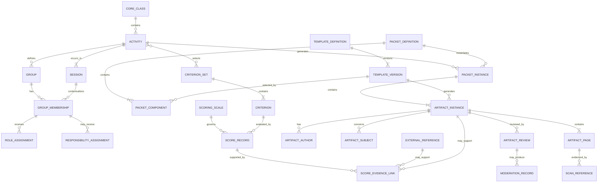

# Initial Concord Domain Model

**Status:** Draft for conceptual contract design
**Project:** Paper Data Suite
**Module:** `pds-concord`
**Issue:** #8
**Date:** July 13, 2026

## 1. Purpose

This document defines the initial conceptual domain model for `pds-concord`.

It translates the findings from the following documents into a coherent set of domain concepts and relationships:

* [Concord Conceptual Design](../concord-conceptual-design-revised.md);
* [Cross-Case Requirements Matrix](cross-case-requirements.md);
* [Socratic Seminar Packet Model](../packet_models/socratic-seminar-packet-model.md);
* [Science Laboratory Group Packet Model](../packet_models/science-laboratory-group-packet-model.md); and
* [Collaborative Programming or Engineering Project Packet Model](../packet_models/collaborative-programming_engineering_project_packet_model.md).

The model is implementation-neutral. It does not prescribe:

* Python classes;
* JSON Schema structure;
* database tables;
* filesystem layout;
* QR payload syntax;
* user-interface design;
* or public API stability.

Its purpose is to establish the concepts, relationships, cardinalities, ownership boundaries, and invariants that later contracts and implementations must preserve.

## 2. Domain Definition

Concord is a paper-based collaborative-evidence system.

Its domain begins with an already-planned collaborative classroom activity and covers:

1. configuring the activity context;
2. generating packets and artifacts;
3. identifying artifact authors and subjects;
4. receiving and filing scans;
5. reviewing and moderating evidence;
6. recording criterion-level scores; and
7. linking Concord evidence and scores to records owned elsewhere.

Concord does not own lesson planning, OMR, extended written-response evaluation, course-grade calculation, formal incident management, or external project-file systems.

## 3. Modeling Conventions

### 3.1 First-class entity

A first-class entity:

* has a durable identity;
* has an independent lifecycle;
* may be referenced by other records; and
* must remain distinguishable from similar entities over time.

Examples include an activity, session, artifact instance, review, or score record.

### 3.2 Association record

An association record represents a meaningful relationship between entities.

It should have its own durable identity when the relationship:

* changes over time;
* carries metadata;
* may be corrected or superseded;
* or must be cited as evidence.

Examples include group membership, role assignment, artifact authorship, artifact subject assignment, and score-evidence linkage.

### 3.3 Typed reference

A typed reference identifies something owned either by Concord or another module without duplicating the referenced record.

Examples include:

* Core student reference;
* Concord group reference;
* Concord session reference;
* ScoreForm result reference;
* Quillan response reference;
* or future gradebook record reference.

A typed reference identifies both:

* the kind of target; and
* the durable identifier of that target.

### 3.4 Value object

A value object has meaning but does not require independent identity.

Examples include:

* privacy classification;
* evidence locator;
* role key;
* score disposition;
* authorship mode;
* page position;
* and status reason.

### 3.5 Definitions and instances

Reusable definitions must remain separate from generated classroom records.

Examples:

* a template definition is reusable;
* a template version is an immutable revision;
* an artifact instance is one generated copy of that version;
* a packet definition is reusable;
* a packet instance is generated for a specific activity context.

### 3.6 Historical preservation

Records that have been used as evidence must not be silently rewritten.

Corrections, rescans, reassignments, revised scores, and superseding decisions must preserve the earlier state and explain what changed.

### 3.7 Surface neutrality

The conceptual model must not depend on whether a teacher completes a step:

* on paper;
* in a terminal interface;
* in a future graphical interface;
* or through another local workflow.

For example, a scanned paper rubric and a digitally entered rubric should be capable of producing the same conceptual score record.

## 4. Ownership Boundaries

### 4.1 Concord-owned concepts

Concord owns:

* activities;
* sessions;
* activity-specific groups;
* group membership;
* contextual roles;
* optional responsibilities;
* packet and template definitions;
* generated packet and artifact instances;
* artifact authorship and subject relationships;
* Concord-specific routed evidence references;
* artifact review and moderation;
* criteria and scoring scales;
* score records;
* score-evidence relationships;
* external-module relationships;
* and Concord-specific corrections and supersession history.

### 4.2 Core-owned concepts

`pds-core` owns:

* workspace resolution;
* canonical class identity;
* roster and student identity;
* canonical assignment-routing conventions;
* shared identifier validation;
* safe path construction;
* shared `PDS1` QR contracts;
* source-scan retention;
* source-scan provenance;
* shared routing-failure and resolution metadata;
* standards libraries and standards profiles;
* and shared navigation behavior.

Concord references these records rather than duplicating them.

### 4.3 ScoreForm-owned concepts

`pds-scoreform` owns:

* OMR assignments;
* machine-readable answer sheets;
* bubble ratings;
* structured machine-readable checks;
* and ScoreForm result records.

### 4.4 Quillan-owned concepts

`pds-quillan` owns:

* focused written responses;
* extended reflections;
* substantial written peer feedback;
* written explanations and defenses;
* and Quillan review and scoring records.

### 4.5 Future or external ownership

Other systems own:

* lesson and unit plans;
* course-grade calculation;
* reporting and communication;
* formal safety or disciplinary incidents;
* source-control history;
* CAD and engineering files;
* and authoritative cloud-document histories.

## 5. Conceptual Overview



The diagram shows conceptual relationships only. It does not prescribe implementation aggregates or database foreign keys.

## 6. Activity and Collaboration Context

### 6.1 Activity

An **Activity** represents one already-planned collaborative classroom undertaking.

Examples include:

* a Socratic seminar;
* a laboratory investigation;
* a collaborative programming project;
* a design challenge;
* a debate;
* or a group research task.

An Activity should contain:

* durable Concord `activity_id`;
* required Core class reference;
* title or short label;
* activity type or teacher-defined category;
* lifecycle status;
* optional Core assignment-routing reference;
* optional selected criterion sets;
* optional standards references;
* creation and update provenance;
* and optional links to related module records.

#### Identity recommendation

Concord should use its own durable `activity_id`.

The Activity should also reference the appropriate Core assignment-routing context when one exists. These identifiers serve different purposes:

* `activity_id` identifies the Concord collaborative activity;
* the Core assignment reference identifies its shared workspace or suite-level routing context.

A one-to-one mapping may be used initially, but the concepts should not be collapsed prematurely. One Core assignment may eventually contain several Concord activities, and one Concord activity may link to several ScoreForm or Quillan assignments.

#### Cardinality

* One Core class may contain zero or many Concord activities.
* One Activity belongs to exactly one Core class in the initial model.
* One Activity contains one or more Sessions.
* One Activity may contain zero or more Groups.
* One Activity may generate zero or more Packet Instances.

Cross-class collaborative activities are outside the initial model.

### 6.2 Session

A **Session** represents one occurrence or work period within an Activity.

Examples include:

* one seminar rotation;
* one laboratory period;
* one project workday;
* one milestone-review period;
* or one final demonstration.

A Session should contain:

* durable `session_id`;
* parent `activity_id`;
* sequence or ordering value;
* optional date and time context;
* optional label;
* lifecycle status;
* and optional contextual notes.

#### Cardinality

* One Activity contains one or more Sessions.
* One Session belongs to exactly one Activity.
* One Session may contextualize zero or more memberships, roles, responsibilities, artifacts, events, and scores.

Even a single-period activity should have one Session. This avoids special cases in group membership, role assignment, artifact routing, and provenance.

### 6.3 Group

A **Group** is an activity-specific collaborative unit.

A Group should contain:

* durable `group_id`;
* parent `activity_id`;
* teacher-facing label;
* optional description;
* optional parent `group_id`;
* lifecycle status;
* and optional effective-session context.

Groups are owned by Concord, not added to the Core class roster.

#### Subteams

A temporary subteam should initially be represented as a Group with:

* a `parent_group_id`;
* bounded session or activity-marker context; and
* its own membership records.

A separate Subteam entity is not required in the initial model.

#### Cardinality

* One Activity may contain zero or many Groups.
* One Group belongs to exactly one Activity.
* One Group may have zero or one parent Group.
* One Group may have zero or many child Groups.
* One Group has zero or many Group Membership records.

### 6.4 Group Membership

A **Group Membership** associates one human participant with one Group for a defined context.

It is not a permanent student attribute.

A Group Membership should contain:

* durable `membership_id`;
* `group_id`;
* typed participant reference;
* effective Session or session range;
* membership status;
* optional reason for change;
* creation provenance;
* and optional supersession reference.

The participant will normally be a Core student reference. The model should also permit another authorized participant when required.

#### Cardinality

* One Group has zero or many memberships.
* One participant may have zero or many memberships within an Activity.
* One membership belongs to exactly one Group.
* One membership refers to exactly one participant.
* One membership is effective for one or more identified Sessions.

A participant may belong to different Groups in different Sessions without rewriting earlier records.

### 6.5 Role Assignment

A **Role Assignment** records a contextual function held by a participant.

Examples include:

* peer observer;
* discussion mapper;
* facilitator;
* recorder;
* materials manager;
* tester;
* debugger;
* or integration coordinator.

A Role Assignment should contain:

* durable `role_assignment_id`;
* participant or membership reference;
* role key or role-definition reference;
* Activity, Session, and optional Group context;
* effective sequence or session context;
* assignment status;
* optional source or assigner;
* and optional supersession reference.

#### Cardinality

* One participant may hold zero or many roles.
* One role may be shared by zero or many participants.
* One role assignment belongs to exactly one Activity.
* A role assignment may be limited to one Session, several Sessions, one Group, or one stage within a Session.

Roles are contextual assignments, not personality labels or permanent classifications.

### 6.6 Responsibility Assignment

A **Responsibility Assignment** records a specific obligation assigned to a participant, Group, or subteam.

Examples include:

* record measurements;
* assemble apparatus;
* implement one component;
* verify a calculation;
* conduct testing;
* or prepare materials.

Responsibility Assignment is part of the Concord domain but optional for activities that do not explicitly divide work.

It should contain:

* durable `responsibility_assignment_id`;
* Activity context;
* optional Session, Group, activity-marker, or work-item reference;
* typed assignee reference;
* concise responsibility description;
* assignment status;
* effective context;
* optional expected output;
* optional reassignment reason;
* and optional supersession reference.

#### Required distinction

A Responsibility Assignment records what was assigned.

It does not prove:

* completion;
* quality;
* contribution;
* or role fulfillment.

Evidence of fulfillment must come from an artifact, observation, contribution claim, teacher judgment, or other reviewed source.

## 7. Reusable Definitions and Generated Instances

### 7.1 Template Definition

A **Template Definition** represents the stable identity and lineage of one reusable printable design.

Examples include:

* peer observation form;
* discussion map;
* responsibility record;
* group retrospective;
* teacher observation tracker;
* or scoring rubric.

A Template Definition should contain:

* durable `template_id`;
* name;
* general artifact category;
* purpose;
* owner or source;
* lifecycle status;
* and zero or more Template Versions.

A Template Definition does not contain a specific class, group, student, or activity assignment.

### 7.2 Template Version

A **Template Version** is one immutable revision of a Template Definition.

It should contain:

* durable `template_version_id`;
* parent `template_id`;
* version label or sequence;
* layout or rendering specification reference;
* artifact category;
* page structure;
* expected-return behavior;
* default privacy classification;
* default authorship and subject expectations;
* optional supported criteria;
* QR-placement requirements;
* creation provenance;
* and retirement status.

Once a Template Version has generated an Artifact Instance, it must not be silently modified.

A change to wording, layout, QR placement, scoring criteria, or page structure requires a new Template Version.

### 7.3 Packet Definition

A **Packet Definition** is a reusable, ordered composition of Template Versions.

It should contain:

* durable `packet_definition_id`;
* name;
* version or revision;
* purpose;
* ordered Packet Components;
* optional generation rules;
* lifecycle status;
* and creation provenance.

Each Packet Component should identify:

* exact Template Version;
* quantity or repetition rule;
* intended audience or context;
* whether it is required, recommended, or conditional;
* and its order within the packet.

A Packet Definition should be immutable after it has generated Packet Instances. Changes to its composition require a new revision.

### 7.4 Packet Instance

A **Packet Instance** is a generated packet tied to a specific classroom context.

It should contain:

* durable `packet_instance_id`;
* exact Packet Definition revision;
* `activity_id`;
* optional `session_id`;
* optional Group or participant context;
* generation timestamp;
* generator or teacher reference;
* generation status;
* and one or more Artifact Instances.

#### Cardinality

* One Packet Definition may generate zero or many Packet Instances.
* One Packet Instance uses exactly one Packet Definition revision.
* One Activity may have zero or many Packet Instances.
* One Packet Instance contains one or more Artifact Instances.

A long-running Activity may use:

* one Packet Instance containing artifacts that continue across Sessions; or
* several linked Packet Instances generated at different checkpoints.

The exact long-lived-packet policy remains a contract question.

### 7.5 Artifact Instance

An **Artifact Instance** is one generated copy of one Template Version.

Examples include:

* the discussion map generated for Group 3;
* one peer observation form assigned to a student observer;
* the teacher observation page for a class period;
* or one project retrospective generated for a milestone.

An Artifact Instance should contain:

* durable `artifact_instance_id`;
* exact `template_version_id`;
* parent `activity_id`;
* optional `packet_instance_id`;
* optional Session, Group, or activity-marker context;
* artifact category;
* generation provenance;
* expected-return status;
* artifact lifecycle status;
* default or effective privacy classification;
* and one or more Artifact Pages.

An Artifact Instance may exist independently of a Packet Instance when the teacher generates a single form.

#### Cardinality

* One Template Version may generate zero or many Artifact Instances.
* One Artifact Instance uses exactly one Template Version.
* One Artifact Instance belongs to exactly one Activity.
* One Artifact Instance may belong to zero or one Packet Instance.
* One Artifact Instance contains one or more Artifact Pages.
* One Artifact Instance may have zero or many Authors.
* One Artifact Instance may have zero or many Subjects.

### 7.6 Artifact Page

An **Artifact Page** represents one expected page within an Artifact Instance.

It should contain:

* durable `artifact_page_id`;
* parent `artifact_instance_id`;
* page number;
* total expected pages where known;
* page kind;
* stable human-readable fallback identifier;
* shared QR payload or QR reference where required;
* expected-return status;
* optional continuation-page relationship;
* and page lifecycle status.

Every scannable page expected to return to Concord should have stable page identity.

Non-returned instructional scaffolds may omit QR data when the Template Version declares that the page is not evidence-bearing.

#### Cardinality

* One Artifact Instance contains one or more Artifact Pages.
* One Artifact Page belongs to exactly one Artifact Instance.
* One Artifact Page may have zero or many Scan References.
* One Scan Reference should identify one source page associated with one Artifact Page.

## 8. Authorship and Subject Relationships

### 8.1 Artifact Author

An **Artifact Author** is an association between an Artifact Instance and the person or collective that completed or produced it.

It should contain:

* durable `artifact_author_id`;
* `artifact_instance_id`;
* typed author reference;
* authorship mode;
* optional role context;
* optional represented Group;
* attribution status;
* source of attribution;
* and optional moderation or correction reference.

Possible authorship modes include:

* direct individual author;
* co-author;
* observer;
* recorder;
* recorder acting for a Group;
* collective Group author;
* teacher author;
* or unknown pending review.

#### Cardinality

* One Artifact Instance may have zero or many Artifact Authors.
* One author may be associated with zero or many Artifact Instances.
* An Artifact may have no confirmed author while generated, missing, or awaiting review.
* A reviewed evidence-bearing artifact should normally have at least one confirmed author or an explicit unknown or collective authorship status.

#### Invariant

The following do not establish sole authorship automatically:

* physical handwriting;
* recorder status;
* device ownership;
* account ownership;
* file ownership;
* or possession of the completed page.

### 8.2 Artifact Subject

An **Artifact Subject** is an association between an Artifact Instance and the person, Group, context, event, or object that the artifact concerns.

It should contain:

* durable `artifact_subject_id`;
* `artifact_instance_id`;
* typed subject reference;
* subject role or relationship;
* optional criterion context;
* confirmation status;
* source of subject assignment;
* and optional correction reference.

Subject types may include:

* student;
* Group;
* Session;
* Activity;
* activity marker;
* work item;
* activity event;
* attachment or external artifact;
* or another supported contextual object.

#### Cardinality

* One Artifact Instance may have zero or many Subjects.
* One Subject may be associated with zero or many Artifact Instances.
* One Artifact may concern several students and several Groups simultaneously.
* One Group-level Artifact need not have any individual student subject.
* An unresolved or unmatched Artifact may temporarily have no confirmed Subject.

#### Multi-subject teacher trackers

A teacher observation tracker should remain one Artifact Instance with several Artifact Subject relationships.

Several later individual or Group Score Records may reference that same Artifact Instance.

The initial model does not require handwriting-region extraction. A Score Evidence Link may carry an optional evidence locator such as:

* page number;
* row label;
* student label;
* criterion column;
* or teacher-entered note.

## 9. Evidence, Scans, Review, and Moderation

### 9.1 Evidence as a domain role

Evidence is not limited to one record type.

The following may function as evidence:

* a reviewed Artifact Instance;
* one Artifact Page;
* a teacher observation;
* a moderated peer observation;
* a reviewed attachment;
* a contribution claim;
* a teacher-entered rationale;
* a ScoreForm result;
* or a Quillan response.

The domain should therefore use a typed **Evidence Reference** rather than requiring every evidence source to be transformed into one universal evidence entity.

An Evidence Reference should identify:

* evidence source type;
* durable source identifier;
* optional page or location;
* optional subject context;
* optional relevance note;
* and optional moderation requirement.

### 9.2 Scan Reference

A **Scan Reference** is a Concord-owned routed reference to a source scan retained by Core.

It should contain:

* durable `scan_reference_id`;
* `artifact_page_id`;
* Core source-scan reference;
* source page index;
* routed representation reference where applicable;
* routing status;
* readability status;
* filing status;
* provenance metadata required by Core;
* and optional superseded Scan Reference.

Concord does not own or replace the original source scan.

#### Cardinality

* One Artifact Page may have zero or many Scan References.
* One Core source scan may yield references for many Artifact Pages.
* One Scan Reference links one source page or page region to one Artifact Page.
* One active routed source page should normally resolve to one Artifact Page after review.
* Duplicate, conflicting, or corrected routing states must remain representable.

### 9.3 Artifact Review

An **Artifact Review** records a human examination of an Artifact Instance and its routed evidence.

It should contain:

* durable `artifact_review_id`;
* target `artifact_instance_id`;
* reviewer reference;
* review timestamp;
* scan-readability judgment;
* page-completeness judgment;
* filing confirmation;
* author confirmation or correction;
* subject confirmation or correction;
* privacy confirmation or override;
* relevance judgment;
* moderation requirement;
* scoring-readiness status;
* notes;
* and optional superseded Review reference.

A Review may confirm or correct metadata, but it must not modify the source scan.

#### Cardinality

* One Artifact Instance may have zero or many Reviews.
* One Review belongs to exactly one Artifact Instance.
* One reviewer may complete zero or many Reviews.
* Later Reviews may supplement or supersede earlier Reviews while retaining history.

### 9.4 Moderation Record

A **Moderation Record** documents a teacher’s judgment about the reliability, fairness, relevance, or permissible use of evidence.

Moderation is especially important for:

* peer observations;
* student-created claims about other students;
* disputed contribution records;
* conflicting group accounts;
* and incomplete or questionable evidence.

A Moderation Record should contain:

* durable `moderation_record_id`;
* moderator reference;
* target evidence reference;
* optional target subject;
* moderation status;
* qualification or rationale;
* permitted scoring use;
* timestamp;
* and optional superseded Moderation Record.

Possible statuses include:

* accepted;
* accepted with qualification;
* insufficient;
* disputed;
* rejected;
* or not used for scoring.

#### Cardinality

* One evidence source may have zero or many Moderation Records.
* One Moderation Record evaluates exactly one primary evidence source or claim.
* One Moderation Record may apply to one or several Subjects if explicitly identified.
* Evidence requiring moderation must not support a consequential score until an applicable moderation decision exists.

### 9.5 Correction and Supersession

The initial model should support a general **Correction Record** or equivalent append-only correction relationship.

A Correction Record should identify:

* durable `correction_id`;
* target record type and identifier;
* correction type;
* reason;
* correcting actor;
* timestamp;
* replacement or superseding record where applicable;
* and optional note.

Corrections may apply to:

* filing metadata;
* author attribution;
* subject attribution;
* Group membership;
* role or responsibility assignment;
* Scan Reference;
* Review;
* Moderation Record;
* Score Record;
* or optional activity-context records.

The original record remains available for provenance.

## 10. Criteria and Scoring

### 10.1 Criterion Set

A **Criterion Set** is a reusable or activity-specific collection of related Criteria.

It should contain:

* durable `criterion_set_id`;
* name;
* purpose;
* version or revision;
* scope;
* ordered Criterion references;
* optional Core standards references;
* lifecycle status;
* and creation provenance.

An Activity may select one or more Criterion Sets.

A Criterion Set should be immutable after scores reference it. Changes require a new revision.

### 10.2 Criterion

A **Criterion** defines one aspect of performance, process, contribution, or product quality.

Examples include:

* responds to peers’ ideas;
* uses evidence in decisions;
* fulfills responsibilities;
* contributes to testing;
* supports Group coordination;
* or improves the shared product.

A Criterion should contain:

* durable `criterion_id`;
* parent Criterion Set;
* stable key;
* teacher-facing label;
* definition;
* supported score-target types;
* optional default Scoring Scale;
* optional standards references;
* and lifecycle status.

Criteria should describe performance rather than personality.

### 10.3 Scoring Scale

A **Scoring Scale** defines the permitted values and meanings used by Score Records.

It may be:

* numeric;
* ordinal;
* categorical;
* binary;
* or teacher-defined.

A Scoring Scale should contain:

* durable `scoring_scale_id`;
* name;
* version or revision;
* scale type;
* permitted values or levels;
* level labels and descriptions;
* optional aggregation guidance;
* lifecycle status;
* and creation provenance.

A scale used by an existing Score Record must remain reproducible. Changes require a new revision.

### 10.4 Score Record

A **Score Record** is one teacher-approved judgment about one Criterion for one target.

It should contain:

* durable `score_record_id`;
* `activity_id`;
* optional `session_id`;
* typed score-target reference;
* `criterion_id`;
* exact Scoring Scale revision;
* score disposition;
* score value when applicable;
* scorer reference;
* scoring timestamp;
* optional rationale;
* optional moderation-complete status;
* and optional superseded Score Record.

Score-target types may include:

* student;
* Group;
* subteam represented as Group;
* Session;
* Artifact Instance;
* activity component;
* or Activity.

#### Score disposition

A Score Record should distinguish:

* scored;
* insufficient evidence;
* absent;
* excused;
* not observed;
* not applicable;
* or deferred.

When the disposition is `scored`, a valid scale value is required.

When the disposition is not `scored`, a low or zero score must not be inferred automatically.

#### Cardinality

* One Criterion may be used by zero or many Score Records.
* One target may have zero or many Score Records.
* One Score Record evaluates exactly one Criterion for exactly one target.
* One Score Record may have zero or many Score Evidence Links.
* One Score Record may supersede zero or one earlier Score Record.

A teacher may enter a Score using professional judgment without one controlling Artifact, but the Score should retain a rationale and scorer provenance.

### 10.5 Score Evidence Link

A **Score Evidence Link** associates one Score Record with one evidence source.

It should contain:

* durable `score_evidence_link_id`;
* `score_record_id`;
* typed Evidence Reference;
* optional evidence locator;
* relevance or use description;
* optional weight or significance note;
* moderation status where applicable;
* and creation provenance.

#### Cardinality

* One Score Record may link to zero or many evidence sources.
* One evidence source may support zero or many Score Records.
* Individual, Group, and subteam Scores may cite overlapping evidence.
* Overlapping evidence does not make those Scores equivalent.

#### Invariant

Group evidence or a Group score must not automatically generate or populate an individual Score Record.

An individual score requires an explicit teacher judgment.

## 11. External References

An **External Reference** represents a relationship to a record owned by another module or system.

It should contain:

* durable `external_reference_id`;
* owning module or system;
* external record type;
* external record identifier;
* relationship purpose;
* related Concord Activity, Session, Artifact, Criterion, or Score;
* availability status;
* optional descriptive label;
* and creation provenance.

Possible external references include:

* ScoreForm assignment;
* ScoreForm result;
* Quillan assignment;
* Quillan response;
* Core standards profile;
* Core standard;
* future lesson-plan record;
* future gradebook record;
* or authorized external artifact location.

Concord should not copy the external record’s full content when a stable reference is sufficient.

An unavailable external record should remain an explicit unavailable reference rather than being treated as missing student performance.

## 12. Optional Context and Extension Concepts

The following concepts belong in the Concord domain but should not be required for every Activity.

### 12.1 Activity Marker

An **Activity Marker** provides an ordered or named context within an Activity.

Marker types may include:

* phase;
* stage;
* milestone;
* checkpoint;
* rotation;
* or iteration.

An Activity Marker may contain:

* durable `activity_marker_id`;
* parent Activity;
* marker type;
* label;
* sequence;
* optional Session range;
* status;
* and supersession history.

This avoids creating a mandatory laboratory- or project-specific hierarchy.

### 12.2 Work Item

A **Work Item** represents a task, component, deliverable, or bounded unit of collaborative work.

It may contain:

* durable `work_item_id`;
* parent Activity;
* optional parent Work Item;
* work-item type;
* concise label and description;
* optional Group or assignee context;
* optional Activity Marker;
* status;
* and supersession history.

Work Items exist to contextualize evidence and responsibilities. Concord should not become a general project-management or scheduling system.

### 12.3 Work-Item Dependency

A **Work-Item Dependency** is an optional association between two Work Items.

It may contain:

* durable dependency identifier;
* predecessor Work Item;
* dependent Work Item;
* dependency type;
* status;
* and optional note.

Blocked work caused by an unmet dependency must remain distinguishable from neglected or incomplete work.

### 12.4 Activity Event

An **Activity Event** is a typed evidence-bearing occurrence within an Activity.

Event types may include:

* decision;
* troubleshooting episode;
* test;
* invalid trial;
* revision;
* handoff;
* teacher intervention;
* interruption;
* or other teacher-defined event.

An Activity Event may contain:

* durable `activity_event_id`;
* Activity and optional Session context;
* event type;
* optional Group, Activity Marker, or Work Item context;
* contributors;
* subjects;
* concise description;
* outcome or status;
* chronology;
* and optional superseding Event.

A common event envelope is preferred initially over separate first-class entities for every event type. Type-specific details may remain in an extension field or artifact-specific record until contract examples demonstrate the need for specialized contracts.

### 12.5 Contribution Claim

A **Contribution Claim** is a statement that a participant or Group made a particular contribution.

It may contain:

* durable `contribution_claim_id`;
* claimant or recorder;
* claimed contributor;
* Activity context;
* optional Artifact, Work Item, Event, or responsibility reference;
* contribution type;
* concise description;
* corroboration status;
* moderation requirement;
* and supersession history.

A Contribution Claim is evidence, not a score.

Claims about another student require teacher review before consequential use.

### 12.6 Attachment

An **Attachment** represents physical or digital work associated with Concord but not generated as a normal Concord Artifact Page.

Examples include:

* poster;
* graph paper;
* photograph of a model;
* screenshot;
* printed source code;
* project diagram;
* teacher-created worksheet;
* or external digital file.

An Attachment may contain:

* durable `attachment_id`;
* parent Activity;
* optional Group, Session, Work Item, Event, or Artifact context;
* attachment type;
* title or label;
* contributor references;
* physical or digital location reference;
* version or iteration label;
* availability status;
* privacy classification;
* and provenance.

An Attachment is distinct from a Scan Reference:

* a Scan Reference links a Core-retained source scan to an Artifact Page;
* an Attachment identifies related work that may have its own file, photograph, cover sheet, or external location.

## 13. Cardinality Summary

| Relationship                                  | Cardinality         |
| --------------------------------------------- | ------------------- |
| Core Class → Activity                         | One to zero-or-many |
| Activity → Session                            | One to one-or-many  |
| Activity → Group                              | One to zero-or-many |
| Group → child Group                           | One to zero-or-many |
| Group → Group Membership                      | One to zero-or-many |
| Participant → Group Membership                | One to zero-or-many |
| Membership/participant → Role Assignment      | One to zero-or-many |
| Participant/Group → Responsibility Assignment | One to zero-or-many |
| Template Definition → Template Version        | One to one-or-many  |
| Packet Definition → Packet Component          | One to one-or-many  |
| Template Version → Packet Component           | One to zero-or-many |
| Packet Definition → Packet Instance           | One to zero-or-many |
| Activity → Packet Instance                    | One to zero-or-many |
| Packet Instance → Artifact Instance           | One to one-or-many  |
| Template Version → Artifact Instance          | One to zero-or-many |
| Artifact Instance → Artifact Page             | One to one-or-many  |
| Artifact Instance → Artifact Author           | One to zero-or-many |
| Artifact Instance → Artifact Subject          | One to zero-or-many |
| Artifact Page → Scan Reference                | One to zero-or-many |
| Artifact Instance → Artifact Review           | One to zero-or-many |
| Evidence source → Moderation Record           | One to zero-or-many |
| Criterion Set → Criterion                     | One to one-or-many  |
| Activity → Criterion Set                      | Many-to-many        |
| Criterion → Score Record                      | One to zero-or-many |
| Score target → Score Record                   | One to zero-or-many |
| Score Record → Score Evidence Link            | One to zero-or-many |
| Evidence source → Score Evidence Link         | One to zero-or-many |
| Concord record → External Reference           | One to zero-or-many |

## 14. Lifecycle Relationships

### 14.1 Activity lifecycle

```text
draft
  -> configured
  -> active
  -> completed
  -> archived
```

An Activity may also be cancelled. Cancellation must not remove already generated evidence.

### 14.2 Packet and artifact lifecycle

```text
definition selected
  -> packet instance generated
  -> artifact instances generated
  -> pages printed/distributed
  -> evidence expected
  -> pages returned
  -> scans retained by Core
  -> pages identified and filed by Concord
  -> artifacts reviewed
  -> moderation completed where required
  -> evidence ready for scoring
  -> scores recorded
  -> records retained or archived
```

Not every Artifact will pass through every step.

Examples:

* a non-returned scaffold stops after distribution;
* a missing Artifact never reaches scan review;
* a peer observation requires moderation;
* a teacher tracker may move directly from review to scoring use.

### 14.3 Independent status dimensions

The initial contracts should avoid one overly broad status field when several independent facts exist.

An Artifact may separately have:

* generation status;
* expected-return status;
* scan status;
* filing status;
* review status;
* moderation status;
* scoring-readiness status;
* and supersession status.

This prevents ambiguous states such as treating “reviewed” as meaning “complete, accepted, moderated, and scored.”

### 14.4 Correction lifecycle

```text
original record
  -> issue discovered
  -> correction or replacement recorded
  -> replacement becomes current
  -> original remains available for provenance
```

## 15. Durable Identifier Requirements

The following should have durable identifiers:

* Activity;
* Session;
* Group;
* Group Membership;
* Role Assignment;
* Responsibility Assignment;
* Template Definition;
* Template Version;
* Packet Definition;
* Packet Instance;
* Artifact Instance;
* Artifact Page;
* Artifact Author association;
* Artifact Subject association;
* Scan Reference;
* Artifact Review;
* Moderation Record;
* Criterion Set;
* Criterion;
* Scoring Scale;
* Score Record;
* Score Evidence Link;
* External Reference;
* Correction Record;
* Activity Marker;
* Work Item;
* Work-Item Dependency;
* Activity Event;
* Contribution Claim;
* and Attachment.

Identifier formats are owned by shared Core conventions.

Identifiers must:

* be stable;
* avoid student names or other direct PII;
* remain safe for local paths when used in paths;
* and remain usable after display names, Group labels, or titles change.

The following are normally value objects rather than independently identified records:

* privacy classification;
* role key;
* authorship mode;
* subject type;
* evidence locator;
* score disposition;
* status reason;
* event type;
* contribution type;
* and page position.

## 16. Privacy Model

Privacy should be attached to evidence-bearing and judgment-bearing records.

At minimum, privacy must be supported on:

* Artifact Instance;
* Artifact Review;
* Moderation Record;
* Contribution Claim;
* Attachment;
* Score Record;
* and teacher-entered notes.

The effective privacy level may be inherited from a Template Version and overridden by the generated record.

A child or derived record may become more restrictive than its parent.

For example:

* a Group process sheet may be Group-and-teacher;
* a teacher note about a dispute may be teacher-restricted;
* a Score Record may be visible only to the teacher and scored subject.

A less restrictive child privacy setting must not be inferred automatically from a parent record.

The exact shared privacy vocabulary remains to be coordinated with Core.

## 17. Domain Invariants

The following rules must be preserved by all later contracts and implementations.

1. **The retained source scan is canonical evidence.**
   Routed files, metadata, notes, reviews, and scores do not replace it.

2. **Author and subject are separate relationships.**
   They must never be inferred to be the same merely because only one student is named.

3. **Authorship is not inferred from physical or digital possession.**
   Handwriting, recorder status, account ownership, and file ownership do not establish sole authorship.

4. **Roles, responsibilities, tasks, and contributions are distinct.**
   One may inform another, but none proves the others automatically.

5. **Assignment is not performance.**
   Being assigned a role or responsibility does not prove fulfillment.

6. **Missing evidence is not negative evidence.**
   Missing, unreadable, misrouted, absent, excused, not observed, and insufficient-evidence states remain distinct.

7. **External failure is not poor performance.**
   Equipment failure, interruption, blocked work, dependency failure, or unavailable external files must be represented separately from neglect or low-quality work.

8. **Moderation precedes consequential use when required.**
   Peer evidence and disputed student-generated claims must receive human review before affecting a score.

9. **Group evidence does not automatically produce individual scores.**
   An individual Score requires explicit teacher judgment.

10. **Evidence and scores have a many-to-many relationship.**
    One score may use several evidence sources, and one source may support several scores.

11. **Review, moderation, and scoring remain separate.**
    Reviewing a scan does not imply accepting its claims or assigning a score.

12. **A score is not a course grade.**
    Concord records judgments about criteria or components. Grade calculation belongs elsewhere.

13. **History is preserved.**
    Corrections, rescans, reassignments, revised decisions, and revised scores must not erase earlier records.

14. **Definitions used by evidence are reproducible.**
    Template Versions, Packet Definition revisions, Criterion Sets, Criteria, and Scoring Scales must remain identifiable after use.

15. **Activity-specific vocabulary remains optional.**
    Seminar rotations, laboratory trials, project milestones, software builds, and similar terms must not become required fields in every Concord record.

16. **External systems remain authoritative for their own records.**
    Concord may reference ScoreForm, Quillan, Core, source-control, cloud-document, or institutional records but does not silently copy or replace their authority.

## 18. Domain Decisions Reached

The initial domain model adopts the following decisions:

1. Concord uses its own `activity_id` while retaining a reference to Core’s assignment-routing context.
2. Every Activity contains at least one Session.
3. Groups are Activity-specific and Concord-owned.
4. Temporary subteams are represented as Groups with a parent Group and bounded context.
5. Group Membership is contextual and preserves historical changes.
6. Role Assignment is a universal first-class relationship.
7. Responsibility Assignment is a first-class but optional relationship.
8. Packet Definitions and Template Versions are reusable definitions; Packet and Artifact Instances are generated records.
9. Artifact Authors and Artifact Subjects are separate association records with flexible cardinality.
10. Multi-subject teacher trackers remain single source Artifacts with several Subject relationships.
11. Evidence is represented through typed references rather than one universal evidence entity.
12. Scan References point to Core-retained source scans rather than duplicating source-scan ownership.
13. Review and Moderation are separate concepts.
14. Score Records evaluate one Criterion for one target.
15. Score Evidence Links provide the many-to-many relationship between scores and evidence.
16. Activity-specific decisions, tests, troubleshooting episodes, revisions, and handoffs initially share a typed Activity Event envelope.
17. Milestones, phases, checkpoints, and iterations may share an optional Activity Marker concept.
18. Tasks and components may share an optional Work Item concept.
19. Attachments are distinct from normal Artifact Pages and Scan References.
20. Corrections and superseding records preserve history rather than overwriting evidence.

## 19. Unresolved Questions

The following questions remain for architecture decisions or conceptual contract work:

1. What exact relationship should exist between Concord `activity_id` and Core `assignment_id`?
2. Which Activity and Artifact context fields belong in the shared QR payload rather than the linked Artifact record?
3. How will the shared QR contract represent Group, Session, Activity, Event, Artifact, and multi-subject scope without a required `student_id`?
4. Does Core provide a durable teacher or authorized-adult identity, or must Concord define a local actor reference?
5. What temporal precision should Group Membership, Role Assignment, and Responsibility Assignment use:

   * Session;
   * Session range;
   * sequence within Session;
   * named stage;
   * or timestamp?
6. Should Packet Definition versioning use a separate Packet Version entity or an immutable revision field on Packet Definition?
7. Should a long-running project use one continuing Packet Instance or several linked Packet Instances?
8. Which privacy classifications should be shared across PDS modules?
9. Should Correction Record be one generic contract or should each record type use type-specific supersession fields?
10. How much typed structure should Activity Event provide before specialized event contracts become necessary?
11. Should an individual Score require at least one individual-specific evidence source?
12. Should Criterion and Scoring Scale revisions be separate entities or immutable version fields?
13. How should teacher-entered professional judgment be represented when no Artifact or external evidence record controls the Score?
14. How should external digital locations be stored without assuming Git, Google Drive, or another provider?
15. Which role, criterion, contribution, and event vocabularies should ship as starter data rather than domain requirements?

## 20. Recommendations for Conceptual Contract Work

The initial conceptual contracts should be drafted in the following order.

### Phase 1: Shared reference primitives

Define:

* Concord identifier conventions;
* Core class reference;
* Core student reference;
* actor reference;
* subject reference;
* score-target reference;
* evidence reference;
* privacy classification;
* provenance fields;
* and supersession references.

### Phase 2: Activity context

Draft examples for:

* `activity`;
* `session`;
* `group`;
* `group_membership`;
* `role_assignment`;
* and optional `responsibility_assignment`.

Test them against:

* seminar role rotation;
* laboratory reassignment;
* project membership changes;
* absence;
* late arrival;
* and temporary subteams.

### Phase 3: Definitions and generated artifacts

Draft examples for:

* `template_definition`;
* `template_version`;
* `packet_definition`;
* `packet_instance`;
* `artifact_instance`;
* `artifact_page`;
* `artifact_author`;
* and `artifact_subject`.

Test them against:

* one student author and a different student subject;
* one Group author;
* one recorder acting for a Group;
* one Artifact with several Subjects;
* one Group Artifact with no individual student Subject;
* and one teacher tracker spanning several Groups.

### Phase 4: Scan, review, and moderation

Draft examples for:

* `scan_reference`;
* `artifact_review`;
* `moderation_record`;
* and correction or supersession behavior.

Test them against:

* mixed-batch scans;
* unreadable pages;
* duplicate scans;
* damaged QR codes;
* incorrect Subjects;
* peer evidence;
* disputed contribution claims;
* and rescans.

### Phase 5: Criteria and scoring

Draft examples for:

* `criterion_set`;
* `criterion`;
* `scoring_scale`;
* `score_record`;
* and `score_evidence_link`.

Test them against:

* one score using several Artifacts;
* one Artifact supporting several Scores;
* individual and Group Scores using overlapping evidence;
* insufficient evidence;
* absence;
* deferred scoring;
* revised Scores;
* and external ScoreForm or Quillan evidence.

### Phase 6: Optional extension concepts

Draft examples only after the foundation succeeds for:

* `activity_marker`;
* `work_item`;
* `work_item_dependency`;
* `activity_event`;
* `contribution_claim`;
* and `attachment`.

These concepts should be added only where representative records demonstrate that generic context fields are insufficient.

## 21. Completion Assessment

The minimum shared Concord domain has been identified.

The model now distinguishes:

* reusable definitions from generated instances;
* Core identities from Concord-owned context;
* roles from responsibilities;
* assignments from contributions;
* Artifact Authors from Artifact Subjects;
* source scans from routed evidence references;
* review from moderation;
* evidence from scores;
* individual Scores from Group Scores;
* and Concord scores from course grades.

Universal concepts have been separated from optional seminar-, laboratory-, and project-oriented extensions.

This document provides the foundation for:

* recording formal architecture decisions;
* identifying required Core integration changes;
* drafting conceptual data contracts;
* and testing representative contract examples.
