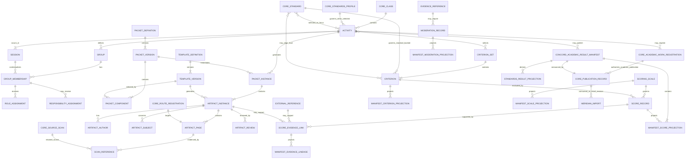

# Initial Concord Domain Model

**Status:** Revised draft for conceptual contract design
**Project:** Paper Data Suite
**Module:** `pds-concord`
**Issue:** #8
**Date:** July 22, 2026
**Revision:** 3 — aligned with PDS2, ADR 0015, the Core publication registry, and Meridian
## 1. Purpose

This document defines the initial conceptual domain model for `pds-concord`.

It translates the findings and decisions from the following documents into a coherent set of domain concepts and relationships:

* [Concord Conceptual Design](../concord-conceptual-design-revised.md);
* [Cross-Case Requirements Matrix](cross-case-requirements.md);
* [Initial Concord Conceptual Data Contracts](conceptual-data-contracts.md);
* [Socratic Seminar Packet Model](../packet_models/socratic-seminar-packet-model.md);
* [Science Laboratory Group Packet Model](../packet_models/science-laboratory-group-packet-model.md);
* [Collaborative Programming or Engineering Project Packet Model](../packet_models/collaborative-programming_engineering_project_packet_model.md);
* the accepted Concord architecture decisions through ADR 0015;
* the current `pds-core` PDS2, standards, Academic Period, Academic Work Registration, and typed Publication Record contracts;
* and the initial `pds-meridian` grading and reporting architecture.

The model is implementation-neutral. It does not prescribe:

* Python classes;
* JSON Schema structure;
* database tables;
* final filesystem layout beneath the module-qualified Concord work root;
* user-interface design;
* or public API stability.

Its purpose is to establish the concepts, relationships, cardinalities, ownership boundaries, standards semantics, publication semantics, and invariants that later contracts and implementations must preserve.

The native Concord domain remains centered on Activities, collaboration context, evidence, Review, Moderation, Criteria, and teacher-approved Scores.

This revision also defines the publication boundary through which:

```text
Concord native records
    -> immutable Concord Academic Result Manifest
    -> immutable Core Publication Record
    -> Meridian import and policy
```

The Concord Academic Result Manifest is a derived, producer-owned publication projection. It does not replace Concord's canonical native records.

When this document conflicts with an accepted Concord ADR, the ADR governs unless a later ADR explicitly supersedes it.

When an earlier design assumption conflicts with the finalized PDS2 or Core publication architecture, the finalized Core contract governs.
## 2. Domain Definition

Concord is a paper-based collaborative-evidence and criterion-scoring system.

Its native domain begins with an already-planned collaborative classroom Activity and covers:

1. configuring the Activity context;
2. declaring whether the Activity is evidence-only, standards-based, mixed, or local-criteria-only;
3. selecting a Core standards profile and ordered Focus Standards when standards-based scoring applies;
4. generating Packets and Artifacts;
5. identifying Artifact Authors and Subjects;
6. receiving and filing scans through PDS2 routing;
7. reviewing and moderating evidence;
8. recording criterion-level teacher judgments;
9. distinguishing direct standard-backed Scores from local Concord Scores;
10. preserving native Score, evidence-link, Moderation, correction, and supersession history;
11. creating immutable, versioned Concord Academic Result Manifests for selected registered Activities;
12. publishing exact manifest revisions through the Core registry;
13. preserving cross-producer evidence lineage for ScoreForm, Quillan, and other authorized sources; and
14. supplying faithful producer-native results to Meridian without calculating proficiency, Grades, Academic Period membership, or formal reports.

Concord's primary academic scoring model is standards-based.

Concord is not standards-exclusive. It also supports:

* evidence-only Activities;
* local procedural or collaborative Criteria;
* Group-process Criteria;
* Activity-component Criteria;
* formative evidence that produces no Score;
* and nonacademic or locally defined collaborative contexts.

The central standards-based relationship is:

```text
collaborative evidence
    -> standard-backed Criterion
    -> teacher-approved Score
    -> Concord Academic Result Manifest
    -> Meridian standards-evidence policy
```

The local-criterion relationship is:

```text
collaborative evidence
    -> local Criterion
    -> teacher-approved local Score
    -> Concord Academic Result Manifest
    -> optional Meridian conventional or hybrid policy
```

A local Score is not a direct standards result merely because the local Criterion carries optional standards-alignment metadata.

Publication is a separate relationship:

```text
Concord Activity
    -> optional Core Academic Work Registration
    -> immutable Concord Academic Result Manifest revision
    -> immutable Core Publication Record
    -> Core discovery catalog
    -> Meridian import
```

Publication does not imply:

* Grade-item membership;
* standards-evidence eligibility;
* summative use;
* Academic Period membership;
* mastery;
* a Grade;
* or inclusion in a formal report.

Concord does not own:

* lesson planning;
* optical mark recognition;
* extended written-response evaluation;
* Academic Period definitions;
* Grade-item membership;
* evidence or attempt selection across publications;
* cross-Activity or cross-module proficiency calculation;
* conventional or hybrid Grade calculation;
* teacher overrides of Meridian-derived results;
* longitudinal reporting;
* formal report snapshots;
* formal incident management;
* or external project-file systems.
## 3. Modeling Conventions

### 3.1 First-class entity

A first-class entity:

* has a durable identity;
* has an independent lifecycle;
* may be referenced by other records;
* and must remain distinguishable from similar entities over time.

Examples include an Activity, Session, Artifact Instance, Review, Criterion, or Score Record.

### 3.2 Association record

An association record represents a meaningful relationship between entities.

It should have its own durable identity when the relationship:

* changes over time;
* carries metadata;
* may be corrected or superseded;
* may be disputed;
* or must be cited as evidence.

Examples include:

* Group Membership;
* Role Assignment;
* Responsibility Assignment;
* Artifact Author;
* Artifact Subject;
* Score Evidence Link;
* Work-Item Dependency;
* and External Reference.

### 3.3 Typed reference

A typed reference identifies something owned either by Concord or another module without duplicating the referenced record.

Examples include:

* Core student reference;
* Concord Group reference;
* Concord Session reference;
* Core standard reference;
* ScoreForm result reference;
* Quillan result reference;
* or future grading and reporting record reference.

A typed reference identifies:

* the owning system;
* the kind of target;
* the durable identifier of that target;
* and, where needed, the public contract version.

### 3.4 Value object

A value object has meaning but does not require independent identity.

Examples include:

* privacy policy;
* evidence locator;
* role key;
* Score disposition;
* authorship mode;
* page position;
* Activity scoring orientation;
* Criterion classification;
* and Status Reason.

### 3.5 Definitions, versions, and instances

Reusable definitions must remain separate from immutable versions and generated classroom records.

Examples:

* a Template Definition is a reusable lineage;
* a Template Version is one immutable revision;
* an Artifact Instance is one generated copy of that version;
* a Packet Definition is a reusable lineage;
* a Packet Version is one immutable composition;
* and a Packet Instance is generated for a specific Activity context.

### 3.6 Historical preservation

Records that have been printed, distributed, scanned, reviewed, moderated, scored, exported, reported, or used as evidence must not be silently rewritten.

Corrections, rescans, reassignments, revised Scores, revised standards relationships, and superseding decisions must preserve the earlier state and explain what changed.

### 3.7 Surface neutrality

The conceptual model must not depend on whether a teacher completes a step:

* on paper;
* in a terminal interface;
* in a future graphical interface;
* through an import;
* or through another authorized local workflow.

For example, a scanned paper rubric and a digitally entered rubric should be capable of producing equivalent Score Records when they represent the same teacher judgment.

### 3.8 Standards semantics

Core owns shared standards identity, storage, profiles, display metadata, and module-neutral validation.

Concord owns:

* Activity Focus Standard selection;
* standard-backed Criterion meaning;
* local Criterion meaning;
* teacher-approved Score Records;
* evidence relationships;
* and Concord-specific standards-result publication semantics.

Meridian owns:

* standards-evidence eligibility;
* repeated-evidence selection;
* proficiency policy;
* proficiency calculation;
* and Grade or report use.

The following are distinct:

```text
Focus Standard selection
standards alignment
standard-backed Criterion
teacher-approved standard-backed Score
published standards-result projection
Meridian proficiency or Grade determination
```

Selecting a Focus Standard does not prove that it was taught, practiced, assessed, demonstrated, or mastered.

A direct Concord standards result exists only through an explicit teacher-approved standard-backed Score Record.

A published standards-result projection preserves that native judgment. It does not calculate proficiency.

### 3.9 Publication semantics

Publication records and native domain records are distinct.

A **Concord Academic Result Manifest** is a Concord-owned immutable projection of selected native Activity result state.

A **Core Academic Work Registration** is a Core-owned revisioned declaration that one `ModuleWorkRef` may participate in academic grading or reporting.

A **Core Publication Record** is a Core-owned immutable announcement that one exact manifest revision was published.

A **Meridian import** is a Meridian-owned record of consuming one exact Core publication and applying supported policy.

The following versioning axes remain separate:

```text
Concord native-record revision or supersession
Concord manifest contract version
Concord manifest record-set revision
Core Academic Work Registration revision
Core Publication Record schema and publication identity
Meridian policy version and derived-result revision
```

A change on one axis does not automatically change every other axis.

The publication catalog is derived and nonauthoritative. Core's canonical registration, publication, and withdrawal records remain authoritative for shared discovery state.

Publication establishes discoverability, not authorization.
## 4. Ownership Boundaries

### 4.1 Concord-owned concepts

Concord owns:

* Activities;
* Sessions;
* Activity-specific Groups;
* Group Membership;
* contextual Roles;
* optional Responsibilities;
* Activity scoring orientation;
* Activity Focus Standard selection;
* Criterion Sets;
* standard-backed and local Criteria;
* Scoring Scales;
* Score Records;
* Score Evidence Links;
* Packet and Template Definitions;
* Packet and Template Versions;
* generated Packet and Artifact Instances;
* Artifact Authors and Subjects;
* Concord-specific routed Scan References;
* Artifact Review and Moderation;
* External References;
* Attachments;
* optional Activity Markers, Work Items, Events, and Contribution Claims;
* Concord-specific correction and supersession history;
* the Concord Academic Result Manifest contract;
* manifest record-set identity and revision assignment;
* manifest generation and validation;
* Activity, Criterion, Scale, Score, evidence-lineage, Moderation, and standards-result projections;
* deciding when native changes require a new manifest revision;
* and the educational meaning of every Concord manifest field.

The manifest is Concord-owned but derived. Concord's canonical native records remain authoritative for their domain meaning.

### 4.2 Core-owned concepts and capabilities

`pds-core` owns:

* workspace resolution;
* canonical class identity;
* roster and student identity;
* shared identifier validation;
* module-qualified work-path construction;
* the PDS2 locator grammar;
* PDS2 parsing and serialization;
* Route Registrations;
* shared `ModuleWorkRef` and `ModuleRecordRef` structures;
* source-scan retention;
* source-scan provenance;
* generic routing-failure and resolution metadata;
* module-profile dispatch;
* standards libraries;
* standards profiles;
* durable `standard_id` and `profile_id` identity;
* standards browsing and selection helpers;
* standards profile-membership validation;
* standards display metadata;
* active, inactive, and deprecated status;
* Core Academic Period calendars and period references;
* revisioned Academic Work Registrations;
* immutable Publication Records;
* publication-series validation;
* publication withdrawals;
* manifest-path and SHA-256 digest binding;
* shared publication-kind and capability vocabularies;
* the canonical publication registry;
* the derived, nonauthoritative registry catalog;
* and shared navigation behavior.

For Concord's top-level module work identity:

```text
module_id = concord
class_id  = <Core class identifier>
work_id   = <Concord activity_id>
```

Therefore:

```text
work_id = activity_id
```

Concord references Core-owned records and capabilities rather than duplicating them.

Core validates shared structure and publication identity. It does not interpret Concord Criteria, Scores, dispositions, evidence, or Moderation state as Grades.

Concord must not create:

* a competing standards library;
* a competing Academic Period calendar;
* a competing class or roster model;
* a separate QR grammar;
* a second source-scan authority;
* or a duplicate publication registry.

### 4.3 ScoreForm-owned concepts

`pds-scoreform` owns:

* OMR assignments;
* machine-readable answer sheets;
* bubble ratings;
* structured machine-readable checks;
* answer keys;
* OMR scoring;
* question-level standards alignment;
* attempts;
* ScoreForm result records;
* and ScoreForm result manifests.

A ScoreForm result may support a Concord judgment through an External Reference and Score Evidence Link.

It does not become a Concord Score automatically.

When the exact source publication is known, Concord may preserve its Core Publication Record identity in evidence lineage without taking ownership of the result.

### 4.4 Quillan-owned concepts

`pds-quillan` owns:

* focused written responses;
* extended reflections;
* substantial written peer feedback;
* written explanations and defenses;
* writing-assignment Focus Standards;
* Quillan review-unit observations;
* Quillan overall Focus Standard ratings;
* Quillan feedback;
* Quillan result records;
* and Quillan result manifests.

A Quillan result may support a Concord judgment through an External Reference and Score Evidence Link.

It does not become a Concord Score automatically.

When the exact source publication is known, Concord may preserve its Core Publication Record identity in evidence lineage without taking ownership of the result.

### 4.5 Meridian-owned concepts

`pds-meridian` owns:

* source subscriptions and publication selection;
* exact imported-publication revision tracking;
* Grade-item membership;
* evidence and attempt selection;
* reassessment and recency policy;
* cross-producer overlap and deduplication policy;
* standards-proficiency models and calculations;
* conventional and hybrid Grade policies;
* weighting and categories;
* minimum-evidence rules;
* Academic Period membership;
* assignment, reporting-period, and cumulative Grades;
* teacher overrides of Meridian-derived results;
* derived-result and Grade history;
* report definitions;
* reproducible report snapshots;
* audience-specific reports;
* and coordination with authorized report-delivery systems.

Meridian may consume standard-backed and local Concord results under explicit policy.

Meridian must not:

* mutate Concord records;
* reinterpret local Scores as direct standards ratings;
* infer member Scores from Group Scores;
* silently convert non-score dispositions to zero;
* or treat publication as automatic Grade inclusion.

### 4.6 Other external ownership

Other external systems remain authoritative for:

* lesson and unit plans;
* formal safety or disciplinary incidents;
* medical and accommodation records;
* source-control history;
* CAD and engineering files;
* cloud-document history;
* and institutional records.

Concord supplies contextual Scores, evidence relationships, and faithful publication projections.

Core supplies neutral registry and discovery infrastructure.

Meridian supplies grading and reporting policy.
## 5. Conceptual Overview


```mermaid
erDiagram
    CORE_CLASS ||--o{ ACTIVITY : contains
    CORE_STANDARDS_PROFILE ||--o{ ACTIVITY : governs_when_selected
    CORE_STANDARD }o--o{ ACTIVITY : selected_as_focus
    ACTIVITY ||--|{ SESSION : occurs_in
    ACTIVITY ||--o{ GROUP : defines
    GROUP ||--o{ GROUP_MEMBERSHIP : has
    SESSION ||--o{ GROUP_MEMBERSHIP : contextualizes
    GROUP_MEMBERSHIP ||--o{ ROLE_ASSIGNMENT : receives
    GROUP_MEMBERSHIP ||--o{ RESPONSIBILITY_ASSIGNMENT : may_receive

    TEMPLATE_DEFINITION ||--|{ TEMPLATE_VERSION : versions
    PACKET_DEFINITION ||--|{ PACKET_VERSION : versions
    PACKET_VERSION ||--|{ PACKET_COMPONENT : contains
    TEMPLATE_VERSION ||--o{ PACKET_COMPONENT : selected_by

    ACTIVITY ||--o{ PACKET_INSTANCE : generates
    PACKET_VERSION ||--o{ PACKET_INSTANCE : instantiates
    PACKET_INSTANCE ||--|{ ARTIFACT_INSTANCE : contains
    TEMPLATE_VERSION ||--o{ ARTIFACT_INSTANCE : generates
    ARTIFACT_INSTANCE ||--|{ ARTIFACT_PAGE : contains
    CORE_ROUTE_REGISTRATION ||--|| ARTIFACT_PAGE : targets

    ARTIFACT_INSTANCE ||--o{ ARTIFACT_AUTHOR : has
    ARTIFACT_INSTANCE ||--o{ ARTIFACT_SUBJECT : concerns
    ARTIFACT_PAGE ||--o{ SCAN_REFERENCE : evidenced_by
    CORE_SOURCE_SCAN ||--o{ SCAN_REFERENCE : retained_source
    ARTIFACT_INSTANCE ||--o{ ARTIFACT_REVIEW : reviewed_by
    EVIDENCE_REFERENCE ||--o{ MODERATION_RECORD : may_require

    CRITERION_SET ||--|{ CRITERION : contains
    ACTIVITY }o--o{ CRITERION_SET : selects
    CORE_STANDARD ||--o{ CRITERION : governs_standard_backed
    CORE_STANDARD }o--o{ CRITERION : may_align_local
    SCORING_SCALE ||--o{ SCORE_RECORD : governs
    CRITERION ||--o{ SCORE_RECORD : evaluated_by
    SCORE_RECORD ||--o{ SCORE_EVIDENCE_LINK : supported_by

    ACTIVITY ||--o{ CORE_ACADEMIC_WORK_REGISTRATION : may_register
    ACTIVITY ||--o{ CONCORD_ACADEMIC_RESULT_MANIFEST : may_publish
    CONCORD_ACADEMIC_RESULT_MANIFEST ||--|{ MANIFEST_SCORE_PROJECTION : contains
    SCORE_RECORD ||--o{ MANIFEST_SCORE_PROJECTION : projects
    CRITERION ||--o{ MANIFEST_CRITERION_PROJECTION : projects
    SCORING_SCALE ||--o{ MANIFEST_SCALE_PROJECTION : projects
    SCORE_EVIDENCE_LINK ||--o{ MANIFEST_EVIDENCE_LINEAGE : projects
    MODERATION_RECORD ||--o{ MANIFEST_MODERATION_PROJECTION : projects
    CONCORD_ACADEMIC_RESULT_MANIFEST ||--o{ STANDARDS_RESULT_PROJECTION : derives
    CORE_ACADEMIC_WORK_REGISTRATION ||--o{ CORE_PUBLICATION_RECORD : authorizes_academic_publication
    CONCORD_ACADEMIC_RESULT_MANIFEST ||--|| CORE_PUBLICATION_RECORD : announced_by
    CORE_PUBLICATION_RECORD ||--o{ MERIDIAN_IMPORT : consumed_as_exact_revision

    EXTERNAL_REFERENCE ||--o{ SCORE_EVIDENCE_LINK : may_support
    ARTIFACT_INSTANCE ||--o{ SCORE_EVIDENCE_LINK : may_support
```

The diagram shows conceptual relationships only.

It does not prescribe:

* implementation aggregates;
* database foreign keys;
* filesystem records;
* serialization nesting;
* Core registry storage;
* or Meridian persistence.

The Core Route Registration points to an existing Artifact Page.

The PDS2 locator identifies the route only:

```text
PDS2|m=<module_id>|c=<class_id>|w=<work_id>|r=<route_id>
```

The Artifact Page and linked Concord records supply the page's complete semantic context.

The publication chain answers a different question:

```text
Concord Activity and native results
    -> immutable Concord manifest revision
    -> immutable Core Publication Record
    -> Meridian import
```

A route registration does not publish results.

A Publication Record does not identify a physical page.

A Meridian import does not transfer ownership of Concord records.
## 6. Activity and Collaboration Context

### 6.1 Activity

An **Activity** represents one already-planned collaborative classroom undertaking.

Examples include:

* a Socratic seminar;
* a laboratory investigation;
* a collaborative programming project;
* a design challenge;
* a debate;
* or a group research task.

An Activity should contain:

* durable Concord `activity_id`;
* required Core class reference;
* title or short label;
* Activity type or teacher-defined category;
* required scoring orientation;
* conditional Core `standards_profile_id`;
* conditional ordered `focus_standard_ids`;
* lifecycle status;
* optional selected Criterion Sets;
* creation and update provenance;
* optional privacy default;
* and optional links to related module records.

Core Academic Work Registration, manifest publication, Grade-item membership, and Academic Period membership are separate records or decisions. They are not embedded as authoritative state in the Activity.

#### Module work identity

The Activity is Concord's top-level Core work unit.

Its routing, registration, publication, and workspace identity is:

```text
module_id = concord
class_id  = <Core class identifier>
work_id   = <activity_id>
```

The Activity does not need a second Concord-versus-Core assignment identity.

The complete module work identity is:

```text
module_id + class_id + activity_id
```

Concord's canonical work root is conceptually:

```text
classes/<class_id>/modules/concord/work/<activity_id>/
```

The path must be constructed through Core helpers rather than unvalidated string concatenation.

The same `ModuleWorkRef` may participate independently in:

* PDS2 route registration;
* Core Academic Work Registration;
* Concord manifest storage;
* and Core Publication Records.

Those records are related but not equivalent.

#### Scoring orientation

Every Activity declares one of:

```text
evidence_only
standards_based
mixed
local_criteria_only
```

##### `evidence_only`

The Activity collects, organizes, reviews, or moderates evidence without producing Concord Score Records.

It does not require:

* a standards profile;
* Focus Standards;
* Criteria;
* or a Scoring Scale.

It is not automatically registered or published merely because it exists.

##### `standards_based`

The Activity's scored judgments are direct judgments against selected Focus Standards.

It requires:

* one Core `standards_profile_id`;
* one or more ordered `focus_standard_ids`;
* one or more standard-backed Criteria;
* and applicable Scoring Scale revisions.

Scored Criteria should ordinarily be standard-backed.

A standards-based Activity may be registered and published, but neither action establishes standards-evidence eligibility in Meridian.

##### `mixed`

The Activity uses both:

* standard-backed Criteria;
* and local Concord Criteria.

It requires one standards profile and one or more ordered Focus Standards.

A mixed Activity may publish both Score kinds in one manifest while preserving their classifications.

##### `local_criteria_only`

The Activity produces Scores, but those Scores are not direct standards judgments.

It does not require a standards profile or Focus Standards.

Local Criteria may carry optional non-governing standards-alignment metadata.

That metadata must not cause a local Score to enter the standards-result projection.

A local-criteria-only Activity may still be registered and published for legitimate conventional, hybrid, or reporting use under Meridian policy.

#### Focus Standards

For `standards_based` and `mixed` Activities:

* `standards_profile_id` identifies the Core-owned profile used for selection;
* `focus_standard_ids` is nonempty;
* duplicate Focus Standard IDs are invalid;
* order is meaningful for teacher-facing scoring and publication;
* each Focus Standard should belong to the selected profile;
* and missing, inactive, or deprecated references must be reported without silently mutating the Activity.

Selecting a Focus Standard does not create a Score, a publication, or a Meridian proficiency result.

#### Academic registration

Academic Work Registration is explicit.

Activity creation, standards selection, Criterion selection, page generation, and Score creation do not automatically create a Core Academic Work Registration.

A registered Concord Activity uses:

```text
work.module_id = concord
work.class_id  = Activity.class_reference.record_id
work.work_id   = Activity.activity_id
```

and must include exactly one matching Activity source `ModuleRecordRef` whose `module_id` is `concord`, whose `record_kind` is `activity`, and whose `record_id` equals `work.work_id`.

Additional source records may be included when justified.

Core registration `academic_intent` remains distinct from Activity `scoring_orientation`.

#### Publication

An Activity may have zero or many immutable Concord Academic Result Manifest revisions.

An academic-result publication must reference the exact current Core Academic Work Registration revision at publication time. Later registration revisions do not alter the revision preserved by an existing Publication Record.

A manifest may include standard-backed Scores, local Scores, explicit non-score dispositions, native history, and evidence lineage.

Publication does not establish Grade-item or Academic Period membership.

#### Cardinality

* One Core class may contain zero or many Concord Activities.
* One Activity belongs to exactly one Core class in the initial model.
* One Activity contains one or more Sessions.
* One Activity may contain zero or more Groups.
* One Activity may select zero or more Criterion Sets.
* One Activity may generate zero or more Packet Instances.
* One Activity may contain zero or more Artifact Instances.
* One Activity may produce zero or more Score Records.
* One `standards_based` or `mixed` Activity selects exactly one standards profile and one or more Focus Standards.
* One `evidence_only` or `local_criteria_only` Activity may omit standards configuration.
* One Activity may have zero or many Core Academic Work Registration revisions.
* One Activity may have zero or many manifest revisions.
* One manifest revision may be announced by exactly one successful Core Publication Record.
* Meridian may import zero or many exact publication revisions over time.

Cross-class collaborative Activities are outside the initial model.

#### Invariants

* `activity_id` is Concord's Core `work_id`.
* An Activity is not automatically a graded assignment.
* An Activity is not automatically registered.
* An Activity is not automatically published.
* An evidence-only Activity must not produce Score Records.
* A standard-backed Criterion used by an Activity must govern one of that Activity's Focus Standards.
* A local Criterion remains local even when it contains optional alignment references.
* Registration does not publish results.
* Publication does not establish Grade or Academic Period membership.
* Cancellation does not delete generated evidence, native Scores, manifests, or publication history.
* Activity-specific structures remain optional unless selected records require them.
### 6.2 Session

A **Session** represents one occurrence or work period within an Activity.

Examples include:

* one seminar rotation;
* one laboratory period;
* one project workday;
* one milestone-review period;
* or one final demonstration.

A Session should contain:

* durable `session_id`;
* parent `activity_id`;
* sequence or ordering value;
* optional date and time context;
* optional label;
* lifecycle status;
* and optional contextual notes.

#### Cardinality

* One Activity contains one or more Sessions.
* One Session belongs to exactly one Activity.
* One Session may contextualize zero or more memberships, roles, responsibilities, artifacts, events, and scores.

Even a single-period activity should have one Session. This avoids special cases in group membership, role assignment, artifact routing, and provenance.


### 6.3 Group

A **Group** is an activity-specific collaborative unit.

A Group should contain:

* durable `group_id`;
* parent `activity_id`;
* teacher-facing label;
* optional description;
* optional parent `group_id`;
* lifecycle status;
* and optional effective-session context.

Groups are owned by Concord, not added to the Core class roster.

#### Subteams

A temporary subteam should initially be represented as a Group with:

* a `parent_group_id`;
* bounded session or activity-marker context; and
* its own membership records.

A separate Subteam entity is not required in the initial model.

#### Cardinality

* One Activity may contain zero or many Groups.
* One Group belongs to exactly one Activity.
* One Group may have zero or one parent Group.
* One Group may have zero or many child Groups.
* One Group has zero or many Group Membership records.


### 6.4 Group Membership

A **Group Membership** associates one human participant with one Group for a defined context.

It is not a permanent student attribute.

A Group Membership should contain:

* durable `membership_id`;
* `group_id`;
* typed participant reference;
* effective Session or session range;
* membership status;
* optional reason for change;
* creation provenance;
* and optional supersession reference.

The participant will normally be a Core student reference. The model should also permit another authorized participant when required.

#### Cardinality

* One Group has zero or many memberships.
* One participant may have zero or many memberships within an Activity.
* One membership belongs to exactly one Group.
* One membership refers to exactly one participant.
* One membership is effective for one or more identified Sessions.

A participant may belong to different Groups in different Sessions without rewriting earlier records.


### 6.5 Role Assignment

A **Role Assignment** records a contextual function held by a participant.

Examples include:

* peer observer;
* discussion mapper;
* facilitator;
* recorder;
* materials manager;
* tester;
* debugger;
* or integration coordinator.

A Role Assignment should contain:

* durable `role_assignment_id`;
* participant or membership reference;
* role key or role-definition reference;
* Activity, Session, and optional Group context;
* effective sequence or session context;
* assignment status;
* optional source or assigner;
* and optional supersession reference.

#### Cardinality

* One participant may hold zero or many roles.
* One role may be shared by zero or many participants.
* One role assignment belongs to exactly one Activity.
* A role assignment may be limited to one Session, several Sessions, one Group, or one stage within a Session.

Roles are contextual assignments, not personality labels or permanent classifications.


### 6.6 Responsibility Assignment

A **Responsibility Assignment** records a specific obligation assigned to a participant, Group, or subteam.

Examples include:

* record measurements;
* assemble apparatus;
* implement one component;
* verify a calculation;
* conduct testing;
* or prepare materials.

Responsibility Assignment is part of the Concord domain but optional for activities that do not explicitly divide work.

It should contain:

* durable `responsibility_assignment_id`;
* Activity context;
* optional Session, Group, activity-marker, or work-item reference;
* typed assignee reference;
* concise responsibility description;
* assignment status;
* effective context;
* optional expected output;
* optional reassignment reason;
* and optional supersession reference.

#### Required distinction

A Responsibility Assignment records what was assigned.

It does not prove:

* completion;
* quality;
* contribution;
* or role fulfillment.

Evidence of fulfillment must come from an artifact, observation, contribution claim, teacher judgment, or other reviewed source.
## 7. Reusable Definitions and Generated Instances

### 7.1 Template Definition

A **Template Definition** represents the stable identity and lineage of one reusable printable design.

Examples include:

* peer observation form;
* discussion map;
* responsibility record;
* Group retrospective;
* teacher observation tracker;
* or scoring rubric.

A Template Definition should contain:

* durable `template_id`;
* name;
* general Artifact category;
* purpose;
* owner or source;
* lifecycle status;
* creation provenance;
* and one or more Template Versions.

A Template Definition does not contain a specific class, Group, student, or Activity assignment.

### 7.2 Template Version

A **Template Version** is one immutable revision of a Template Definition.

It should contain:

* durable `template_version_id`;
* parent `template_id`;
* version label or sequence;
* layout or rendering specification reference;
* Artifact category;
* expected page structure;
* expected-return behavior;
* default privacy policy;
* default authorship and Subject expectations;
* optional supported Criteria;
* page-level PDS2 route requirements;
* creation provenance;
* lifecycle status;
* and optional superseded Template Version.

Once a Template Version has generated an Artifact Instance, it must not be silently modified.

A change to:

* wording;
* layout;
* page structure;
* QR placement;
* authorship expectations;
* Subject expectations;
* supported Criteria;
* or return behavior

requires a new Template Version.

### 7.3 Packet Definition

A **Packet Definition** represents the stable identity and lineage of one reusable packet design.

It should contain:

* durable `packet_definition_id`;
* name;
* purpose;
* lifecycle status;
* creation provenance;
* and one or more Packet Versions.

A Packet Definition does not directly contain mutable component composition after use.

Composition belongs to Packet Version.

### 7.4 Packet Version

A **Packet Version** is one immutable ordered composition of Template Versions and optional external components.

It should contain:

* durable `packet_version_id`;
* parent `packet_definition_id`;
* version label or sequence;
* ordered Packet Components;
* optional generation rules;
* lifecycle status;
* creation provenance;
* and optional superseded Packet Version.

A Packet Version must contain at least one Packet Component.

Once a Packet Version has generated a Packet Instance, changes to composition or order require a new Packet Version.

### 7.5 Packet Component

A **Packet Component** is one ordered element of a Packet Version.

It should identify:

* durable `packet_component_id`;
* parent `packet_version_id`;
* sequence;
* component kind;
* exact Concord Template Version or external component reference;
* quantity or repetition rule;
* intended audience or context;
* requirement level;
* optional generation condition;
* and optional display label.

Exactly one Concord Template Version or external component is identified according to component kind.

Physical assembly into one packet does not transfer record ownership.

### 7.6 Packet Instance

A **Packet Instance** is a generated packet tied to a specific classroom context.

It should contain:

* durable `packet_instance_id`;
* exact `packet_version_id`;
* `activity_id`;
* optional `session_id`;
* optional Group or participant context;
* optional long-running series identity;
* optional previous Packet Instance;
* generation timestamp;
* generator or teacher reference;
* generation status;
* creation provenance;
* and one or more Concord Artifact Instances.

#### Cardinality

* One Packet Definition has one or more Packet Versions.
* One Packet Version may generate zero or many Packet Instances.
* One Packet Instance uses exactly one Packet Version.
* One Activity may have zero or many Packet Instances.
* One Packet Instance contains one or more Concord Artifact Instances.

A long-running Activity may use:

* one continuing Packet Instance whose Artifacts span several Sessions; or
* several linked Packet Instances within one series.

The Activity or packet-generation configuration must choose deliberately.

Regeneration does not silently replace an already distributed Packet Instance.

### 7.7 Artifact Instance

An **Artifact Instance** is one generated copy of one Template Version.

Examples include:

* the discussion map generated for Group 3;
* one peer observation form assigned to a student observer;
* the teacher observation page for a class period;
* or one project retrospective generated for a milestone.

An Artifact Instance should contain:

* durable `artifact_instance_id`;
* exact `template_version_id`;
* parent `activity_id`;
* optional `packet_instance_id`;
* optional Session, Group, Activity Marker, or Work Item context;
* Artifact category;
* generation provenance;
* expected-return status;
* Artifact lifecycle status;
* effective privacy policy;
* one or more Artifact Pages;
* and optional superseded Artifact Instance.

An Artifact Instance may exist independently of a Packet Instance when the teacher generates a single form.

#### Cardinality

* One Template Version may generate zero or many Artifact Instances.
* One Artifact Instance uses exactly one Template Version.
* One Artifact Instance belongs to exactly one Activity.
* One Artifact Instance may belong to zero or one Packet Instance.
* One Artifact Instance contains one or more Artifact Pages.
* One Artifact Instance may have zero or many Authors.
* One Artifact Instance may have zero or many Subjects.

### 7.8 Artifact Page

An **Artifact Page** represents one expected physical page within an Artifact Instance.

It should contain:

* durable `artifact_page_id`;
* parent `artifact_instance_id`;
* logical page number;
* total expected pages where known;
* page kind;
* expected-return status;
* whether a PDS2 route is required;
* one immutable `route_id` when routing is required;
* stable human-readable fallback identifier when routing is required;
* optional continuation-page relationship;
* page lifecycle status;
* and creation provenance.

Every returned scannable page should have stable page identity before rendering.

#### PDS2 route semantics

The generated locator is exactly:

```text
PDS2|m=concord|c=<class_id>|w=<activity_id>|r=<route_id>
```

The Core Route Registration targets:

```text
module_id: concord
record_kind: artifact_page
record_id: <artifact_page_id>
```

The Artifact Page must exist before its Route Registration and QR code are generated.

The locator does not contain:

* student identity;
* Artifact Author;
* Artifact Subject;
* Group identity;
* Session identity;
* logical page semantics;
* Criterion identity;
* standard identity;
* scorer identity;
* or Score target identity.

Those meanings resolve through the Artifact Page and linked Concord records.

#### Cardinality

* One Artifact Instance contains one or more Artifact Pages.
* One Artifact Page belongs to exactly one Artifact Instance.
* One Artifact Page may have zero or many Scan References.
* One route-required Artifact Page has exactly one immutable Core route registration.
* One Scan Reference identifies one source page or defined region associated with one Artifact Page.

Non-returned instructional scaffolds may omit a route when the Template Version declares that the page is not evidence-bearing.
## 8. Authorship and Subject Relationships

### 8.1 Artifact Author

An **Artifact Author** is an association between an Artifact Instance and the person or collective that completed or produced it.

It should contain:

* durable `artifact_author_id`;
* `artifact_instance_id`;
* typed author reference;
* authorship mode;
* optional role context;
* optional represented Group;
* attribution status;
* source of attribution;
* and optional moderation or correction reference.

Possible authorship modes include:

* direct individual author;
* co-author;
* observer;
* recorder;
* recorder acting for a Group;
* collective Group author;
* teacher author;
* or unknown pending review.

#### Cardinality

* One Artifact Instance may have zero or many Artifact Authors.
* One author may be associated with zero or many Artifact Instances.
* An Artifact may have no confirmed author while generated, missing, or awaiting review.
* A reviewed evidence-bearing artifact should normally have at least one confirmed author or an explicit unknown or collective authorship status.

#### Invariant

The following do not establish sole authorship automatically:

* physical handwriting;
* recorder status;
* device ownership;
* account ownership;
* file ownership;
* or possession of the completed page.

### 8.2 Artifact Subject

An **Artifact Subject** is an association between an Artifact Instance and the person, Group, context, event, or object that the artifact concerns.

It should contain:

* durable `artifact_subject_id`;
* `artifact_instance_id`;
* typed subject reference;
* subject role or relationship;
* optional criterion context;
* confirmation status;
* source of subject assignment;
* and optional correction reference.

Subject types may include:

* student;
* Group;
* Session;
* Activity;
* activity marker;
* work item;
* activity event;
* attachment or external artifact;
* or another supported contextual object.

#### Cardinality

* One Artifact Instance may have zero or many Subjects.
* One Subject may be associated with zero or many Artifact Instances.
* One Artifact may concern several students and several Groups simultaneously.
* One Group-level Artifact need not have any individual student subject.
* An unresolved or unmatched Artifact may temporarily have no confirmed Subject.

#### Multi-subject teacher trackers

A teacher observation tracker should remain one Artifact Instance with several Artifact Subject relationships.

Several later individual or Group Score Records may reference that same Artifact Instance.

The initial model does not require handwriting-region extraction. A Score Evidence Link may carry an optional evidence locator such as:

* page number;
* row label;
* student label;
* criterion column;
* or teacher-entered note.
## 9. Evidence, Scans, Review, and Moderation

### 9.1 Evidence as a domain role

Evidence is not limited to one record type.

The following may function as evidence:

* a reviewed Artifact Instance;
* one Artifact Page;
* a teacher observation;
* a moderated peer observation;
* a reviewed Attachment;
* a Contribution Claim;
* an Activity Event;
* a teacher-entered rationale;
* a ScoreForm result;
* a Quillan result;
* or another authorized external record.

The domain therefore uses a typed **Evidence Reference** rather than requiring every source to become one universal Evidence entity.

An Evidence Reference should identify:

* evidence source kind;
* owning system;
* durable source identifier;
* optional public contract version;
* optional page or source location;
* optional Subject context;
* optional relevance note;
* and optional Moderation requirement.

Evidence ownership remains with the source record’s owner.

A reference to evidence does not create a Score.

### 9.2 Scan Reference

A **Scan Reference** is a Concord-owned routed association between one Artifact Page and one page or defined region of a Core-retained source scan.

It should contain:

* durable `scan_reference_id`;
* `artifact_page_id`;
* Core source-scan reference;
* source page index;
* routed derivative reference where applicable;
* routing status;
* readability status;
* filing status;
* review status;
* whether the source is currently preferred for use;
* provenance;
* optional Status Reason;
* and optional superseded Scan Reference.

Concord does not own or replace the original source scan.

#### PDS2 relationship

The normal resolution chain is:

```text
PDS2 locator
    -> Core Route Registration
    -> Artifact Page
    -> Artifact Instance
    -> optional Packet Instance
    -> Activity
    -> optional Session and Group context
    -> Artifact Authors
    -> Artifact Subjects
```

Core retains the original source before module-specific processing.

Concord creates the Scan Reference after dispatch and semantic validation.

#### Cardinality

* One Artifact Page may have zero or many Scan References.
* One Core source scan may yield references for many Artifact Pages.
* One Scan Reference links one source page or defined region to one Artifact Page.
* One active routed source page should normally resolve to one Artifact Page after review.
* Duplicate, conflicting, rescanned, misrouted, and corrected states remain representable.

### 9.3 Artifact Review

An **Artifact Review** records a human examination of an Artifact Instance and its routed evidence.

It should contain:

* durable `artifact_review_id`;
* target `artifact_instance_id`;
* reviewer reference;
* review timestamp;
* scan-readability judgment;
* page-completeness judgment;
* filing confirmation;
* Author confirmation or correction;
* Subject confirmation or correction;
* privacy confirmation or override;
* relevance judgment;
* Moderation requirement;
* scoring-readiness status;
* review outcome;
* notes;
* privacy policy;
* and optional superseded Review.

A Review may confirm or correct metadata, but it must not modify the source scan.

Review determines administrative and evidentiary readiness.

It does not determine performance.

It does not create a Score.

#### Cardinality

* One Artifact Instance may have zero or many Reviews.
* One Review belongs to exactly one Artifact Instance.
* One reviewer may complete zero or many Reviews.
* Later Reviews may supplement or supersede earlier Reviews while retaining history.

### 9.4 Moderation Record

A **Moderation Record** documents an authorized judgment about the reliability, fairness, relevance, credibility, or permissible use of evidence.

Moderation is especially important for:

* peer observations;
* student-created claims about other students;
* disputed contribution records;
* conflicting Group accounts;
* incomplete or questionable evidence;
* and evidence proposed for consequential individual scoring.

A Moderation Record should contain:

* durable `moderation_record_id`;
* moderator reference;
* target Evidence Reference;
* optional target Subjects;
* Moderation status;
* qualification where required;
* permitted use;
* rationale;
* timestamp;
* privacy policy;
* and optional superseded Moderation Record.

Possible statuses include:

* accepted;
* accepted with qualification;
* insufficient;
* disputed;
* rejected;
* or not used for scoring.

#### Cardinality

* One evidence source may have zero or many Moderation Records.
* One Moderation Record evaluates exactly one primary evidence source or claim.
* One Moderation Record may apply to one or several Subjects when explicitly identified.
* Evidence requiring Moderation must not support a consequential Score until an applicable permitted-use decision exists.

#### Invariants

* Moderation evaluates evidence use, not performance.
* Accepted evidence is not a high Score.
* Rejected evidence is not negative evidence against a Subject.
* Moderation does not select the Criterion, Score target, standard, scale value, or final Score.
* Superseded decisions remain available.

### 9.5 Correction and Supersession

Concord uses a hybrid correction model:

1. same-type replacement records use explicit supersession relationships; and
2. a general **Correction Record** explains the correction, actor, reason, and old-to-new relationship.

A Correction Record should identify:

* durable `correction_id`;
* target record type and identifier;
* correction type;
* reason;
* correcting Actor;
* timestamp;
* replacement or superseding record where applicable;
* optional supporting source;
* privacy policy;
* and optional note.

Corrections may apply to:

* filing metadata;
* Author attribution;
* Subject attribution;
* Group Membership;
* Role or Responsibility Assignment;
* Scan Reference;
* Review;
* Moderation Record;
* Criterion revision;
* Score Record;
* or optional Activity-context records.

The original record remains available for provenance.

A current-record designation is a retrieval aid, not deletion of history.
## 10. Criteria and Scoring

Concord’s primary academic scoring model is standards-based.

The model also preserves local Criteria and local Scores where direct standards judgment is not intended.

### 10.1 Core standards context

Core owns:

* shared standard definitions;
* standards profiles;
* durable `standard_id` values;
* durable `profile_id` values;
* display metadata;
* profile membership;
* active, inactive, and deprecated status;
* browsing and selection;
* and module-neutral validation.

Concord stores durable Core references and owns their Activity-, Criterion-, Score-, and workflow-specific meaning.

The principal standards references are:

* `standards_profile_id` on a `standards_based` or `mixed` Activity;
* ordered `focus_standard_ids` on that Activity;
* exactly one governing `standard_id` on a standard-backed Criterion;
* optional non-governing `alignment_standard_ids` on a local Criterion;
* and the governing `standard_id` on a standard-backed Score Record.

Display codes, short names, titles, and descriptions are not durable identities.

### 10.2 Criterion Set

A **Criterion Set** is one immutable revision of an ordered collection of related Criteria.

Each revision should contain:

* durable immutable `criterion_set_id`;
* stable `lineage_id`;
* name;
* purpose;
* revision label or sequence;
* reusable or Activity-specific scope;
* required classification as `standard_backed`, `local`, or `mixed`;
* optional Core standards-profile context;
* ordered Criterion references;
* lifecycle status;
* creation provenance;
* and optional superseded Criterion Set revision.

#### Classification

```text
standard_backed
local
mixed
```

A `standard_backed` Criterion Set contains only standard-backed Criteria.

A `local` Criterion Set contains only local Criteria.

A `mixed` Criterion Set may contain both.

#### Cardinality and invariants

* One Criterion Set contains one or more Criteria.
* One Activity may select zero or many Criterion Sets.
* One Criterion Set revision may be selected by zero or many Activities.
* A Criterion Set becomes immutable once selected by an Activity that produces Scores.
* Changes to Criterion membership, order, definition, governing standards, target applicability, classification, or scoring meaning require a new revision.
* Historical Scores retain the exact referenced Criterion and Set revision.
* Selecting a Criterion Set does not create Scores.

### 10.3 Criterion

A **Criterion** defines one aspect of performance, process, contribution, or product quality.

Every Criterion used for scoring is classified as:

```text
standard_backed
local
```

A Criterion should contain:

* durable immutable `criterion_id`;
* parent Criterion Set revision;
* stable key;
* teacher-facing label;
* definition;
* required Criterion classification;
* exactly one governing `standard_id` when standard-backed;
* optional non-governing `alignment_standard_ids` when local;
* supported Score-target types;
* optional default Scoring Scale revision;
* lifecycle status;
* and creation provenance.

#### Standard-backed Criterion

A standard-backed Criterion defines how one selected Focus Standard will be judged in an Activity context.

Conceptually:

```text
criterion_kind: standard_backed
standard_id: <one durable Core standard_id>
```

Example:

```text
Standard:
njsls-ela:SL.PE.9-10.1

Activity-specific Criterion:
Builds on peers' ideas and responds substantively during collaborative discussion
```

The Activity-specific definition may clarify what the shared standard looks like in:

* a seminar;
* a laboratory;
* a programming project;
* an engineering challenge;
* or another collaborative context.

It does not redefine the Core-owned standard.

A standard-backed Criterion used by an Activity must govern exactly one standard in that Activity’s ordered Focus Standards.

#### Local Criterion

A local Criterion evaluates an Activity-specific, procedural, organizational, or collaborative expectation that is not a direct standards rating.

Conceptually:

```text
criterion_kind: local
standard_id: absent
```

Examples include:

* returns shared materials;
* performs an assigned observer rotation;
* records a component handoff;
* follows a local discussion protocol;
* or maintains an Activity-specific version log.

A local Criterion may include optional `alignment_standard_ids`.

Those references document instructional relevance only.

A Score against the local Criterion must not become a direct rating for any aligned standard.

#### Multi-standard or holistic Criteria

One direct Score must not govern several standards.

When one classroom behavior reflects several standards, Concord should ordinarily use:

* several standard-backed Criteria;
* and several separate Score Records.

A holistic Criterion spanning several standards must be modeled as:

* a local Criterion with non-governing alignment references;
* several separate standard-backed Criteria;
* or a future explicitly defined composite contract.

A future reporting module must not split one holistic Score across several standards automatically.

### 10.4 Scoring Scale

A **Scoring Scale** defines one immutable revision of the values and meanings used by Score Records.

It may be:

* numeric;
* ordinal;
* categorical;
* binary;
* or teacher-defined.

A Scoring Scale should contain:

* durable immutable `scoring_scale_id`;
* stable `lineage_id`;
* name;
* revision label or sequence;
* scale type;
* permitted values or levels;
* level labels and descriptions;
* ordering where applicable;
* optional non-binding aggregation guidance;
* lifecycle status;
* creation provenance;
* and optional superseded Scoring Scale revision.

A scale used by an existing Score Record must remain reproducible.

Changes require a new Scoring Scale revision.

A Meridian grading and reporting module must not assume that similarly numbered scales are semantically equivalent.

### 10.5 Score Record

A **Score Record** is one teacher-approved judgment about one Criterion for one target.

Every Score is classified as:

```text
standard_backed
local
```

The classification must match the referenced Criterion.

A Score Record should contain:

* durable `score_record_id`;
* `activity_id`;
* optional `session_id`;
* exactly one typed Score-target reference;
* exact immutable `criterion_id`;
* required Score classification;
* governing `standard_id` when standard-backed;
* exact Scoring Scale revision;
* Score disposition;
* Score value when applicable;
* basis;
* scorer reference;
* scoring timestamp;
* rationale where required;
* optional Status Reason;
* whether required Moderation is complete;
* privacy policy;
* and optional superseded Score Record.

#### Standard-backed Score

A standard-backed Score is a direct contextual Concord judgment about one standard.

It must reference:

* one standard-backed Criterion;
* the same one governing `standard_id`;
* one target;
* one exact Scoring Scale revision;
* one scorer;
* and one decision time.

Conceptually:

```text
one Score Record
    -> one standard-backed Criterion
    -> one standard_id
    -> one Score target
    -> one Scoring Scale revision
```

The direct `standard_id` on the Score Record is a historical and interoperability field.

It must match the immutable referenced Criterion.

A standard-backed Score is not automatically:

* mastery;
* a final standards rating;
* a marking-period result;
* or a course Grade.

#### Local Score

A local Score evaluates one local Criterion.

It must reference:

* one local Criterion;
* no governing `standard_id`;
* one target;
* and one exact Scoring Scale revision.

Optional Criterion alignment does not convert the Score into a direct standards result.

#### Score-target types

Initial target kinds may include:

* Core student;
* Concord Group;
* Session;
* Artifact Instance;
* Work Item;
* Activity component;
* or Activity.

A Group target does not imply individual Scores for Group members.

#### Score disposition

A Score Record distinguishes:

* `scored`;
* `insufficient_evidence`;
* `absent`;
* `excused`;
* `not_observed`;
* `not_applicable`;
* or `deferred`.

When `disposition = scored`:

* a valid value from the exact Scoring Scale revision is required;
* the scorer and decision time are required;
* and required Moderation must be complete.

When the disposition is not `scored`:

* a value is forbidden;
* zero or the lowest scale level must not be inferred;
* and a Status Reason may be required by workflow policy.

#### Score basis

Initial basis values are:

```text
linked_evidence
professional_judgment
mixed_basis
```

A teacher may enter a Score through professional judgment without one controlling Artifact.

When no formal Score Evidence Link exists:

* rationale is required;
* scorer provenance is required;
* and the Activity context must be explicit.

#### Individual Scores and Group evidence

An individual Score does not require an exclusively individual evidence source.

A teacher may use Group or multi-subject evidence when:

* the evidence is relevant to the individual target;
* any required Moderation permits that use;
* the Score is an explicit teacher judgment;
* and the rationale or evidence-link description explains the individual relevance.

Group evidence must never generate individual Scores automatically.

#### Group standards Scores

A standard-backed Score may target a Group when:

* the governing standard validly supports Group-level judgment;
* the Criterion supports Group targets;
* and the teacher deliberately selects the Group target.

A Group standards Score does not become an individual standards Score for each Group member.

### 10.6 Score Evidence Link

A **Score Evidence Link** associates one Score Record with one evidence source.

It should contain:

* durable `score_evidence_link_id`;
* `score_record_id`;
* typed Evidence Reference;
* optional Evidence Locator;
* optional Subject context;
* required relevance description;
* optional significance;
* applicable Moderation Record where required;
* lifecycle status;
* creation provenance;
* and optional superseded Score Evidence Link.

Possible significance values include:

* primary;
* corroborating;
* contextual;
* qualifying;
* counterevidence;
* and background.

#### Cardinality

* One Score Record may link to zero or many evidence sources.
* One evidence source may support zero or many Score Records.
* Individual and Group Scores may cite overlapping evidence.
* One source may support several standard-backed Scores.
* One standard-backed Score may use several sources.

#### Invariants

* Overlapping evidence does not make Scores equivalent.
* Link count does not determine Score value.
* Numeric evidence weighting is not required.
* Rejected evidence must not remain an active supporting link for a consequential Score.
* Historical links remain associated with historical Scores.
* Group evidence does not automatically create individual Scores.

### 10.7 Concord Academic Result Manifest

A **Concord Academic Result Manifest** is an immutable, versioned, producer-owned projection of selected academic-result state for exactly one Concord Activity.

It is derived from canonical Concord records.

It is not a replacement for:

* the Activity;
* Criterion Sets or Criteria;
* Scoring Scales;
* Score Records;
* Score Evidence Links;
* Moderation Records;
* External References;
* or source evidence.

The initial manifest series is scoped to one `ModuleWorkRef`:

```text
module_id = concord
class_id  = Activity.class_reference.record_id
work_id   = Activity.activity_id
```

A manifest should identify:

* public manifest contract version;
* stable `record_set_id`;
* positive `record_set_revision`;
* exact `ModuleWorkRef`;
* source Activity `ModuleRecordRef`;
* generation timestamp and provenance;
* Activity context;
* included Criterion projections;
* included Scoring Scale projections;
* standard-backed and local Score projections;
* explicit non-score dispositions;
* native Score supersession state;
* evidence-lineage projections;
* required Moderation state;
* and the standards-result subset.

#### Manifest identity and authority

The stable `record_set_id` identifies one logical publication series within the Activity work context.

The `record_set_revision` identifies one exact immutable projection revision.

The manifest is authoritative for the exact published projection it contains.

Canonical Concord records remain authoritative for native domain meaning.

#### Initial inclusion model

The initial manifest may include:

* current standard-backed Scores;
* current local Scores;
* relevant superseded Score history;
* explicit non-score dispositions;
* exact Criterion and Scale information required for interpretation;
* evidence lineage;
* and Moderation state.

A local Score remains local inside the manifest.

A non-score disposition remains non-score inside the manifest.

A manifest does not calculate:

* standards proficiency;
* Grade-item results;
* Grades;
* Academic Period membership;
* or report presentation.

### 10.8 Manifest Projections

The manifest contains derived projections rather than duplicate native authorities.

#### Activity projection

The Activity projection includes:

* `activity_id`;
* Core class identity;
* title snapshot;
* scoring orientation;
* standards profile when applicable;
* and ordered Focus Standards when applicable.

The title is a display snapshot, not identity.

#### Criterion projection

Every included Score must have enough Criterion information to preserve:

* exact `criterion_id`;
* Criterion Set context;
* `criterion_kind`;
* definition;
* supported target kinds;
* exactly one governing `standard_id` when standard-backed;
* and optional non-governing alignment references when local.

#### Scoring Scale projection

Every included Score must have enough exact scale information to preserve:

* `scoring_scale_id`;
* lineage and revision;
* scale type;
* ordered or defined permitted levels;
* machine values;
* display labels;
* and meanings.

A bare scale ID without a public means of resolving the exact revision is insufficient for independent downstream interpretation.

#### Score projection

Each included Score projection preserves:

* native `score_record_id`;
* Activity and optional Session context;
* exactly one target;
* exact Criterion;
* Score kind;
* governing standard when applicable;
* exact Scoring Scale revision;
* disposition;
* value only when scored;
* basis;
* scorer and scoring time;
* Moderation-complete state;
* current or superseded state;
* and native supersession relationship.

#### Evidence-lineage projection

Each deliberate published evidence use preserves:

* `score_evidence_link_id`;
* supported Score;
* typed evidence reference;
* module-qualified or Concord source-record reference;
* optional exact Core source-publication reference when known;
* optional locator and Subject context;
* relevance description;
* significance;
* applicable Moderation Record;
* and active, inactive, or superseded state.

The projection does not copy complete evidence.

#### Moderation projection

The manifest exposes the minimum structured Moderation state required to establish valid consequential use, including:

* Moderation identity;
* moderated evidence;
* applicable Subjects;
* outcome;
* permitted use;
* material qualification;
* decision time;
* and privacy classification.

Sensitive unrestricted rationale is not required when structured state is sufficient.

### 10.9 Standards Result Projection

A **Standards Result Projection** is the standards-only subset of a Concord Academic Result Manifest.

It preserves ADR 0014's earlier handoff purpose while placing it inside the broader publication model.

It includes only standard-backed Score projections and preserves:

* module and class identity;
* Activity and optional Session context;
* Score identity;
* target identity;
* governing `standard_id`;
* exact Criterion;
* exact Scoring Scale revision;
* disposition;
* value only when scored;
* scorer;
* scoring time;
* evidence-link identity;
* Moderation-complete state;
* and native supersession state.

#### Invariants

* Only standard-backed Scores enter this subset.
* Local Scores remain available only in the broader manifest.
* Non-score dispositions remain explicit.
* Group and individual targets remain distinct.
* Exact scale identity remains preserved.
* The projection does not calculate mastery, growth, Grades, averages, weighting, or Academic Period membership.
* Meridian determines standards-evidence eligibility and aggregation.

### 10.10 Cross-Producer Evidence Lineage

A Concord Score may use a ScoreForm or Quillan result as evidence.

Meridian may also import the originating producer publication directly.

The manifest must preserve enough lineage to distinguish:

```text
external producer result
    -> Concord evidence relationship
    -> Concord teacher-approved Score
```

from unrelated evidence produced by separate observations.

When known, lineage may include the exact Core Publication Record identity of the external source.

Concord does not decide whether Meridian should use:

* both results;
* only the Concord judgment;
* only the originating producer result;
* one as corroboration;
* or neither.

Concord supplies faithful lineage.

Meridian owns overlap, independence, and deduplication policy.

### 10.11 Core Academic Work Registration Relationship

A **Core Academic Work Registration** is a Core-owned revisioned record declaring that one Concord `ModuleWorkRef` may participate in academic grading or reporting.

A Concord Activity is not automatically registered.

The registration identifies:

* exact `ModuleWorkRef`;
* registration revision;
* public Concord producer contract version;
* Activity title snapshot;
* work kind, initially `collaborative_activity`;
* Core-controlled academic intent;
* Core-controlled registration lifecycle;
* timestamps;
* and source Concord record references including the Activity.

Initial academic intents are:

```text
formative
summative
diagnostic
practice
feedback_only
reporting_only
```

Activity `scoring_orientation`, Core registration `academic_intent`, and Meridian Grade membership answer different questions.

Registration:

* is explicit;
* does not publish results;
* does not establish Grade-item membership;
* does not establish Academic Period membership;
* and preserves revision history.

### 10.12 Core Publication Record Relationship

A **Core Publication Record** is an immutable Core-owned registry record announcing one exact Concord manifest revision.

For initial Concord academic-result publication, it identifies:

* Core publication identity;
* exact Activity `ModuleWorkRef`;
* source Activity `ModuleRecordRef`;
* `publication_kind: academic_result_set`;
* truthful capabilities;
* `record_set_id`;
* `record_set_revision`;
* manifest contract version;
* safe manifest path;
* SHA-256 digest;
* publication timestamp;
* applicable Academic Work Registration revision;
* and optional predecessor Publication Record.

Initial relevant capabilities include:

```text
criterion_scores
standards_ratings
moderated_scores
```

Capabilities support discovery and compatibility.

They do not establish:

* authorization;
* Grade eligibility;
* standards-evidence eligibility;
* or semantic normalization.

The Core Publication Record is not the manifest and does not contain full Score arrays.

### 10.13 Manifest Storage and Publication

Published manifests reside beneath the exact Activity work root, conceptually:

```text
classes/<class_id>/modules/concord/work/<activity_id>/
  exports/manifests/<record_set_id>/<record_set_revision>.json
```

The path is:

* workspace-relative;
* normalized;
* inside the exact work root;
* outside Core registry storage;
* and immutable after publication.

A mutable convenience file may exist but must not be the canonical Publication Record target.

The required workflow is:

```text
validate native records
    -> generate and validate immutable manifest
    -> durably close revision-addressed bytes
    -> calculate SHA-256 digest
    -> request Core publication
    -> Core validates registration, path, digest, and envelope
    -> Core creates immutable Publication Record
    -> Core updates or later rebuilds derived catalog
```

A valid native Score remains valid when publication fails.

An unregistered manifest file is not a publication.

Canonical Publication Record success remains authoritative when catalog update fails.

### 10.14 Manifest Revision, Supersession, and Withdrawal

A new manifest revision is required when the published projection changes materially.

Examples include:

* a new publishable Score;
* native Score supersession;
* Score target or governing-standard correction;
* scored-to-non-score or non-score-to-scored change;
* consequential evidence-link change;
* Moderation change affecting permitted use;
* evidence-lineage correction;
* Criterion or Scale projection correction;
* privacy correction;
* or manifest-contract migration.

After publication:

* bytes must not change;
* paths must not be repointed;
* and the digest must continue to match.

Repeating the same logical publication request with identical path, contract, and digest is idempotent.

Reusing one logical revision for different content is an integrity conflict.

Native Score supersession and Core publication supersession remain separate:

```text
Concord Score 2 -> supersedes Concord Score 1
Core Publication B -> supersedes Core Publication A
```

Neither relationship is inferred from the other.

Core withdrawal:

* does not delete the manifest;
* does not delete native Concord records;
* does not rewrite earlier Meridian results;
* and does not erase history.

A corrected replacement requires a new manifest revision and Publication Record.

### 10.15 Meridian Consumption Boundary

Meridian consumes Concord publications through Core and preserves the exact:

* Core Publication Record identity;
* digest;
* manifest contract version;
* record-set identity and revision;
* registration revision;
* source Activity reference;
* withdrawal state;
* and import time.

Meridian applies explicit policy for:

* publication eligibility;
* Grade-item membership;
* standards-evidence eligibility;
* local Score use;
* repeated-evidence selection;
* reassessment;
* cross-producer overlap;
* proficiency calculation;
* conventional or hybrid Grade calculation;
* Academic Period membership;
* overrides;
* and reporting.

Meridian must preserve Concord-native meaning.

It must not:

* mutate Concord Scores;
* reinterpret local Scores as standards ratings;
* copy Group Scores to members;
* assume newest or highest always wins;
* silently convert non-score dispositions to zero;
* or treat publication as automatic Grade inclusion.

A Concord Score revision changes a native teacher judgment.

A Meridian override changes a Meridian-derived result.

The two histories remain separate.

### 10.16 Academic Period and Formal Reporting Boundary

Core owns Academic Period definitions and calendar revisions.

Meridian owns policy assigning Grade items, publications, and evidence to those periods.

Concord preserves native Activity, Session, evidence, Review, Moderation, and scoring dates.

Those dates do not universally determine marking-period or reassessment membership.

The initial Concord manifest does not require an authoritative `academic_period_id`.

A Concord manifest is not a formal report.

Meridian owns report definitions, snapshots, audience selection, and report provenance.
## 11. External References

An **External Reference** represents a relationship to a record owned by another PDS module or external system.

It should contain:

* durable `external_reference_id`;
* owning module or system;
* external record kind;
* external record identifier;
* optional public contract version;
* relationship purpose;
* related Concord Activity;
* optional Session, Group, Activity Marker, Work Item, Artifact, Criterion, Score, or Subject context;
* availability status;
* optional provider-neutral locator;
* optional descriptive label;
* last-confirmed timestamp where available;
* optional exact Core source-publication reference when known;
* creation provenance;
* and optional superseded External Reference.

Possible external references include:

* ScoreForm assignment;
* ScoreForm result;
* Quillan assignment;
* Quillan response or standards result;
* Core standards profile;
* Core standard;
* Core Academic Work Registration;
* Core Publication Record;
* Meridian import or derived-result reference;
* source-control record;
* or authorized external Artifact location.

Possible relationship purposes include:

* related assignment;
* packet instruction;
* individual accountability check;
* supporting evidence;
* complementary written response;
* prerequisite check;
* follow-up reflection;
* Score evidence;
* contextual result;
* source-publication lineage;
* or downstream publication relationship.

Concord should not copy an external record's full content when a stable reference is sufficient.

An unavailable external record should remain an explicit unavailable reference rather than being treated as missing student performance.

### Standards-related external evidence

A ScoreForm or Quillan result may support a Concord standard-backed or local Score through:

```text
external result
    -> Concord External Reference
    -> Evidence Reference
    -> Score Evidence Link
    -> explicit Concord Score Record
    -> Manifest Evidence-Lineage Projection
```

The external module remains authoritative for its own result.

The Concord Score remains authoritative for the Concord Activity judgment.

When the external source publication is known, Concord should preserve its exact Core Publication Record identity so Meridian can detect related results.

Concord must not:

* infer a Concord Score merely because an external record cites the same standard;
* convert ScoreForm percent correct automatically into a Concord rating;
* import Quillan review-unit workflow;
* assume external and Concord results are independent;
* or create a direct runtime package dependency on ScoreForm, Quillan, or Meridian.

### Downstream references

Concord may preserve references to:

* the Core Academic Work Registration used for publication;
* the Core Publication Record announcing a manifest;
* or a Meridian import or result that cites a Concord publication.

Those references support navigation and provenance.

They do not transfer ownership or authorize Concord to mutate downstream records.
## 12. Optional Context and Extension Concepts

The following concepts belong in the Concord domain but should not be required for every Activity.

### 12.1 Activity Marker

An **Activity Marker** provides an ordered or named context within an Activity.

Marker types may include:

* phase;
* stage;
* milestone;
* checkpoint;
* rotation;
* or iteration.

An Activity Marker may contain:

* durable `activity_marker_id`;
* parent Activity;
* marker type;
* label;
* sequence;
* optional Session range;
* status;
* and supersession history.

This avoids creating a mandatory laboratory- or project-specific hierarchy.

### 12.2 Work Item

A **Work Item** represents a task, component, deliverable, or bounded unit of collaborative work.

It may contain:

* durable `work_item_id`;
* parent Activity;
* optional parent Work Item;
* work-item type;
* concise label and description;
* optional Group or assignee context;
* optional Activity Marker;
* status;
* and supersession history.

Work Items exist to contextualize evidence and responsibilities. Concord should not become a general project-management or scheduling system.

### 12.3 Work-Item Dependency

A **Work-Item Dependency** is an optional association between two Work Items.

It may contain:

* durable dependency identifier;
* predecessor Work Item;
* dependent Work Item;
* dependency type;
* status;
* and optional note.

Blocked work caused by an unmet dependency must remain distinguishable from neglected or incomplete work.

### 12.4 Activity Event

An **Activity Event** is a typed evidence-bearing occurrence within an Activity.

Event types may include:

* decision;
* troubleshooting episode;
* test;
* invalid trial;
* revision;
* handoff;
* teacher intervention;
* interruption;
* or other teacher-defined event.

An Activity Event may contain:

* durable `activity_event_id`;
* Activity and optional Session context;
* event type;
* optional Group, Activity Marker, or Work Item context;
* contributors;
* subjects;
* concise description;
* outcome or status;
* chronology;
* and optional superseding Event.

A common event envelope is preferred initially over separate first-class entities for every event type. Type-specific details may remain in an extension field or artifact-specific record until contract examples demonstrate the need for specialized contracts.

### 12.5 Contribution Claim

A **Contribution Claim** is a statement that a participant or Group made a particular contribution.

It may contain:

* durable `contribution_claim_id`;
* claimant or recorder;
* claimed contributor;
* Activity context;
* optional Artifact, Work Item, Event, or responsibility reference;
* contribution type;
* concise description;
* corroboration status;
* moderation requirement;
* and supersession history.

A Contribution Claim is evidence, not a score.

Claims about another student require teacher review before consequential use.

### 12.6 Attachment

An **Attachment** represents physical or digital work associated with Concord but not generated as a normal Concord Artifact Page.

Examples include:

* poster;
* graph paper;
* photograph of a model;
* screenshot;
* printed source code;
* project diagram;
* teacher-created worksheet;
* or external digital file.

An Attachment may contain:

* durable `attachment_id`;
* parent Activity;
* optional Group, Session, Work Item, Event, or Artifact context;
* attachment type;
* title or label;
* contributor references;
* physical or digital location reference;
* version or iteration label;
* availability status;
* privacy classification;
* and provenance.

An Attachment is distinct from a Scan Reference:

* a Scan Reference links a Core-retained source scan to an Artifact Page;
* an Attachment identifies related work that may have its own file, photograph, cover sheet, or external location.
## 13. Cardinality Summary

| Relationship | Cardinality |
| --- | --- |
| Core Class → Activity | One to zero-or-many |
| Core Standards Profile → standards-based or mixed Activity | One to zero-or-many |
| Activity → Focus Standard | One to one-or-many when standards configuration is required |
| Activity → Session | One to one-or-many |
| Activity → Group | One to zero-or-many |
| Group → child Group | One to zero-or-many |
| Group → Group Membership | One to zero-or-many |
| Participant → Group Membership | One to zero-or-many |
| Membership/participant → Role Assignment | One to zero-or-many |
| Participant/Group → Responsibility Assignment | One to zero-or-many |
| Template Definition → Template Version | One to one-or-many |
| Packet Definition → Packet Version | One to one-or-many |
| Packet Version → Packet Component | One to one-or-many |
| Template Version → Packet Component | One to zero-or-many |
| Packet Version → Packet Instance | One to zero-or-many |
| Activity → Packet Instance | One to zero-or-many |
| Packet Instance → Artifact Instance | One to one-or-many |
| Template Version → Artifact Instance | One to zero-or-many |
| Artifact Instance → Artifact Page | One to one-or-many |
| Core Route Registration → route-required Artifact Page | One to one |
| Artifact Instance → Artifact Author | One to zero-or-many |
| Artifact Instance → Artifact Subject | One to zero-or-many |
| Artifact Page → Scan Reference | One to zero-or-many |
| Core Source Scan → Scan Reference | One to zero-or-many |
| Artifact Instance → Artifact Review | One to zero-or-many |
| Evidence source → Moderation Record | One to zero-or-many |
| Criterion Set → Criterion | One to one-or-many |
| Activity → Criterion Set | Many-to-many |
| Core Standard → standard-backed Criterion | One to zero-or-many |
| Core Standard → local Criterion alignment | Many-to-many, non-governing |
| Criterion → Score Record | One to zero-or-many |
| Score target → Score Record | One to zero-or-many |
| Standard-backed Score Record → Core Standard | Many-to-one |
| Score Record → Score Evidence Link | One to zero-or-many |
| Evidence source → Score Evidence Link | One to zero-or-many |
| Activity → Core Academic Work Registration revision | One to zero-or-many |
| Activity → Concord Academic Result Manifest revision | One to zero-or-many |
| Manifest series → Manifest revision | One to one-or-many after first generation |
| Manifest revision → Activity projection | One to one |
| Manifest revision → Criterion projection | One to one-or-many when Scores are included |
| Manifest revision → Scoring Scale projection | One to one-or-many when Scores are included |
| Manifest revision → Score projection | One to one-or-many |
| Canonical Score Record → Manifest Score projection | One to zero-or-many across manifest revisions |
| Score Evidence Link → Manifest Evidence-Lineage projection | One to zero-or-many across manifest revisions |
| Moderation Record → Manifest Moderation projection | One to zero-or-many across manifest revisions |
| Manifest revision → Standards Result projection | One to zero-or-many |
| Core Academic Work Registration revision → academic Core Publication Record | One to zero-or-many |
| Manifest revision → successful Core Publication Record | One to one |
| Core Publication Record → successor Publication Record | One to zero-or-one in one unbranched series |
| Core Publication Record → Core withdrawal | One to zero-or-one |
| Core Publication Record → Meridian import | One to zero-or-many |
| Concord record → External Reference | One to zero-or-many |
## 14. Lifecycle Relationships

### 14.1 Activity lifecycle

```text
draft
  -> configured
  -> active
  -> completed
  -> archived
```

An Activity may also be cancelled.

Cancellation must not remove already generated evidence, native Scores, manifest revisions, or publication history.

Configuration includes:

* class and Activity identity;
* scoring orientation;
* standards profile and Focus Standards when required;
* selected Criterion Sets;
* optional Groups, Roles, Responsibilities, and packet choices;
* and applicable privacy defaults.

An Activity must not enter standards-based or mixed scoring workflows until its standards references and standard-backed Criteria validate.

Academic Work Registration is a separate Core lifecycle.

Manifest publication is a separate Concord-and-Core workflow.

### 14.2 Packet and Artifact lifecycle

```text
definition selected
  -> immutable version selected
  -> Packet Instance generated
  -> Artifact Instances generated
  -> Artifact Pages and routes created
  -> pages printed/distributed
  -> evidence expected
  -> pages returned
  -> source scans retained by Core
  -> PDS2 routes resolved
  -> Scan References created by Concord
  -> Artifacts reviewed
  -> Moderation completed where required
  -> evidence ready for possible scoring
  -> Scores recorded
  -> records retained or archived
```

Not every Artifact passes through every step.

Examples:

* a non-returned scaffold stops after distribution;
* a missing Artifact never reaches scan review;
* a peer observation requires Moderation;
* a teacher tracker may move directly from Review to scoring use;
* and an evidence-only Activity may never create Scores.

### 14.3 Native Score lifecycle

```text
Criterion selected
  -> evidence collected and reviewed
  -> Moderation completed where required
  -> teacher records Score or non-score disposition
  -> Score becomes eligible for a future manifest projection
  -> later native Score may explicitly supersede it
  -> historical Score remains available
```

For a standard-backed Score, a Focus Standard and standard-backed Criterion are also required.

The following do not create a Score:

* selecting a Focus Standard;
* attaching a standard to a Criterion Set;
* printing a standards-aligned form;
* receiving an Artifact;
* completing Review;
* accepting evidence through Moderation;
* linking an external standards-related result;
* registering the Activity;
* or publishing a manifest.

The explicit teacher-approved Score Record is the native Concord result.

### 14.4 Academic registration lifecycle

```text
Activity work root exists
  -> teacher explicitly registers academic work
  -> Core creates registration revision
  -> later metadata or lifecycle change creates another revision
  -> Core selects one current registration revision
  -> registration may close or cancel
```

Registration:

* does not publish results;
* does not create a Grade item;
* does not assign an Academic Period;
* and does not invalidate native Concord records when absent.

### 14.5 Manifest and publication lifecycle

```text
native publishable state validated
  -> immutable manifest revision generated
  -> manifest contract validated
  -> revision-addressed bytes durably closed
  -> SHA-256 digest calculated
  -> Core publication requested
  -> Core validates registration, path, digest, and envelope
  -> immutable Core Publication Record created
  -> derived catalog updated or later rebuilt
  -> Meridian may import exact publication
```

A later material native or projection change requires:

```text
new manifest revision
  -> new Core Publication Record
  -> explicit publication supersession when replacing the current head
```

A withdrawal creates a separate Core record and preserves the publication and manifest.

Native Score supersession and publication supersession are separate histories.

### 14.6 Independent status dimensions

The contracts should avoid one overly broad status field when several independent facts exist.

An Artifact may separately have:

* generation status;
* expected-return status;
* page status;
* scan status;
* filing status;
* Review status;
* Moderation status;
* scoring-readiness status;
* and supersession status.

A Score separately has:

* standard-backed or local classification;
* disposition;
* value state;
* basis;
* Moderation-complete state;
* and current or superseded state.

Publication separately has:

* registration state;
* manifest-generation state;
* manifest-contract validity;
* canonical publication state;
* catalog synchronization state;
* publication supersession state;
* withdrawal state;
* and Meridian import state.

This prevents ambiguous states such as treating "reviewed" as "scored" or "published" as "graded."

### 14.7 Correction lifecycle

```text
original record
  -> issue discovered
  -> correction or replacement recorded
  -> replacement becomes current
  -> original remains available for provenance
```

Changes to governing standard, Criterion classification, Criterion meaning, Scoring Scale meaning, or consequential Score create new immutable revisions or superseding records.

A correction affecting a published projection may also require:

```text
new manifest revision
  -> new Core Publication Record
```

It must not mutate already published manifest bytes.
## 15. Durable Identifier Requirements

The following should have durable Concord identifiers:

* Activity;
* Session;
* Group;
* Group Membership;
* Role Assignment;
* Responsibility Assignment;
* Template Definition;
* Template Version;
* Packet Definition;
* Packet Version;
* Packet Component;
* Packet Instance;
* Artifact Instance;
* Artifact Page;
* Artifact Author association;
* Artifact Subject association;
* Scan Reference;
* Artifact Review;
* Moderation Record;
* Criterion Set revision;
* Criterion;
* Scoring Scale revision;
* Score Record;
* Score Evidence Link;
* External Reference;
* Correction Record;
* Activity Marker;
* Work Item;
* Work-Item Dependency;
* Activity Event;
* Contribution Claim;
* Attachment;
* and Concord manifest record-set series.

`activity_id` is also Concord's Core `work_id`.

A manifest series uses:

* stable Concord-owned `record_set_id`; and
* positive `record_set_revision` for each immutable revision.

The manifest contract version is a schema identifier, not a record-set revision.

Core owns the identifiers for:

* class;
* student;
* standards profile;
* standard;
* Academic Period;
* Route Registration;
* source scan;
* Academic Work Registration revision;
* Publication Record;
* publication withdrawal;
* and other Core records.

Meridian owns identifiers for:

* imports;
* Grade items;
* derived proficiency and Grade results;
* overrides;
* report definitions;
* and report snapshots.

Concord stores those external identities as typed references rather than issuing replacement identities.

Identifier formats are governed by shared Core conventions and later Concord contracts.

Identifiers must:

* be stable;
* be opaque;
* avoid student names or other direct PII;
* remain safe for local paths when used in paths;
* remain usable after display names, Group labels, standard display metadata, or titles change;
* and never be reused for a different record.

Stable lineages and immutable revisions are distinct:

* Template Definition uses `template_id`; each revision uses `template_version_id`.
* Packet Definition uses `packet_definition_id`; each revision uses `packet_version_id`.
* Criterion Set revisions use immutable `criterion_set_id` plus stable `lineage_id`.
* Scoring Scale revisions use immutable `scoring_scale_id` plus stable `lineage_id`.
* Manifest publication uses stable `record_set_id` plus positive `record_set_revision`.
* Core publication uses a separate immutable `publication_id`.

The following are normally value objects rather than independently identified records:

* privacy classification;
* role key;
* authorship mode;
* Subject type;
* Evidence Locator;
* Score disposition;
* Status Reason;
* event type;
* contribution type;
* page position;
* Activity scoring orientation;
* Criterion classification;
* publication capability;
* and Academic Work Registration academic intent.
## 16. Privacy Model

Privacy should be attached to evidence-bearing, judgment-bearing, and publication-bearing records.

At minimum, privacy must be supported on:

* Artifact Instance;
* Artifact Review;
* Moderation Record;
* Contribution Claim;
* Attachment;
* Score Record;
* Correction Record;
* Activity Event where sensitive;
* teacher-entered notes;
* and Manifest projections where disclosure must be minimized.

The effective privacy policy may be inherited from a Template Version and overridden by the generated record.

A child or derived record may become more restrictive than its parent.

A child must not become less restrictive automatically.

For example:

* a Group process sheet may be Group-and-teacher;
* a peer observation may be teacher-restricted;
* a teacher note about a dispute may be teacher-restricted;
* a standard-backed Score may be visible to the teacher and scored Subject;
* a Moderation rationale may remain more restricted than the resulting Score;
* and a manifest may expose structured Moderation state while excluding unrestricted rationale.

Access to a Score does not imply access to every supporting evidence source.

Access to a Core Publication Record does not imply authorization to read the manifest.

Publication establishes discoverability, not authorization.

The Core registry and catalog should contain only neutral publication metadata, not full student result arrays.

A Concord manifest must minimize:

* source scans;
* full student writing;
* unrestricted peer comments;
* detailed teacher notes;
* detailed Moderation narratives;
* names;
* and unrelated Activity records.

Author, Subject, Group Membership, Score target, publication audience, and report audience are separate concepts.

The initial minimum privacy vocabulary may include:

* `teacher_restricted`;
* `teacher_and_subjects`;
* `group_and_teacher`;
* `classroom_shared`;
* `inherited`;
* and `external_policy`.

Final suite-wide ownership of the privacy vocabulary remains to be coordinated with Core.

Sensitive medical, disability, counseling, or disciplinary details must not be copied into Concord merely to explain a restriction or exception.
## 17. Domain Invariants

The following rules must be preserved by all later contracts and implementations.

1. **The retained source scan is canonical evidence.**  
   Routed derivatives, metadata, notes, Reviews, Moderation decisions, Scores, and manifests do not replace it.

2. **PDS2 identifies a physical route, not full semantic context.**  
   The QR contains module, class, work, and route identity. Artifact Page and linked Concord records provide Authors, Subjects, Group, Session, Criterion, standard, and Score meaning.

3. **The route target is an existing Artifact Page.**  
   The Artifact Page exists before its Route Registration and QR are created.

4. **`activity_id` is Concord's Core `work_id`.**  
   The effective work identity is `module_id + class_id + activity_id`.

5. **Routing and publication are separate Core domains.**  
   A route registration does not publish results, and a Publication Record does not identify a physical page.

6. **Author and Subject are separate relationships.**  
   They must never be inferred to be the same merely because only one participant is named.

7. **Authorship is not inferred from physical or digital possession.**  
   Handwriting, recorder status, account ownership, file ownership, scanning, and upload identity do not establish sole authorship.

8. **Roles, Responsibilities, Work Items, and Contributions are distinct.**  
   One may contextualize another, but none proves the others automatically.

9. **Assignment is not performance.**  
   Being assigned a Role or Responsibility does not prove fulfillment.

10. **Missing evidence is not negative evidence.**  
    Missing, unreadable, misrouted, absent, excused, not observed, and insufficient-evidence states remain distinct.

11. **External failure is not poor performance.**  
    Equipment failure, interruption, blocked work, dependency failure, or unavailable external records remain separate from neglect or low-quality work.

12. **Moderation precedes consequential use when required.**  
    Peer evidence and disputed student-generated claims must receive authorized human review before affecting a consequential Score.

13. **Group evidence does not automatically produce individual Scores.**  
    An individual Score requires an explicit teacher judgment.

14. **A Group Score does not become member Scores.**  
    Target identity remains explicit in native records, manifests, and Meridian imports.

15. **Evidence and Scores have a many-to-many relationship.**  
    One Score may use several sources, and one source may support several Scores.

16. **Review, Moderation, and Scoring remain separate.**  
    Reviewing a scan does not accept its claims, and accepting evidence does not assign a Score.

17. **Concord's primary academic scoring model is standards-based.**  
    Standards-based and mixed Activities explicitly select a Core standards profile and ordered Focus Standards.

18. **Concord is not standards-exclusive.**  
    Evidence-only, local-criteria-only, and mixed Activities remain valid.

19. **A standard-backed Criterion governs exactly one standard.**  
    A direct Score must not be split across several standards automatically.

20. **A local Criterion has no governing standard.**  
    Optional alignment references are non-governing.

21. **Alignment is not a direct standards result.**  
    A local Score remains local in native records and in the broader manifest.

22. **Focus Standard selection is not a Score.**  
    Selection alone does not prove teaching, practice, assessment, demonstration, mastery, publication, or Grade impact.

23. **A standard-backed Score is explicit and teacher-approved.**  
    It identifies one standard-backed Criterion, one governing `standard_id`, one target, one exact Scoring Scale revision, one scorer, and one decision time.

24. **A Score is not mastery or a Grade.**  
    Concord records contextual judgments. Meridian owns broader selection, aggregation, proficiency, and Grade policy.

25. **Non-score dispositions are not low Scores.**  
    Insufficient evidence, absence, excusal, not observed, not applicable, and deferred states must not become zero or the lowest scale value.

26. **Zero is valid only when deliberately permitted and selected from the exact scale.**

27. **External standards-related results do not automatically become Concord Scores.**  
    ScoreForm and Quillan records may support a Concord judgment through explicit evidence relationships.

28. **Cross-producer lineage must remain visible.**  
    When a Concord Score uses an external producer result, the manifest preserves that relationship so Meridian can apply explicit overlap policy.

29. **Core remains authoritative for standards identity and profiles.**  
    Concord must not duplicate shared standard definitions or use display codes as durable keys.

30. **Core remains authoritative for Academic Period definitions.**  
    Concord dates do not universally determine Grade-item or evidence membership in a period.

31. **Missing, inactive, or deprecated standards references preserve history.**  
    Validation reports the problem without silently deleting or substituting Concord records.

32. **Definitions used by evidence and Scores are reproducible.**  
    Template Versions, Packet Versions, Criterion Set revisions, Criteria, and Scoring Scale revisions remain identifiable after use and publication.

33. **Native history is preserved.**  
    Corrections, rescans, reassignments, revised decisions, revised Criteria, and revised Scores must not erase earlier records.

34. **Activity-specific vocabulary remains optional.**  
    Seminar rotations, laboratory trials, project milestones, software builds, and similar terms must not become required fields in every Concord record.

35. **External systems remain authoritative for their own records.**  
    Concord may reference Core, ScoreForm, Quillan, Meridian, source-control, cloud-document, or institutional records but does not silently copy or replace their authority.

36. **Privacy is record-specific.**  
    Access to a Score does not imply access to all supporting evidence, and a derived projection must not become less restrictive automatically.

37. **Academic Work Registration is explicit.**  
    Activity creation, standards selection, page generation, and Score creation do not register the work automatically.

38. **Registration does not publish results.**  
    It also does not establish Grade-item or Academic Period membership.

39. **The manifest is derived and Concord-owned.**  
    It does not replace canonical Activity, Criterion, Scale, Score, evidence-link, or Moderation records.

40. **A manifest may include standard-backed and local Scores while preserving their distinct meanings.**

41. **The standards-result projection contains only standard-backed Scores.**

42. **Published manifests are immutable and revision-addressable.**  
    Changed published projections require a new revision.

43. **A Core Publication Record binds exact bytes through safe path and SHA-256 digest.**

44. **Publication does not imply Grade inclusion, standards-evidence eligibility, summative use, or Academic Period membership.**

45. **Manifest revision, native Score supersession, Core publication supersession, and Meridian override are separate histories.**

46. **Core withdrawal preserves history.**  
    Withdrawal does not delete manifests, Publication Records, native Concord records, or earlier Meridian results.

47. **The Core catalog is derived and nonauthoritative.**  
    Canonical registration, publication, and withdrawal records remain authoritative.

48. **Meridian preserves producer meaning.**  
    It must not reinterpret local Scores as standards ratings or infer individual results from Group Scores.

49. **A Meridian override does not revise a Concord Score.**  
    A changed native judgment requires a new Concord Score and, when published, a new manifest and Publication Record.

50. **Publication establishes discoverability, not authorization.**
## 18. Domain Decisions Reached

The revised initial domain model adopts the following decisions.

1. Concord uses `activity_id` as its Core `work_id`.
2. The effective module work identity is `module_id + class_id + activity_id`.
3. The canonical Concord work root is module-qualified.
4. Every returnable scannable page is represented by an Artifact Page before route creation.
5. The PDS2 Route Registration targets `record_kind = artifact_page`.
6. The PDS2 locator carries route identity only; semantic context resolves through Concord records.
7. PDS2 route registration and reportable-data publication are separate.
8. Every Activity contains at least one Session.
9. Every Activity declares one scoring orientation: evidence-only, standards-based, mixed, or local-criteria-only.
10. Concord's primary academic scoring model is standards-based.
11. Concord remains capable of evidence-only and local-criterion workflows.
12. Standards-based and mixed Activities select one Core standards profile and one or more ordered Focus Standards.
13. Core owns standards identity, definitions, profiles, display metadata, and module-neutral validation.
14. Criteria are classified as standard-backed or local.
15. A standard-backed Criterion governs exactly one Focus Standard.
16. A local Criterion has no governing standard but may carry non-governing alignment references.
17. One direct Score must not be interpreted as several standards ratings.
18. Score Records are classified as standard-backed or local and must match their Criteria.
19. A standard-backed Score preserves the governing `standard_id` explicitly.
20. Local Scores remain valid Concord results but are not direct standards results.
21. Only standard-backed Scores enter the standards-result projection.
22. The standards-result projection is a subset of the broader Concord Academic Result Manifest.
23. Groups are Activity-specific and Concord-owned.
24. Temporary subteams are represented as Groups with a parent Group and bounded context.
25. Group Membership is contextual and preserves historical changes.
26. Role Assignment is a universal first-class relationship.
27. Responsibility Assignment is a first-class but optional relationship.
28. Template Definition and Template Version are separate.
29. Packet Definition and Packet Version are separate.
30. Packet Components preserve ordered composition and external ownership.
31. Packet and Artifact Instances are generated records tied to exact immutable versions.
32. Artifact Authors and Artifact Subjects are separate association records with flexible cardinality.
33. Multi-subject teacher trackers remain one source Artifact with several Subject relationships.
34. Evidence is represented through typed references rather than one universal Evidence entity.
35. Scan References point to Core-retained source scans rather than duplicating source ownership.
36. Review and Moderation are separate.
37. Score Records evaluate one Criterion for one target.
38. Score Evidence Links provide a many-to-many relationship between Scores and evidence.
39. Group evidence may support an individual Score only through explicit teacher judgment and relevance.
40. Activity-specific decisions, tests, troubleshooting episodes, revisions, and handoffs initially share a typed Activity Event envelope.
41. Milestones, phases, checkpoints, and iterations may share an optional Activity Marker.
42. Tasks and components may share an optional Work Item.
43. Attachments are distinct from normal Artifact Pages and Scan References.
44. Both continuing and linked-series Packet Instance models are permitted for long-running Activities.
45. Session identity is the primary effective-time unit for Memberships, Roles, and Responsibilities; Markers and sequence may refine it.
46. Teachers and other authorized adults use typed Actor References; a mandatory Concord-local actor registry is not required by the foundation.
47. Criterion Sets and Scoring Scales use immutable revision records with stable lineages.
48. Concord uses same-type supersession plus a general Correction Record.
49. Corrections and superseding records preserve history rather than overwriting evidence.
50. External ScoreForm and Quillan records remain source-module-owned and may support, but do not determine, Concord Scores.
51. Concord defines a public, immutable, versioned Academic Result Manifest contract.
52. The initial manifest is scoped to one Activity `ModuleWorkRef`.
53. The manifest may include standard-backed Scores, local Scores, non-score dispositions, native history, evidence lineage, and Moderation state.
54. The manifest remains derived; canonical Concord records retain native authority.
55. Academic Work Registration is explicit and Core-owned.
56. Activity scoring orientation, Core academic intent, and Meridian Grade membership remain distinct.
57. Academic-result publication requires an applicable Core Academic Work Registration revision.
58. Concord publishes manifests through Core as `academic_result_set`.
59. Core Publication Records bind exact manifest bytes through safe path and SHA-256 digest.
60. Manifest record-set revision and Core Publication Record identity are separate.
61. Native Score supersession and publication supersession are separate.
62. Core withdrawal preserves publication, manifest, and native history.
63. The Core registry catalog is derived and nonauthoritative.
64. Concord preserves cross-producer evidence lineage, including source Publication Record identity when known.
65. Meridian owns cross-producer overlap and deduplication policy.
66. Meridian owns Grade-item membership, evidence selection, proficiency, conventional and hybrid Grades, Academic Period membership, overrides, and reports.
67. Concord does not assign authoritative Academic Period membership.
68. A Meridian override does not revise a Concord Score.
69. Publication establishes discoverability, not authorization.
70. Concord does not require a runtime dependency on Meridian.
## 19. Deferred Implementation Questions

The foundational domain and publication decisions are sufficiently settled for revised representative contract examples and implementation planning.

The following questions remain implementation-level or require coordinated Core and Meridian contracts.

1. What exact serialized schema versions will govern each native Concord record?
2. What exact native-record filesystem layout will be used beneath:

   ```text
   classes/<class_id>/modules/concord/work/<activity_id>/
   ```

3. What persistence service will create Scan References after successful Core dispatch?
4. How will authorized-adult Actor References resolve when a broader suite identity capability becomes available?
5. Which privacy classifications will ultimately move into a shared Core contract?
6. What exact teacher workflow will present multiple standard-backed Criteria efficiently when one classroom behavior supplies evidence for several standards?
7. What exact JSON schema will define the initial Concord Academic Result Manifest contract?
8. Which Activity, Criterion, Scale, Score, evidence-lineage, and Moderation fields will be embedded versus resolved through public Concord records?
9. Which native Score lifecycle states are publishable?
10. How much superseded native Score history must each manifest include to remain self-contained and reproducible?
11. What exact stable `record_set_id` generation strategy will Concord use?
12. What teacher workflow creates and revises Core Academic Work Registrations?
13. What teacher workflow publishes, republishes, supersedes, or withdraws result manifests?
14. Which Core package and publication-contract versions will Concord support first?
15. What public producer-compatibility declaration will advertise Concord manifest versions and capabilities?
16. Which ScoreForm and Quillan public record kinds, manifest versions, and source-publication references will Concord support first?
17. How will Meridian detect equivalent, overlapping, corroborating, or derivative evidence across producer publications?
18. What exact public Scoring Scale projection will Meridian support?
19. Which role, Criterion, contribution, and Activity Event vocabularies should ship as starter data rather than domain requirements?
20. When do repeated Activity Event extension fields justify specialized event contracts?
21. What user-interface safeguards will make the distinction between:

    * direct standard-backed Score;
    * local Score;
    * standards alignment;
    * non-score disposition;
    * evidence-only status;
    * registered work;
    * published result;
    * and Meridian Grade membership

    unmistakable to teachers?

22. What current-record indexing strategy will make native supersession traversal efficient without weakening append-only history?
23. How will Concord present canonical publication success separately from a failed derived-catalog update?
24. Which authorization rules govern registration, publication, withdrawal, manifest inspection, and downstream report access?
25. Which cross-scale conversion, weighting, attempt-selection, proficiency, and Grade policies will Meridian adopt?
26. How will Core Academic Period calendar revisions be preserved in Meridian calculations and reports?

Questions 17, 25, and 26 require Meridian policy and are outside Concord's authority.

No foundational question remains about:

* Concord's primary standards-based scoring model;
* the distinction between standard-backed and local Scores;
* the Core publication pipeline;
* or Meridian's ownership of grading and reporting policy.
## 20. Recommendations for Representative Contract Work

The representative contract work should validate the revised domain in the following order.

### Phase 1: Shared reference primitives

Validate:

* Concord identifier conventions;
* Core class reference;
* Core student reference;
* Actor Reference;
* Subject Reference;
* Score-Target Reference;
* Evidence Reference;
* Module Work and Module Record References;
* Core standards profile and standard references;
* Core Publication Record references;
* privacy policy;
* provenance;
* Effective Context;
* and supersession references.

### Phase 2: Activity and scoring context

Draft complete examples for:

* evidence-only Activity;
* standards-based Activity;
* mixed Activity;
* local-criteria-only Activity;
* Session;
* Group;
* Group Membership;
* Role Assignment;
* and optional Responsibility Assignment.

Test them against:

* seminar role rotation;
* laboratory reassignment;
* project Membership changes;
* absence;
* late arrival;
* temporary subteams;
* standards profile selection;
* ordered Focus Standards;
* invalid or inactive standard references;
* explicit academic registration;
* and unregistered but valid native Activities.

### Phase 3: Definitions and generated Artifacts

Draft complete examples for:

* Template Definition;
* Template Version;
* Packet Definition;
* Packet Version;
* Packet Component;
* Packet Instance;
* Artifact Instance;
* Artifact Page;
* Artifact Author;
* and Artifact Subject.

Test them against:

* one student Author and a different student Subject;
* one Group Author;
* one recorder acting for a Group;
* one Artifact with several Subjects;
* one Group Artifact with no individual student Subject;
* one teacher tracker spanning several Groups;
* one Packet containing external module instructions;
* one PDS2 route per returnable Artifact Page;
* and routing that remains independent from publication.

### Phase 4: Scan, Review, Moderation, and correction

Draft complete examples for:

* Scan Reference;
* Artifact Review;
* Moderation Record;
* Correction Record;
* and same-type supersession.

Test them against:

* mixed-batch scans;
* unreadable pages;
* duplicate scans;
* damaged QR codes;
* incorrect Subjects;
* peer evidence;
* disputed Contribution Claims;
* rescans;
* a source whose permitted use differs by Subject;
* and a Moderation change that requires manifest republication.

### Phase 5: Criteria and native scoring

Draft complete examples for:

* standard-backed Criterion Set;
* local Criterion Set;
* mixed Criterion Set;
* standard-backed Criterion;
* local Criterion with alignment metadata;
* Scoring Scale revision;
* standard-backed Score Record;
* local Score Record;
* non-score disposition;
* and Score Evidence Link.

Test them against:

* one standard-backed Score using several Artifacts;
* one Artifact supporting several standards Scores;
* separate Criteria when one behavior relates to several standards;
* one Group standards Score;
* one individual standards Score supported by Group evidence;
* local alignment that does not become a standards result;
* insufficient evidence;
* absence;
* deferred scoring;
* revised Scores;
* and professional judgment without one controlling Artifact.

### Phase 6: Registration and manifest publication

Draft complete examples for:

* Core Academic Work Registration;
* one unregistered Activity;
* one registered but unpublished Activity;
* Concord Academic Result Manifest envelope;
* Activity projection;
* Criterion projection;
* Scoring Scale projection;
* standard-backed and local Score projections;
* non-score disposition projection;
* evidence-lineage projection;
* Moderation projection;
* standards-result projection;
* Core Publication Record;
* manifest revision;
* idempotent publication replay;
* publication supersession;
* and publication withdrawal.

Test them against all four Activity scoring orientations.

### Phase 7: Cross-producer lineage and Meridian boundary

Draft examples for:

* ScoreForm result used as supporting evidence;
* Quillan result used as supporting evidence;
* exact source Publication Record identity when known;
* one originating result also imported directly by Meridian;
* related versus independent observations;
* local Score available for conventional or hybrid policy;
* standard-backed Score available for standards policy;
* Grade-item exclusion despite publication;
* Academic Period assignment performed only by Meridian;
* Meridian override without Concord Score mutation;
* and historical report reproduction from an earlier publication revision.

The examples must demonstrate that Meridian can consume faithful results without reverse-engineering generic Criteria or double-counting related producer evidence.

### Phase 8: Optional extension concepts

Draft examples only after the foundation succeeds for:

* Activity Marker;
* Work Item;
* Work-Item Dependency;
* Activity Event;
* Contribution Claim;
* and Attachment.

These concepts should be instantiated only where representative records demonstrate that generic context fields are insufficient.
## 21. Completion Assessment

The minimum shared Concord domain has been identified and aligned with the current PDS2, standards-based scoring, Core publication, and Meridian grading-and-reporting architecture.

The model now distinguishes:

* reusable Definitions from immutable Versions and generated Instances;
* Core identities from Concord-owned context;
* Core `work_id` from module semantics while establishing `activity_id = work_id`;
* PDS2 route identity from Artifact semantics;
* route registration from reportable-data publication;
* Roles from Responsibilities;
* assignments from Contributions;
* Artifact Authors from Artifact Subjects;
* source scans from routed Scan References;
* Review from Moderation;
* evidence from Scores;
* standard-backed Criteria from local Criteria;
* direct standards Scores from alignment-only metadata;
* individual Scores from Group Scores;
* non-score dispositions from low Scores;
* native Concord Scores from manifest projections;
* standard-backed and local Scores within the broader manifest;
* the standards-result subset from the complete manifest;
* Concord manifest revision from Core Publication Record identity;
* native Score supersession from publication supersession;
* Core publication withdrawal from deletion;
* Concord Score revision from Meridian override;
* Activity scoring orientation from Core academic intent;
* publication from Grade-item membership;
* native dates from Academic Period membership;
* Concord-owned judgments from ScoreForm- or Quillan-owned evidence;
* and producer publication from Meridian-derived proficiency, Grades, and reports.

Universal concepts remain separated from optional seminar-, laboratory-, and project-oriented extensions.

The foundation supports Concord's role as a predominantly standards-based collaborative-evidence module without forcing every Activity or Criterion into standards scoring.

It also supports Paper Data Suite's new cross-module boundary:

```text
Concord
    -> creates contextual teacher-approved judgments
    -> publishes faithful immutable result projections

Core
    -> registers academic work
    -> binds and discovers exact manifest revisions

Meridian
    -> applies evidence-selection, proficiency, grading, Academic Period, override, and reporting policy
```

This document provides the basis for:

* revising the PDS Core integration requirements;
* revising the cross-case requirements;
* updating the broader Concord conceptual design;
* updating ADR 0008 and ADR 0014 cross-references;
* revising representative contract examples;
* validating Core and Meridian interoperability;
* preparing the skeptical foundation review;
* and later implementing Concord without transferring native educational authority to Core or grading authority to Concord.
